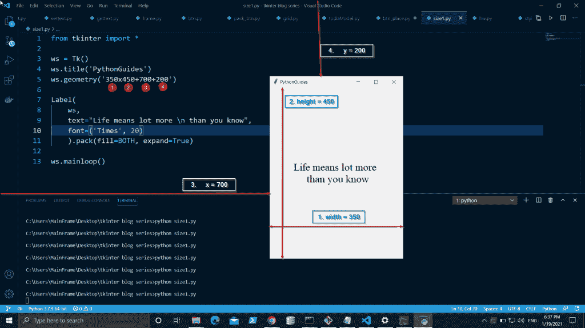
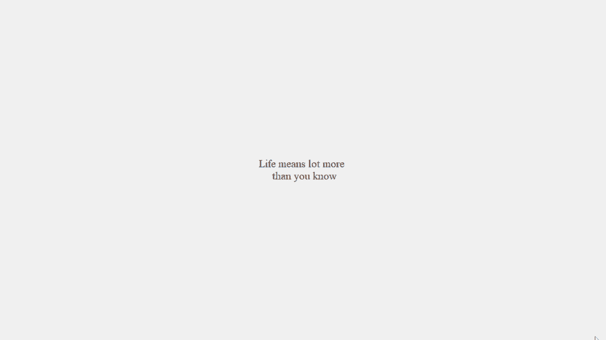
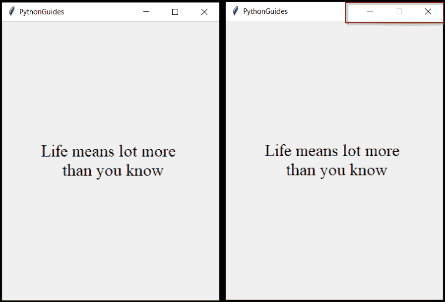
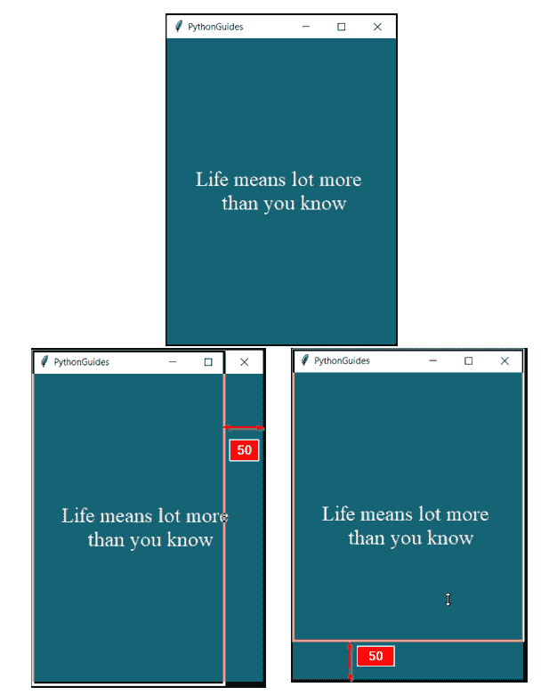
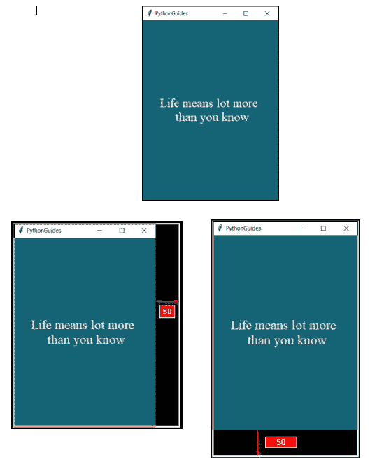

# Python Tkinter 窗口大小

> 原文：<https://pythonguides.com/python-tkinter-window-size/>

[](https://sharepointsky.teachable.com/p/python-and-machine-learning-training-course)

在本教程中，我们将了解到**Python t inter 窗口大小**以及这些主题。

*   在 Python Tkinter 中配置窗口大小和位置。
*   如何在 Python Tkinter 中将窗口大小设置为全屏？
*   如何在 Python Tkinter 中设置窗口的固定大小？
*   如何在 Python Tkinter 中锁定窗口大小？
*   如何设置最小窗口大小？
*   如何设置最大窗口大小？

如果你是新的 Python Tkinter，看看 [Python GUI 编程(Python Tkinter)](https://pythonguides.com/python-gui-programming/) 。

目录

[](#)

*   [Python Tkinter 窗口大小和位置](#Python_Tkinter_Window_Size_and_Position "Python Tkinter Window Size and Position")
*   [Python Tkinter 窗口大小全屏](#Python_Tkinter_Window_Size_Fullscreen "Python Tkinter Window Size Fullscreen")
*   [Python Tkinter 固定窗口大小](#Python_Tkinter_Fixed_Window_Size "Python Tkinter Fixed Window Size")
*   [Python Tkinter 锁窗口大小](#Python_Tkinter_Lock_Window_Size "Python Tkinter Lock Window Size")
*   [Python Tkinter 最小窗口大小](#Python_Tkinter_Minimum_Window_Size "Python Tkinter Minimum Window Size")
*   [Python Tkinter 最大窗口大小](#Python_Tkinter_Max_Window_Size "Python Tkinter Max Window Size")

## Python Tkinter 窗口大小和位置

*   **窗口大小**是指窗口的高度和宽度。
*   **窗口位置**是指窗口在屏幕上出现的位置。
*   在这一节中，我们将学习如何调整窗口&如何在 Python Tkinter 中定位窗口。
*   **几何学**是用于这两个目的的方法。

**语法:**

```py
parent_window.geometry("width_size x height_size + x_position + y_position")
```

*   `width_size` :只接受整数值&决定窗口的水平间距。
*   `height_size` :只接受整数值&决定窗口的垂直间距。
*   `x_position` :只接受整数值&将窗口推到垂直位置。
*   `y_position` :只接受整数值&将窗口推到水平位置。

**代码:**

在这段代码中，创建的窗口宽度为 350，高度为 450。它位于 x = 700 和 y=200 处。所以每次运行代码时，它看起来稍微偏右一点。

```py
from tkinter import *

ws = Tk()
ws.title('PythonGuides')
ws.geometry('350x450+700+200')

Label(
    ws,
    text="Life means lot more \n than you know",
    font=('Times',20)
    ).pack(fill=BOTH, expand=True)

ws.mainloop()
```

**输出:**

在这个输出中，窗口出现在中心偏右的位置。



Python Tkinter Window Size and Position

## Python Tkinter 窗口大小全屏

*   在本节中，我们将学习**如何将 Python Tkinter 窗口大小设置为全屏**。
*   默认情况下，有几种方法可以将应用程序设置为全屏。
*   第一种方法需要屏幕的分辨率。
*   如果你知道屏幕分辨率，那么你可以直接提供高度和宽度。比如，我的分辨率是 1920×1080，

```py
ws.geometry("1920x1080)
```

这里，1920 是窗户的宽度，1080 是高度。

*   另一种方法是将父窗口的属性设置为 True 以全屏显示。
*   在这种方法中，屏幕被设置为全屏，而与显示尺寸无关。
*   换句话说，应用程序会在所有设备上全屏显示。
*   使用它的缺点是你必须手动创建关闭和其他按钮。

```py
ws.attributes('-fullscreen', True)
```

**代码:**

在这段代码中，我们显示了第二种方法的示例，其中我们将属性方法的全屏设置为 True。

```py
from tkinter import *

ws = Tk()
ws.title('PythonGuides')
ws.attributes('-fullscreen', True)

Label(
    ws,
    text="Life means lot more \n than you know",
    font=('Times', 20)
    ).pack(fill=BOTH, expand=True)

ws.mainloop()
```

**输出:**

在这个输出中，Python tkinter 处于全屏模式。你也不会注意到用于关闭、最小化或最大化屏幕的常规工具栏。



Python Tkinter Window Size Fullscreen

## Python Tkinter 固定窗口大小

*   在处理应用程序时，有时我们希望固定窗口大小，以便小部件出现在您固定它们的位置。
*   因此，在这一节中，我们将学习如何在 Python Tkinter 中设置固定的窗口大小。
*   为此，我们将在可调整大小的方法中传递(0，0)。这里 0，0 指的是假宽度&高度。
*   方法指示窗口管理器这个窗口是否可以调整大小。
*   它只接受布尔值。

**语法:**

```py
ws.resizable(0, 0)

ws.resizable(False, False)

ws.resizable(width=False, Height=False) 
```

所有这些表达做同样的事情。你可以使用这些方法中的任何一种。

**代码:**

在这段代码中，我们固定了窗口的大小。这种方法也称为屏幕锁定。用户将不允许改变屏幕的大小。

```py
from tkinter import *

ws = Tk()
ws.title('PythonGuides')
ws.geometry('350x450+700+200')
ws.resizable(0,0)

Label(
    ws,
    text="Life means lot more \n than you know",
    font=('Times', 20)
    ).pack(fill=BOTH, expand=True)

ws.mainloop()
```

**输出:**

在这个输出中，显示了两个图像。第一个图像显示常规窗口，其中用户可以通过单击最大化方形按钮来改变窗口的大小。另一方面，另一个框锁定了窗口。窗口的大小是固定的，用户不能改变它。



Python Tkinter Fixed Window Size

## Python Tkinter 锁窗口大小

*   在处理应用程序时，有时我们希望固定窗口大小，以便小部件出现在您放置它们的相同位置。
*   因此，在这一节中，我们将学习如何在 Python Tkinter 中锁定窗口大小。
*   锁定窗口大小仅仅意味着用户不能改变窗口大小。
*   为此，我们将在可调整大小的方法中传递(0，0)。这里 0，0 指的是假宽度&高度。
*   方法指示窗口管理器这个窗口是否可以调整大小。
*   它只接受布尔值。
*   这与我们上一节关于 python Tkinter 固定窗口大小的内容相同。

**语法:**

```py
ws.resizable(0, 0)

ws.resizable(False, False)

ws.resizable(width=False, Height=False) 
```

所有这些表达做同样的事情。你可以使用这些方法中的任何一种。

**输出:**

在这个输出中，窗口被锁定，这意味着它不能调整大小。左边的第一个图像是一个常规窗口的例子，其中用户可以改变窗口的大小，但侧边图像的最大化按钮被禁用，这意味着用户不允许改变窗口的大小。


Python Tkinter Lock Window Size

锁定窗口大小的另一种方式是通过提供与几何尺寸相同的**最小尺寸()**和**最大尺寸()**。我们将在下一节讨论这些内容。

## Python Tkinter 最小窗口大小

*   在这一节中，我们将学习如何在 Python Tkinter 中设置最小窗口大小。
*   最小窗口大小决定了可以收缩的窗口数量。没有这个用户可以缩小窗口到任何级别。
*   `minsize()` 方法用于设置窗口不会缩小的极限。

**语法:**

```py
ws.minsize(width_minsize, height_minsize)
```

*   `width_minsize()` 接受整数值&它阻止从东向西方向的收缩。
*   `height_minsize` ( `)` 接受整数值&停止从南向北的收缩。

**代码:**

在这段代码中，我们只允许用户将窗口缩小 50 像素。你可以看到几何图形是 300×400，最小尺寸是宽度 250，高度 350。两者相差 50。所以窗口可以从左到右缩小 50，从下到上缩小 50。

```py
from tkinter import *

ws = Tk()
ws.title('PythonGuides')
ws.geometry('300x400')

ws.minsize(250, 350)

Label(
    ws,
    text="Life means lot more \n than you know",
    font=('Times', 20),
    bg = '#156475',
    fg = '#fff'
    ).pack(fill=BOTH, expand=True)

ws.mainloop()
```

**输出:**

*   在此输出中，显示了三张图片。顶部的第一个描述了代码运行时窗口的原始形式。
*   左侧的第二张图片显示，当用户试图从右侧向左侧缩小或收缩窗口时，他只能将其缩小 50 个像素，高度也是如此。
*   这就是我们在 Python Tkinter 中限制窗口收缩的方式。



Python Tkinter Minimum Window Size

## Python Tkinter 最大窗口大小

*   在这一节中，我们将学习如何在 Python Tkinter 中设置最大窗口大小。
*   最大窗口大小决定了窗口的最大扩展量。
*   没有它，用户可以将窗口扩展到任何级别。
*   `maxsize` 方法用于设置窗口不会扩大的限制。

**语法:**

```py
ws.maxsize(width_maxsize, height_maxsize)
```

*   `width_maxsize()` 接受整数值&停止从西向东的扩展。
*   `height_maxsize` ( `)` 接受整数值&停止从北向南的扩展。

**代码:**

在这段代码中，我们只允许用户将窗口尺寸扩大 50 像素。正如你所看到的，几何图形是 300×400，最大宽度是 350，高度是 450。两者相差 50。因此，窗口可以从右到左扩展到 50，从上到下扩展到 50。

```py
from tkinter import *

ws = Tk()
ws.title('PythonGuides')
ws.config()
ws.geometry('300x400')

ws.maxsize(350, 450)

Label(
    ws,
    text="Life means lot more \n than you know",
    font=('Times', 20),
    bg = '#156475',
    fg = '#fff'
    ).pack(fill=BOTH, expand=True)

ws.mainloop()
```

**输出:**

*   在此输出中，显示了三张图片。顶部的第一个描述了代码运行时窗口的原始形式。
*   左侧的第二张图片显示，当用户试图将窗口大小从左侧扩展到右侧时，他只能将其扩展 50 个像素，高度也是如此。
*   这就是我们在 Python Tkinter 中限制窗口扩展的方式。



Python Tkinter Max Window Size

您可能会喜欢以下 Python Tkinter 教程:

*   [Python Tkinter 画布教程](https://pythonguides.com/python-tkinter-canvas/)
*   [Python Tkinter 进度条](https://pythonguides.com/python-tkinter-progress-bar/)
*   [Python Tkinter Stopwatch](https://pythonguides.com/python-tkinter-stopwatch/)
*   [Python Tkinter 列表框](https://pythonguides.com/python-tkinter-listbox/)
*   [Python tkinter messagebox](https://pythonguides.com/python-tkinter-messagebox/)
*   [Python Tkinter 帧](https://pythonguides.com/python-tkinter-frame/)
*   [Python Tkinter 计算器](https://pythonguides.com/make-a-calculator-in-python/)
*   [Python Tkinter 待办事项列表](https://pythonguides.com/python-tkinter-todo-list/)
*   [检查一个列表是否存在于另一个列表中 Python](https://pythonguides.com/check-if-a-list-exists-in-another-list-python/)
*   [Python Tkinter Map()函数](https://pythonguides.com/python-tkinter-map-function/)
*   [Python Tkinter 拖拽](https://pythonguides.com/python-tkinter-drag-and-drop/)

在本教程中，我们学习了配置 Python Tkinter 窗口大小的不同方式**。此外，我们已经讨论了这些主题。**

*   在 Python Tkinter 中配置窗口大小和位置。
*   如何在 Python Tkinter 中将窗口大小设置为全屏？
*   如何在 Python Tkinter 中设置窗口的固定大小？
*   如何在 Python Tkinter 中锁定窗口大小？
*   如何设置最小窗口大小？
*   如何设置最大窗口大小？

[Bijay Kumar](https://pythonguides.com/author/fewlines4biju/)

Python 是美国最流行的语言之一。我从事 Python 工作已经有很长时间了，我在与 Tkinter、Pandas、NumPy、Turtle、Django、Matplotlib、Tensorflow、Scipy、Scikit-Learn 等各种库合作方面拥有专业知识。我有与美国、加拿大、英国、澳大利亚、新西兰等国家的各种客户合作的经验。查看我的个人资料。

[enjoysharepoint.com/](https://enjoysharepoint.com/)[](https://www.facebook.com/fewlines4biju "Facebook")[](https://www.linkedin.com/in/fewlines4biju/ "Linkedin")[](https://twitter.com/fewlines4biju "Twitter")