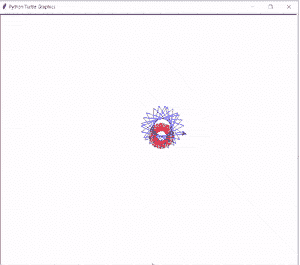

# 蟒蛇龟艺术——如何绘画

> 原文：<https://pythonguides.com/python-turtle-art/>

[](https://sharepointsky.teachable.com/p/python-and-machine-learning-training-course)

在本教程中，我们将学习如何在[巨蟒龟](https://pythonguides.com/turtle-programming-in-python/)的帮助下**绘制一幅艺术作品**，我们还将介绍与**龟艺术**相关的不同例子。我们将讨论这些话题。

*   蟒蛇龟艺术
*   蟒蛇龟像素艺术
*   巨蟒龟艺术代码
*   蟒蛇龟艺术示例

目录

[](#)

*   [蟒龟艺术](#Python_Turtle_Art "Python Turtle Art")
*   [蟒龟像素艺术](#Python_Turtle_Pixel_Art "Python Turtle Pixel Art")
*   [蟒龟艺术代码](#Python_Turtle_Art_Code "Python Turtle Art Code")
*   [蟒龟艺术示例](#Python_Turtle_Art_Example "Python Turtle Art Example")

## 蟒龟艺术

在这一节中，我们将学习如何在蟒蛇龟的帮助下绘制一幅艺术作品。

在前进之前，我们应该有一个关于艺术的知识。艺术是一种绘制美丽形状，图片等的技能。乌龟艺术和正常艺术是一样的。

**代码:**

在下面的代码中，我们从 turtle import * 、**导入 turtle 作为 tur** 导入 turtle 库**，我们定义一些函数，在 turtle 的帮助下画出漂亮的艺术品。**

*   `ws.speed(100)` 用来管理龟的速度。
*   `ws.color("pink")` 用于赋予形状颜色。
*   **ws.shape("龟")**用来给龟造型。

```py
from turtle import *
import turtle as tur 

def petal1(t1, r, ang):
    for i in range(2):
        t1.circle(r, ang)
        t1.left(180 - ang)

def flower1(t1, n, r, ang):
    for i in range(n):
        petal1(t1, r, ang)
        t1.left(360.0 / n)

def move(t1, len):
    win = tur.Screen()
    win.bgcolor("cyan")
    t1.pu()
    t1.fd(len)
    t1.pd()

ws = tur.Turtle()
ws.speed(100)

ws.color("pink")
ws.shape("turtle")
move(ws, -150)
ws.begin_fill()
flower1(ws, 7, 50.0, 50.0)
ws.end_fill()

ws.color("blue")
move(ws, 150)
ws.begin_fill()
flower1(ws, 9, 20.0, 60.0)
ws.end_fill()

ws.color("green")
move(ws, 150)
ws.begin_fill()
flower1(ws, 13, 60.0, 40.0)
ws.end_fill()

tur.mainloop()
```

**输出:**

运行上面的代码后，我们得到了下面的输出，其中我们看到一些图形被绘制出来，展示了一个美丽的海龟艺术。


Python turtle art Output

阅读:[使用蟒蛇龟绘制彩色填充形状](https://pythonguides.com/draw-colored-filled-shapes-using-python-turtle/)

## 蟒龟像素艺术

在本节中，我们将学习如何在 python turtle 中绘制**乌龟像素艺术**。

**像素艺术**是一种通过使用软件创建的数字艺术形式，图像在**像素**级别进行编辑。

**代码:**

在下面的代码中，我们在屏幕内部创建了一个屏幕，我们用背景色“**白色**”绘制了**像素艺术**。并且还得到了一些关于图片像素的知识。

*   **乌龟。Screen()** 用于创建一个屏幕。
*   **ws.bgcolor("白色")**用于给出白色背景色。
*   `ws.speed(6)` 用于给乌龟正常速度。
*   `ws.forward(30)` 用于向前移动乌龟。

```py
from turtle import *
import turtle

ws=turtle.Screen()
ws.bgcolor("white")
ws=turtle.Turtle()
ws.speed(6)
ws.pensize(5)
def square():
  for a in range(6):
    ws.forward(30)
    ws.right(90)

def tetris_piece():
  for a in range(6):
   ws.begin_fill()
   square()
   ws.color("cyan")
   ws.end_fill()
   ws.color("black")
   ws.forward(30)

tetris_piece()

ws.penup()
ws.forward(90)
ws.pendown()
```

**输出:**

运行上面的代码后，我们得到下面的输出，我们看到像素艺术显示在屏幕上。


Python turtle pixel art Output

阅读:[如何使用 Turtle](https://pythonguides.com/snake-game-in-python/) 创建 Python 中的贪吃蛇游戏

## 蟒龟艺术代码

在这一节中，我们将学习如何在 Python turtle 中创建艺术代码。

艺术代码是用于构建代码的任何艺术。通过创建一个代码，我们在一只乌龟的帮助下画出了一幅画。

**代码:**

在下面的代码中，我们创建了一个屏幕，在这个屏幕中我们绘制了吸引人们眼球的艺术作品。

*   **导入龟**是一个用来画美术的库。
*   `ws.bgcolor("black")` 用来给背景颜色。
*   **sk.color("青色")**用来给乌龟上色。

```py
from turtle import *
import turtle 
ws = turtle.Screen()
ws.bgcolor("black")
sk = turtle.Turtle()
sk.color("cyan")

def squarefunc(size):
	for i in range(4):
		sk.fd(size)
		sk.left(90)
		size = size + 6

squarefunc(7)
squarefunc(27)
squarefunc(47)
squarefunc(67)
squarefunc(87)
squarefunc(107)
squarefunc(127)
squarefunc(147)
```

**输出**:

运行上面的代码后，我们得到了下面的输出，其中我们看到一个美丽的艺术是用背景色“黑色”绘制的。


Python turtle art code Output

阅读:[如何在 Turtle Python 中附加图片](https://pythonguides.com/attach-image-to-turtle-python/)

## 蟒龟艺术示例

在本节中，我们将学习 Python turtle 中的**乌龟艺术示例**。

众所周知，海龟艺术是一种绘制美丽的形状、图片等的技巧。在海龟艺术中，我们可以从任何软件和网站拖放图像。

**代码:**

在下面的代码中，我们导入了 turtle 库，用于在屏幕上绘制艺术。

*   `painting.pencolor("red")` 用于给笔赋予颜色。
*   `painting.forward(60)` 用于向前移动乌龟。
*   `painting.left(133)` 用于顺时针方向移动光标。

```py
from turtle import *
import turtle 

painting = turtle.Turtle()

painting.pencolor("red")

for x in range(60):
    painting.forward(60)
    painting.left(133)

painting.pencolor("blue")
for x in range(60):
    painting.forward(100)
    painting.left(133)

turtle.done()
```

**输出:**

运行上面的代码后，我们得到下面的输出，其中我们看到乌龟艺术是用两种美丽的颜色绘制的。



Python turtle art example Output

还有，多看看一些和 Python Turtle 相关的教程。

*   [巨蟒龟命令](https://pythonguides.com/python-turtle-commands/)
*   [蟒龟广场](https://pythonguides.com/python-turtle-square/)
*   [巨蟒龟大小](https://pythonguides.com/python-turtle-size/)
*   [Replit 蟒蛇龟](https://pythonguides.com/replit-python-turtle/)
*   [蟒龟速度](https://pythonguides.com/python-turtle-speed/)
*   [蟒蛇龟的颜色](https://pythonguides.com/python-turtle-colors/)
*   [蟒龟圈](https://pythonguides.com/python-turtle-circle/)
*   [Python 龟写函数](https://pythonguides.com/python-turtle-write-function/)

因此，在本教程中，我们讨论了 `Python Turtle Art` ,我们还涵盖了与其实现相关的不同示例。这是我们已经讨论过的例子列表。

*   蟒蛇龟艺术
*   蟒蛇龟像素艺术
*   巨蟒龟艺术代码
*   蟒蛇龟艺术示例

[Bijay Kumar](https://pythonguides.com/author/fewlines4biju/)

Python 是美国最流行的语言之一。我从事 Python 工作已经有很长时间了，我在与 Tkinter、Pandas、NumPy、Turtle、Django、Matplotlib、Tensorflow、Scipy、Scikit-Learn 等各种库合作方面拥有专业知识。我有与美国、加拿大、英国、澳大利亚、新西兰等国家的各种客户合作的经验。查看我的个人资料。

[enjoysharepoint.com/](https://enjoysharepoint.com/)[](https://www.facebook.com/fewlines4biju "Facebook")[](https://www.linkedin.com/in/fewlines4biju/ "Linkedin")[](https://twitter.com/fewlines4biju "Twitter")