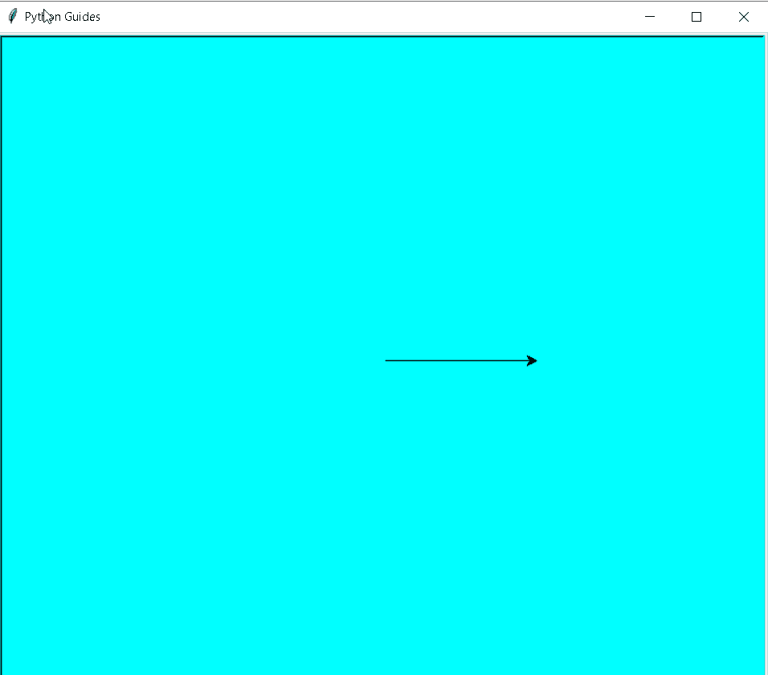
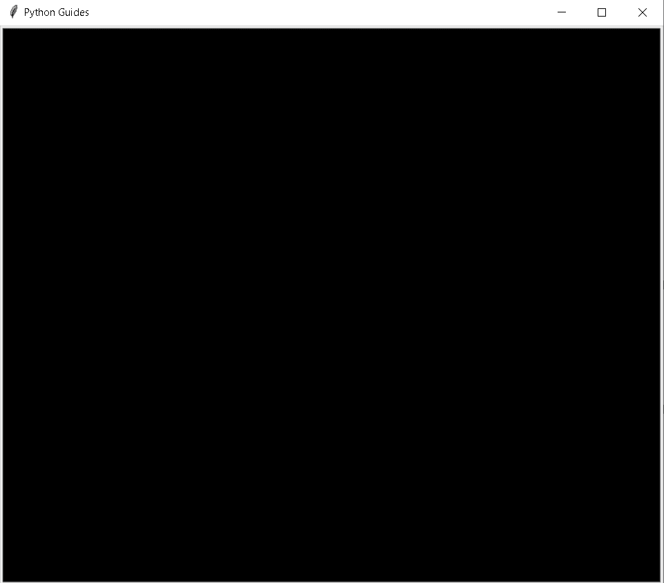
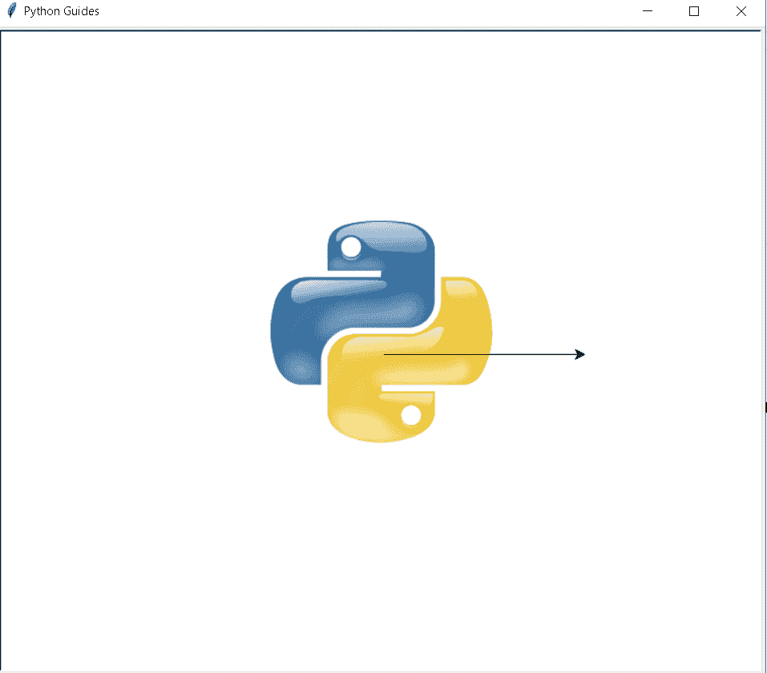
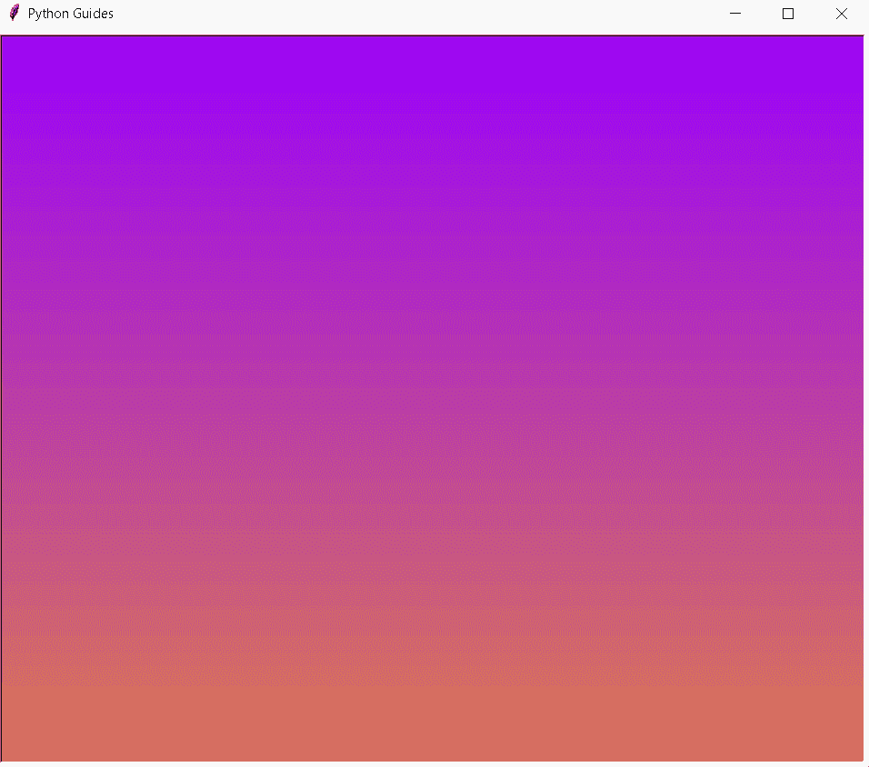
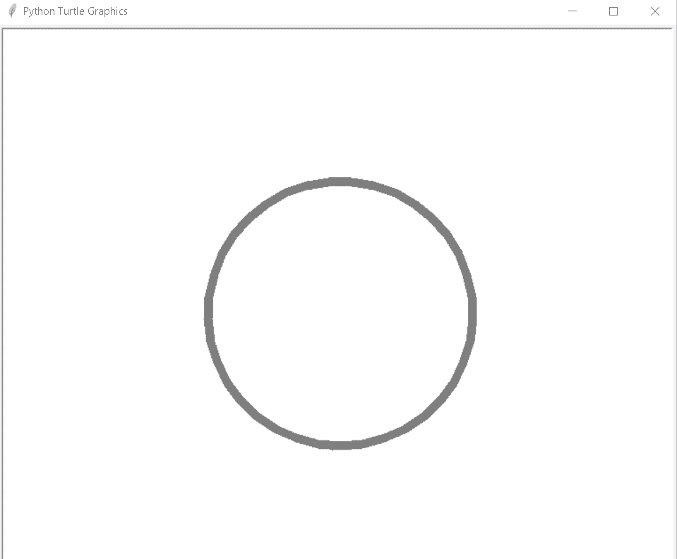
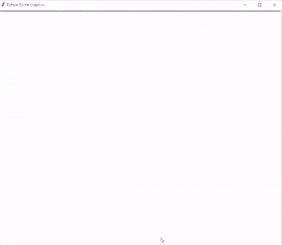
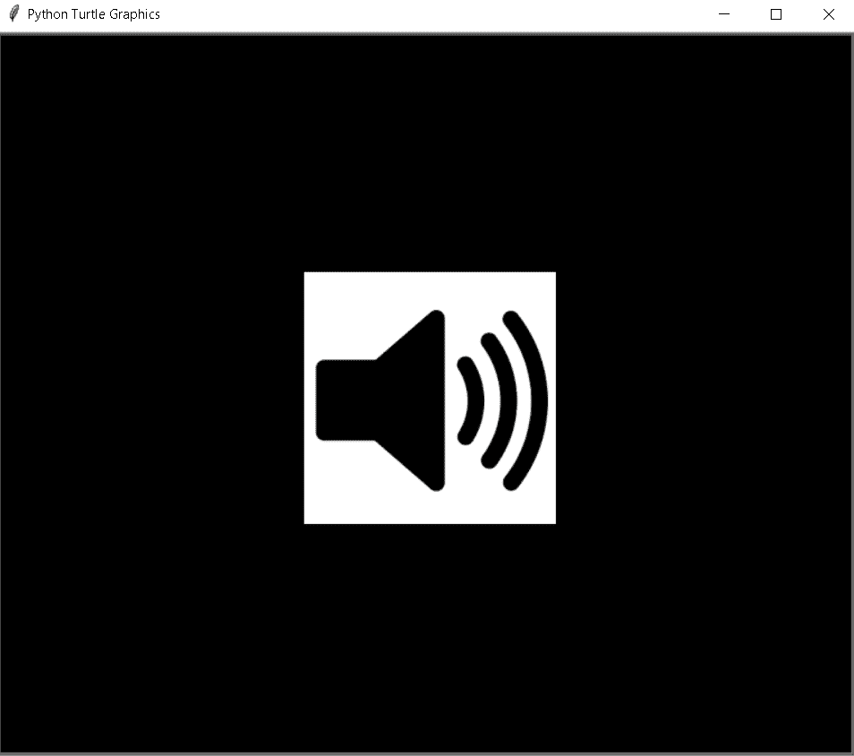
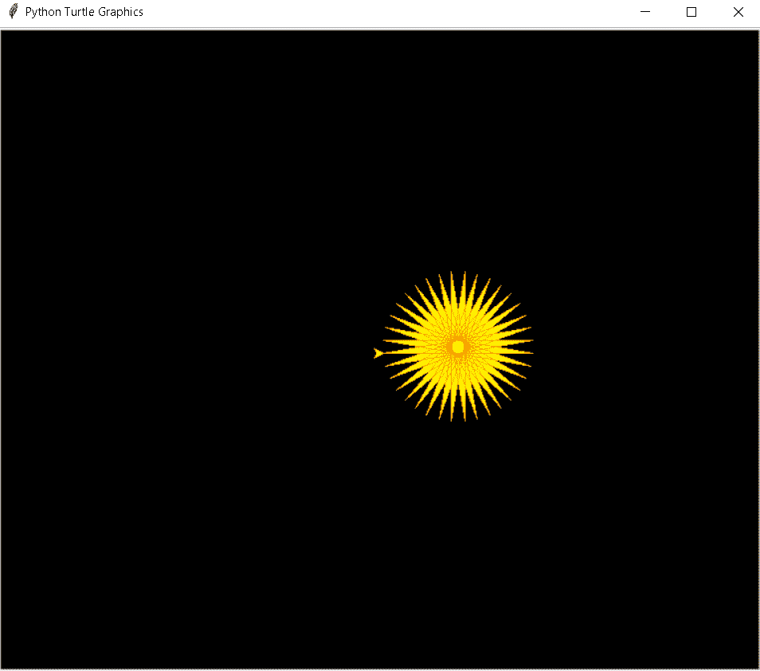

# Python 海龟背景+示例

> 原文：<https://pythonguides.com/python-turtle-background/>

[](https://sharepointsky.teachable.com/p/python-and-machine-learning-training-course)

在这个 [Python 教程](https://pythonguides.com/python-hello-world-program/)**中，我们将学习**如何在 [Python 乌龟](https://pythonguides.com/turtle-programming-in-python/)的帮助下创建背景**，我们还将涵盖与乌龟背景相关的不同例子。我们将讨论这些话题。**

 ***   蟒蛇龟背景
*   蟒蛇龟背景色
*   蟒蛇龟背景图像
*   蟒蛇龟背景渐变
*   蟒蛇龟透明背景
*   Python turtle 添加背景图片
*   巨蟒龟背景音乐
*   蟒蛇皮海龟图形背景

目录

[](#)

*   [蟒龟背景](#Python_turtle_background "Python turtle background")
*   [蟒蛇龟背景色](#Python_turtle_background-color "Python turtle background-color")
*   [巨蟒龟背景图](#Python_turtle_background_image "Python turtle background image")
*   [蟒龟背景渐变](#Python_turtle_background_gradient "Python turtle background gradient")
*   [蟒蛇龟透明背景](#Python_turtle_transparent_background "Python turtle transparent background")
*   [巨蟒龟添加背景图片](#Python_turtle_add_a_background_image "Python turtle add a background image")
*   [巨蟒龟背景音乐](#Python_turtle_background_music "Python turtle background music")
*   [蟒蛇龟图形背景](#Python_turtle_graphic_background "Python turtle graphic background")

## 蟒龟背景

在这一节中，我们将学习**如何在 python turtle 中的乌龟的帮助下创建背景**。

在前进之前，我们应该有一些背景知识。背景被定义为放置所有物体的表面，或者我们可以说是屏幕的着色表面。我们可以给不同的颜色或在背景中设置不同的图像。

**代码:**

在下面的代码中，我们将从海龟导入* 、**导入**、**海龟**中导入海龟模块**。使用 `turtle()` 方法来制作对象。**

*   `tur . title(" Python Guides ")`用于给屏幕加标题。
*   **转身。屏幕()。bgcolor("青色")**用于设置背景颜色。
*   `tur.forward(150)` 用于向前移动乌龟。

```py
from turtle import *

import turtle as tur
tur.title("Python Guides")

tur.Screen().bgcolor("cyan")

tur.forward(150)
tur.done()
```

**输出:**

运行上面的代码后，我们得到了下面的输出，我们可以看到一只乌龟在美丽的背景上画出了这个形状。



Python turtle background

另外，检查:[蟒龟画线](https://pythonguides.com/python-turtle-draw-line/)

## 蟒蛇龟背景色

在这一节中，我们将学习如何在 python turtle 中改变背景颜色。

正如我们所知，背景是屏幕的一部分，我们可以在那里绘制不同的形状或图像，或者我们可以说，背景是一个着色的表面，借助颜色来看起来很漂亮，如果背景看起来很漂亮，我们的形状也看起来很漂亮。

**代码:**

在下面的代码中，我们将从 turtle import * ，import `turtle` 导入 turtle 模块**。**龟()**法是用来做物件的。**

*   `tur.bgcolor("black")` 用于给背景上色。
*   `tur . title(" Python Guides ")`用于给屏幕加标题。

```py
from turtle import *
import turtle
tur=turtle.Screen()
tur.bgcolor("black")
tur.title("Python Guides")
turtle.done()
```

**输出:**

运行上面的代码后，我们得到下面的输出，我们可以看到黑色背景的屏幕。在乌龟的帮助下，我们可以在屏幕上画任何东西。



Python turtle background-color

阅读:[蟒龟鼠](https://pythonguides.com/python-turtle-mouse/)

## 巨蟒龟背景图

在这一节中，我们将学习**如何在** python turtle 中的乌龟的帮助下设置背景图像。

背景是屏幕的一个曲面，海龟可以在这里画出形状。我们可以将图像设置在背景中，而不是颜色，以使屏幕背景看起来更漂亮。我们使用 `bgpic()` 函数来设置图像的背景。

**代码:**

在下面的代码中，我们将从 turtle import * 导入 turtle 模块**，导入 **turtle 作为 tur** 。**龟()**法是用来做物件的。**

*   `tur . title(" Python Guides ")`用于给乌龟上屏。
*   `tur.bgpic("bgimg.png")` 用于设置图像的背景。
*   `tur.forward(200)` 用于向前移动乌龟。
*   `tur.color("green")` 用来给乌龟上绿色。

```py
from turtle import *

import turtle as tur
tur.title("Python Guides")

tur.bgpic("bgimg.png")
tur.forward(200)
tur.color("green")
tur.done()
```

**输出:**

运行上面的代码后，我们得到了下面的输出，我们可以看到我们可以设置背景图像，也可以在 turtle 的帮助下在这个背景中绘制形状。



Python turtle background image

阅读:[蟒龟画字母](https://pythonguides.com/python-turtle-draw-letters/)

## 蟒龟背景渐变

在这一节，我们将学习如何在 python turtle 中设置渐变背景。

梯度被定义为一个函数的变化率，或者我们可以说，温度，压力，或浓度的增加或减少。

**代码:**

在下面的代码中，我们将从海龟导入* 、**导入海龟**中导入海龟库**。**龟()**法是用来做物件的。**

*   **turt.color(颜色)**用于给乌龟上色。
*   `turt.penup()` 用于拿起乌龟，停止画图。
*   **turt.goto(-width/2，height/2)** 用于在绝对位置移动乌龟。
*   `turt.pendown()` 用于开始绘图。
*   `turt . forward(width * direct)`就是将乌龟向前移动。

```py
from turtle import *
import turtle
from turtle import Screen, Turtle

color = (0.60160, 0, 0.99220)  # (154, 0, 254)
target = (0.86330, 0.47660, 0.31255)  # (221, 122, 80)
turtle.title("Python Guides")
tur = Screen()
tur.tracer(False)

width, height = tur.window_width(), tur.window_height()

deltas = [(hue - color[index]) / height for index, hue in enumerate(target)]

turt = Turtle()
turt.color(color)

turt.penup()
turt.goto(-width/2, height/2)
turt.pendown()

direct = 1

for distance, y in enumerate(range(height//2, -height//2, -1)):

    turt.forward(width * direct)
    turt.color([color[i] + delta * distance for i, delta in enumerate(deltas)])
    turt.sety(y)

    direct *= -1

tur.tracer(True)
tur.exitonclick()
```

**输出:**

运行上面的代码后，我们得到下面的输出，我们可以看到一个美丽的渐变背景被放置在屏幕内。



Python turtle background gradient

阅读: [Python 龟输入示例](https://pythonguides.com/python-turtle-input/)

## 蟒蛇龟透明背景

在这一节中，我们将学习如何在 python turtle 中创建透明背景。

在前进之前，我们应该了解一些关于透明度的知识。透明是指让光线从和放置在它们后面的物体直接看到，而不需要移开物体。透明背景就是直接看到放在屏幕后面的物体。

**代码:**

在下面的代码中，我们将从乌龟导入* 、**导入**、**乌龟**中导入乌龟库**。使用 `turtle()` 方法来制作对象。**

*   tur.width(10)用于给出海龟的宽度。
*   turtle.penup()用于停止绘制。
*   turtle.pendown()用于开始绘制。
*   **turtle.circle(150)用于在**和**龟的帮助下绘制圆圈的 sh** 猿。

```py
from turtle import *
import turtle

tur = getturtle()

ws = (tur
    ._screen
    .getcanvas()
    .winfo_toplevel())
ws.attributes('-alpha', 0.5)

tur.width(10)

turtle.penup()
turtle.sety(-150)
turtle.pendown()
turtle.circle(150)
turtle.done()
```

**输出:**

运行上面的代码后，我们得到了下面的输出，我们可以看到在屏幕上画了一个圆形，背景是透明的。



Python turtle transparent background

阅读:[蟒龟网格](https://pythonguides.com/python-turtle-grid/)

## 巨蟒龟添加背景图片

在这一节中，我们将学习**如何在 python turtle 中的乌龟的帮助下添加背景图片**。

正如我们所知，背景是屏幕的曲面，我们可以给背景添加颜色，或者将图像添加到背景中，这样看起来非常漂亮，可以吸引用户的眼球。

**代码:**

在下面的代码中，我们将导入 turtle 库**导入 turtle 并且**也导入 time 模块。**龟()**法是用来做物件的。

*   **乌龟。Screen()** 用于设置乌龟画图形的屏幕。
*   `time.sleep(2)` 函数暂停执行给定的秒数。
*   **screen . bgpic(' bgimg 1 . png ')**用于在 **e 背景**中添加图像。

```py
import turtle
import time

screen = turtle.Screen()
screen.setup(900,800)
time.sleep(2)
screen.bgpic('bgimg1.png')
turtle.done()
```

**输出:**

运行上面的代码后，我们得到下面的输出，我们可以看到我们看到一个屏幕，几秒钟后，我们在背景中添加了一个看起来很漂亮的图像。



Python turtle add a background image

阅读:[蟒龟笔+例题](https://pythonguides.com/python-turtle-pen/)

## 巨蟒龟背景音乐

在这一节中，我们将学习如何在 python turtle 中给海龟背景音乐。

正如我们所知，背景是屏幕或图片的一部分，我们也可以给背景着色，也可以添加图片。在这里，我们可以在背景中发出声音，这看起来非常有创意，点击按键时声音来自背景。

**代码:**

在下面的代码中，我们将从 turtle import * 中导入 turtle 库**，导入 `turtle` ，还有**导入 winsound** 用于在窗口上给出背景声音。**

*   `turtle()` 模块用于制作对象。
*   `tur.bgcolor("black")` 用于给背景上色。
*   tur.bgpic("sound img.png ")用于在屏幕背景中添加图像。
*   **winsound。PlaySound('sound.wav '，winsound。SND_ASYNC)** 用于后台播放声音。
*   这里是我们可以下载声音的链接:

```py
 https://mixkit.co/free-sound-effects/
```

*   **tur.onkeypress(playmusic，' space')** 功能用于当我们单击空格键时，我们获得来自背景的声音。

```py
from turtle import *
import turtle
import winsound

tur = turtle.Screen()
tur.bgcolor("black")
tur.bgpic("sound img.png")
def playmusic():
    winsound.PlaySound('sound.wav',winsound.SND_ASYNC)

tur.listen()
tur.onkeypress(playmusic,'space')

turtle.done()
```

**输出:**

运行上面的代码后，我们得到下面的输出，其中我们可以看到一个黑色的背景，声音图像显示在屏幕上。从这个声音图像中，我们通过按空格键获得声音。



Python turtle background music

阅读:[如何在蟒蛇龟身上画花](https://pythonguides.com/draw-flower-in-python-turtle/)

## 蟒蛇龟图形背景

在这一节中，我们将学习如何在 python turtle 中获得乌龟图形背景。

背景是屏幕的一部分，我们可以在屏幕的背景中添加颜色、图像、音乐和图形，这样我们的背景看起来非常漂亮。

**代码:**

在下面的代码中，我们将从 turtle import * 、**导入 turtle 库**。**用**龟()**的方法制作物品。**

*   `turtle.bgcolor("black")` 用于给背景赋予黑色。
*   **颜色('橙'，'黄')**用来给乌龟加上橙黄色。
*   `begin_fill()` 用于开始填充颜色。
*   **前进(150)** 用于向前移动乌龟。
*   **向左(170)** 用于向左移动乌龟。
*   `end_fill()` 用于停止填充颜色。

```py
from turtle import *
import turtle
turtle.bgcolor("black")
color('orange', 'yellow')
begin_fill()
while True:
    forward(150)
    left(170)
    if abs(pos()) < 1:
        break
end_fill()
turtle.done()
```

**输出:**

运行上述代码后，我们得到以下输出，其中我们可以看到屏幕上显示的图形背景。带有图形的背景看起来非常惊艳。



Python turtle graphic background

你可能也喜欢阅读下面的 Python 海龟教程。

*   [蟒蛇龟星——如何绘制](https://pythonguides.com/python-turtle-star/)
*   [蟒龟小抄](https://pythonguides.com/python-turtle-cheat-sheet/)
*   [蟒龟嵌套循环](https://pythonguides.com/python-turtle-nested-loop/)
*   [蟒龟获得位置](https://pythonguides.com/python-turtle-get-position/)

因此，在本教程中，我们讨论了 **Python Turtle 的背景**，我们还涵盖了与其实现相关的不同示例。这是我们已经讨论过的例子列表。

*   蟒蛇龟背景
*   蟒蛇龟背景色
*   蟒蛇龟背景图像
*   蟒蛇龟背景渐变
*   蟒蛇龟透明背景
*   Python turtle 添加背景图片
*   巨蟒龟背景音乐
*   蟒蛇皮海龟图形背景

[Bijay Kumar](https://pythonguides.com/author/fewlines4biju/)

Python 是美国最流行的语言之一。我从事 Python 工作已经有很长时间了，我在与 Tkinter、Pandas、NumPy、Turtle、Django、Matplotlib、Tensorflow、Scipy、Scikit-Learn 等各种库合作方面拥有专业知识。我有与美国、加拿大、英国、澳大利亚、新西兰等国家的各种客户合作的经验。查看我的个人资料。

[enjoysharepoint.com/](https://enjoysharepoint.com/)[](https://www.facebook.com/fewlines4biju "Facebook")[](https://www.linkedin.com/in/fewlines4biju/ "Linkedin")[](https://twitter.com/fewlines4biju "Twitter")**