# Python 海龟备忘单

> 原文：<https://pythonguides.com/python-turtle-cheat-sheet/>

[](https://sharepointsky.teachable.com/p/python-and-machine-learning-training-course)

在本 [Python 教程](https://pythonguides.com/learn-python/)中，我们将借助本**备忘单**了解**蟒龟**，我们还将涵盖与**蟒龟备忘单**相关的不同示例。我们将讨论这些话题。

*   Python 中的乌龟是什么
*   如何安装海龟库
*   如何导入海龟库
*   如何设置背景颜色
*   如何改变乌龟的形状
*   如何用乌龟画出形状
*   如何改变龟速
*   如何改变箭头或乌龟的颜色
*   如何改变乌龟的宽度
*   如何给乌龟运动
*   如何在乌龟的帮助下填充图像
*   如何使用 turtle 实现动作
*   如何在乌龟的帮助下写课文
*   如何用 python turtle 添加图形
*   如何用 python turtle 制作网格

目录

[](#)

*   [Python 中的乌龟是什么](#What_is_turtle_in_Python "What is turtle in Python")
*   [如何安装龟库](#How_to_install_turtle_library "How to install turtle library")
*   [如何导入海龟库](#How_to_import_turtle_library "How to import turtle library")
*   [如何设置背景颜色](#How_to_set_the_background_color "How to set the background color")
*   [如何改变乌龟的形状](#How_to_change_a_shape_of_a_turtle "How to change a shape of a turtle")
*   [如何使用乌龟绘制形状](#How_to_draw_the_shape_using_turtle "How to draw the shape using turtle")
*   [如何改变龟速](#How_to_change_the_speed_of_turtle "How to change the speed of turtle")
*   [如何改变箭头或乌龟的颜色](#How_to_change_the_color_of_the_arrow_or_turtle "How to change the color of the arrow or turtle")
*   [如何改变乌龟的宽度](#How_to_change_the_width_of_the_turtle "How to change the width of the turtle")
*   [如何把动作交给乌龟](#How_to_give_the_movement_to_turtle "How to give the movement to turtle")
*   [如何在乌龟的帮助下填充图像](#How_to_fill_the_image_with_the_help_of_turtle "How to fill the image with the help of turtle")
*   [如何使用 turtle 实现动作](#How_to_implement_actions_using_turtle "How to implement actions using turtle")
*   [如何在乌龟的帮助下写文章](#How_to_write_the_text_with_the_help_of_a_turtle "How to write the text with the help of a turtle")
*   [如何用 python 龟添加图形](#How_to_add_graphics_with_python_turtle "How to add graphics with python turtle")
*   [如何用蟒蛇龟制作网格](#How_to_make_a_grid_with_python_turtle "How to make a grid with python turtle")

## Python 中的乌龟是什么

`Turtle` 是 `python turtle` 的一个 Python 特性或库，用来在画板上画一些形状、图片。

乌龟就像一支笔，帮助用户在屏幕上画出不同的形状，这里屏幕被用作画板，用户可以在乌龟的帮助下画画。

我们可以使用不同的函数，如 `turtle.right()` ， `turtle.forward()` ， `turtle.up()` ， `turtle.left()` ， `turtle.backward()` 在这些函数的帮助下，我们的乌龟可以沿着不同的方向移动，并绘制不同的形状。

*   [如何使用 Turtle 在 python 中绘制形状](https://pythonguides.com/turtle-programming-in-python/)

## 如何安装龟库

在这一节中，我们将学习如何在 python turtle 中安装一个 turtle 库。

turtle 模块用于制作对象，它还提供图形，并用于在屏幕上绘制不同的形状。这里屏幕被用作画板。

用于安装 turtle 库的命令是 pip install python turtle。

**语法:**

```py
pip install PythonTurtle
```

**输出:**

运行上面的语法后，我们得到下面的输出，从中我们可以看到 python turtle 安装成功。

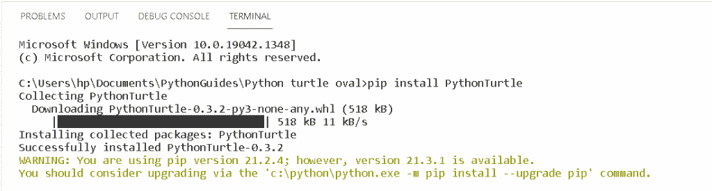

Python turtle installation

*   [使用蟒蛇龟绘制彩色填充形状](https://pythonguides.com/draw-colored-filled-shapes-using-python-turtle/)

## 如何导入海龟库

在这一节，我们将学习如何使用下面的语法**导入 turtle 库**

**语法:**

```py
From turtle import *
import turtle
```

上面的语法解释了我们必须使用之前作为包安装在 **python 文件**下的模块，通过它我们可以导入包或库，同时执行任何逻辑任务，给出问题的解决方案。

## 如何设置背景颜色

在这一节中，我们将学习如何使用 python turtle 设置背景中的颜色或图像。

正如我们所知，turtle 用于在屏幕上绘制不同的形状和图片，我们想为这个屏幕设置背景颜色。我们也可以改变背景的颜色。

**语法:**

```py
turtle.bgcolor("black")
```

上面的语法解释了我们如何将**“黑色”**背景色添加到屏幕上，让乌龟可以轻松地画出图片。

**输出:**

在下面的输出中，我们可以看到一个背景颜色为“黑色”的屏幕。

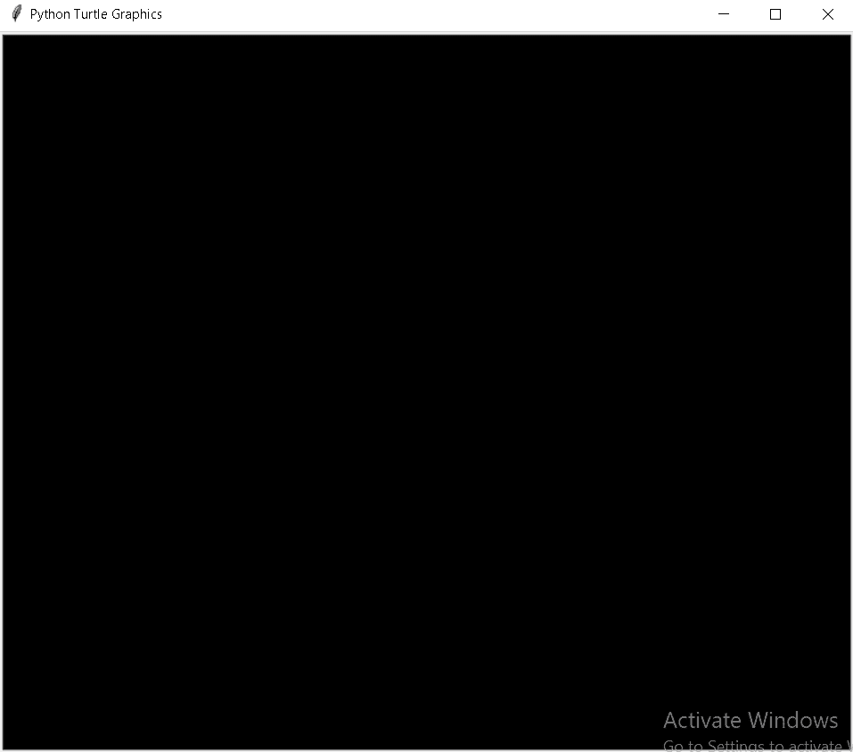

How to set the background color

*   [如何用 Turtle 创建 Python 中的贪吃蛇游戏](https://pythonguides.com/snake-game-in-python/)

## 如何改变乌龟的形状

在本节中，我们将学习如何在蟒蛇龟中改变乌龟的形状 **。**

乌龟模块是用来做物件的。在乌龟的帮助下，我们可以画出不同的形状。乌龟可以当笔用。

我们也可以改变乌龟的形状，给它不同的形状，比如“箭头”、“圆形”、“三角形”、“乌龟”等等。下面是改变乌龟形状的语法。

**语法:**

```py
turtle.shape("turtle")
```

**输出:**

在下面的输出中，我们可以看到这只乌龟被放在屏幕上。在这只乌龟的帮助下，我们可以画出不同的形状。

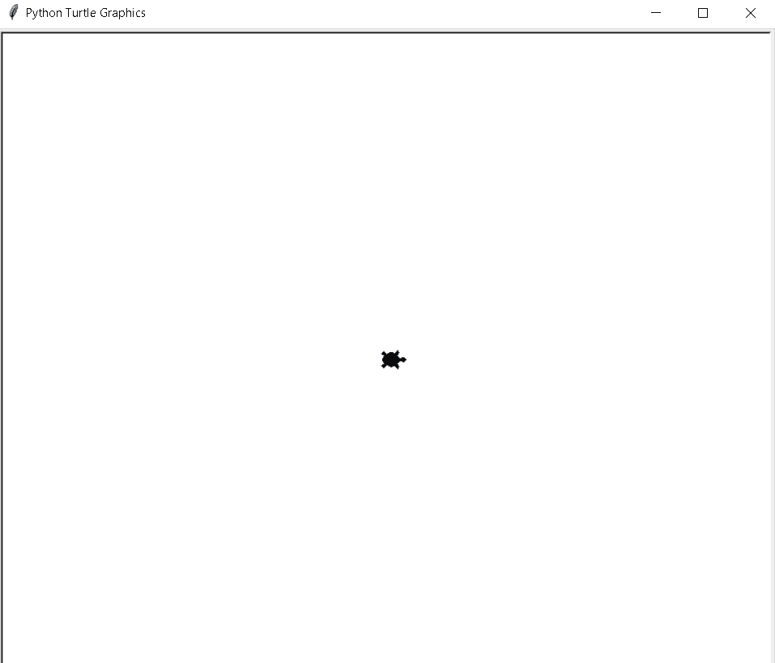

how to change the turtle shape

阅读[巨蟒龟命令](https://pythonguides.com/python-turtle-commands/)

## 如何使用乌龟绘制形状

在这一节中，我们将学习如何在 python turtle 中使用 turtle 绘制不同的形状。

海龟被用作在绘图板上画不同形状的笔，这里屏幕被用作绘图板，我们可以在这里画不同的形状，如“圆形”、“三角形”、“星形”等。

**语法:**

```py
turtle.circle(90)
```

上面的语法解释了如何用乌龟来画一个有半径的圆。这里我们以 90 度为半径画一个正圆。

**输出:**

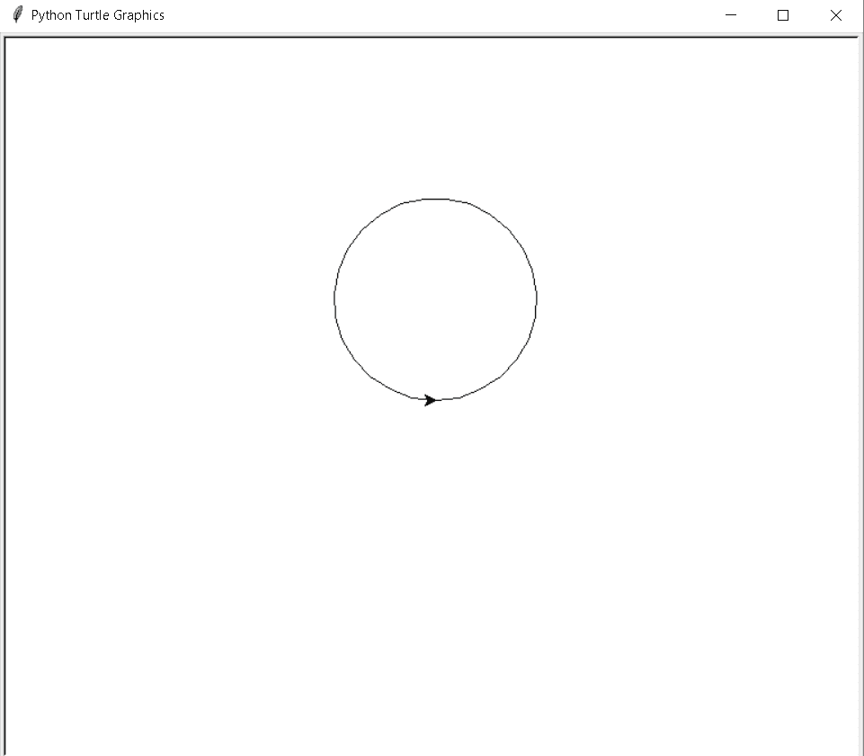

Draw a shape of a circle

阅读[如何在 Turtle Python 中附加图像](https://pythonguides.com/attach-image-to-turtle-python/)

## 如何改变龟速

本节我们将学习**如何在 python turtle 中改变 turtle 的速度**。

Speed 用来改变海龟的速度，通过给定一个参数值。乌龟的速度在 0-10 之间。

速度字符串由速度值绘制:

最快:0

最慢:1

慢速:3

正常:6

快速:10

**语法:**

```py
turtle.speed(value)
```

在上面的语法中，我们可以在参数中输入任何值来给海龟速度。

*   [蟒蛇龟的颜色](https://pythonguides.com/python-turtle-colors/)

## 如何改变箭头或乌龟的颜色

在这一节中，我们将学习如何在 python turtle 中改变箭头或乌龟的颜色。

使用 `turtle()` 方法制作对象。它用于在屏幕上绘制不同的形状。我们可以很容易地改变乌龟的颜色。

**语法:**

```py
turtle.color("cyan")
```

在上面的语法中，我们在参数中给出了颜色，用于简单地改变乌龟的颜色。

**输出:**

在下面的输出中，我们可以看到一只漂亮的彩色海龟放在屏幕上，吸引了用户的眼球。

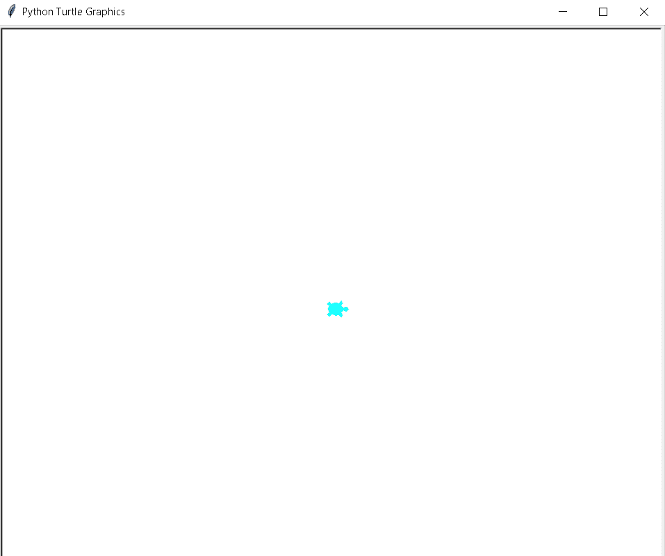

How to change the color of the turtle

*   [蟒蛇龟追踪仪——如何使用](https://pythonguides.com/python-turtle-tracer/)

## 如何改变乌龟的宽度

在本节中，我们将学习如何在 python turtle 中改变乌龟的宽度。

乌龟的默认大小是 20 像素，我们可以根据需要改变乌龟的大小。如果我们想要一只大乌龟，我们就增加乌龟的宽度；如果我们想要一只小乌龟，我们就减少乌龟的宽度。

**语法:**

```py
turtle.width()
```

在上面的语法中，我们可以将值作为一个参数给出，它只需要一个正参数。

**输出:**

在下面的输出中，我们可以看到一个箭头，它可以在宽度为“5”的乌龟的帮助下绘制。

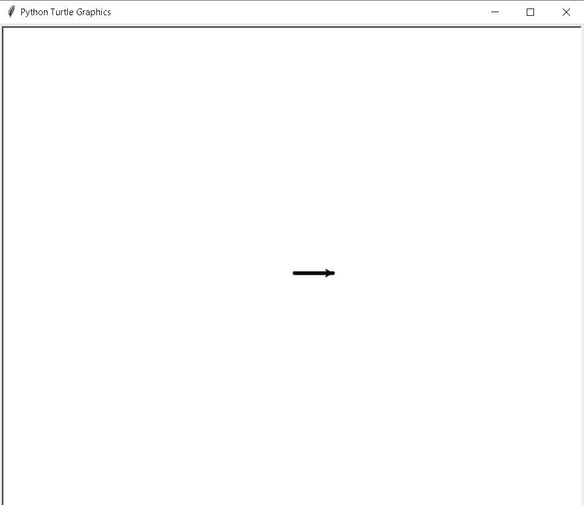

How to change the width of a turtle

*   [蟒龟三角](https://pythonguides.com/python-turtle-triangle/)

## 如何把动作交给乌龟

在这一节中，我们将学习如何在 python turtle 中将动作赋予 turtle 。

正如我们所知，乌龟被用来画不同的形状，它像一支笔一样工作，我们也可以控制乌龟的运动。

一只乌龟有四个方向可以移动，并在屏幕上画出形状。

*   向前
*   向后的
*   左边的
*   对吧

**语法:**

```py
turtle.right(90)
```

上面的语法描述了乌龟的向右移动。

```py
turtle.left(90)
```

上面的语法描述了乌龟向左的运动。

```py
turtle.forward(100)
```

上面的语法描述了海龟向前运动的方向。

```py
turtle.backward(100)
```

上面的语法描述了乌龟向后的运动方向。

**输出:**

在下面的输出中，我们可以看到乌龟在**向前**、**向右**、**向左**和**向后**方向移动。

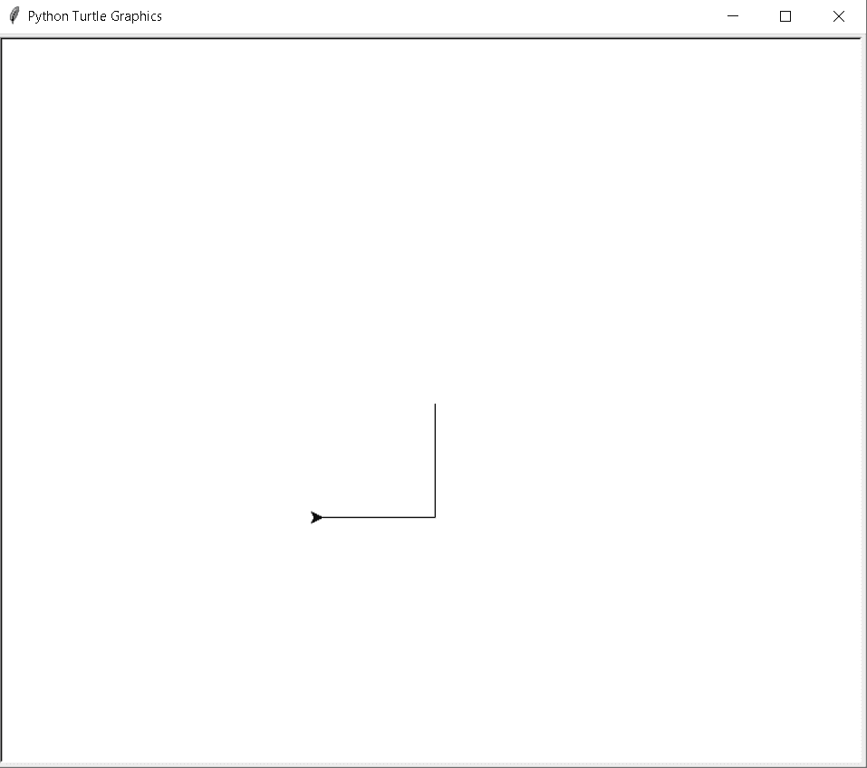

how to give the movement to turtle

*   [Replit 蟒蛇龟](https://pythonguides.com/replit-python-turtle/)

## 如何在乌龟的帮助下填充图像

在这一节中，我们将学习**如何在 python 海龟中的海龟的帮助下填充图像**。

乌龟被用来绘制不同的形状和图像，我们也可以在形状内部的乌龟的帮助下填充颜色。这种颜色给图像带来迷人的外观，我们的图像是美丽的。

**语法:**

```py
tur.fillcolor("yellow")
```

输出:

在下面的输出中，我们可以看到在屏幕上一只乌龟的帮助下绘制了一个填充有黄色的六边形。

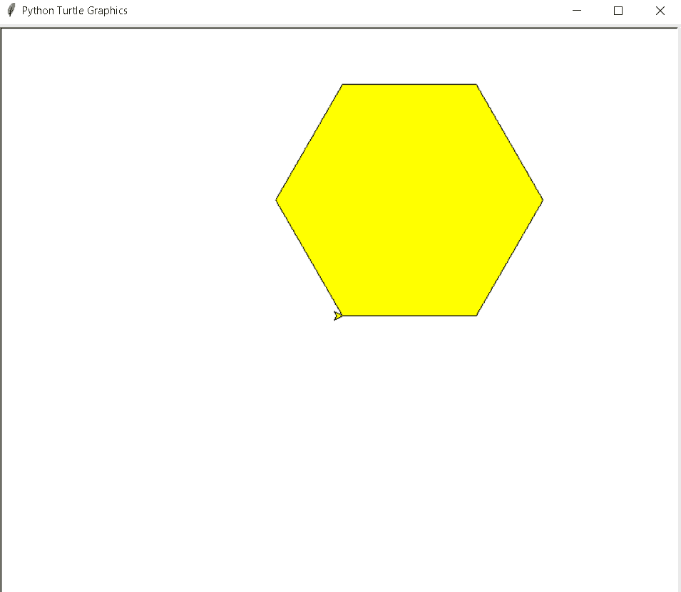

How to fill the image with the help of a turtle

*   [巨蟒龟大小](https://pythonguides.com/python-turtle-size/)

## 如何使用 turtle 实现动作

在接下来的章节中，我们将学习如何在 python turtle 中使用 turtle 实现动作。

众所周知，在乌龟的帮助下，我们可以画出不同的形状。在这里，我们可以简单地点击鼠标，通过这个动作，乌龟开始移动，并开始在乌龟上画出形状。

**语法:**

```py
turtle.onclick(func)
```

在上面的语法中，我们可以使用 onclick 函数将海龟移动到不同的方向。

**输出:**

在下面的输出中，我们可以看到乌龟在向前移动，然后点击它们，它们又转身移动了。

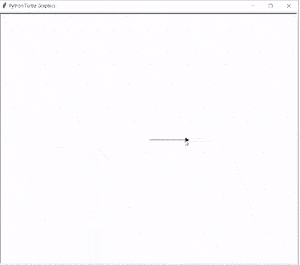

How to implement action using turtle

*   [蟒龟字体](https://pythonguides.com/python-turtle-font/)

## 如何在乌龟的帮助下写文章

在这一节中，我们将学习如何在 python turtle 中的一只乌龟的帮助下编写文本。

在 `write()` 函数的帮助下，我们可以书写任何想要的文本。如果用户想在屏幕上书写文本，他们只需借助 write 功能即可。

**语法:**

```py
turtle.write(arg,move=false,align='left',font=('Times New Roman',12,'normal')
```

*   **arg:** 用于屏幕上书写的信息。
*   `move=false` 用于证明乌龟的移动。
*   `align` 用于给乌龟指明方向。
*   **字体**用于赋予文本字体大小、字体颜色。

**输出:**

在下面的输出中，我们可以看到文本是在乌龟的帮助下写在屏幕上的。

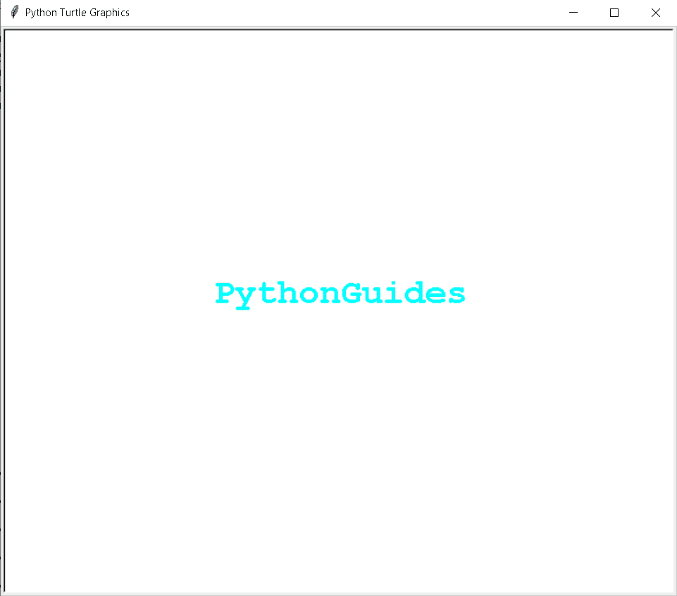

How to write the text with the help of a turtle

*   [蟒龟广场](https://pythonguides.com/python-turtle-square/)

## 如何用 python 龟添加图形

在这一节中，我们将学习如何在 python turtle 中**添加图形。**

这个图形是用来给我们的控制台增加吸引力的。它也用于定义我们的文本、图像和图片。

**代码:**

在这段代码中，我们将从 turtle import * 、 `import turtle` 中导入 turtle 模块**。**龟()**法是用来做物件的。**

*   `turt.forward(50)` 用于向前移动乌龟。
*   `turt.right(90)` 用于向右移动乌龟。

```py
from turtle import *
import turtle
turt = turtle.Turtle()

for x in range(4):
    turt.forward(50)
    turt.right(90)

turtle.done()
```

**输出:**

运行上面的代码后，我们得到下面的输出，我们可以看到设计是在图形的帮助下创建的。

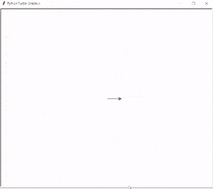

How to add graphics with python turtle

*   [蟒蛇龟艺术——如何绘制](https://pythonguides.com/python-turtle-art/)

## 如何用蟒蛇龟制作网格

在这一节中，我们将学习如何在 python turtle 中制作网格。

网格是由水平线或垂直线组成的网络。水平线和垂直线相互连接，形成一个网格，用户可以在图形中的理想位置上提到该点。

**代码:**

在下面的输出中，我们将从 turtle import * 、**导入 turtle 模块**。**用**龟()**的方法制作物品。**

*   `tur.forward(300)` 用于向前移动乌龟。
*   `tur.up()` 用于向上移动乌龟。
*   `tur.down()` 用于向下移动乌龟。
*   `tur.write()` 用于在屏幕上书写文本。
*   `tur.speed(100)` 用来给乌龟速度。
*   `tur.backward(300)` 用于向后移动乌龟。
*   **tur.color('blue')** 用来给乌龟上色。

```py
from turtle import *
import turtle

ws=turtle.Screen()
tur=turtle.Turtle()

def draw_yaxs(val):

    tur.forward(300)

    tur.up()
    tur.setpos(val,300)
    tur.down()

    tur.backward(300) 

    tur.up()
    tur.setpos(val+10,0)
    tur.down()

def draw_xaxs(val):

    tur.forward(300)

    tur.up()
    tur.setpos(300,val)
    tur.down()

    tur.backward(300)

    tur.up()
    tur.setpos(0,val+10)
    tur.down()

def label():

    tur.penup()
    tur.setpos(155,155)
    tur.pendown()

    tur.write(0,font=("Verdana", 18, "bold"))

    tur.penup()
    tur.setpos(290,155)
    tur.pendown()

    tur.write("x",font=("Verdana", 18, "bold"))

    tur.penup()
    tur.setpos(155,290)
    tur.pendown()

    tur.write("y",font=("Verdana", 18, "bold"))

ws.setup(800,800)   

tur.speed(100)
tur.left(90) 
tur.color('blue')

for i in range(30):
    draw_yaxs(10*(i+1))

tur.right(90)
tur.up()
tur.setpos(0,0)
tur.down()

for i in range(30):
    draw_xaxs(10*(i+1))

tur.hideturtle()
turtle.done()
```

输出:

运行上面的代码后，我们得到下面的输出，我们可以看到网格是由水平线和垂直线组成的。

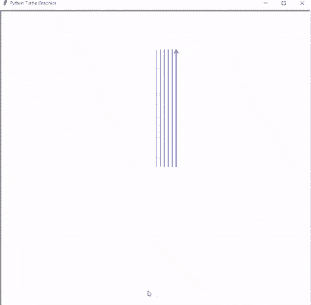

How to make a grid using python turtle

相关 Python 教程:

*   [蟒蛇龟椭圆形](https://pythonguides.com/python-turtle-oval/)
*   [蟒蛇龟星——如何绘制](https://pythonguides.com/python-turtle-star/)
*   [如何在蟒蛇龟身上画花](https://pythonguides.com/draw-flower-in-python-turtle/)
*   [蟒龟网格](https://pythonguides.com/python-turtle-grid/)
*   [蟒蛇龟笔+例题](https://pythonguides.com/python-turtle-pen/)

因此，在本教程中，我们讨论了 `Python turtle cheat sheet` ，并且涵盖了与其实现相关的不同示例。这是我们已经讨论过的例子列表。

*   什么是乌龟
*   如何安装海龟库
*   如何导入海龟库
*   如何设置背景颜色
*   如何改变乌龟的形状
*   如何用乌龟画出形状
*   如何改变龟速
*   如何改变箭头或乌龟的颜色
*   如何改变乌龟的宽度
*   如何给乌龟运动
*   如何在 turtle 的帮助下填充图像
*   如何使用 turtle 实现动作
*   如何在乌龟的帮助下写课文
*   如何用 python turtle 添加图形
*   如何用 python turtle 制作网格

[Bijay Kumar](https://pythonguides.com/author/fewlines4biju/)

Python 是美国最流行的语言之一。我从事 Python 工作已经有很长时间了，我在与 Tkinter、Pandas、NumPy、Turtle、Django、Matplotlib、Tensorflow、Scipy、Scikit-Learn 等各种库合作方面拥有专业知识。我有与美国、加拿大、英国、澳大利亚、新西兰等国家的各种客户合作的经验。查看我的个人资料。

[enjoysharepoint.com/](https://enjoysharepoint.com/)[](https://www.facebook.com/fewlines4biju "Facebook")[](https://www.linkedin.com/in/fewlines4biju/ "Linkedin")[](https://twitter.com/fewlines4biju "Twitter")