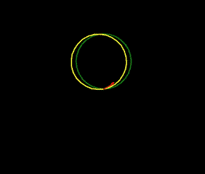

# 蟒蛇龟圈

> 原文：<https://pythonguides.com/python-turtle-circle/>

[](https://sharepointsky.teachable.com/p/python-and-machine-learning-training-course)

在这个 Python 教程中，我们将学习如何在 Python Turtle 中创建一个圆圈**，我们还将介绍与 `Python Turtle circle` 相关的不同示例。我们将讨论这些话题。**

*   蟒蛇龟圈
*   蟒蛇龟半圆
*   Python 龟圈螺旋代码
*   蟒蛇龟圈肺活量计
*   蟒蛇皮乌龟圈填充颜色
*   蟒蛇龟圆中心
*   蟒蛇龟圈步
*   蟒蛇龟圈颜色
*   蟒蛇龟倒圆
*   Python 海龟圈命令

目录

[](#)

*   [蟒龟圈](#Python_turtle_circle "Python turtle circle")
*   [蟒龟半圆](#Python_turtle_half_circle "Python turtle half circle")
*   [蟒龟圈螺旋码](#Python_turtle_circle_spiral_code "Python turtle circle spiral code")
*   [蟒龟圈肺活量计](#Python_turtle_circle_spirograph "Python turtle circle spirograph")
*   [蟒蛇龟圈填充颜色](#Python_turtle_circle_fill_color "Python turtle circle fill color")
*   [蟒龟圆心](#Python_turtle_circle_center "Python turtle circle center")
*   [蟒龟圈步骤](#Python_turtle_circle_steps "Python turtle circle steps")
*   [蟒龟圈色](#Python_turtle_circle_color "Python turtle circle color")
*   [蟒龟倒圆](#Python_turtle_Inverted_circle "Python turtle Inverted circle")
*   [Python 龟圈命令](#Python_turtle_circle_commands "Python turtle circle commands")

## 蟒龟圈

在这一节中，我们将学习**如何在[巨蟒龟](https://pythonguides.com/python-turtle-commands/)中的一只乌龟的帮助下创建一个圆**。

这个圆是一个像圆环一样的圆形。在 Python turtle 中，我们可以在乌龟的帮助下画出一个**圆**。一只乌龟正在像一支钢笔一样工作，他们画出了一个圆的确切形状。

**代码:**

在下面的代码中，我们在一只乌龟的帮助下画了一个**圆**，乌龟给出了一个类似圆环的精确形状。

`tur.circle(90)` 用于在乌龟的帮助下画圆。

```py
from turtle import *
import turtle as tur

tur.circle(90)
```

**输出:**

运行上面的代码后，我们得到下面的输出，其中我们看到一个圆是在一只乌龟的帮助下画出来的。


Python turtle circle Output

阅读[如何在 Turtle Python 中附加图像](https://pythonguides.com/attach-image-to-turtle-python/)

## 蟒龟半圆

在第节中，我们将学习**如何在 Python turtle** 中一只乌龟的帮助下画一个半圆。

半圆也称为半圆。它是通过沿直径切割整个圆而形成的。

**代码:**

在下面的代码中，我们从 turtle import * 、 **import turtle as tur、**中导入一些模块**，并在 turtle 的帮助下画一个半圆。**

`Turtle`-这是一个预装的库，用于创建形状和图片。

`tur.speed(1)` 用于管理圆的速度。

**tur . circle(90°，范围= 150)** 用于绘制半圆。

```py
from turtle import *
import turtle as tur
tur.speed(1)

tur.circle(90, 
              extent = 150)
```

**输出:**

运行上面的代码后，我们得到下面的输出，其中我们看到一个**半圆**是在 turtle 的帮助下创建的。


Python turtle half-circle Output

阅读[如何使用 Turtle](https://pythonguides.com/snake-game-in-python/) 创建 Python 中的贪吃蛇游戏

## 蟒龟圈螺旋码

在本节中，我们将学习如何在 Python turtle 中**创建一个圆形螺旋代码。**

螺旋是一种圆柱形的线圈状结构，或者我们可以说它绕着一个点，同时从一个点进一步移动。

**代码:**

在下面的代码中，我们绘制了一个半径为 8 的螺旋圆。这个螺旋圆是在一只乌龟的帮助下绘制的。

```py
import turtle

tur = turtle.Turtle()
r = 8

for i in range(100):
    tur.circle(r + i, 35)
```

**输出:**

运行上面的代码后，我们得到了下面的输出，其中我们看到了一个螺旋形的圆圈


Python turtle circle spiral code Output

阅读[使用蟒蛇龟绘制彩色填充形状](https://pythonguides.com/draw-colored-filled-shapes-using-python-turtle/)

## 蟒龟圈肺活量计

在本节中，我们将学习如何在 Python turtle 中绘制圆形螺旋图。

肺活量描记器是一种用于绘制不同类型的曲线以及吸引用户眼球的美丽图案的装置。

**代码:**

在下面的代码中，我们导入乌龟库来绘制所需的曲线，并将背景色设置为**“黑色”**。选择颜色组合**('绿色'，'黄色'，'红色'，'粉色'，'蓝色'，'橙色'，'青色'):**在这个和屏幕上显示的漂亮的彩色肺活量描记器内。

我们也画一个选定大小的圆。

```py
 import turtle as tur

tur.bgcolor('black')
tur.pensize(4)
tur.speed(10)

for i in range(5):

    for color in ('green', 'yellow', 'red',
                  'pink', 'blue', 'orange',
                  'cyan'):
        tur.color(color)

        tur.circle(100)

        tur.left(10)

    tur.hideturtle()
```

**输出:**

运行上面的代码后，我们得到了下面的输出，因为我们显示了一个美丽的彩色圆圈肺活量图绘制。



Python turtle circle spirograph Output

阅读[如何使用 Turtle 在 python 中绘制形状](https://pythonguides.com/turtle-programming-in-python/)

## 蟒蛇龟圈填充颜色

在下面的代码中，我们将学习**如何在 Python turtle** 中给一个圆填充颜色。

我们可以在 `tur.fillcolor()` 的帮助下填充颜色，并在参数中添加我们想要的任何颜色，以赋予形状样式。

**代码:**

在下面的代码中，我们在钢笔的帮助下绘制了一个充满颜色的圆，并控制了速度。**速度(1)** 为慢速，帮助用户轻松识别形状。

*   `tur.fillcolor("red")` 用于将填充颜色设置为红色。
*   `tur.begin_fill()` 用于开始填充颜色。
*   `tur.circle(100)` 用于绘制带半径的圆。
*   `tur.end_fill()` 用于结束颜色的填充。

```py
import turtle

tur = turtle.Turtle()
tur.speed(1)
tur.fillcolor("red")

tur.begin_fill()
tur.circle(100)
tur.end_fill()
```

**输出:**

运行上面的代码后，我们会看到下面的输出，其中我们会看到一个圆圈被画了出来，里面填充了漂亮的**“红色”**。


Python turtle circle fill color Output

阅读[蟒蛇龟的颜色](https://pythonguides.com/python-turtle-colors/)

## 蟒龟圆心

在本节中，我们将了解 Python turtle 中的**圆心。**

圆心是将圆从边上的点分成相等部分的点。

**代码:**

在下面的代码中，我们从龟导入* 、**、**、**导入龟包**作为 tur** 也画出了**半径 60** 的圆。**半径**是从中心点到任意端点的距离。**

```py
 from turtle import *
import turtle as tur

tur.speed(1)

tur.pensize(4)
tur.circle(60)
```

**输出:**

在下面的输出中，我们看到一个圆是在一只乌龟的帮助下画出来的，这个圆里面有一个中心点。


Python turtle circle center Output

阅读 [Python 龟速带示例](https://pythonguides.com/python-turtle-speed/)

## 蟒龟圈步骤

在这一节中，我们将学习如何在 Python turtle 中用步骤画一个圆。

我们使用 **turtle.circle(radius，extend=None，steps=None)** 来创建圆。

*   **半径:**半径表示给定圆的半径。
*   **范围:**是圆的一部分，度数为弧形。
*   **步数:**将圆的形状按给定的步数等分。

**代码:**

在下面的代码中，我们从海龟导入*中导入海龟库**，导入海龟` `作为 tur** 我们借助钢笔绘制一个**半径 150 像素**的圆。

`tur.circle(150)` 用于借助钢笔绘制半径为 150 像素的圆。

```py
from turtle import *
import turtle as tur

tur.pensize(2)
tur.circle(150)
```

**输出:**

运行上面的代码后，我们得到了下面的输出，其中我们看到画了一个圆。


Python turtle circle steps Output

阅读:[蟒龟三角](https://pythonguides.com/python-turtle-triangle/)

## 蟒龟圈色

在这一节，我们将学习如何在 python turtle 中**改变圆圈颜色。**

颜色是用来给形状增加吸引力的。基本上，乌龟的**默认颜色**是**黑色**如果我们想改变乌龟的颜色，那么我们使用 `tur.color()` 。

**代码:**

在下面的代码中，我们用 `pensize(2)` 将背景颜色设置为黑色，画圆的速度为 speed(1)。我们给圆赋予两种颜色，也给画圆的尺寸 `tur.circle(100)` 。

```py
import turtle as tur

tur.bgcolor('black')
tur.pensize(4)
tur.speed(1)

for i in range(1):

    for color in ('orange', 'yellow', ):
        tur.color(color)
        tur.circle(100)
        tur.left(2)
```

**输出:**

运行上面的代码后，我们得到了下面的输出，因为我们看到了一个美丽的彩色圆圈，如图所示。


Python turtle circle color Output

还有，查:[蟒龟艺术](https://pythonguides.com/python-turtle-art/)

## 蟒龟倒圆

本节我们将学习**如何在 Python turtle** 中绘制一个倒圆。

倒置的意思是把某物放在相反的位置。倒圆是顺时针方向画的，而不是逆时针方向画的。

**代码:**

在下面的代码中，我们导入 turtle 库来绘制一个倒圆。 **Turtle 是一个**预装的库，用来画不同的形状和图片。

*   `t.right(90)` 用于向右移动乌龟。
*   `t.forward(100)` 用于将乌龟向右移动后向前进方向移动。
*   `t.circle(-100)` 用于绘制半径的圆。

```py
 from turtle import *
import turtle

t = turtle.Turtle()
t.right(90)
t.forward(100)
t.left(90)
t.circle(-100)
```

**输出:**

运行上面的代码后，我们得到下面的输出，其中我们看到画了一个倒圆。


Python turtle inverted circle Output

还有，检查:[蟒龟方块](https://pythonguides.com/python-turtle-square/)

## Python 龟圈命令

在这一节中，我们将学习 python turtle 中的 circle 命令是如何工作的。

不同的**命令**用于绘制不同的形状，它们也有助于向任何方向移动乌龟。我们将在下面讨论海龟圈命令。

*   `circle()` -circle()命令用来在乌龟的帮助下画一个圆形。
*   `forward()`–forward()命令用于向前移动乌龟。
*   **右()**–右()命令用于顺时针方向移动乌龟。
*   `Penup()`–Penup()命令用于拿起乌龟围栏。
*   `pendown()` -Pendown()命令用于放下海龟笔。
*   `color()`–color()命令用于改变乌龟笔的颜色。
*   `shape()` -Shape()命令用来给乌龟赋予形状。

**代码:**

在下面的代码中，我们使用了一些有助于画圆的命令。我们做的圈看起来很吸引人。

```py
import turtle

tur = turtle.Turtle()
tur.color("blue")

radius = 10
n = 10

for i in range(2, n + 1, 2):
    tur.circle(radius * i)
```

**输出:**

运行上面的代码后，我们得到了下面的输出，在输出中我们看到了一个循环，循环正在工作。


Python turtle circle command output

另外，请阅读:

*   [蟒蛇龟图形](https://pythonguides.com/python-turtle-graphics/)
*   [蟒龟兽皮](https://pythonguides.com/python-turtle-hide/)
*   [蟒龟背景](https://pythonguides.com/python-turtle-background/)

因此，在本教程中，我们讨论了 `Python Turtle circle` ，并且我们还涵盖了与其实现相关的不同示例。这是我们已经讨论过的例子列表。

*   蟒蛇龟圈
*   蟒蛇龟半圆
*   Python 龟圈螺旋代码
*   蟒蛇龟圈肺活量计
*   蟒蛇皮乌龟圈填充颜色
*   蟒蛇龟圆中心
*   蟒蛇龟圈步
*   Python 圆形颜色
*   蟒蛇龟倒圆
*   Python 海龟圈命令

[Bijay Kumar](https://pythonguides.com/author/fewlines4biju/)

Python 是美国最流行的语言之一。我从事 Python 工作已经有很长时间了，我在与 Tkinter、Pandas、NumPy、Turtle、Django、Matplotlib、Tensorflow、Scipy、Scikit-Learn 等各种库合作方面拥有专业知识。我有与美国、加拿大、英国、澳大利亚、新西兰等国家的各种客户合作的经验。查看我的个人资料。

[enjoysharepoint.com/](https://enjoysharepoint.com/)[](https://www.facebook.com/fewlines4biju "Facebook")[](https://www.linkedin.com/in/fewlines4biju/ "Linkedin")[](https://twitter.com/fewlines4biju "Twitter")