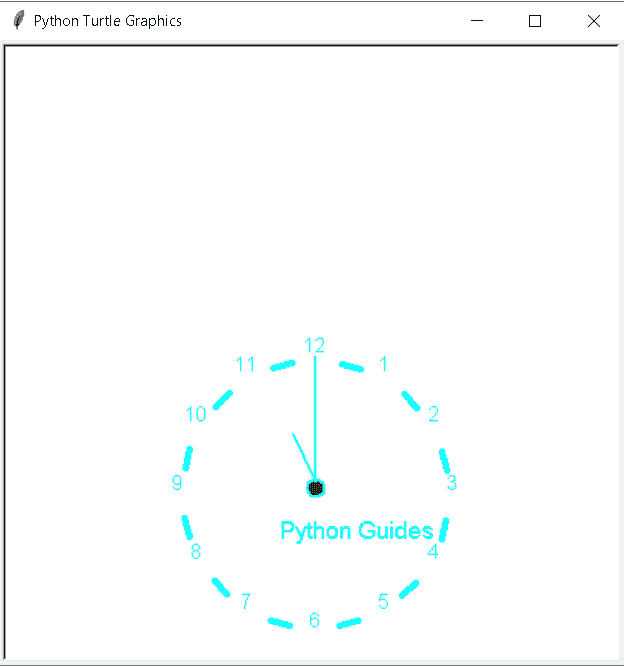
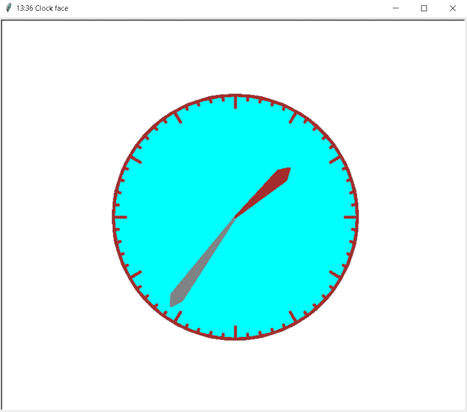
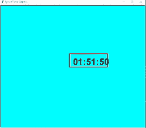
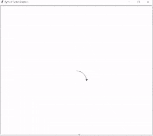
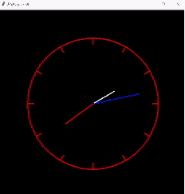
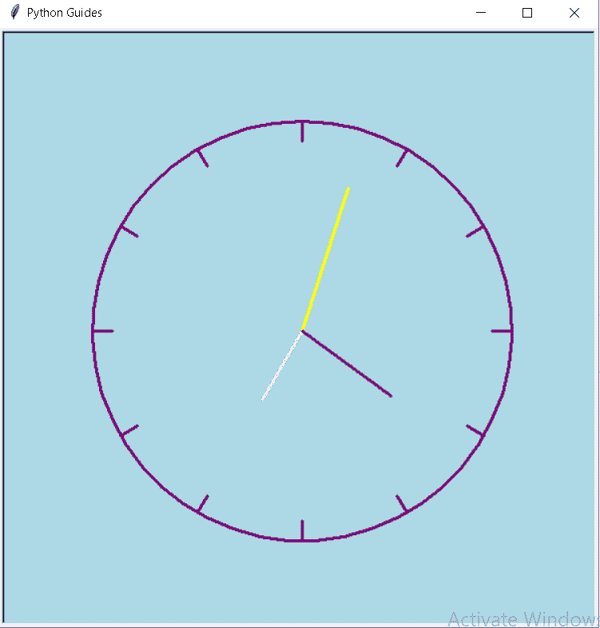

# 蟒蛇皮乌龟钟——如何绘制

> 原文：<https://pythonguides.com/python-turtle-clock/>

[](https://sharepointsky.teachable.com/p/python-and-machine-learning-training-course)

在这个 Python 教程中，我们将学习如何在 [Python 龟](https://pythonguides.com/turtle-programming-in-python/)中绘制龟钟，我们还将介绍与龟钟相关的不同例子。我们将讨论这些话题。

*   蟒蛇皮海龟钟
*   蟒蛇龟钟面
*   蟒蛇龟数字时钟
*   蟒蛇龟顺时针转圈
*   蟒蛇龟模拟时钟
*   蟒蛇皮海龟钟背景色

目录

[](#)

*   [蟒龟钟](#Python_turtle_clock "Python turtle clock")
*   [蟒龟钟面](#Python_turtle_clock_face "Python turtle clock face")
*   [蟒蛇龟数字时钟](#Python_turtle_digital_clock "Python turtle digital clock")
*   [巨蟒龟顺时针转圈](#Python_turtle_circle_clockwise "Python turtle circle clockwise")
*   [蟒龟模拟时钟](#Python_turtle_analog_clock "Python turtle analog clock")
*   [蟒蛇龟时钟背景色](#Python_turtle_clock_background-color "Python turtle clock background-color")

## 蟒龟钟

本节我们将学习**如何在 Python turtle 中绘制乌龟时钟**。

正如我们所知，钟是用来计时的。时钟通过顺时针方向的指针移动来指示小时、分钟和秒。

乌龟是用来画时钟的，它和普通的时钟一样，也是用来计时的。

**代码:**

在下面的代码中，我们将从 turtle import * 、 `import turtle` 中导入 turtle 模块**。**龟()**法是用来做物件的。**

*   **乌龟。Screen()** 用于显示我们在其上绘制图形的屏幕。
*   **clock.color('青色')**用于给时钟颜色。
*   `clock.width(5)` 用于设置时钟宽度。
*   `clock.penup()` 用来拿起笔。
*   `clock.right(90)` 用于将乌龟向正确的方向移动。
*   `clock.forward(100)` 用于向前移动乌龟。
*   `val += 1` 用于将值增加 1。
*   **clock.fillcolor('Green')** 用于填充时钟中的颜色。
*   `clock.circle(7)` 用来画半径为 7 的圆。
*   `clock.begin_fill()` 用于开始在时钟中填充颜色。
*   `clock.end_fill()` 用于结束时钟中的填充颜色。

```py
from turtle import *
import turtle

scr = turtle.Screen()

scr.setup(500, 500)

clock = turtle.Turtle()

clock.color('cyan')

clock.width(5)

def drawhourhand():
    clock.penup()
    clock.home()
    clock.right(90)
    clock.pendown()
    clock.forward(100)

val = 0

for i in range(12):

    val += 1

    clock.penup()

     clock.setheading(-30 * (i + 3) + 75)

    clock.forward(22)

    clock.pendown()

    clock.forward(15)

    clock.penup()

    clock.forward(20)

    clock.write(str(val), align="center",
              font=("Arial",
                    12, "normal"))
clock.setpos(2, -112)
clock.pendown()
clock.width(2)

clock.fillcolor('Green')

clock.begin_fill()

clock.circle(7)

clock.end_fill()

clock.penup()
drawhourhand()
clock.setpos(-18, -62)
clock.pendown()
clock.penup()

clock.setpos(-28, -150)
clock.pendown()
clock.write('Python Guides', font=("Arial",14,
                              "normal"))
clock.hideturtle()
turtle.done()
```

**输出:**

运行上面的代码后，我们得到下面的输出，我们可以看到屏幕上画出了时钟。



Python turtle clock Output

另外，检查:[蟒蛇龟图形](https://pythonguides.com/python-turtle-graphics/)

## 蟒龟钟面

在这一节中，我们将学习如何在蟒蛇龟身上绘制钟面。

钟面是钟的一部分，它显示时间，由指针组成，指示小时、分钟和秒。这些显示时间的指针完善了钟面。

**代码:**

在下面的代码中，我们将从 turtle import * 、 **import turtle、**中导入 turtle 模块**，并导入DateTime 模块。使用 `turtle()` 方法来制作对象。**

*   `tur.pensize(5)` 用于给乌龟大小。
*   **tur.fillcolor(颜色)**用于在时钟中填充颜色。
*   `tur.pencolor("brown")` 用来给乌龟加上棕色。
*   **tur.circle(-r，360//mins)** 用于绘制给定半径的圆。
*   `tur.right(90)` 用于向右移动乌龟。
*   **tur.forward(冷)**用来使乌龟向前移动
*   **tur.title("钟面")**用来给我们的窗口加标题。

```py
from turtle import *
import turtle as tur
import datetime
import time

def drawclock(r,hrs,mins,leng,color):
    tur.pensize(5)
    tur.penup()
    tur.goto(0,r)
    tur.pendown()
    tur.fillcolor(color)
    tur.pencolor("brown")
    tur.begin_fill()
    for degree in range(0,360,360//mins):
        tur.circle(-r,360//mins)
        tur.right(90)
        tur.forward(leng/3)
        tur.back(leng/3)
        tur.left(90)
    tur.end_fill()
    tur.pencolor("brown")
    for degree in range(0,360,360//hrs):
        tur.circle(-r,360//hrs)
        tur.right(90)
        tur.forward(leng)
        tur.back(leng)
        tur.left(90)
    tur.circle(-r)

def draw_hand(ang, r, wid, color, outline=False):
    if outline:
        tur.pencolor("brown")
    else:
        tur.pencolor(color)
    tur.pensize(4)
    tur.penup()
    tur.home()
    tur.fillcolor(color)
    tur.begin_fill()
    tur.left(90)
    tur.right(ang)
    tur.forward(r)
    tur.pendown()
    tur.left(150)
    tur.forward(wid)
    tur.home()
    tur.left(90)
    tur.right(ang)
    tur.penup()
    tur.forward(r)
    tur.pendown()
    tur.right(150)
    tur.forward(wid)
    tur.home()
    tur.end_fill()

r=200
tur.speed(0)
tur.hideturtle()
tur.title("Clock Face")
drawclock(r,12,60,r*.1,"cyan")
current_time=datetime.datetime.now().time()
tur.title(current_time.strftime("%H:%M Clock face"))
draw_hand(current_time.minute * 6, r * .9, r // 10, "gray")
draw_hand(((current_time.hour + current_time.minute / 60) % 12) * 30, r * .6, r // 10, "brown")

while True:
    new_time=datetime.datetime.now().time()
    if current_time.minute is not new_time.minute:
        tur.title(new_time.strftime("%H:%M Clock Face"))
        draw_hand(current_time.minute * 6, r * .9, r // 10, "cyan")
        draw_hand(((current_time.hour + current_time.minute / 60) % 12) * 30, r * .6, r // 10, "cyan")
        draw_hand(new_time.minute * 6, r * .9, r // 10, "gray")
        draw_hand(((new_time.hour + new_time.minute / 60) % 12) * 30, r * .6, r // 10, "black")
    current_time=new_time
    time.sleep(50)
```

**输出:**

运行上面的代码后，我们得到了下面的输出，在这个输出中，我们可以看到时钟的指针显示了小时、分钟和秒。



Python turtle clock face Output

阅读: [Python turtle onclick 附示例](https://pythonguides.com/python-turtle-onclick/)

## 蟒蛇龟数字时钟

在这一节中，我们将学习如何在 Python turtle 中绘制数字时钟。

数字时钟像模拟时钟一样显示时间，但它用数字显示时间，而不是手动表盘。乌龟数字钟是由一只乌龟画的，用数字显示时间。

**代码:**

在下面的代码中，我们将从 turtle import * 、 **import turtle、**和 `import datetime` 模块中导入 turtle 模块**。使用 `turtle()` 方法来制作对象。**

*   **乌龟。Screen()** 用于创建一个屏幕，我们可以在其中绘制形状。
*   **screen.bgcolor("青色")**用于给屏幕背景色。
*   **秒= datetime.datetime.now()。秒**用于从屏幕上获取当前秒。
*   **minute = datetime . datetime . now()。分钟**用于从屏幕上获取当前分钟。
*   **hour = datetime.datetime.now()。小时**用于从屏幕上获取当前小时。
*   **tur1.goto(-20，0)** 用于设置乌龟的位置。
*   `tur1.forward(200)` 用于将乌龟向前移动，创建一个矩形框。
*   `tur1.left(90)` 用于向左移动乌龟，创建一个矩形框。

```py
from turtle import *
import time
import datetime 
import turtle

tur  = turtle.Turtle()

tur1 = turtle.Turtle()

screen = turtle.Screen()

screen.bgcolor("cyan")

second = datetime.datetime.now().second
minute = datetime.datetime.now().minute
hour = datetime.datetime.now().hour
tur1.pensize(4)
tur1.color('red')
tur1.penup()

tur1.goto(-20, 0)
tur1.pendown()

for i in range(2):
    tur1.forward(200)
    tur1.left(90)
    tur1.forward(70)
    tur1.left(90)

tur1.hideturtle()

while True:
    tur.hideturtle()
    tur.clear()

    tur.write(str(hour).zfill(2)
            +":"+str(minute).zfill(2)+":"
            +str(second).zfill(2),
            font =("Arial", 35, "bold"))
    time.sleep(1)
    second+= 1

    if second == 60:
        second = 0
        minute+= 1

    if minute == 60:
        minute = 0
        hour+= 1

    if hour == 13:
        hour = 1
```

**输出:**

运行上面的代码后，我们得到下面的输出，我们可以在屏幕上看到显示当前时间的数字时钟。



Python turtle digital clock Output

阅读:[蟒龟示踪器](https://pythonguides.com/python-turtle-tracer/)

## 巨蟒龟顺时针转圈

本节我们将学习**如何在 Python turtle 中顺时针**画龟圈。

正如我们所知，钟是圆形的。这里我们画了一个顺时针方向运动的圆，就像时钟一样，我们的圆完全是顺时针运动的。

**代码:**

在下面的代码中，我们将从 turtle import * 、 `import turtle` 中导入 turtle 模块**。**龟()**法是用来做物件的。**

`tur.circle(-50)` 用于顺时针方向画圆。

```py
from turtle import *
import turtle

tur = turtle.Turtle()

tur.circle(-50)
turtle.done()
```

**输出:**

运行上面的代码后，我们得到下面的输出，可以看到屏幕上的圆是顺时针方向画的。



Python turtle circle clockwise Output

阅读:[蟒龟三角+例题](https://pythonguides.com/python-turtle-triangle/)

## 蟒龟模拟时钟

在这一节中，我们将学习如何在 python turtle 中**绘制一个 turtle 模拟时钟。**

模拟时钟是一种借助指针显示时间的时钟，这些指针指示小时、分钟和秒钟。

**代码:**

在下面的代码中，我们将从 turtle import * ，import turtle， `import time` 中导入 turtle 模块**。**龟()**法是用来做物件的。**

*   `ws.bgcolor("black")` 用于给屏幕赋予背景色。
*   **ws.title("模拟时钟")**用于给窗口赋予标题。
*   `tur.speed(0)` 用于给海龟速度， `0` 为最快速度。
*   `tur.pensize(3)` 用于给龟定大小。
*   `tur.circle(210)` 用于在乌龟的帮助下画圆。
*   **clockhands = [("红色"，80，12)，("白色"，150，60)，("蓝色"，110，60)]** 用于给时钟的指针赋予颜色。
*   `tur.fd(190)` 用于向前移动乌龟。

```py
from turtle import *
import turtle
import time

ws = turtle.Screen()
ws.bgcolor("black")
ws.setup(width=600, height=600)
ws.title("Analog Clock")
ws.tracer(0)
tur = turtle.Turtle()
tur.hideturtle()
tur.speed(0)
tur.pensize(3)
def draw_clock(hour, min, second, tur):
    tur.up()
    tur.goto(0, 210)
    tur.setheading(180)
    tur.color("red")
    tur.pendown()
    tur.circle(210)
    tur.up()
    tur.goto(0, 0)
    tur.setheading(90)
    for _ in range(12):
        tur.fd(190)
        tur.pendown()
        tur.fd(20)
        tur.penup()
        tur.goto(0, 0)
        tur.rt(30)

    clockhands = [("red", 80, 12), ("white", 150, 60), ("blue", 110, 60)]
    timeset = (hour, min, second)
    for hand in clockhands:
        timepart = timeset[clockhands.index(hand)]
        angle = (timepart/hand[2])*360
        tur.penup()
        tur.goto(0, 0)
        tur.color(hand[0])
        tur.setheading(90)
        tur.rt(angle)
        tur.pendown()
        tur.fd(hand[1])
while True:
    hour = int(time.strftime("%I"))
    min = int(time.strftime("%M"))
    second = int(time.strftime("%S"))
    draw_clock(hour, min, second, tur)
    ws.update()
    time.sleep(1)
    tur.clear()
window.mainloop()
```

**输出:**

运行上面的代码后，我们得到下面的输出，我们可以看到模拟时钟显示在屏幕上。



Python turtle analog clock Output

阅读:[蟒龟字体](https://pythonguides.com/python-turtle-font/)

## 蟒蛇龟时钟背景色

本节我们将学习**如何在 python turtle 中更改海龟时钟的背景色**。

时钟是用来测量时间的，它帮助人们按时工作。

在这里，我们可以借助 turtle 绘制时钟，并给时钟添加背景色，使其更加漂亮和吸引人。

**代码:**

在下面的代码中，我们将从 turtle import * ，import turtle， `import time` 中导入 turtle 模块**。**龟()**法是用来做物件的。**

*   **ws.bgcolor("浅蓝色")**用于给屏幕赋予背景色。
*   **ws.title("模拟时钟")**用于给窗口赋予标题。
*   `tur.speed(0)` 用于给海龟速度， `0` 为最快速度。
*   `tur.pensize(3)` 用于给龟定大小。
*   `tur.circle(210)` 用于在乌龟的帮助下画圆。
*   **clockhands = [("粉色"，80，12)，("黄色"，150，60)，("棕色"，110，60)]** 用于给时钟的指针赋予颜色。
*   `tur.fd(190)` 用于向前移动乌龟。

```py
from turtle import *
import turtle
import time

ws = turtle.Screen()
ws.bgcolor("light blue")
ws.setup(width=600, height=600)
ws.title("Python Guides")
ws.tracer(0)

tur = turtle.Turtle()
tur.hideturtle()
tur.speed(0)
tur.pensize(3)
def draw_clock(hour, min, second, tur):

    tur.up()
    tur.goto(0, 210)
    tur.setheading(180)
    tur.color("purple")
    tur.pendown()
    tur.circle(210)

    tur.up()
    tur.goto(0, 0)
    tur.setheading(90)
    for _ in range(12):
        tur.fd(190)
        tur.pendown()
        tur.fd(20)
        tur.penup()
        tur.goto(0, 0)
        tur.rt(30)

    clockhands = [("pink", 80, 12), ("yellow", 150, 60), ("brown", 110, 60)]
    timeset = (hour, min, second)
    for hand in clockhands:
        timepart = timeset[clockhands.index(hand)]
        angle = (timepart/hand[2])*360
        tur.penup()
        tur.goto(0, 0)
        tur.color(hand[0])
        tur.setheading(90)
        tur.rt(angle)
        tur.pendown()
        tur.fd(hand[1])
while True:
    hour = int(time.strftime("%I"))
    min = int(time.strftime("%M"))
    second = int(time.strftime("%S"))
    draw_clock(hour, min, second, tur)
    ws.update()
    time.sleep(1)
    tur.clear() 
```

**输出:**

运行上面的代码后，我们得到了下面的输出，从中我们可以看到时钟美丽的背景色。



Python turtle clock background-color Output

你可能也喜欢阅读下面的 Python 海龟教程。

*   [蟒蛇龟广场——实用指南](https://pythonguides.com/python-turtle-square/)
*   [蟒蛇龟艺术——如何绘制](https://pythonguides.com/python-turtle-art/)
*   [Python 龟写函数](https://pythonguides.com/python-turtle-write-function/)
*   [Python 清龟配实例](https://pythonguides.com/python-clear-turtle/)
*   [蟒龟速度举例](https://pythonguides.com/python-turtle-speed/)
*   [蟒蛇龟颜色+示例](https://pythonguides.com/python-turtle-colors/)

在这里，我们学习了 `Python Turtle Clock` ，并且我们还介绍了与其实现相关的不同示例。这是我们已经讨论过的例子列表。

*   蟒蛇皮海龟钟
*   蟒蛇龟钟面
*   蟒蛇龟数字时钟
*   蟒蛇龟顺时针转圈
*   蟒蛇龟模拟时钟
*   蟒蛇皮海龟钟背景色

[Bijay Kumar](https://pythonguides.com/author/fewlines4biju/)

Python 是美国最流行的语言之一。我从事 Python 工作已经有很长时间了，我在与 Tkinter、Pandas、NumPy、Turtle、Django、Matplotlib、Tensorflow、Scipy、Scikit-Learn 等各种库合作方面拥有专业知识。我有与美国、加拿大、英国、澳大利亚、新西兰等国家的各种客户合作的经验。查看我的个人资料。

[enjoysharepoint.com/](https://enjoysharepoint.com/)[](https://www.facebook.com/fewlines4biju "Facebook")[](https://www.linkedin.com/in/fewlines4biju/ "Linkedin")[](https://twitter.com/fewlines4biju "Twitter")