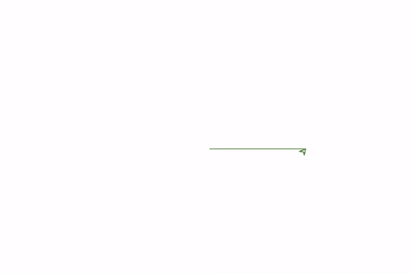
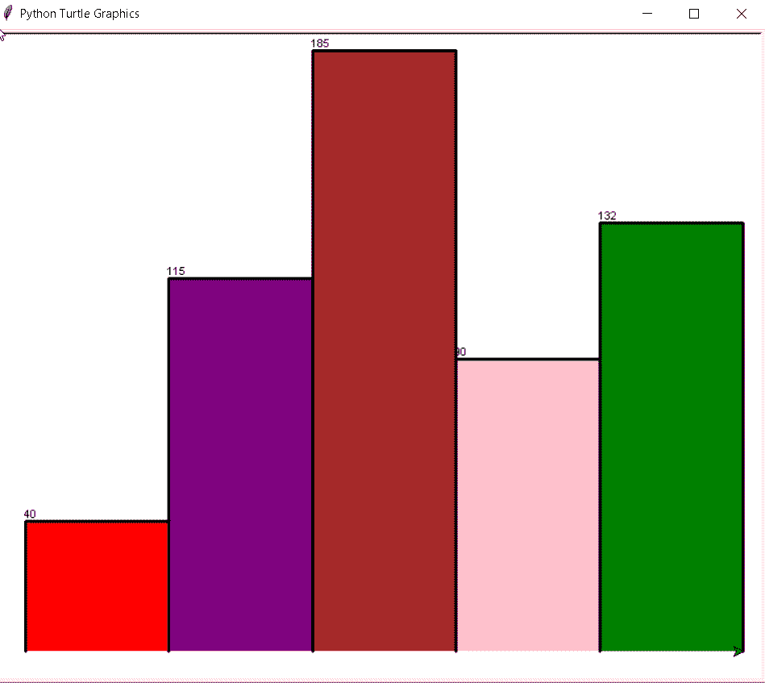
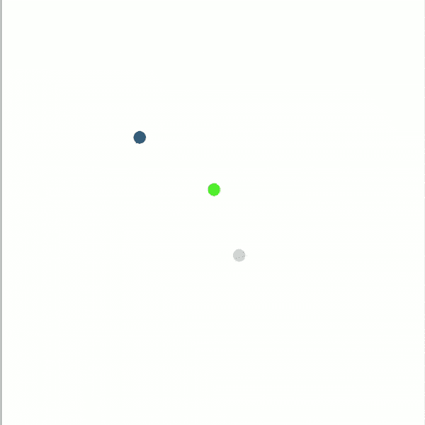
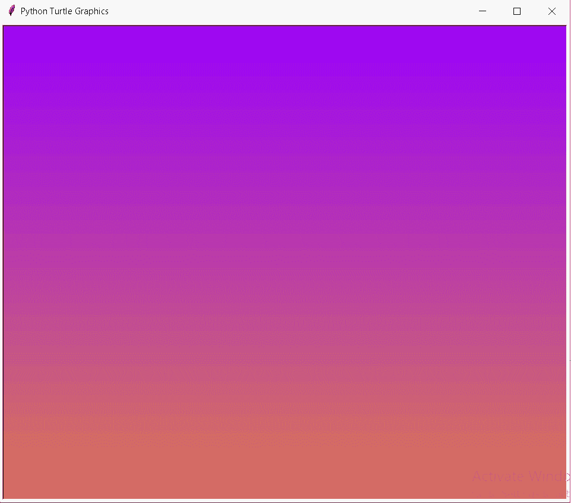
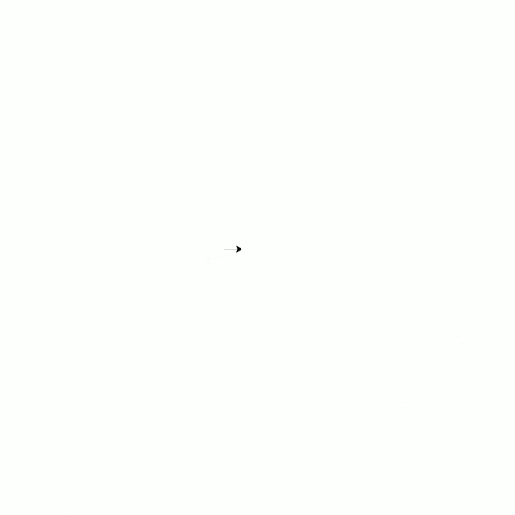

# 蟒蛇皮海龟颜色+示例

> 原文：<https://pythonguides.com/python-turtle-colors/>

[](https://sharepointsky.teachable.com/p/python-and-machine-learning-training-course)

在这个 [Python 教程](https://pythonguides.com/learn-python/)中，我们将学习如何**在 Python 海龟**中创建颜色，我们还将涵盖与**海龟颜色**相关的不同示例。我们将讨论这些话题。

*   蟒蛇龟色
*   蟒蛇皮海龟颜色 rgb
*   蟒蛇皮海龟颜色填充
*   蟒蛇皮海龟彩色图表
*   蟒蛇皮海龟颜色代码
*   蟒蛇龟颜色随机
*   蟒蛇皮海龟颜色渐变
*   蟒蛇龟变色

目录

[](#)

*   [蟒龟色](#Python_turtle_color "Python turtle color")
*   [蟒蛇龟颜色 RGB](#Python_turtle_colors_RGB "Python turtle colors RGB")
*   [蟒蛇龟颜色填充](#Python_turtle_colors_fill "Python turtle colors fill")
*   [蟒龟色图](#Python_turtle_color_chart "Python turtle color chart")
*   [蟒蛇龟色码](#Python_turtle_color_codes "Python turtle color codes")
*   [蟒龟颜色随机](#Python_turtle_color_random "Python turtle color random")
*   [蟒蛇龟颜色渐变](#Python_turtle_color_gradient "Python turtle color gradient")
*   [蟒龟变色](#Python_turtle_color_change "Python turtle color change")

## 蟒龟色

在这一节中，我们将学习如何在 Python Turtle 中创建颜色。

Turtle 是 Python 的一个特性，我们可以在其中绘制各种形状，并在这些形状之间填充颜色。Turtle 是一个画板，我们也可以创建类和定义函数。

**代码:**

在下面的代码中，我们生成了一些**颜色**，比如**、【绿色】、【粉色】**我们填充这些颜色以使输出更具吸引力。

*   `begin_fill()` 在绘制要填充的形状之前使用。
*   **前进(150)** 用于向前移动光标。
*   `end_fill()` 用于绘制形状后终止。

```py
from turtle import *
color('green', 'pink')
begin_fill()
while True:
    forward(150)
    left(120)
    if abs(pos()) < 1:
        break
end_fill()
done()
```

**输出:**

运行上面的代码后，我们得到了下面的输出，我们看到光标以绿色向前移动，制作三角形并用粉红色填充三角形。



Python turtle colors Output

阅读:[如何使用 Turtle 在 python 中绘制形状](https://pythonguides.com/turtle-programming-in-python/)

## 蟒蛇龟颜色 RGB

在这一节，我们将学习如何在 Python turtle 中**创建 RCB 颜色。**

众所周知，turtle 是 Python 中的一个特性，它被用作画板，我们可以在上面画出任何颜色的任何形状。我们创建一个 **RCB 颜色**来制作一个形状。

**代码:**

在下面的代码中，我们将乌龟包导入为 `import turtle` ，并将乌龟形状赋予光标，并将钢笔颜色赋予为**“RGB”**。

*   `turtle.shape("turtle")` 以乌龟的形式给出光标的形状。
*   `turtle.pencolor()` 用于赋予颜色，使图形更具吸引力。
*   `turtle.forward(120)` 用于向前移动乌龟。

```py
from turtle import *
import turtle

turtle.shape("turtle")
turtle.colormode(255)
turtle.forward(120)
turtle.pencolor("red")
turtle.right(90)
turtle.forward(120)
turtle.pencolor(("blue"))
turtle.right(90)
turtle.forward(120)
turtle.pencolor("green")
turtle.right(90)
turtle.forward(120)
```

**输出:**

在下面的输出中，我们看到用三种美丽的颜色**“RGB”**创建了一个正方形。黑色是默认颜色。


Python turtle RGB color Output

阅读:[使用蟒蛇龟绘制彩色填充形状](https://pythonguides.com/draw-colored-filled-shapes-using-python-turtle/)

## 蟒蛇龟颜色填充

在这一节，我们将学习如何在 Python turtle 中填充颜色。

Python turtle 有一些移动乌龟的功能，即**向前()**、**向后()**，还有填充形状的填充功能，选择颜色并填充形状，即 `fillcolor()` 。

**代码:**

在下面的代码中，我们创建了一个绘制六边形的海龟笔。并且还设置了填充六边形的**填充颜色**。

*   **tur =乌龟。Turtle()** 为此，我们设计了 turpel 笔。
*   `tur.fillcolor("yellow")` 用于设置填充颜色。
*   `tur.begin_fill()` 开始填充颜色。
*   `tur.end_fill()` 用于结束颜色的填充。

```py
from turtle import *
import turtle

tur = turtle.Turtle()
tur.fillcolor("yellow")
tur.begin_fill()
for _ in range(6):
  tur.forward(150)
  tur.right(-60)  
tur.end_fill()
```

**输出:**

运行上面的代码后，我们得到下面的输出，其中我们看到一个六边形用黄色填充。


Python turtle fill color Output

阅读:[如何使用 Turtle](https://pythonguides.com/snake-game-in-python/) 创建 Python 中的贪吃蛇游戏

## 蟒龟色图

在这一节中，我们将学习如何在 Python turtle 中**创建颜色图表。**

图表被定义为以图形或表格的形式给出信息。 `Color char` 用于给填充在图表内部的信息赋予不同的颜色。

**代码:**

在下面的代码中，我们将海龟包导入为 `import turtle` ，并将绘制海龟的函数定义为 **def 拉杆(tur，height，color):** 我们创建了一个条形图，并用颜色填充了这个条形图。

*   `tur.fillcolor(color)` 用于开始填充形状。
*   `tur.end_fill()` 当所有条完全填满时，这用于停止填充。

```py
import turtle

def drawbar(tur, height, color):

    tur.fillcolor(color)
    tur.begin_fill()              
    tur.left(90)
    tur.forward(height)
    tur.write(str(height))
    tur.right(90)
    tur.forward(40)
    tur.right(90)
    tur.forward(height)
    tur.left(90)

    # stop filling the shape
    tur.end_fill()                 

values = [40, 115, 185, 90, 132]
colors = ["red", "purple", "brown", "pink",
        "green"]

maxheight = max(values)
numbar = len(values)
bord = 5

ws = turtle.Screen()             
ws.setworldcoordinates(0 - bord, 0 - bord, 
                       40 * numbar + bord,
                       maxheight + bord)
tur = turtle.Turtle()           
tur.pensize(3)

for i in range(len(values)):

    drawbar (tur, values[i],
             colors[i])

ws.exitonclick()
```

**输出:**

在下面的输出中，我们创建了一个**条形图**，并且这个条形图用不同的颜色填充显示了颜色图表。



Python turtle color chart Output

阅读:[巨蟒龟命令](https://pythonguides.com/python-turtle-commands/)

## 蟒蛇龟色码

在本节中，我们将学习如何在 Python turtle 中创建颜色代码。

**色码**在不同的平台上工作，为用户视觉提供一个漂亮的前端，这有助于我们使视图页面对用户友好。

代码:

在下面的代码中，**我们将**包导入为**导入乌龟**，当乌龟将颜色变化移动到绿色，然后变为红色时，我们将颜色赋予乌龟，我们也以代码的形式提到这些颜色。

`turtle.forward(50)` 用于前进方向。

```py
from turtle import *
import turtle

turtle.speed(1)
turtle.forward(50)
turtle.color("green")

turtle.right(90)
turtle.forward(50)
turtle.pencolor(("blue"))
turtle.right(90)
turtle.forward(70)
```

输出:

在下面的输出中，我们看到有一只默认颜色为黑色的乌龟，然后这只乌龟以不同的美丽颜色向前移动。


Python turtle color codes Output

阅读:[如何在 Turtle](https://pythonguides.com/attach-image-to-turtle-python/) 中附加图片

## 蟒龟颜色随机

在这一节，我们将学习如何在 Python turtle 中**生成随机颜色。**

随机颜色的定义是不使用任何函数，随机选取某种颜色。颜色是随机生成的，这给屏幕带来了美丽的外观。

**代码:**

在下面的代码中，我们从 random import randint 中导入模块**，用于生成吸引观众眼球的随机颜色。**

*   `pensize(12)` 用于给笔赋予尺寸。
*   `colormode(255)` 用于显示每一种颜色。
*   **color(randint(0，255)** randint 将根据每个被调用的 randint 颜色随机选择颜色。
*   `begin_fill()` 开始用颜色填充圆圈。
*   **圆(10)** 生成圆。
*   `end_fill()` 它将结束填充颜色。

```py
from turtle import *
from random import randint
speed(0)
pensize(12)
colormode(255)
while True:       
    color(randint(0, 255),
          randint(0, 255),
          randint(0, 255))       
    begin_fill()       
    circle(10)         
    end_fill()         
    penup()       
    goto(randint(-300, 300), randint(-200, 170))     
    pendown()
```

**输出:**

运行上面的代码后，我们得到了下面的输出，其中我们看到生成了一些看起来非常漂亮的随机圆。



Python turtle color random Output

读取: [Matplotlib 改变背景颜色](https://pythonguides.com/matplotlib-change-background-color/)

## 蟒蛇龟颜色渐变

在这一节，我们将学习如何在 Python turtle 中**创建颜色渐变。**

**颜色渐变**标识一系列位置，在这些位置中，颜色被用来填充该区域。**渐变**也被称为连续色图。

**代码:**

在下面的代码中，我们定义了一些颜色，并设置了一个目标。我们还创建了一个屏幕，并给出了宽度和高度，其中的**颜色渐变**确定了使用颜色填充区域的位置范围。

```py
from turtle import *
from turtle import Screen, Turtle

COL = (0.60156, 0, 0.99218)  
TAR = (0.86328, 0.47656, 0.31250)  

screen = Screen()
screen.tracer(False)

WID, HEIG = screen.window_width(), screen.window_height()

delt = [(red - COL[index]) / HEIG for index, red in enumerate(TAR)]

tur = Turtle()
tur.color(COL)

tur.penup()
tur.goto(-WID/2, HEIG/2)
tur.pendown()

direction = 1

for distance, y in enumerate(range(HEIG//2, -HEIG//2, -1)):

    tur.forward(WID * direction)
    tur.color([COL[i] + delta * distance for i, delta in enumerate(delt)])
    tur.sety(y)

    direction *= -1

screen.tracer(True)
screen.exitonclick()
```

**输出:**

在下面的输出中，我们看到不同的颜色在屏幕上显示为连续的颜色图。



Python turtle color gradient Output

阅读: [Python Tkinter Colors](https://pythonguides.com/python-tkinter-colors/)

## 蟒龟变色

在这一节，我们将学习如何改变巨蟒龟的颜色。

我们改变事物的颜色，使其看起来更有吸引力。在 turtle 中，我们通过 `pencolor()` 来改变颜色，它改变了乌龟墨水的颜色，默认颜色是黑色。

**代码:**

在下面的代码中，我们知道乌龟的默认颜色是黑色，我们将乌龟的颜色**黑色**改为**“紫色”**。

*   `turtle.speed(1)` 用来减缓乌龟的速度。
*   `turtle.forward(80)` 用于前进。
*   **turtle.color("紫色")**用于改变乌龟的颜色。

```py
from turtle import *
import turtle

turtle.speed(1)
turtle.forward(80)
turtle.color("purple")
turtle.forward(80)
```

**输出:**

运行上面的代码后，我们得到下面的输出，其中我们看到箭头向前移动，它们的默认颜色是黑色，几秒钟后，颜色变成紫色。



Python turtle color change Output

您可能会喜欢以下 Python 教程:

*   [蟒龟速度举例](https://pythonguides.com/python-turtle-speed/)
*   [蟒龟圈](https://pythonguides.com/python-turtle-circle/)

因此，在本教程中，我们讨论了 `Python turtle colors` ，并且我们还涵盖了与其实现相关的不同示例。这是我们已经讨论过的例子列表。

*   蟒蛇龟色
*   蟒蛇皮海龟颜色 rgb
*   蟒蛇皮海龟颜色填充
*   蟒蛇皮海龟彩色图表
*   蟒蛇皮海龟颜色代码
*   蟒蛇龟颜色随机
*   蟒蛇皮海龟颜色渐变
*   蟒蛇龟变色

[Bijay Kumar](https://pythonguides.com/author/fewlines4biju/)

Python 是美国最流行的语言之一。我从事 Python 工作已经有很长时间了，我在与 Tkinter、Pandas、NumPy、Turtle、Django、Matplotlib、Tensorflow、Scipy、Scikit-Learn 等各种库合作方面拥有专业知识。我有与美国、加拿大、英国、澳大利亚、新西兰等国家的各种客户合作的经验。查看我的个人资料。

[enjoysharepoint.com/](https://enjoysharepoint.com/)[](https://www.facebook.com/fewlines4biju "Facebook")[](https://www.linkedin.com/in/fewlines4biju/ "Linkedin")[](https://twitter.com/fewlines4biju "Twitter")