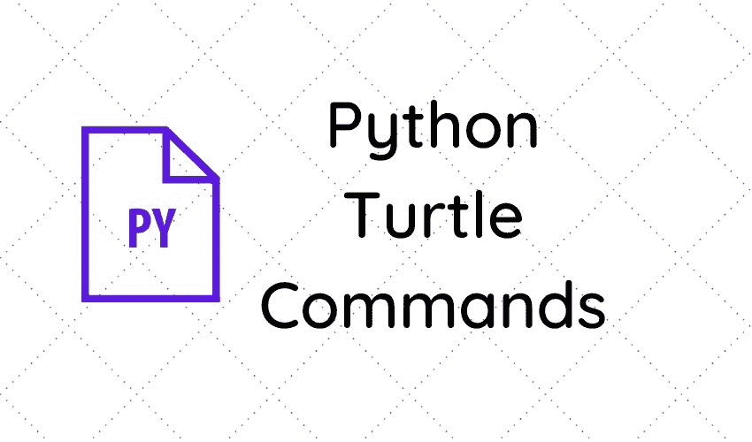

# Python Turtle 命令(15 个有用的命令)

> 原文：<https://pythonguides.com/python-turtle-commands/>

[](https://sharepointsky.teachable.com/p/python-and-machine-learning-training-course)

在这个 [Python 教程](https://pythonguides.com/python-programming-for-the-absolute-beginner/)中，我们将讨论 **python turtle 命令**，我们将看到 python turtle 使用的语法。此外，我们将看到以下主题:

*   Python turtle shape()命令
*   Python turtle up()命令
*   Python turtle down()命令
*   Python turtle backward()命令
*   Python turtle forward()命令
*   Python turtle color()命令
*   Python 海龟 position()命令
*   Python turtle goto()命令
*   Python turtle left()命令
*   Python turtle right()命令
*   Python turtle begin_fill()命令
*   Python turtle end_fill()命令
*   Python turtle fillcolor()命令
*   Python turtle window_width()命令
*   Python turtle dot()命令



Python Turtle Commands

目录

[](#)

*   [Python 龟形()命令](#Python_turtle_shape_commands "Python turtle shape() commands")
*   [Python turtle up()命令](#Python_turtle_up_commands "Python turtle up() commands")
*   [巨蟒龟 down()命令](#Python_turtle_down_commands "Python turtle down() commands")
*   [巨蟒龟后退()命令](#Python_turtle_backward_commands "Python turtle backward() commands")
*   [巨蟒龟前进()命令](#Python_turtle_forward_commands "Python turtle forward() commands")
*   [Python 龟色()命令](#Python_turtle_color_commands "Python turtle color() commands")
*   [巨蟒龟位置()命令](#Python_turtle_position_commands "Python turtle position() commands")
*   [Python turtle goto()命令](#Python_turtle_goto_commands "Python turtle goto() commands")
*   [巨蟒龟左()命令](#Python_turtle_left_commands "Python turtle left() commands")
*   [巨蟒龟右()命令](#Python_turtle_right_commands "Python turtle right() commands")
*   [Python turtle begin_fill()命令](#Python_turtle_begin_fill_commands "Python turtle begin_fill() commands")
*   [Python turtle end_fill()命令](#Python_turtle_end_fill_commands "Python turtle end_fill() commands")
*   [Python turtle fillcolor()命令](#Python_turtle_fillcolor_commands "Python turtle fillcolor() commands")
*   [Python turtle window_width()命令](#Python_turtle_window_width_commands "Python turtle window_width() commands")
*   [Python 龟点()命令](#Python_turtle_dot_commands "Python turtle dot() commands")

## Python 龟形()命令

`turtle shape()` 命令用于设置具有给定名称的乌龟形状，如果没有给定形状，则返回默认形状。在这里，**名称**将是字符串参数，如三角形、正方形、圆形、箭头和经典。

**语法:**

```py
turtle.shape(name)
```

## Python turtle up()命令

`turtle up()` 命令停止所有绘图。它拉起笔，没有东西会被画到屏幕上，直到向下被调用。

**语法:**

```py
turtle.up()
```

读取 [Python 龟写函数](https://pythonguides.com/python-turtle-write-function/)

## 巨蟒龟 down()命令

`turtle down()` 命令用于将笔拉回到屏幕上，当移动时，笔开始绘图。

**语法:**

```py
turtle.down()
```

**举例:**

```py
import turtle
turtle.forward(40)
turtle.up()
turtle.forward(40)
turtle.down()
turtle.forward(30)
turtle.done()
```

你可能喜欢 [Python 熊猫 CSV 教程](https://pythonguides.com/python-pandas-csv/)。

## 巨蟒龟后退()命令

`turtle backward()` 命令用于将乌龟向后移动指定的距离，与乌龟头部的方向相反。

**语法:**

```py
turtle.backward(distance)
```

## 巨蟒龟前进()命令

`turtle forward()` 命令用于沿乌龟前进的方向将乌龟向前移动指定的距离。

**语法:**

```py
turtle.forward(distance)
```

## Python 龟色()命令

**乌龟颜色()**命令用来改变乌龟的颜色，乌龟的默认颜色是**“黑色”**。

**语法:**

```py
turtle.color(*args)
```

**举例:**

```py
import turtle
turtle.forward(40)
turtle.color("orange")
turtle.forward(60)
turtle.done()
```

## 蟒蛇龟位置()命令

**海龟位置()**命令用于返回海龟当前位置(x，y)。

**语法:**

```py
turtle.position()
```

## Python turtle goto()命令

python `turtle goto()` 命令用于将乌龟从当前位置沿两个位置之间的最短直线路径移动到 x，y 位置。

**语法:**

```py
turtle.goto(x,y)
```

## 巨蟒龟左()命令

`turtle left()` 命令用于根据参数的给定值改变乌龟的方向。所以，它逆时针转动海龟

**语法:**

```py
turtle.left(angle)
```

**举例:**

```py
import turtle
turtle.forward(100)
turtle.left(90)
turtle.forward(100)
turtle.done()
```

## 巨蟒龟右()命令

python `turtle right()` 命令用于根据参数的给定值改变乌龟的方向。所以，它顺时针转动乌龟。

**语法:**

```py
turtle.right(angle)
```

**举例:**

```py
import turtle
turtle.forward(100)
turtle.right(90)
turtle.forward(100)
turtle.done()
```

## Python turtle begin_fill()命令

在 python 中， `turtle begin_fill()` 命令用于在绘制要填充的形状之前调用。这不需要任何争论。

**语法:**

```py
turtle.begin_fill() 
```

## Python turtle end_fill()命令

`turtle end_fill()` 命令用于填充最后一次调用 begin_fill()后绘制的形状。这不需要任何争论。

**语法:**

```py
turtle.end_fill()
```

## Python turtle fillcolor()命令

`turtle fillcolor()` 命令用于返回或设置 fillcolor。如果乌龟形状是多边形，那么我们可以用新设置的 fillcolor 来设置内部颜色。

**语法:**

```py
turtle.fillcolor(*args)
```

## Python turtle window_width()命令

`turtle window_width()` 命令用于返回当前窗口的宽度，以像素为单位。这不需要任何争论。

**语法:**

```py
turtle.window_width()
```

## Python 龟点()命令

`turtle dot()` 命令用于在当前位置绘制一个特定大小的圆点，并带有某种颜色。我们可以设置尺寸和颜色。

**语法:**

```py
turtle.dot(size, *color)
```

**举例:**

```py
import turtle
turtle.forward(120)
turtle.dot(30, "red")
turtle.done()
```

您可能会喜欢以下 Python 教程:

*   [如何将 Python 数组写入 CSV](https://pythonguides.com/python-write-array-to-csv/)
*   [Python 形状的一个数组](https://pythonguides.com/python-shape-of-an-array/)
*   [蟒龟速度举例](https://pythonguides.com/python-turtle-speed/)
*   [如何在蟒龟里做出笑脸](https://pythonguides.com/how-to-make-a-smiling-face-in-python-turtle/)
*   [如何用 Turtle 创建 Python 中的贪吃蛇游戏](https://pythonguides.com/snake-game-in-python/)
*   [使用蟒蛇龟绘制彩色填充形状](https://pythonguides.com/draw-colored-filled-shapes-using-python-turtle/)
*   [使用 if-else 理解 Python 列表](https://pythonguides.com/python-list-comprehension-using-if-else/)
*   [Python 读取二进制文件](https://pythonguides.com/python-read-a-binary-file/)
*   [检查一个列表是否存在于另一个列表中 Python](https://pythonguides.com/check-if-a-list-exists-in-another-list-python/)

在本教程中，我们已经学习了 **python turtle 命令**的语法，我们还涵盖了以下主题:

*   Python turtle shape()命令
*   Python turtle up()命令
*   Python turtle down()命令
*   Python turtle backward()命令
*   Python turtle forward()命令
*   Python turtle color()命令
*   Python 海龟 position()命令
*   Python turtle goto()命令
*   Python turtle left()命令
*   Python turtle right()命令
*   Python turtle begin_fill()命令
*   Python turtle end_fill()命令
*   Python turtle fillcolor()命令
*   Python turtle window_width()命令
*   Python turtle dot()命令

[Bijay Kumar](https://pythonguides.com/author/fewlines4biju/)

Python 是美国最流行的语言之一。我从事 Python 工作已经有很长时间了，我在与 Tkinter、Pandas、NumPy、Turtle、Django、Matplotlib、Tensorflow、Scipy、Scikit-Learn 等各种库合作方面拥有专业知识。我有与美国、加拿大、英国、澳大利亚、新西兰等国家的各种客户合作的经验。查看我的个人资料。

[enjoysharepoint.com/](https://enjoysharepoint.com/)[](https://www.facebook.com/fewlines4biju "Facebook")[](https://www.linkedin.com/in/fewlines4biju/ "Linkedin")[](https://twitter.com/fewlines4biju "Twitter")