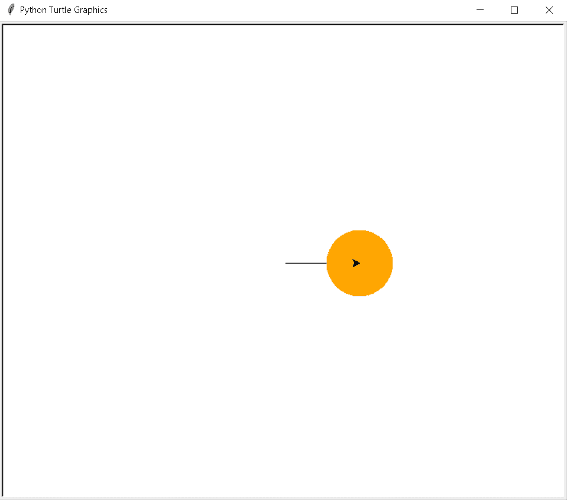
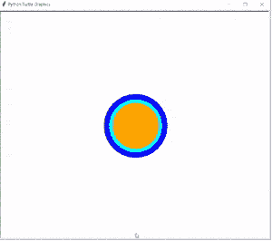
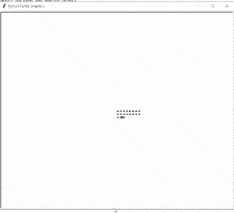
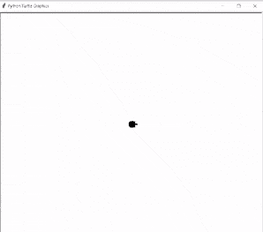
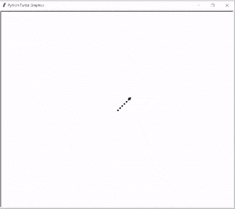
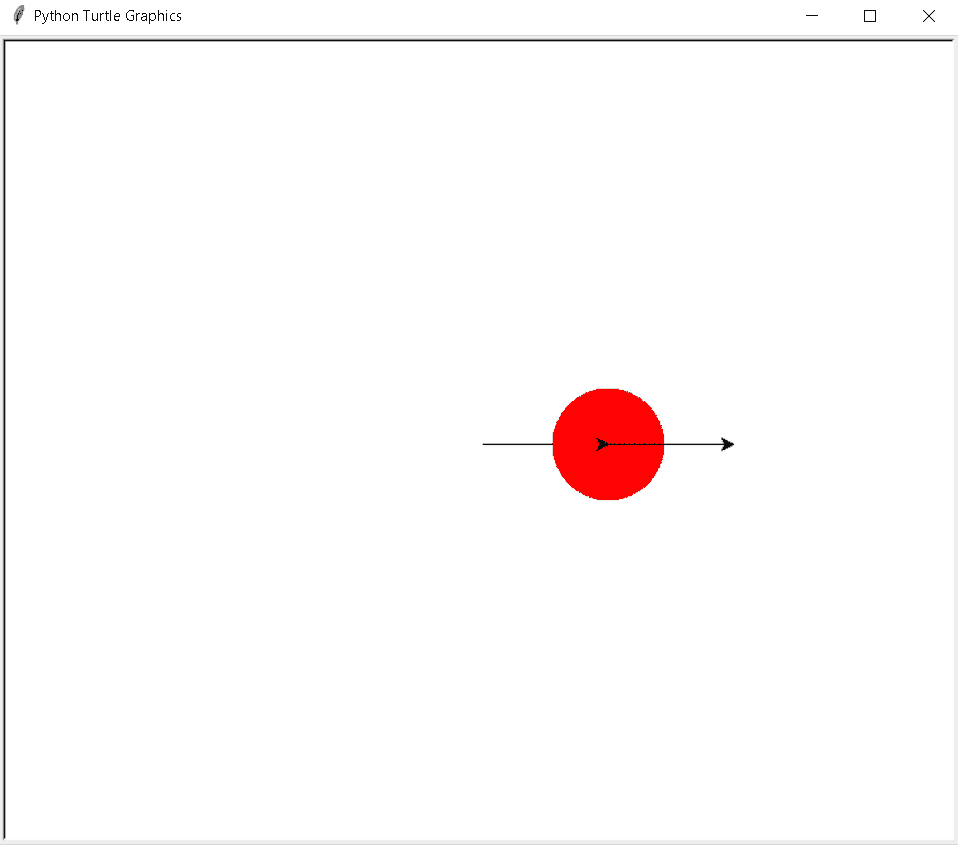

# 蟒蛇龟点——实用指南

> 原文：<https://pythonguides.com/python-turtle-dot/>

[](https://sharepointsky.teachable.com/p/python-and-machine-learning-training-course)

在这个 Python 教程中，我们将学习如何在 [Python Turtle](https://pythonguides.com/turtle-programming-in-python/) 中创建一个龟点**，我们还将讨论与龟点相关的不同例子。我们将讨论这些话题。**

*   蟒蛇龟圆点
*   Python 龟点函数
*   蟒蛇龟虚线
*   蟒蛇龟点画
*   蟒蛇龟随机圆点
*   蟒蛇龟邮票圆点

目录

[](#)

*   [蟒龟圆点](#Python_turtle_dot "Python turtle dot")
*   [Python 龟点函数](#Python_turtle_dot_function "Python turtle dot function")
*   [蟒龟虚线](#Python_turtle_dotted_line "Python turtle dotted line")
*   [蟒龟点画](#Python_turtle_dot_painting "Python turtle dot painting ")
*   [蟒龟随机圆点](#Python_turtle_random_dots "Python turtle random dots")
*   [蟒龟戳圆点](#Python_turtle_stamp_dot "Python turtle stamp dot")

## 蟒龟圆点

在这一节中，我们将学习如何在 Python turtle 中绘制龟点。

`dot()` 函数用于绘制给定大小的圆点。圆点的大小是**悬挂+4** 和**2 *悬挂**的最大值。

**语法:**

```py
tur.dot(size=None, color)
```

**圆点的大小**是**悬挂+4** 和**2 *悬挂**的最大值。

**颜色**用于给点赋予颜色。

**代码:**

在下面的代码中，我们从 turtle import * 导入 turtle 模块作为**，**导入 turtle 作为 tur** 。**

*   `tur.forward(100)` 用于向前移动乌龟。
*   **tur.dot(90，“橙色”)**用于绘制一个直径为 90，颜色为橙色的点。

```py
from turtle import *

import turtle as tur

tur.forward(100)

tur.dot(90, "orange")
tur.done()
```

**输出:**

运行上面的代码后，我们得到了下面的输出，其中我们看到了带彩色圆点的箭头。



Python turtle dot Output

此外，检查:[使用 Python Turtle](https://pythonguides.com/draw-colored-filled-shapes-using-python-turtle/) 绘制彩色填充形状

## Python 龟点函数

在本节中，我们将学习 python turtle 中的 **turtle 点函数**。

`Dot()` 函数用于在屏幕上画一个点，或者我们也可以使用 Dot()函数用不同颜色的点来画一张吸引用户眼球的图片。

**代码:**

在下面的代码中，我们将从 turtle import * 、**导入 turtle 模块**作为 tur** 。**

*   `tur.delay(500)` 用来延迟海龟的工作速度，以便更好的理解。
*   `tur . hideturt()`用于隐藏乌龟。
*   **tur.dot(180，“蓝色”)**用于绘制带直径和颜色的点。

```py
from turtle import *
# import package
import turtle as tur

# delay the turtle work speed
# for better understandings
tur.delay(500)

# hide the turtle
tur.hideturtle()
# some dots with diameter and color
tur.dot(180,"blue")
tur.dot(150,"cyan")
tur.dot(130,"orange")
tur.dot(110,"Purple")
tur.dot(90,"yellow")
tur.dot(70,"red")
tur.dot(50,"green")
tur.dot(30,"brown")
tur.done()
```

**输出:**

运行上面的代码后，我们得到了下面的输出，其中我们看到屏幕上显示了带有彩色圆点的美丽图片。



Python turtle dot function Output

阅读:[巨蟒龟命令](https://pythonguides.com/python-turtle-commands/)

## 蟒龟虚线

本节我们将学习 Python turtle 中的**龟虚线**。

一条**虚线**由一系列点组成。 `Dot()` 功能用来制作虚线。

**代码:**

在下面的代码中，我们将从 turtle import * 、 `import turtle` 中导入 turtle 模块**。**龟()**法是用来做物件的。**

*   `tur.dot()` 用于在屏幕上画点。
*   `tur.forward(space)` 用于保持另一个点的向前距离。
*   `tur.backward(space*x)` 用于从另一个点向后移动一段距离。

```py
from turtle import *

import turtle 

tur = turtle.Turtle()

def draw(space,x):
  for i in range(x):
    for j in range(x):

        tur.dot()

        tur.forward(space)     

    tur.right(90)
    tur.forward(space)
    tur.left(90)

tur.penup()
draw(10,8)

tur.hideturtle()
```

**输出:**

运行上面的代码后，我们得到下面的输出，我们可以看到屏幕上画了虚线。



Python turtle dotted line Output

阅读:[蟒蛇龟颜色+示例](https://pythonguides.com/python-turtle-colors/)

## 蟒龟点画

本节我们将学习**如何在 Python turtle 中绘制点画**。

我们可以用点来画一幅美丽的画。 `Dot()` 函数帮助我们画出我们使用的不同的点，也可以给画中吸引用户眼球的点赋予颜色。

**代码:**

在下面的代码中，我们将从 turtle import * 、 `import turtle` 中导入 turtle 模块**。**龟()**法是用来做物件的。**

*   `tur.shape("turtle")` 用于给笔赋予乌龟形状。
*   `tur.speed(6)` 用于给海龟速度， `6` 为正常速度。
*   `tur.dot(20)` 用于画点。
*   `tur.fd(50)` 用于向前移动乌龟。

```py
from turtle import *
import turtle

tur = turtle.Turtle()
tur.shape("turtle")
tur.speed(6)
tr = tur.getscreen()
tr.bgcolor("white")

tur.dot(20)
tur.fd(50)
tur.dot(15, "cyan")
tur.fd(50)
tur.dot(15,"cyan")
tur.fd(50)
tur.dot(20,'blue')

tur.hideturtle()
turtle.done()
```

**输出:**

运行上面的代码后，我们得到了下面的输出，我们可以看到这些点被用来画一幅画。



Python turtle dot painting Output

阅读:[蟒蛇龟速配实例](https://pythonguides.com/python-turtle-speed/)

## 蟒龟随机圆点

在本节中，我们将学习 python turtle 中的 **turtle 随机圆点**。

在继续之前，我们应该了解一些关于随机的知识。随机模块用于生成随机数、值。

乌龟随机点的定义是生成随机点来绘制有趣的形状或绘图。

**代码:**

在下面的代码中，我们将从 turtle import * 、 `import turtle` 中导入 turtle 模块**。**龟()**法是用来做物件的。**

*   `turt.dot()` 用于在屏幕上画点。
*   `turt.forward(space)` 用于保持另一个点的前进距离。
*   `turt . backward(space * x)`用于从另一个点向后移动一段距离。
*   `turt.left(45)` 用于给出向左的方向，形成一个菱形。

```py
from turtle import *

import turtle 

turt = turtle.Turtle()

def draw(space,x):
  for i in range(x):
    for j in range(x):

        turt.dot()

        turt.forward(space)
    turt.backward(space*x)

    turt.right(90)
    turt.forward(space)
    turt.left(90)

turt.penup()

turt.left(45)
draw(10,8)

turt.hideturtle()
```

**输出:**

运行上面的代码后，我们得到下面的输出，我们可以看到随机生成的点，并在屏幕上形成一个菱形。



Python turtle random dots Output

阅读:[蟒龟圈](https://pythonguides.com/python-turtle-circle/)

## 蟒龟戳圆点

本节我们将学习 Python turtle 中的**龟戳圆点**。

turtle `stamp()` 方法用于标记 turtle 形状的副本并返回其 id。我们还导入了一个带有图章的点，点有其唯一的 id。

**代码:**

在下面的代码中，我们将从 turtle import * 、**导入 turtle 模块**作为 tur** 。**龟()**法是用来做物件的。**

*   `tur.forward(100)` 用于向前移动乌龟。
*   **tur.dot(90，"红色")**用来画圆点。
*   `tur.stamp()` 用于复制一个乌龟形状。

```py
from turtle import *

import turtle as tur

tur.forward(100)

tur.dot(90,"red")
tur.stamp()

tur.forward(100)
tur.done()
```

**输出:**

运行上面的代码后，我们得到下面的输出，其中我们可以看到 stamp 点被放置在屏幕上。



Python turtle stamp dot Output

你可能也喜欢阅读下面的教程。

*   [Python 龟写函数](https://pythonguides.com/python-turtle-write-function/)
*   [巨蟒龟屏幕尺寸](https://pythonguides.com/python-turtle-screen-size/)
*   [分形蟒龟+例子](https://pythonguides.com/fractal-python-turtle/)
*   [蟒龟三角+例题](https://pythonguides.com/python-turtle-triangle/)
*   [Python turtle onclick 举例](https://pythonguides.com/python-turtle-onclick/)
*   [蟒蛇龟大小——详细指南](https://pythonguides.com/python-turtle-size/)

在本 Python 教程中，我们讨论了 `Python turtle dot` ，并且我们还涵盖了与其实现相关的不同示例。这是我们已经讨论过的例子列表。

*   蟒蛇龟圆点
*   Python 龟点函数
*   蟒蛇龟虚线
*   蟒蛇龟点画
*   蟒蛇龟随机圆点
*   蟒蛇龟邮票圆点

[Bijay Kumar](https://pythonguides.com/author/fewlines4biju/)

Python 是美国最流行的语言之一。我从事 Python 工作已经有很长时间了，我在与 Tkinter、Pandas、NumPy、Turtle、Django、Matplotlib、Tensorflow、Scipy、Scikit-Learn 等各种库合作方面拥有专业知识。我有与美国、加拿大、英国、澳大利亚、新西兰等国家的各种客户合作的经验。查看我的个人资料。

[enjoysharepoint.com/](https://enjoysharepoint.com/)[](https://www.facebook.com/fewlines4biju "Facebook")[](https://www.linkedin.com/in/fewlines4biju/ "Linkedin")[](https://twitter.com/fewlines4biju "Twitter")