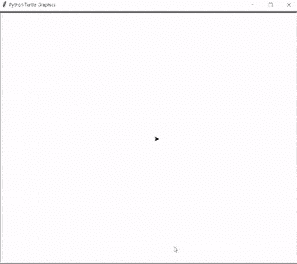

# 蟒蛇龟画线

> 原文：<https://pythonguides.com/python-turtle-draw-line/>

[](https://sharepointsky.teachable.com/p/python-and-machine-learning-training-course)

在这个 [Python turtle](https://pythonguides.com/turtle-programming-in-python/) 教程中，我们将学习**如何在 Python turtle 中绘制线条**，我们还将涵盖与 Turtle Draw 相关的不同示例。我们将讨论这些话题。

*   蟒蛇龟画线
*   蟒蛇龟在两点之间画一条线
*   巨蟒龟画一条虚线
*   蟒蛇龟画虚线

目录

[](#)

*   [蟒龟画线](#Python_turtle_draw_line "Python turtle draw line")
*   [蟒龟在两点之间画一条线](#Python_turtle_draw_line_between_two_points "Python turtle draw line between two points")
*   [蟒龟画一条虚线](#Python_turtle_draw_a_dashed_line "Python turtle draw a dashed line")
*   [蟒龟画虚线](#Python_turtle_draw_a_dotted_line "Python turtle draw a dotted line")

## 蟒龟画线

本节我们将学习**如何在 python turtle 中绘制线条**。

在前进之前，我们应该对一条线有所了解。一条线被定义为一个长而窄的标记、箭头、电线、绳子，它们完美地描述了这条线。借助于一条线，我们可以做出不同的形状。这里我们可以借助一只乌龟来画一条线。

**代码:**

在下面的代码中，我们将从海龟导入* 、**导入海龟库**。**龟()**法是用来做物件的。****

 `*   `tur.fillcolor('青色')**用于填充形状内部的颜色。
*   `tur.forward(150)` 用于向前移动乌龟。

```py
from turtle import *
import turtle

tur = turtle.Turtle()
tur.fillcolor('cyan')

tur.forward(150)

turtle.done()
```

**输出:**

运行上面的代码后，我们得到下面的输出，我们可以看到屏幕上画了一条线。


Python turtle draw line

阅读: [Python turtle onclick 附示例](https://pythonguides.com/python-turtle-onclick/)

## 蟒龟在两点之间画一条线

在本节中，我们将学习如何在 python turtle 中的两点之间绘制线条。

一条直线是由连接直线末端的两点来描述的。它覆盖了这两点之间较短的距离，也确定了两点 x 和 y 之间的线段，射线。

**代码:**

*   在下面的代码中，我们将从海龟导入* 、**导入海龟库**。**龟()**法是用来做物件的。****
*   **`tur.penup()` 用于停止绘图。**
*   **`tur.goto(x)` 用于将乌龟移动到其准确位置。**
*   **`tur.pendown()` 用于开始绘图。**
*   `**tur . hideturt()`用于将乌龟从屏幕上移除。**
*   **`tur.exitonclick()` 用于仅在点击它们时退出屏幕。**

```py
from turtle import *
import turtle as tur

x = (10, 140)
y = (100, 240)

tur.penup()
tur.goto(x)
tur.pendown()
tur.goto(y)

tur.hideturtle()
tur.exitonclick()
```

**输出:**

运行上面的代码后，我们得到下面的输出，我们可以看到在 x 和 y 点之间画了一条线。


Python turtle draw line between two points

阅读:[蟒蛇龟屏幕尺寸](https://pythonguides.com/python-turtle-screen-size/)

## 蟒龟画一条虚线

在这一节，我们将学习**如何在巨蟒龟身上画一条虚线**。

在前进之前，我们应该有一个关于虚线的知识。虚线被定义为一个空白空间，用来填充这个空间中的东西，或者我们可以说，为了完成这个句子，我们可以在段落或句子的中间、结尾或开头使用虚线。

**代码:**

在下面的代码中，我们将从海龟导入* 、**导入海龟库**。**龟()**法是用来做物件的。****

 `*   `乌龟。Screen()** 用于创建屏幕。
*   `tur.color("black")` 用来给物体上色。
*   `tur.penup()` 用于开始绘图。
*   `tur.forward(180)` 用于向前移动乌龟。
*   `turtle.listen()` 用于监听事件。
*   **turtle.onkeypress(motion()，" w")** 用于在按下一个键时偶数被发生。

```py
from turtle import *

import turtle

ws = turtle.Screen()

tur = turtle.Turtle()
tur.color("black")
tur.penup()

def motion():
  tur.forward(180)

turtle.listen()
turtle.onkeypress(motion(),"w")
turtle.done()
```

**输出:**

运行上面的代码后，我们得到下面的输出，我们可以看到乌龟以虚线的形式移动。



Python turtle draw a dashed line

阅读: [Python 清龟配实例](https://pythonguides.com/python-clear-turtle/)

## 蟒龟画虚线

在这一节，我们将学习**如何在巨蟒龟身上画一条虚线**。

虚线是由一系列的点组成的。 `Dot()` 函数用于制作虚线。我们可以在乌龟的帮助下画一条虚线。

**代码:**

在下面的代码中，我们将从 turtle import *导入 turtle 库，导入 turtle。使用 `turtle()` 方法制作对象。

*   `tur.dot()` 用于在屏幕上画点。
*   `tur.forward(space)` 用于将乌龟向前移动。
*   `tur.backward(space*x)` 用于向后移动乌龟。
*   `tur.right(90)` 用于向右移动乌龟。
*   `tur.left(90)` 用于向左移动乌龟。
*   `tur.penup()` 用于停止绘图。

```py
from turtle import *
import turtle 

tur = turtle.Turtle()

def drawdot(space,x):
  for i in range(x):
    for j in range(x):

        tur.dot()

        tur.forward(space)
    tur.backward(space*x)

    tur.right(90)
    tur.forward(space)
    tur.left(90)

tur.penup()
drawdot(10,8)

tur.hideturtle()
```

**输出:**

运行上面的代码后，我们得到下面的输出，我们可以看到屏幕上画了虚线。


Python turtle draw a dotted line

您可能也喜欢阅读以下关于 Python Turtle 的文章。

*   [蟒龟获得位置](https://pythonguides.com/python-turtle-get-position/)
*   [蟒龟嵌套循环](https://pythonguides.com/python-turtle-nested-loop/)
*   [蟒龟鼠](https://pythonguides.com/python-turtle-mouse/)
*   [蟒龟网格](https://pythonguides.com/python-turtle-grid/)
*   [蟒龟画字母](https://pythonguides.com/python-turtle-draw-letters/)
*   [蟒蛇龟笔+例题](https://pythonguides.com/python-turtle-pen/)
*   [蟒龟三角+例题](https://pythonguides.com/python-turtle-triangle/)
*   [蟒蛇龟大小——详细指南](https://pythonguides.com/python-turtle-size/)
*   [蟒蛇龟艺术——如何绘制](https://pythonguides.com/python-turtle-art/)

因此，在本教程中，我们讨论了 **Python 海龟绘制线**，我们还涵盖了与其实现相关的不同示例。这是我们已经讨论过的例子列表。

*   蟒蛇龟画线
*   蟒蛇龟在两点之间画一条线
*   巨蟒龟画一条虚线
*   巨蟒龟画一条虚线

[Bijay Kumar](https://pythonguides.com/author/fewlines4biju/)

Python 是美国最流行的语言之一。我从事 Python 工作已经有很长时间了，我在与 Tkinter、Pandas、NumPy、Turtle、Django、Matplotlib、Tensorflow、Scipy、Scikit-Learn 等各种库合作方面拥有专业知识。我有与美国、加拿大、英国、澳大利亚、新西兰等国家的各种客户合作的经验。查看我的个人资料。

[enjoysharepoint.com/](https://enjoysharepoint.com/)[](https://www.facebook.com/fewlines4biju "Facebook")[](https://www.linkedin.com/in/fewlines4biju/ "Linkedin")[](https://twitter.com/fewlines4biju "Twitter")`**`