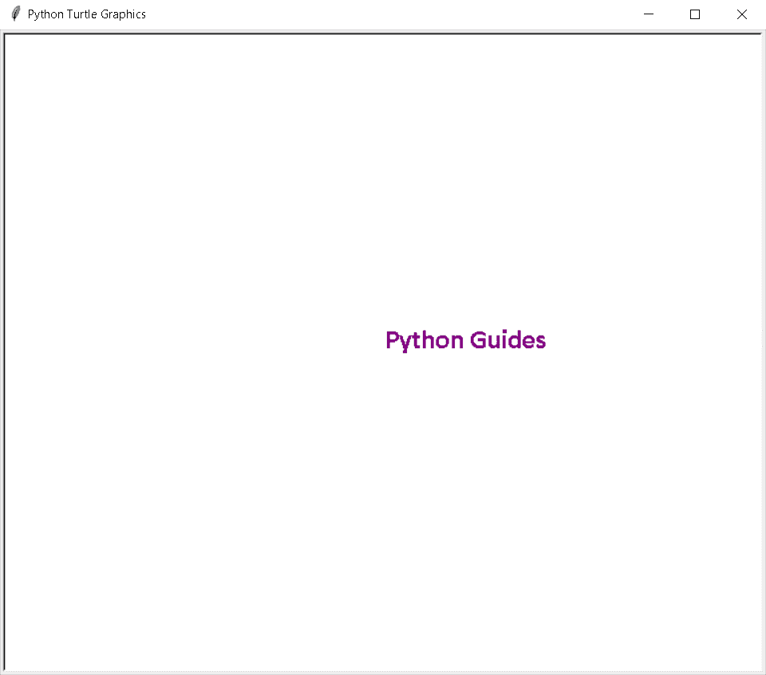

# Python 海龟字体

> 原文：<https://pythonguides.com/python-turtle-font/>

[](https://sharepointsky.teachable.com/p/python-and-machine-learning-training-course)

在本 [Python 教程](https://pythonguides.com/python-download-and-installation/)中，我们将学习**如何在 Python Turtle** 中选择字体，我们还将涵盖与 **Python Turtle 字体**相关的不同示例。我们将讨论这些话题。

*   Python 海龟字体
*   蟒蛇龟字体大小
*   Python 海龟字体样式
*   Python 海龟字体颜色
*   Python turtle 字体列表
*   Python turtle 字体示例

目录

[](#)

*   [蟒龟字体](#Python_turtle_font "Python turtle font")
*   [蟒龟字号](#Python_turtle_font_Size "Python turtle font Size")
*   [蟒蛇龟字体样式](#Python_turtle_font_Style "Python turtle font Style")
*   [蟒龟字体颜色](#Python_turtle_font_Color "Python turtle font Color")
*   [蟒龟字体列表](#Python_turtle_font_List "Python turtle font List")
*   [蟒蛇龟字体示例](#Python_turtle_font_example "Python turtle font example")

## 蟒龟字体

在本节中，我们将学习如何在 Python turtle 中选择字体。

字体用于改变大小、样式、颜色，使文本看起来更有吸引力。

**代码:**

在下面的代码中，我们从 turtle import * 、 **import turtle、**中导入了 turtle 库**，并借助于 write()函数中的 **write()函数**编写了一个文本，我们使用 `font=(" Verdana ")` 来给文本一个吸引人的外观。**

```py
from turtle import *

import turtle

turtle.write("Python Guides", font=("Verdana"))
turtle.done()
```

**输出:**

运行上面的代码后，我们得到下面的输出，我们看到文本以漂亮的字体写在屏幕上。


Python turtle font Output

*   [蟒蛇龟的颜色](https://pythonguides.com/python-turtle-colors/)

## 蟒龟字号

在本节中，我们将学习如何在 Python turtle 中选择和更改字体大小。

字体大小的定义是给我们的字体一个大小，这取决于一个文件，如果它是一个标题，我们给一个大的字体大小，写在一个段落中，我们给我们的文本一个小的大小。

**代码:**

在下面的代码中，我们导入了 turtle 库 import turtle，并在 write()函数中的 **write()函数**的帮助下编写了一个文本，我们使用 **font=('arial '，50，' bold')** 给文本一个大小。

```py
import turtle

turtle.write('Hello!', font=('arial',50,'bold'), align='center')
turtle.hideturtle()
turtle.exitonclick()
```

**输出:**

运行上面的代码后，我们得到了下面的输出，从中我们可以看到如何在 `write()` 函数的帮助下给我们的字体指定一个大小。


Python turtle font size Output

*   [如何在 Turtle Python 中附加图像](https://pythonguides.com/attach-image-to-turtle-python/)

## 蟒蛇龟字体样式

在这一节，我们将学习如何在 Python turtle 中赋予 turtle 字体样式。

字体风格是用来给我们的文本或任何标题的风格，使文件有吸引力和像样的。

**代码:**

在下面的代码中，我们给了我们的字体一个样式，我们定义了 **style= ('Courier '，60，' italic')** ，在 `write()` 函数的帮助下，我们在一个字体内部调用 Style。

```py
from turtle import *
import turtle

turtle.color('cyan')
Style = ('Courier', 60, 'italic')
turtle.write('Python Guides!', font=Style, align='center')
turtle.hideturtle()
turtle.done()
```

**输出:**

运行上面的代码后，我们得到了下面的输出，其中我们给了字体一个样式。


Python turtle font style

*   [巨蟒龟命令](https://pythonguides.com/python-turtle-commands/)

## 蟒龟字体颜色

本节我们将学习 Python turtle 中的 **turtle 字体颜色**。

字体颜色赋予文本或标题颜色，使我们的屏幕看起来丰富多彩，富有吸引力。我们可以为我们想要的文本选择任何字体颜色。

**代码:**

在下面的代码中，我们为文本赋予颜色，使文档看起来更有吸引力。

**font color = tur . color(' purple ')**用于给文本赋予颜色。

```py
from turtle import *
import turtle

tur = turtle.Turtle()
fontcolor=tur.color('purple')

tur.write("Python Guides", font=("Calibri",20, "bold"))
tur.hideturtle()
turtle.done()
```

**输出:**

运行上面的代码后，我们得到下面的输出，其中我们看到彩色文本显示在屏幕上，看起来很漂亮。



Python turtle font color Output

*   [如何用 Turtle 创建 Python 中的贪吃蛇游戏](https://pythonguides.com/snake-game-in-python/)

## 蟒龟字体列表

在这一节中，我们将学习如何在 Python turtle 中创建字体列表。

字体列表用于分配列表形式的文本，其中文本可以从上到下列出，也可以根据文本大小列出。

**代码:**

在下面的代码中，我们创建了一个列表，在该列表中，文本以从小到大可见的列表形式分配，这将根据列表中的标题改变字体的大小。

*   `list.speed(1)` 用来给乌龟慢速。
*   `list.penup()` 用于乌龟笔的停止绘制。
*   **list.goto(0，200)** 用于将乌龟移动到绝对位置。
*   `list.color("purple")` 用于给文本赋予颜色。

```py
from turtle import *
import turtle

list=turtle.Turtle()
list.speed(1)

list.penup()
list.goto(0,200)

list.color("blue")
list.write("Python Guides!",font=("arial",20,"bold"),align="center")

list.penup()
list.goto(0,150)

list.color("purple")
list.write("Python Guides!",font=("Time New Roman",30,"italic"),align="center")

list.penup()
list.goto(0,80)

list.color("cyan")
list.write("Python Guides!",font=("Apple Chancery",50,"underline"),align="center")

list.hideturtle()
turtle.exitonclick() 
```

**输出:**

运行上面的代码后，我们得到了下面的结果，在这个结果中我们可以看到文本被分配到的列表，这个列表给了屏幕一个吸引人的外观。


Python turtle font list Output

*   [使用蟒蛇龟绘制彩色填充形状](https://pythonguides.com/draw-colored-filled-shapes-using-python-turtle/)

## 蟒蛇龟字体示例

在本节中，我们将学习 Python turtle 中的 **turtle 字体示例**。

众所周知，字体用于改变文本的大小、风格和颜色。应用任何字体后，我们的文本看起来很漂亮，吸引了用户的眼球。

**代码:**

在下面的代码中，我们为文本赋予了样式、颜色和大小，使我们的文档看起来更有吸引力和更好看。

*   **tur.color('violet')** 用于给文本赋予颜色。
*   **tur . write(‘导游您好！’，font=style，align='center')** 用于书写文本并赋予文本样式。

```py
from turtle import *
import turtle as tur

tur.color('violet')
style = ('Arial', 30, 'bold')
tur.write('Hello Guides!', font=style, align='center')
tur.hideturtle()
tur.done()
```

**输出:**

运行上面的代码后，我们得到下面的输出，我们可以看到文本是用不同的样式、大小和颜色书写的。


Python turtle font example Output

您可能会喜欢以下 Python turtle 教程:

*   [蟒龟广场](https://pythonguides.com/python-turtle-square/)
*   [蟒龟艺术](https://pythonguides.com/python-turtle-art/)
*   [蟒龟示踪器](https://pythonguides.com/python-turtle-tracer/)
*   [Python 龟写函数](https://pythonguides.com/python-turtle-write-function/)
*   [蟒龟圈](https://pythonguides.com/python-turtle-circle/)
*   [蟒龟速度举例](https://pythonguides.com/python-turtle-speed/)
*   [蟒龟 onclick](https://pythonguides.com/python-turtle-onclick/)

因此，在本教程中，我们讨论了 **Python Turtle 字体**，我们还涵盖了与其实现相关的不同示例。这是我们已经讨论过的例子列表。

*   Python 海龟字体
*   蟒蛇龟字体大小
*   Python 海龟字体样式
*   Python 海龟字体颜色
*   Python turtle 字体列表
*   Python turtle 字体示例

[Bijay Kumar](https://pythonguides.com/author/fewlines4biju/)

Python 是美国最流行的语言之一。我从事 Python 工作已经有很长时间了，我在与 Tkinter、Pandas、NumPy、Turtle、Django、Matplotlib、Tensorflow、Scipy、Scikit-Learn 等各种库合作方面拥有专业知识。我有与美国、加拿大、英国、澳大利亚、新西兰等国家的各种客户合作的经验。查看我的个人资料。

[enjoysharepoint.com/](https://enjoysharepoint.com/)[](https://www.facebook.com/fewlines4biju "Facebook")[](https://www.linkedin.com/in/fewlines4biju/ "Linkedin")[](https://twitter.com/fewlines4biju "Twitter")