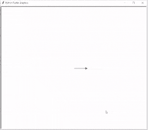
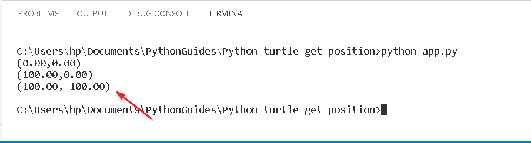
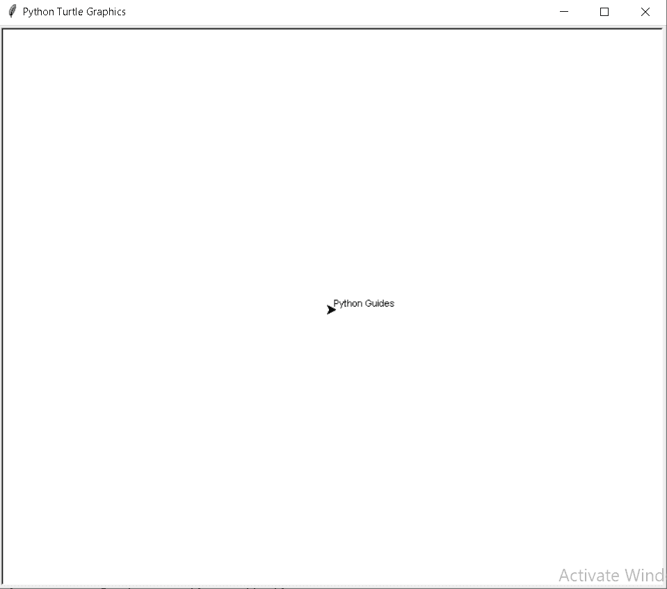
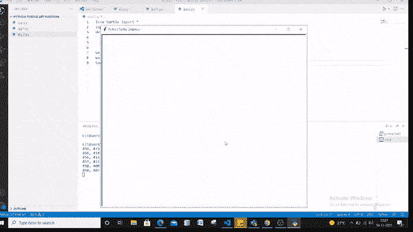
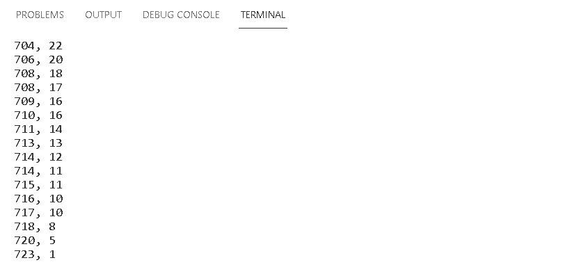

# 巨蟒龟获得位置

> 原文：<https://pythonguides.com/python-turtle-get-position/>

[](https://sharepointsky.teachable.com/p/python-and-machine-learning-training-course)

在本教程中，我们将学习**如何在[巨蟒龟](https://pythonguides.com/turtle-programming-in-python/)中获得位置**，我们还将介绍与获得位置龟相关的不同示例。而且，我们将涵盖这些主题

*   巨蟒龟获得位置
*   巨蟒龟获得 X 和 Y 位置
*   巨蟒龟获得鼠标位置

目录

[](#)

*   [蟒龟获得位置](#Python_turtle_get_position "Python turtle get position")
*   [巨蟒龟获得 X 和 Y 位置](#Python_turtle_get_X_and_Y_position "Python turtle get X and Y position")
*   [巨蟒龟获得鼠标位置](#Python_turtle_get_mouse_position "Python turtle get mouse position")

## 蟒龟获得位置

本节我们将学习**如何在 python turtle 中获得位置**。

位置能够描述对象的运动，对象被放置在哪个位置，或者还描述它在任何特定时间的确切位置或坐标。

**代码:**

在下面的代码中，我们将从 `turtle import *` 、 `import turtle` 中导入 turtle 模块，从中获取海龟位置。**龟()**法是用来做物件的。

*   `print(tur.pos())` 用于打印海龟的默认位置。
*   `tur.forward(100)` 用于将乌龟向前移动，得到这个方向的位置。
*   `tur.right(90)` 用于将乌龟向右移动并得到位置，得到这个方向的位置。

```py
from turtle import *
import turtle as tur

print(tur.pos())

tur.forward(100)  

print(tur.pos())

tur.right(90)
tur.forward(100)
print(tur.pos())
```

**输出:**

运行上面的代码后，我们得到下面的输出，我们可以看到乌龟向前移动，然后右转 90 度。



Python turtle get the position

当海龟在屏幕上移动时，命令提示符会显示出它的位置，如下图所示。



Python turtle get position Output

还有，读: [Python 龟三角+例题](https://pythonguides.com/python-turtle-triangle/)

## 巨蟒龟获得 X 和 Y 位置

本节我们将学习**如何在 python turtle 中获取 turtle 的和 y 位置**。

在前进之前，我们应该有一个关于 `X` 和 `Y` 位置的知识。 `X` 位置被赋予沿水平轴的多个像素，而 `Y` 位置被赋予沿垂直轴的多个像素。这里我们设置乌龟的 `x` 和 `y` 位置，乌龟显示在屏幕上的准确位置。

**代码:**

在下面的输出中，我们将从 turtle import * 、 `import turtle` 中导入 turtle 模块**，从中我们可以获得海龟的 x 和 y 位置，还有 `import time` 以获得特定时间的精确位置。使用 `turtle()` 方法来制作对象。**

*   **tur _ txt . goto(tur . position()[0]，tur.position()[1])** 用于获取乌龟的 x 和 y 位置。
*   `tur _ txt . write(" Python Guides ")`用于在所在的位置上写文本。
*   `time.sleep(2)` 用于延迟执行给定的秒数。

```py
from turtle import *
import turtle
import time

tur = turtle.Turtle()
tur_txt = turtle.Turtle()
tur_txt.goto(tur.position()[0], tur.position()[1])
tur_txt.write("Python Guides")
time.sleep(2)
turtle.done()
```

**输出:**

运行上面的代码后，我们得到下面的输出，我们可以看到文本被放置在屏幕上，从中我们可以得到 x 和 y 位置。



Python turtle get x and y position Output

阅读:[蟒蛇龟广场-实用指南](https://pythonguides.com/python-turtle-square/)

## 巨蟒龟获得鼠标位置

在这一节中，我们将学习如何在 python turtle 中获取鼠标位置。

众所周知，在鼠标的帮助下，我们点击放置在笔记本电脑或计算机屏幕上的项目。这里我们要捕捉鼠标的位置。随着鼠标的移动，可以在命令提示符下看到鼠标的位置。

**代码:**

在下面的代码中，我们将从 turtle import * 、**导入 turtle 模块**，作为获取鼠标位置的 tur** 。**龟()**法是用来做物件的。**

*   **a，b = event.x，event.y** 用于获取鼠标在屏幕上移动的任何位置鼠标捕捉的位置。
*   **打印(' {}，{} ')。**(a，b))格式用于打印鼠标的位置。

```py
from turtle import *
import turtle as tur
def position(event):
    a, b = event.x, event.y
    print('{}, {}'.format(a, b))

ws = tur.getcanvas()
ws.bind('<Motion>', position)
tur.done()
```

**输出:**

运行上述代码后，我们得到以下输出，其中我们可以看到，单击鼠标时，光标开始在屏幕上移动，我们在命令提示符下得到移动光标的位置。



Python turtle get mouse position

在下图中我们可以看到移动光标的位置。



python turtle get mouse position Output

您可能也喜欢阅读以下关于 Python Turtle 的文章。

*   [蟒蛇龟艺术——如何绘制](https://pythonguides.com/python-turtle-art/)
*   [Python 龟写函数](https://pythonguides.com/python-turtle-write-function/)
*   [蟒龟画线](https://pythonguides.com/python-turtle-draw-line/)
*   [蟒龟画字母](https://pythonguides.com/python-turtle-draw-letters/)
*   [蟒龟嵌套循环](https://pythonguides.com/python-turtle-nested-loop/)
*   [蟒蛇龟笔+例题](https://pythonguides.com/python-turtle-pen/)
*   [Python Turtle Grid–实用指南](https://pythonguides.com/python-turtle-grid/)
*   [分形蟒龟+例子](https://pythonguides.com/fractal-python-turtle/)
*   [蟒龟速度举例](https://pythonguides.com/python-turtle-speed/)
*   [蟒蛇龟颜色+示例](https://pythonguides.com/python-turtle-colors/)

因此，在本教程中，我们讨论了 `Python Turtle Get Position` ，并且我们还讨论了与其实现相关的不同示例。这是我们已经讨论过的例子列表。

*   巨蟒龟获得位置
*   巨蟒龟获得 X 和 Y 位置
*   巨蟒龟获得鼠标位置

[Bijay Kumar](https://pythonguides.com/author/fewlines4biju/)

Python 是美国最流行的语言之一。我从事 Python 工作已经有很长时间了，我在与 Tkinter、Pandas、NumPy、Turtle、Django、Matplotlib、Tensorflow、Scipy、Scikit-Learn 等各种库合作方面拥有专业知识。我有与美国、加拿大、英国、澳大利亚、新西兰等国家的各种客户合作的经验。查看我的个人资料。

[enjoysharepoint.com/](https://enjoysharepoint.com/)[](https://www.facebook.com/fewlines4biju "Facebook")[](https://www.linkedin.com/in/fewlines4biju/ "Linkedin")[](https://twitter.com/fewlines4biju "Twitter")