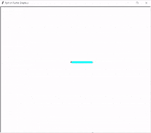
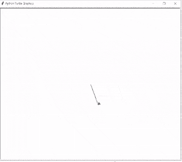
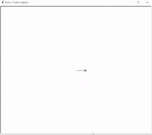
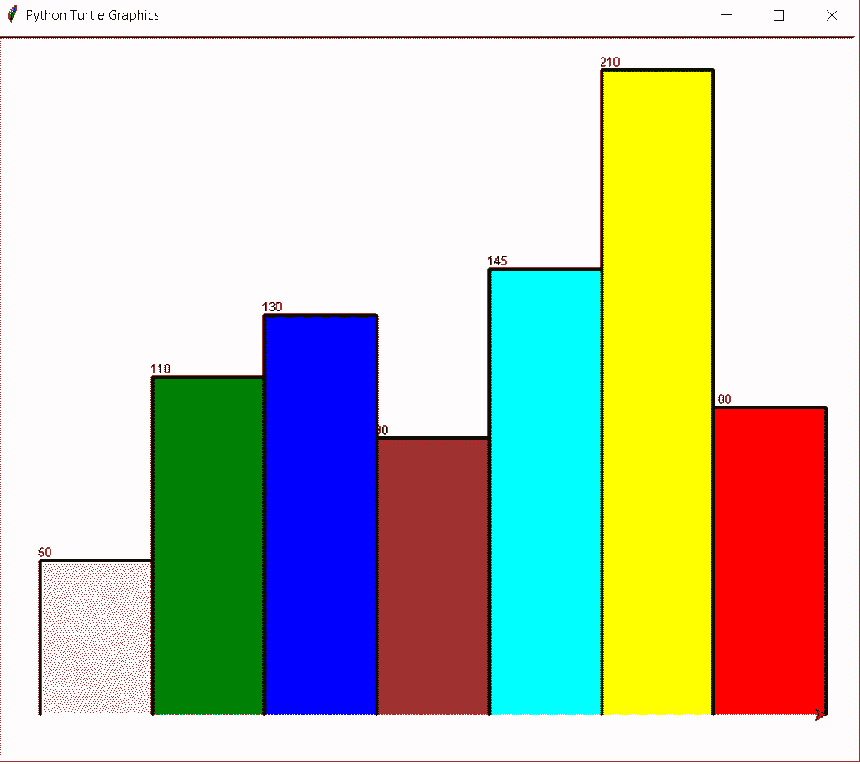
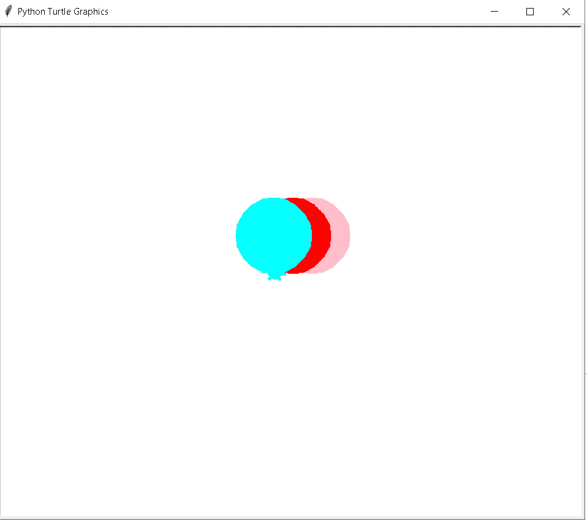
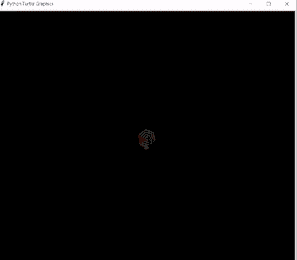

# 蟒蛇皮海龟图案

> 原文：<https://pythonguides.com/python-turtle-graphics/>

[](https://sharepointsky.teachable.com/p/python-and-machine-learning-training-course)

在本[蟒蛇龟](https://pythonguides.com/turtle-programming-in-python/)教程中，我们将学习**如何制作**蟒蛇龟**中的龟图形**，我们还将涵盖与龟图形相关的不同示例。我们将讨论这些话题。

*   Python 海龟图形教程
*   Python 海龟图形代码
*   Python 海龟图形示例
*   Python 海龟图形条形图
*   Python 海龟图形在线编译器
*   Python 海龟图形项目

目录

[](#)

*   [蟒龟图形教程](#Python_turtle_graphics_tutorial "Python turtle graphics tutorial")
*   [巨蟒龟图形代码](#Python_turtle_graphics_code "Python turtle graphics code")
*   [蟒龟图形示例](#Python_turtle_graphics_example "Python turtle graphics example")
*   [巨蟒龟图形条形图](#Python_turtle_graphics_bar_graph "Python turtle graphics bar graph")
*   [巨蟒龟图形在线编译器](#Python_turtle_graphics_online_compiler "Python turtle graphics online compiler")
*   [巨蟒龟图形项目](#Python_turtle_graphics_project "Python turtle graphics project")

## 蟒龟图形教程

在本节中，我们将学习如何在 Python turtle 中制作龟图形。

在前进之前，我们应该有一个关于图形的知识。图形是用来展示的，或者我们可以说图形是一个图像、图画、设计或代表一个物体。图形和文字冲突。图形的使用使我们的演示看起来很有吸引力。

**代码:**

在下面的代码中，我们导入 turtle 模块**导入 turtle** 来制作 turtle 图形，完成后显示在屏幕上。

*   使用 `turtle()` 方法制作对象。
*   `tur.penup()` 用来接龟笔。
*   `tur.pensize(10)` 用来给笔的大小。
*   **tur.pencolor("青色")**用来给笔上色。
*   `tur.forward(100)` 用于向前移动乌龟。
*   `tur.backward(100)` 用于向后移动乌龟。
*   `tur.right(90)` 用于向右移动乌龟。
*   `tur.left(90)` 用于向左移动乌龟。

```py
import turtle
tur=turtle.Turtle()
tur.penup()
tur.setpos(-20,40)
tur.pendown()
tur.pensize(10)
tur.pencolor("cyan")
tur.forward(100)
tur.backward(100)
tur.right(90)
tur.forward(100)
tur.left(90)
tur.forward(100)
tur.backward(100)
tur.right(90)
tur.forward(100)
tur.left(90)
tur.forward(100)
turtle.done()
```

**输出:**

运行上面的代码后，我们得到下面的输出，其中我们可以看到字母 E 是用图形绘制的。



Python turtle graphic example

阅读:[蟒蛇龟艺术——如何画](https://pythonguides.com/python-turtle-art/)

## 巨蟒龟图形代码

在这一节中，我们将学习乌龟 python 中的**乌龟图形代码**。

图形用于为我们的应用程序提供一个吸引人的外观，用户对在控制台上工作感兴趣，在图形的帮助下，我们将文本和图像动画到我们的控制台上。

**代码:**

在下面的代码中，我们导入海龟库**导入海龟**。**龟()**法是用来做物件的。

我们使用 `right()` 和 `forward()` 函数来给出图形形状，这些函数有助于定义一个吸引人的外观。

```py
import turtle
tur = turtle.Turtle()

tur.right(70)
tur.forward(90)

for i in range(4):
    tur.right(140)
    tur.forward(90)

turtle.done()
```

**输出:**

在下面的输出中，我们可以看到图形形状，其中借助于 `forward()` 和 `right()` 借助于 loop 给出了这个形状。



Python turtle graphic code Output

阅读: [Python 龟写函数](https://pythonguides.com/python-turtle-write-function/)

## 蟒龟图形示例

在本节中，我们将学习 Python turtle 中的**图形示例**。

众所周知，图形是用来给我们的应用程序增加吸引力的。我们使用图形来设计我们的文本，形状，图像，给我们的窗口一个美丽的外观。

**代码:**

在下面的代码中，我们从 turtle import *导入 turtle 模块，导入 turtle。使用 `turtle()` 方法制作对象。

*   `turt.forward(50)` 用于向前移动乌龟。
*   `turt.right(90)` 用于向右移动乌龟。

```py
from turtle import *

import turtle
turt = turtle.Turtle()

for x in range(4):
    turt.forward(50)
    turt.right(90)

turtle.done()
```

**输出:**

在下面的输出中，我们使用 `forward()` 和 `right()` 函数设计了一个符号符号。



Python turtle graphic example Output

阅读:[蟒蛇龟速配实例](https://pythonguides.com/python-turtle-speed/)

## 巨蟒龟图形条形图

在本节中，我们将学习 python turtle 中的 **turtle 图形条形图**。

条形图是以矩形条的形式表示数据的图形。图形条形图看起来很吸引人，并以一种吸引人的方式表示其数据。

**代码:**

在下面的代码中，我们从 turtle `import *` ， `import turtle` 中导入 turtle 模块，用于制作图形条形图。

*   `tur.begin_fill()` 用于开始填充颜色。
*   `tur.left(90)` 用于向左移动乌龟。
*   `tur.forward(heig)` 用于向前移动乌龟。
*   `tur.end_fill()` 用于停止填充形状。
*   **乌龟。Screen()** 用于制作图形的屏幕。

```py
from turtle import *

import turtle

def draw_bar(tur, heig, clr):

    tur.fillcolor(clr)
    tur.begin_fill()              
    tur.left(90)
    tur.forward(heig)
    tur.write(str(heig))
    tur.right(90)
    tur.forward(40)
    tur.right(90)
    tur.forward(heig)
    tur.left(90)

    tur.end_fill()                 

axis = [50, 110, 130, 90, 145, 210, 100]
colors = ["pink", "green", "blue", "brown",
        "cyan", "yellow", "red"]

maxheig = max(axis)
numberbars = len(axis)
bordr = 10

ws = turtle.Screen()             
ws.setworldcoordinates(0 - bordr, 0 - bordr, 
                       40 * numberbars + bordr,
                       maxheig + bordr)

tur = turtle.Turtle()           
tur.pensize(3)

for x in range(len(axis)):

    draw_bar (tur, axis[x],
             colors[x])

ws.exitonclick()
```

**输出:**

运行上述代码后，我们得到以下输出，其中我们可以看到屏幕上显示的图形条形图。



Python turtle graphics bar graph Output

另外，检查:[蟒蛇龟颜色+示例](https://pythonguides.com/python-turtle-colors/)

## 巨蟒龟图形在线编译器

在本节中，我们将学习 Python turtle 中的**图形在线编译器**。

我们使用图形在线编译器，我们使用 replit 图形在线编译器，并给我们的应用程序带来吸引力。

在 replit 中，我们可以托管我们的应用程序，并在我们可以从任何地方访问的服务器上运行代码。

在这个[链接](https://replit.com/@techvaishali/NaturalSoulfulSpecialist#main.py)中，我们可以看到我们的代码是如何在 Replit 平台上工作的，我们可以访问它来查看输出。

**代码:**

在下面的代码中，我们将学习海龟模块**导入海龟**。

*   `tur.penup()` 用来拿起笔。
*   `tur.fillcolor(clr)` 用于填充颜色。
*   `tur.circle(Size)` 用于绘制圆形。

```py
import turtle

def drawcircle(tur, clr, Size, i, j):
    tur.penup()
    tur.color(clr)
    tur.fillcolor(clr)
    tur.goto(i,j)
    tur.begin_fill()
    tur.circle(Size)
    tur.end_fill()
    tur.pendown()

ballon = turtle.Turtle()
ballon.shape("turtle")
ballon.speed(500)

drawcircle(ballon, "pink", 50, 25, 0)
drawcircle(ballon, "red", 50, 0, 0)
drawcircle(ballon, "cyan", 50, -25, 0)
turtle.done()
```

**输出:**

运行上述代码后，我们得到以下输出，其中我们可以看到图形是在在线编译器上运行的。



Python turtle graphics online compiler Output

阅读:[蟒龟字体](https://pythonguides.com/python-turtle-font/)

## 巨蟒龟图形项目

在本节中，我们将了解 Python turtle 中的 **turtle 图形项目**。

在前进之前，我们应该有一个关于图形项目的知识。图形用于为我们的应用程序提供外观。在这个项目中，我们在一只乌龟的帮助下绘制彩虹苯，我们的屏幕给用户一个吸引人的外观。

**代码:**

在下面的代码中，我们将从 turtle import * 、 `import turtle` 中导入 turtle 模块**。**龟()**法是用来做物件的。**

*   **turtle.bgcolor('black')** 用于给屏幕背景色。
*   **tur.pencolor(colrs[i%6])** 用来给笔上色。
*   `tur.width(i//100 + 1)` 用于给笔宽度。
*   `tur.forward(i)` 用于向前移动乌龟。
*   `tur.left(59)` 用于向左移动乌龟。

```py
from turtle import *
# Python program to draw
# Rainbow Benzene
# using Turtle Programming
import turtle
colrs = ['yellow', 'blue', 'orange', 'cyan', 'pink', 'red']
tur = turtle.Turtle()
turtle.bgcolor('black')
for i in range(360):
    tur.pencolor(colrs[i%6])
    tur.width(i//100 + 1)
    tur.forward(i)
    tur.left(59)
```

**输出:**

运行上面的代码后，我们得到下面的输出，我们可以看到彩虹苯被绘制在屏幕上。



Python turtle graphics project Output

你可能也喜欢阅读下面的教程。

*   [蟒蛇龟大小——详细指南](https://pythonguides.com/python-turtle-size/)
*   [蟒蛇龟广场——实用指南](https://pythonguides.com/python-turtle-square/)
*   [蟒龟三角+例题](https://pythonguides.com/python-turtle-triangle/)
*   [分形蟒龟+例子](https://pythonguides.com/fractal-python-turtle/)
*   [Python 截屏](https://pythonguides.com/python-screen-capture/)
*   [蟒蛇龟追踪仪——如何使用](https://pythonguides.com/python-turtle-tracer/)

因此，在本教程中，我们将讨论 **Python 海龟图形**，我们也已经涵盖了与其实现相关的不同示例。这是我们已经讨论过的例子列表。

*   Python 海龟图形教程
*   Python 海龟图形代码
*   Python 海龟图形示例
*   Python 海龟图形条形图
*   Python 海龟图形在线编译器
*   Python 海龟图形项目

[Bijay Kumar](https://pythonguides.com/author/fewlines4biju/)

Python 是美国最流行的语言之一。我从事 Python 工作已经有很长时间了，我在与 Tkinter、Pandas、NumPy、Turtle、Django、Matplotlib、Tensorflow、Scipy、Scikit-Learn 等各种库合作方面拥有专业知识。我有与美国、加拿大、英国、澳大利亚、新西兰等国家的各种客户合作的经验。查看我的个人资料。

[enjoysharepoint.com/](https://enjoysharepoint.com/)[](https://www.facebook.com/fewlines4biju "Facebook")[](https://www.linkedin.com/in/fewlines4biju/ "Linkedin")[](https://twitter.com/fewlines4biju "Twitter")