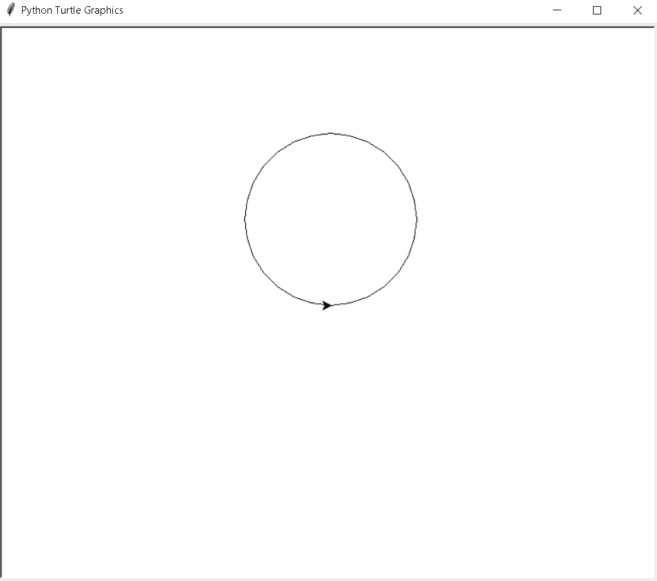
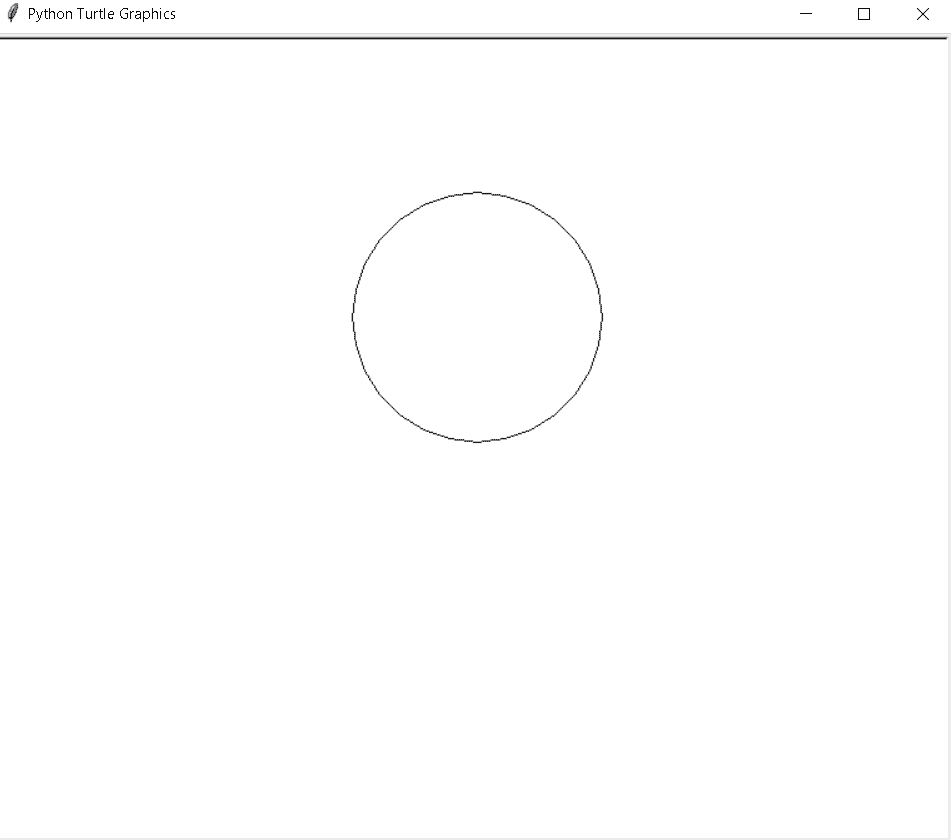
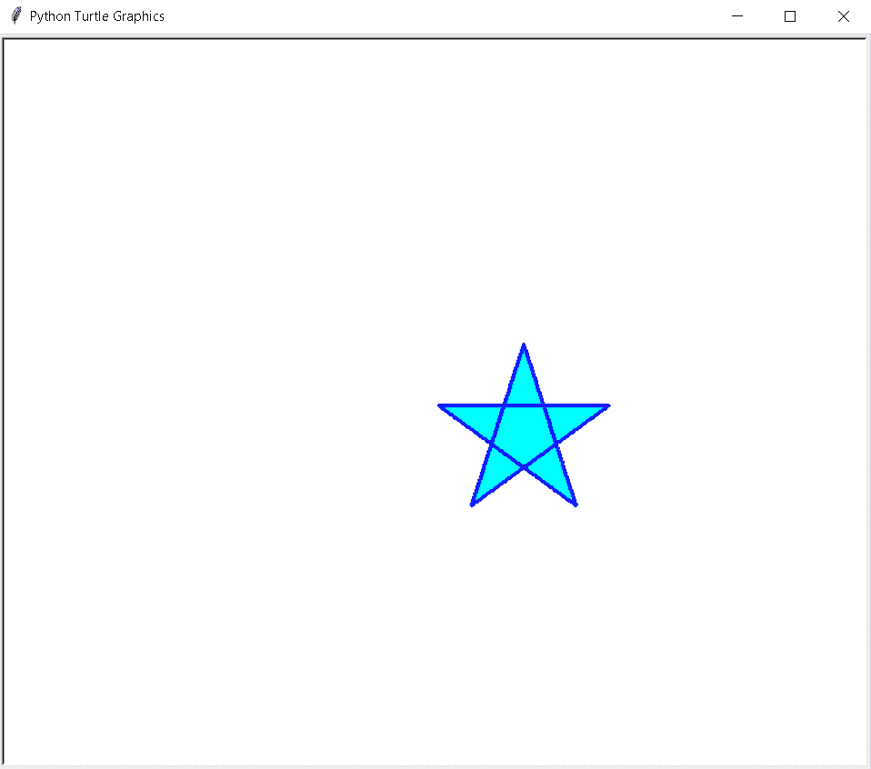

# 举例说明蟒蛇皮

> 原文：<https://pythonguides.com/python-turtle-hide/>

[](https://sharepointsky.teachable.com/p/python-and-machine-learning-training-course)

在这个 [Python 教程](https://pythonguides.com/python-hello-world-program/)中，我们将学习**如何在 [Python turtle](https://pythonguides.com/turtle-programming-in-python/) 中创建一个 hide turtle** 函数，我们还将涵盖与 Python Turtle Hide 相关的不同示例。而且，我们将涵盖这些主题

*   蟒蛇皮海龟皮
*   蟒蛇皮海龟
*   蟒蛇皮海龟皮橱窗

目录

[](#)

*   [蟒龟兽皮](#Python_Turtle_Hide "Python Turtle Hide")
*   [蟒龟藏龟](#Python_turtle_hide_turtle "Python turtle hide turtle")
*   [蟒龟隐藏窗口](#Python_turtle_hide_window "Python turtle hide window")

## 蟒龟兽皮

在这一节中，我们将学习如何在 python turtle 中创建一个 hide turtle 或其他东西。

在前进之前，我们应该有一个关于隐藏单词的知识。隐藏的定义是把东西藏在看不见的地方，或者我们可以说是秘密放置的东西。

**代码:**

在下面的代码中，我们将从 turtle import *导入 turtle 库**，将 turtle 作为 tur 导入。**用**龟()**的方法制作物件。

*   **【tur . circle(100)**是用来借助一只乌龟画圆的，在这里乌龟是当钢笔用的。
*   `tur . hideturt()`用来隐藏画完形状后的乌龟。
*   `tur.done()` 用于完成任务后停止窗口。

```py
from turtle import *

import turtle as tur

tur.circle(100)

tur.hideturtle()
tur.done()
```

**输出:**

运行上面的代码后，我们得到了下面的输出，我们可以看到，在没有隐藏海龟的情况下，我们得到了下面的输出。



Python turtle hide

在应用了`tur . hideturt()`函数之后，我们得到了下面的输出，其中我们可以看到圆是在乌龟的帮助下绘制的，而乌龟不是。显示在屏幕上。



Python turtle hide output

另外，检查:[蟒蛇龟屏幕尺寸](https://pythonguides.com/python-turtle-screen-size/)

## 蟒龟藏龟

在这一节中，我们将学习如何在 python turtle 中从屏幕上隐藏乌龟。

正如我们所知，turtle 是用来在屏幕上绘制图形的，我们也可以在屏幕上隐藏这只乌龟。 `turtle.hideturtle()` 用于将当前海龟从屏幕上消失。乌龟已经连续画出形状，但看不见。在移除了 `hideturtle()` 之后，或者我们可以说，如果 `hideturtle()` 没有被使用，那么我们可以看到乌龟显示在屏幕上。

**代码:**

在下面的代码中，我们将从海龟导入* 、**导入海龟**中导入海龟库**。**

*   `turtle.forward(200)` 用于移动乌龟前进的方向。在这里，turtle os 就像一只在屏幕上画物体的笔。
*   `turtle.hideturtle()` 用于使当前海龟从屏幕上消失。

```py
from turtle import *
import turtle

turtle.forward(200)
turtle.hideturtle()
turtle.done()
```

**输出:**

运行上面的代码后，我们得到下面的输出，我们可以看到，在一只乌龟的帮助下，这条线被画在了屏幕上，但是乌龟正在消失，却没有显示在屏幕上。


Python turtle hide turtle

另外，阅读:[蟒蛇龟图形](https://pythonguides.com/python-turtle-graphics/)

## 蟒龟隐藏窗口

在这一节中，我们将学习如何在 python turtle 的窗口中隐藏乌龟。

正如我们所知，为了隐藏一只海龟，我们使用了一个 `hideturtle()` 函数，它可以很容易地将当前的海龟从窗口中消失，海龟可以在窗口中连续绘制图形，但在窗口中看不到海龟的标记，它们可以消失。

**代码:**

在下面的代码中，我们将从 turtle import *中导入 turtle 库，**导入 turtle 为** `tur` 。**龟()**法是用来做物件的。

*   `tur.begin_fill()` 用于开始填充颜色。
*   `tur.forward(150)` 用于向前移动乌龟。
*   `tur.right(144)` 用于向右移动乌龟。
*   **tur.fillcolor("青色")**用于填充形状内部的颜色。
*   `tur.end_fill()` 用于停止填充颜色。

```py
from turtle import *
import turtle as tur
tur.hideturtle()

tur.pen(pencolor="blue", pensize=3)

tur.begin_fill() 

for i in range(5):
    tur.forward(150)
    tur.right(144)
    tur.fillcolor("cyan")

tur.end_fill()
tur.done()
```

**输出:**

运行上面的代码后，我们得到下面的输出，我们可以看到星形是在乌龟的帮助下画出来的，但是乌龟没有显示在窗口上。



Python turtle hide window

另外，看看更多关于 Python Turtle 的教程。

*   [分形蟒龟+例子](https://pythonguides.com/fractal-python-turtle/)
*   [Python 清龟配实例](https://pythonguides.com/python-clear-turtle/)
*   [巨蟒龟 Setworldcoordinates](https://pythonguides.com/python-turtle-setworldcoordinates/)
*   [蟒龟获得位置](https://pythonguides.com/python-turtle-get-position/)
*   [巨蟒龟 3d 造型](https://pythonguides.com/python-turtle-3d-shapes/)
*   [蟒龟随机](https://pythonguides.com/python-turtle-random/)
*   [蟒龟嵌套循环](https://pythonguides.com/python-turtle-nested-loop/)
*   [蟒龟画线](https://pythonguides.com/python-turtle-draw-line/)

因此，在本教程中，我们讨论了 `Python Turtle Hide` ,我们还涵盖了与其实现相关的不同示例。这是我们已经讨论过的例子列表。

*   蟒蛇皮海龟皮
*   蟒蛇皮海龟
*   蟒蛇皮海龟皮橱窗

[Bijay Kumar](https://pythonguides.com/author/fewlines4biju/)

Python 是美国最流行的语言之一。我从事 Python 工作已经有很长时间了，我在与 Tkinter、Pandas、NumPy、Turtle、Django、Matplotlib、Tensorflow、Scipy、Scikit-Learn 等各种库合作方面拥有专业知识。我有与美国、加拿大、英国、澳大利亚、新西兰等国家的各种客户合作的经验。查看我的个人资料。

[enjoysharepoint.com/](https://enjoysharepoint.com/)[](https://www.facebook.com/fewlines4biju "Facebook")[](https://www.linkedin.com/in/fewlines4biju/ "Linkedin")[](https://twitter.com/fewlines4biju "Twitter")