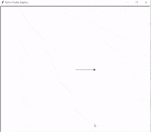
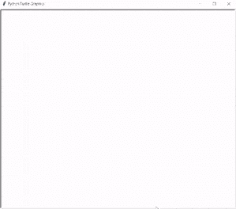
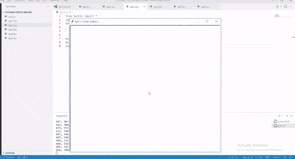
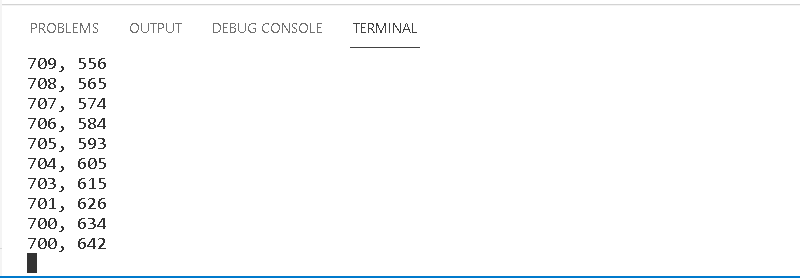
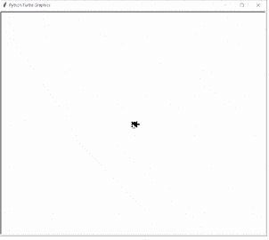
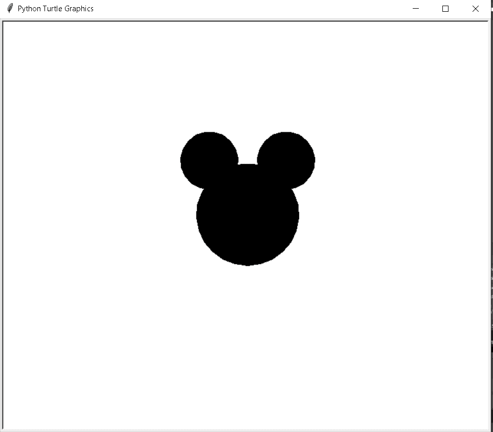
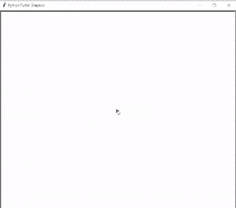
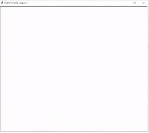

# Python 龟鼠+多个例子

> 原文：<https://pythonguides.com/python-turtle-mouse/>

[](https://sharepointsky.teachable.com/p/python-and-machine-learning-training-course)

在这个 [Python turtle](https://pythonguides.com/turtle-programming-in-python/) 教程中，我们将学习**如何在 Python Turtle** 中使用 turtle mouse，我们还将涵盖与 Turtle Mouse 相关的不同示例。此外，我们将涵盖这些主题。

*   蟒蛇龟鼠
*   Python 龟鼠事件
*   蟒蛇龟鼠标位置
*   巨蟒龟跟随老鼠
*   蟒蛇龟米老鼠
*   蟒蛇龟用鼠标绘制
*   巨蟒龟等待鼠标点击

目录

[](#)

*   [蟒龟鼠](#Python_turtle_mouse "Python turtle mouse")
*   [蟒龟鼠事件](#Python_turtle_mouse_events "Python turtle mouse events")
*   [蟒龟鼠标位置](#Python_turtle_mouse_position "Python turtle mouse position")
*   [蟒龟跟随老鼠](#Python_turtle_follows_mouse "Python turtle follows mouse")
*   [蟒蛇龟米老鼠](#Python_turtle_mickey_mouse "Python turtle mickey mouse")
*   [蟒蛇龟用鼠标画画](#Python_turtle_draw_with_mouse "Python turtle draw with mouse")
*   [巨蟒龟等待鼠标点击](#Python_turtle_wait_for_mouse_click "Python turtle wait for mouse click ")

## 蟒龟鼠

在本节中，我们将学习如何在 [python turtle](https://pythonguides.com/python-turtle-cheat-sheet/) 中使用龟鼠标。

乌龟是用来画形状的，我们可以在鼠标的帮助下移动乌龟。当老鼠发出命令时，乌龟开始工作。

**代码:**

在下面的代码中，我们将从海龟导入* 、**导入海龟库**。**龟()**是用来做物件的。****

 ***   `turtle.right(90)` 用于向右移动乌龟。
*   `turtle.forward(150)` 用于向前移动乌龟。
*   `turtle.speed(6)` 用于给乌龟正常速度。
*   `turtle.onclick(func)` 用于允许用户点击鼠标进行某种动作。

```py
from turtle import *
import turtle

def func(i,j):

    turtle.right(90)
    turtle.forward(150)

turtle.speed(6)
turtle.forward(100) 
turtle.onclick(func)
turtle.done()
```

**输出:**

运行上面的代码后，我们得到下面的输出，我们可以看到在鼠标的帮助下点击箭头，乌龟向前移动，画出了正方形。



Python turtle mouse Output

还有，查:[蟒龟赛](https://pythonguides.com/python-turtle-race/)

## 蟒龟鼠事件

在本节中，我们将了解 python turtle 中的 **turtle 鼠标事件**。

在继续之前，我们应该对事件有所了解。

事件是在特定时间发生的事情。这里，在鼠标的帮助下点击屏幕，一个事件发生了，海龟从一个地方换到另一个地方。

**代码:**

在下面的代码中，我们将从 turtle import * 中导入 turtle 库**，i **导入 turtle** 。**

*   **ws =乌龟。Screen()** 用来做一个屏幕，我们在里面画形状。
*   **turtle.goto(i，j)** 用于将乌龟移动到绝对位置。
*   `ws.onclick(func)` 用来在单击鼠标后移动光标并绘制形状。

```py
from turtle import *

import turtle

ws = turtle.Screen()

def func(i, j):
  turtle.goto(i, j)
  turtle.write(str(i)+","+str(j))

ws.onclick(func)
ws.mainloop()
```

**输出:**

运行上面的代码后，我们得到了下面的输出，其中我们可以看到在单击鼠标后，一些动作完成了，并且生成了一个事件。



Python turtle mouse event Output

阅读:[蟒龟 onclick](https://pythonguides.com/python-turtle-onclick/)

## 蟒龟鼠标位置

在本节中，我们将学习如何在 Python turtle 中获取鼠标位置。

众所周知，在鼠标的帮助下，我们完成了大部分功能。这里也是点击鼠标，放置在屏幕上的光标开始移动。无论光标移动到哪里，我们都会得到位置，并且位置会显示在命令提示符上。

**代码:**

在下面的代码中，我们将从海龟导入* 、**导入海龟库**。**龟()**法是用来做物件的。****

 `*   `i，j = event.x，event.y** 用于定义海龟的位置。
*   `turtle.getcanvas()` 用于制作画布。

```py
from turtle import *
import turtle
def position(event):
    i,j = event.x, event.y
    print('{}, {}'.format(i, j))

ws = turtle.getcanvas()
ws.bind('<Motion>', position)
turtle.done()
```

**输出:**

运行上面的代码后，我们得到下面的输出，其中我们可以看到光标被放置在屏幕上，单击鼠标后光标开始移动，我们得到光标在命令提示符上的位置。



Python turtle mouse position

在下图中，我们可以看到光标在屏幕上移动后的位置。



Python turtle mouse position Output

阅读:[蟒龟示踪器](https://pythonguides.com/python-turtle-tracer/)

## 蟒龟跟随老鼠

在本节中，我们将学习如何在 python turtle 中跟随鼠标。

正如我们所知，点击鼠标后，光标可以开始在屏幕上移动。光标跟随鼠标命令并在屏幕上绘制形状。

**代码:**

在下面的代码中，我们将从海龟导入* 、**导入海龟库**。**龟()**法是用来做物件的。****

 `*   `tur.goto(i，j)** 用于将乌龟移动到绝对位置。
*   `tur.ondrag(drag)` 用于拖动光标，跟随鼠标。
*   `ws = Screen()` 用于制作屏幕。
*   **tur . speed(‘最快’)**用来给乌龟最快的速度。

```py
from turtle import *
from turtle import Turtle, Screen

def drag(i, j):
    tur.ondrag(None)
    tur.setheading(tur.towards(i, j))
    tur.goto(i, j)
    tur.ondrag(drag)

ws = Screen()

tur = Turtle('turtle')
tur.speed('fastest')

tur.ondrag(drag)

ws.mainloop()
```

**输出:**

运行上面的代码后，我们得到了下面的输出，其中我们可以看到乌龟按照鼠标命令画出了形状。



Python turtle follows mouse Output

阅读:[蟒龟三角](https://pythonguides.com/python-turtle-triangle/)

## 蟒蛇龟米老鼠

本节我们将学习**如何在 python turtle 中绘制米老鼠**。

在这里，我们可以在乌龟的帮助下画出米老鼠的形状。我们知道**龟()**的方法是用来做出不同的形状。

**代码:**

在下面的代码中，我们将从 turtle import *导入 turtle 库，导入 turtle。turtle()方法用于制作对象。

*   **乌龟。Screen()** 用来做一个屏幕，我们可以在里面画出不同的形状。
*   `background . bgcolor(" white ")`用于给屏幕赋予背景色。
*   `tur.shape ("turtle")` 用于将乌龟形状赋予光标。
*   `tur.speed(100)` 用来给乌龟速度。
*   `turt.penup()` 用于停止绘图。
*   `turt.fillcolor(clr)` 用于填充形状内部的颜色。
*   **turt.goto(i，j)** 用于将乌龟移动到绝对位置。
*   `turt.begin_fill()` 用于开始填充颜色。
*   `turt.circle(siz)` 用来在乌龟的帮助下画出圆形。
*   `turt.end_fill()` 用于停止填充颜色。

```py
from turtle import *
import turtle

background = turtle.Screen()
background.bgcolor("white")

tur = turtle.Turtle()
tur.shape ("turtle")
tur.speed(100)

def draw_mickymouse(turt, clr, siz, i,j):
  turt.penup()
  turt.color(clr)
  turt.fillcolor(clr)
  turt.goto(i,j)
  turt.pendown()
  turt.begin_fill()
  turt.circle(siz)
  turt.end_fill()

draw_mickymouse(tur, "black", 80, 0, -60)
draw_mickymouse(tur, "black", 45, 60, 60)
draw_mickymouse(tur, "black", 45, -60, 60)

turtle.done()
```

**输出:**

运行上面的代码后，我们得到下面的输出，其中我们可以看到米老鼠的形状是在 turtle 的帮助下绘制的。



Python turtle mickey mouse

阅读:[蟒龟大小](https://pythonguides.com/python-turtle-size/)

## 蟒蛇龟用鼠标画画

在这一节中，我们将学习如何用鼠标在蟒蛇龟中绘制不同的形状。

众所周知，海龟被用来制作不同的形状。在这里，我们用鼠标帮助乌龟画出形状，乌龟按照鼠标的指示做。

在点击鼠标时，他们画出乌龟来画出形状，乌龟也按照鼠标的命令画出形状。

**代码:**

```py
from turtle import *
import turtle
from turtle import Screen, Turtle

ws = Screen()
tur = turtle.Turtle()
tur.speed(-1)

def dragging(x, y): 
    tur.ondrag(None)
    tur.setheading(tur.towards(x, y))
    tur.goto(x, y)
    tur.ondrag(dragging)

def clickRight():
    tur.clear()

def main():  
    turtle.listen()

    tur.ondrag(dragging)  dragging
    turtle.onscreenclick(clickRight, 3)

    ws.mainloop()  

main()
```

**输出:**

运行上面的代码后，我们得到下面的输出，其中我们可以看到在鼠标的帮助下画出了帽子的形状。



Python turtle draw with mouse

阅读:[蟒龟字体](https://pythonguides.com/python-turtle-font/)

## 巨蟒龟等待鼠标点击

在这一节中，我们将学习 python turtle 中的 **turtle 等待鼠标点击**。

我们在一只乌龟的帮助下在屏幕上画出不同的形状。这里海龟在等待鼠标点击。只需在屏幕上点击一下鼠标，乌龟就开始画画了。

**代码:**

在下面的代码中，我们将从 tur import *、**import turn、**和 `import time** `导入 turn 库**作为 t** 来管理时间。使用 `turtle()` 方法制作对象。**

*   `tur . onscreen click(on _ click)`功能用于在屏幕上单击一次后发送当前坐标上的乌龟。
*   `t.sleep(.1)` 用于延迟程序的执行。
*   `tur.forward(100)` 用于向前移动乌龟。
*   `tur.left(90)` 用于向左移动乌龟。

```py
from turtle import *
import turtle as tur
import time as t

click = False

def on_click(i, j):
    global click

    click = True

tur.onscreenclick(on_click)

def waitforclick():
    global click

    tur.update()
    click = False

    while not click:
        tur.update()
        t.sleep(.1)

    click = False

tur.update()

for _ in range(4):
    waitforclick()
    tur.forward(100)
    tur.left(90)

tur.exitonclick() 
```

**输出:**

运行上面的代码后，我们得到了下面的输出，其中我们可以看到乌龟正在等待鼠标点击。在单击鼠标后，乌龟开始在屏幕上画一个形状。



Python turtle wait for mouse click Output

您可能也喜欢阅读以下关于 Python Turtle 的文章。

*   [蟒蛇龟广场——实用指南](https://pythonguides.com/python-turtle-square/)
*   [蟒蛇龟艺术——如何绘制](https://pythonguides.com/python-turtle-art/)
*   [蟒龟速度举例](https://pythonguides.com/python-turtle-speed/)
*   [蟒蛇龟颜色+示例](https://pythonguides.com/python-turtle-colors/)
*   [蟒龟获得位置](https://pythonguides.com/python-turtle-get-position/)

因此，在本教程中，我们讨论了 `Python Turtle Mouse` ,我们还涵盖了与其实现相关的不同示例。这是我们已经讨论过的例子列表。

*   蟒蛇龟鼠
*   Python 龟鼠事件
*   蟒蛇龟鼠标位置
*   巨蟒龟跟随老鼠
*   蟒蛇龟米老鼠
*   蟒蛇龟用鼠标绘制
*   巨蟒龟等待鼠标点击

[Bijay Kumar](https://pythonguides.com/author/fewlines4biju/)

Python 是美国最流行的语言之一。我从事 Python 工作已经有很长时间了，我在与 Tkinter、Pandas、NumPy、Turtle、Django、Matplotlib、Tensorflow、Scipy、Scikit-Learn 等各种库合作方面拥有专业知识。我有与美国、加拿大、英国、澳大利亚、新西兰等国家的各种客户合作的经验。查看我的个人资料。

[enjoysharepoint.com/](https://enjoysharepoint.com/)[](https://www.facebook.com/fewlines4biju "Facebook")[](https://www.linkedin.com/in/fewlines4biju/ "Linkedin")[](https://twitter.com/fewlines4biju "Twitter")`**`