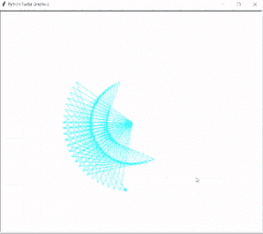
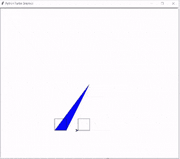
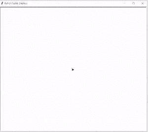
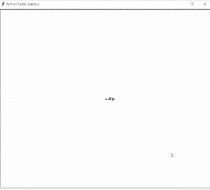
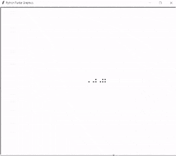

# Python Turtle 嵌套循环

> 原文：<https://pythonguides.com/python-turtle-nested-loop/>

[](https://sharepointsky.teachable.com/p/python-and-machine-learning-training-course)

在这个 [Python turtle](https://pythonguides.com/turtle-programming-in-python/) 教程中，我们将学习**如何在 Python turtle 中创建一个嵌套循环**，我们还将涵盖与 turtle 嵌套循环相关的不同示例。我们将讨论这些话题。

*   Python turtle 嵌套循环
*   蟒蛇龟嵌套循环广场
*   Python 海龟嵌套循环练习
*   Python 海龟嵌套循环模式
*   蟒蛇龟嵌套循环三角形

目录

[](#)

*   [蟒龟嵌套循环](#Python_turtle_nested_loop "Python turtle nested loop")
*   [蟒龟嵌套循环方块](#Python_turtle_nested_loop_square "Python turtle nested loop square")
*   [蟒龟嵌套循环练习](#Python_turtle_nested_loop_practice "Python turtle nested loop practice")
*   [蟒龟嵌套循环模式](#Python_turtle_nested_loop_pattern "Python turtle nested loop pattern")
*   [蟒龟嵌套循环三角形](#Python_turtle_nested_loop_triangle "Python turtle nested loop triangle")

## 蟒龟嵌套循环

在这一节中，我们将学习如何在 python turtle 中创建嵌套循环。

嵌套循环被定义为创建不同形状和模式的另一个循环中的一个循环，也代表我们逻辑的连续部署。

**代码:**

在下面的代码中，我们将导入 turtle 模块 `import turtle` ，从这里我们创建一个嵌套循环。**龟()**法是用来做物件的。

*   `ws.speed(0)` 用来给乌龟速度， `0` 是最快的速度。
*   **ws.color("青色")**用于给乌龟赋予颜色，以画出美丽的形状。
*   `ws.left(144)` 用于向左移动乌龟。
*   `ws.forward(200)` 用于将乌龟向左移动后再向前移动。

```py
import turtle

ws = turtle.Turtle()
ws.speed(0)
ws.color("cyan")

for j in range (1,100):
  for i in range (1,6):
      ws.left(144)
      ws.forward(200)
  ws.left(5)
turtle.done()
```

**输出:**

运行上面的代码后，我们得到了下面的输出，我们可以看到在嵌套循环的帮助下创建了一个漂亮的形状。



Python turtle nested loop Output

还有，查:[蟒龟赛](https://pythonguides.com/python-turtle-race/)

## 蟒龟嵌套循环方块

在这一节中，我们将学习如何在 python turtle 中创建嵌套循环方块。

众所周知，嵌套循环是另一个循环中的一个循环。在这里，我们可以借助嵌套循环创建一个正方形，我们可以在一个循环中使用一个循环，也可以使用另一个循环。

**代码:**

在下面的代码中，我们将从 turtle import * 、 `import turtle` 中导入 turtle 模块**，从中我们创建了一个嵌套的循环方块，并绘制了一个漂亮的图案。**龟()**法是用来做物件的。**

*   `turtle.speed(0)` 用来给乌龟最快的速度。
*   `turtle . fill color(" black ")`用于将黑色赋予乌龟，用于填充形状。
*   `turtle.begin_fill()` 用于开始填充形状。
*   **turtle.setpos(a，b)** 用于设置乌龟的位置。
*   **turtle.forward(长度)**用于向前移动乌龟。
*   `turtle.left(90)` 用于向左移动乌龟。
*   `turtle.end_fill()` 用于结束填充形状。

```py
from turtle import *
import turtle
size = 8
length = 50
startx = -200
starty = -200
def nestedloop():

 turtle.speed(0)

 for row1 in range(size):
     for col1 in range(size):
        if (row1+col1)%2 == 0:
             turtle.fillcolor("black")
        else:
            turtle.fillcolor("blue")
            turtle.begin_fill()
            a = startx + col1*length
            b = starty + row1*length
            turtle.penup()
            turtle.setpos(a,b)
            turtle.pendown()
            for i in range(4):
                     turtle.forward(length)
                     turtle.left(90)
                     turtle.end_fill()
nestedloop()
turtle.done()
```

**输出:**

运行上面的代码后，我们得到了下面的输出，其中我们可以看到构建块是在嵌套循环方块的帮助下创建的，看起来非常漂亮。



Python turtle nested loop square Output

阅读:[蟒龟示踪器](https://pythonguides.com/python-turtle-tracer/)

## 蟒龟嵌套循环练习

在本节中，我们将**练习嵌套循环**，并学习如何在嵌套循环的帮助下创建一个不同的、更漂亮的图案。

当需要重复或进行任何设计时，嵌套循环代表我们逻辑的连续部署。

**代码:**

在下面的代码中，我们将从 turtle import * 、 `import turtle` 中导入 turtle 模块**。**龟()**法是用来做物件的。**

*   **乌龟。Screen()** 用于创建一个屏幕，我们可以在其中绘制不同的形状。
*   **而计数器<** 4 用于重复该行 4 次。
*   `tur.forward(50)` 用于向前移动乌龟。
*   `tur.left(90)` 用于向左移动乌龟。
*   `ws.exitonclick()` 用于完成程序后我们想退出屏幕时只需点击屏幕。

```py
from turtle import *
import turtle

ws = turtle.Screen()
tur = turtle.Turtle()

counter = 0
while counter < 4:
    tur.forward(50)
    tur.left(90)
    counter = counter + 1

ws.exitonclick()
```

**输出:**

运行上面的代码后，我们得到下面的输出，从中我们可以看到一个模式。这种模式是在计数器的帮助下创建的，它重复四次，并生成一个嵌套循环。



Python turtle nested loop practice Output

阅读:[蟒龟三角](https://pythonguides.com/python-turtle-triangle/)

## 蟒龟嵌套循环模式

在本节中，我们将学习如何在 python turtle 中创建嵌套循环模式。

在前进之前，我们应该有一些关于模式的知识。图案是借助几何形状形成的，并绘制出美丽的图案。

在这里，我们可以借助嵌套循环创建不同的模式。我们知道嵌套循环是另一个循环中的一个循环。

**代码:**

在下面的代码中，我们将导入乌龟模块**导入乌龟导入*** ，**导入乌龟**。**龟()**法是用来做物件的。

*   `myturtle.penup()` 用于停止乌龟。
*   `my turtle . forward(stepsize)`用于向前移动乌龟。

```py
from turtle import *
import turtle

def drawtriangle(size, col=1):
    for shift in range(0, col):
        myturtle.goto(myturtle.xcor(), shift * stepsize)
        myturtle.dot()
    myturtle.forward(stepsize)
    if col < size:
        drawtriangle(size, col + 1)

myturtle = turtle.Turtle()
myturtle.penup()
stepsize = 5
for trianglesize in range(1, 5):
    drawtriangle(trianglesize)
    myturtle.forward(stepsize)
turtle.done()
```

**输出:**

运行上面的代码后，我们得到了下面的输出，其中我们可以看到在嵌套循环的帮助下，绘制出了模式和一个漂亮的设计。



Python turtle nested loop pattern Output

阅读:[蟒龟大小](https://pythonguides.com/python-turtle-size/)

## 蟒龟嵌套循环三角形

在这一节中，我们将学习如何在 python turtle 中创建嵌套循环三角形。

在继续之前，我们有一些关于三角形的知识。三角形有三个顶点和三条边。它是一个封闭的二维形状。我们也可以借助嵌套循环来绘制三角形。嵌套循环三角形被定义为另一个循环中的一个循环。

**代码:**

在下面的代码中，我们将从海龟导入 **屏幕**、**海龟**中导入海龟模块**，从中我们可以创建一个嵌套的循环三角形。使用 `turtle()` 方法来制作对象。**

*   `turtle.position()` 用于设置乌龟的位置。
*   `turtle.dot()` 用于绘制圆形圆点。
*   `ws.exitonclick()` 是在完成程序后我们想退出屏幕时才点击屏幕。

```py
from turtle import Screen, Turtle

stepsize = 10

def draw_triangles(tur, dot, steps=1):
    a, b = turtle.position()

    for step in range(steps):
        turtle.goto(a, b + step * stepsize)
        turtle.dot()

        for _ in range(steps - step - 1):
            turtle.backward(stepsize)
            turtle.dot()

    if steps < dot:
        turtle.goto(a + stepsize * (steps + 2), b)
        draw_triangles(turtle, dot, steps + 1)

screen = Screen()

turtle = Turtle()
turtle.hideturtle()
turtle.penup()

draw_triangles(turtle, 6)

screen.exitonclick()
```

**输出:**

运行上面的代码后，我们得到下面的输出，我们可以看到屏幕上显示了一个嵌套的循环三角形。



Python turtle nested loop triangle Output

你可能也喜欢阅读以下关于 Python turtle 的教程。

*   [巨蟒龟屏幕尺寸](https://pythonguides.com/python-turtle-screen-size/)
*   [蟒蛇龟图形](https://pythonguides.com/python-turtle-graphics/)
*   [蟒龟鼠](https://pythonguides.com/python-turtle-mouse/)
*   [蟒龟获得位置](https://pythonguides.com/python-turtle-get-position/)
*   [蟒龟画线](https://pythonguides.com/python-turtle-draw-line/)
*   [分形蟒龟+例子](https://pythonguides.com/fractal-python-turtle/)
*   [Python 清龟配实例](https://pythonguides.com/python-clear-turtle/)
*   [蟒龟输入](https://pythonguides.com/python-turtle-input/)

因此，在本教程中，我们讨论了 **Python turtle 嵌套循环**,我们还涵盖了与其实现相关的不同示例。这是我们已经讨论过的例子列表。

*   Python turtle 嵌套循环
*   蟒蛇龟嵌套循环广场
*   Python 海龟嵌套循环练习
*   Python 海龟嵌套循环模式
*   蟒蛇龟嵌套循环三角形

[Bijay Kumar](https://pythonguides.com/author/fewlines4biju/)

Python 是美国最流行的语言之一。我从事 Python 工作已经有很长时间了，我在与 Tkinter、Pandas、NumPy、Turtle、Django、Matplotlib、Tensorflow、Scipy、Scikit-Learn 等各种库合作方面拥有专业知识。我有与美国、加拿大、英国、澳大利亚、新西兰等国家的各种客户合作的经验。查看我的个人资料。

[enjoysharepoint.com/](https://enjoysharepoint.com/)[](https://www.facebook.com/fewlines4biju "Facebook")[](https://www.linkedin.com/in/fewlines4biju/ "Linkedin")[](https://twitter.com/fewlines4biju "Twitter")