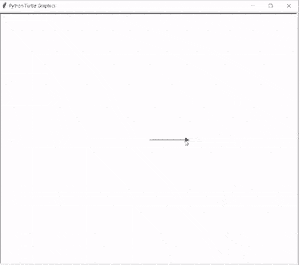
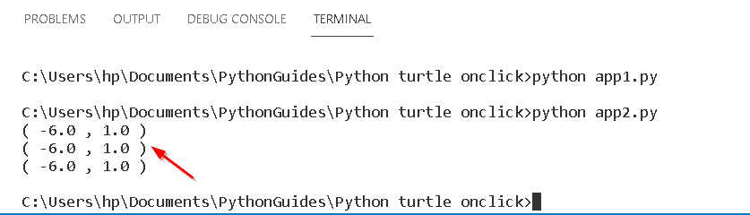
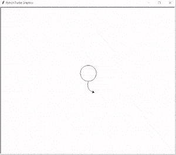

# Python turtle onclick 示例

> 原文：<https://pythonguides.com/python-turtle-onclick/>

[](https://sharepointsky.teachable.com/p/python-and-machine-learning-training-course)

在本 [Python turtle 教程](https://pythonguides.com/python-turtle-commands/)中，我们将了解 `Python turtle onclick` ，我们还将涵盖与 turtle onclick 相关的不同示例。我们将讨论这些话题。

*   蟒蛇龟 onclick
*   蟒蛇龟 onclick 位置
*   Python turtle onclick 退出

目录

[](#)

*   [蟒龟 onclick](#Python_turtle_onclick "Python turtle onclick")
*   [蟒龟 onclick 位置](#Python_turtle_onclick_position "Python turtle onclick position")
*   [Python turtle onclick 退出](#Python_turtle_onclick_exit "Python turtle onclick exit")

## 蟒龟 onclick

在本节中，我们将学习 Python turtle 中的 `turtle onclick` 。

当我们点击屏幕时，onclick 函数被赋值。它使用户能够执行一个动作。当用户点击屏幕时，动作被执行，对象开始工作。

**代码:**

在下面的代码中，我们将从 turtle import * 、 `import turtle` 中导入 turtle 模块**。turtle()方法用于制作对象。**

*   `tur.speed(1)` 用来给乌龟最慢的速度。
*   `tur.forward(100)` 用于向前移动乌龟。
*   `tur.onclick(func)` 允许用户点击某个动作。

```py
from turtle import *

import turtle as tur 

def func(i,j):

    tur.right(90)
    tur.forward(100)

tur.speed(1)

tur.forward(100)

tur.onclick(func)
tur.done()
```

**输出:**

运行上面的代码后，我们得到下面的输出，其中我们可以看到 onclick on arrow turtle 向前移动。



Python turtle onclick Output

*   [使用蟒蛇龟绘制彩色填充形状](https://pythonguides.com/draw-colored-filled-shapes-using-python-turtle/)

## 蟒龟 onclick 位置

在这一节中，我们将学习如何在 Python turtle 中通过点击屏幕上的来获得位置。

当我们点击屏幕时，onclick 函数得到评估。用户只需点击屏幕，海龟的位置就会打印在命令提示符上。

**代码:**

在下面的代码中，我们将从 t `urtle import *` ，`import tur`中导入 turn 模块**，由此我们执行 onclick 函数。**

`tur.onclick(getPosition)` 用于在屏幕上通过简单的 onclick 获得位置。

```py
from turtle import *
import turtle as tur
def getPosition(i,j):
    print("(", i, "," ,j,")")
    return

def mainscr():
    tur.onclick(getPosition)
    tur.mainloop()
mainscr()
```

**输出:**

在上面的代码之后，我们得到了下面的输出，其中我们可以看到只需点击屏幕，海龟的位置就会显示在命令提示符上。



Python turtle onclick position Output

阅读[如何使用 Turtle](https://pythonguides.com/snake-game-in-python/) 创建 Python 中的贪吃蛇游戏

## Python turtle onclick 退出

在本节中，我们将学习如何在 Python turtle 中简单地通过 onclick 屏幕上的退出。

当我们点击屏幕时, `onclick()` 函数被求值。类似地，在程序执行后，只需点击屏幕即可使用 `onclickexit()` 函数。点击屏幕后，屏幕被终止。

**代码:**

在下面的代码中，我们将从 turtle import * 、**导入 turtle 模块**作为 tur** 。**龟()**法是用来做物件的。**

`tur.circle(35)` 用于在屏幕上画圆。

`tur.right(115)` 用于向右移动乌龟。

`tur.exitonclick()` 函数用于当且仅当鼠标被点击时退出屏幕。

```py
from turtle import *

import turtle as tur

for x in range(3):
  tur.circle(35)
  tur.right(115)

# exit from the screen 
# if and only if
# mouse is clicked
tur.exitonclick()
```

**输出:**

运行上面的代码后，我们将得到下面的输出，其中我们看到在程序完成后屏幕上画了一个圆 `onclickexit()` 函数执行当且仅当鼠标在屏幕上单击时。



Python turtle onclickexit Output

查看以下 Python 海龟教程:

*   [如何使用 Turtle 在 python 中绘制形状](https://pythonguides.com/turtle-programming-in-python/)
*   [蟒龟赛跑](https://pythonguides.com/python-turtle-race/)
*   [蟒清龟](https://pythonguides.com/python-clear-turtle/)
*   [巨蟒龟屏幕尺寸](https://pythonguides.com/python-turtle-screen-size/)
*   [蟒龟圆点](https://pythonguides.com/python-turtle-dot/)
*   [蟒龟示踪器](https://pythonguides.com/python-turtle-tracer/)
*   [蟒龟三角](https://pythonguides.com/python-turtle-triangle/)
*   [Replit 蟒蛇龟](https://pythonguides.com/replit-python-turtle/)

因此，在本教程中，我们讨论了 `Python turtle onclick` ,我们还讨论了与其实现相关的不同示例。这是我们已经讨论过的例子列表。

*   蟒蛇龟 onclick
*   蟒蛇龟 onclick 位置
*   Python turtle onclick 退出

[Bijay Kumar](https://pythonguides.com/author/fewlines4biju/)

Python 是美国最流行的语言之一。我从事 Python 工作已经有很长时间了，我在与 Tkinter、Pandas、NumPy、Turtle、Django、Matplotlib、Tensorflow、Scipy、Scikit-Learn 等各种库合作方面拥有专业知识。我有与美国、加拿大、英国、澳大利亚、新西兰等国家的各种客户合作的经验。查看我的个人资料。

[enjoysharepoint.com/](https://enjoysharepoint.com/)[](https://www.facebook.com/fewlines4biju "Facebook")[](https://www.linkedin.com/in/fewlines4biju/ "Linkedin")[](https://twitter.com/fewlines4biju "Twitter")