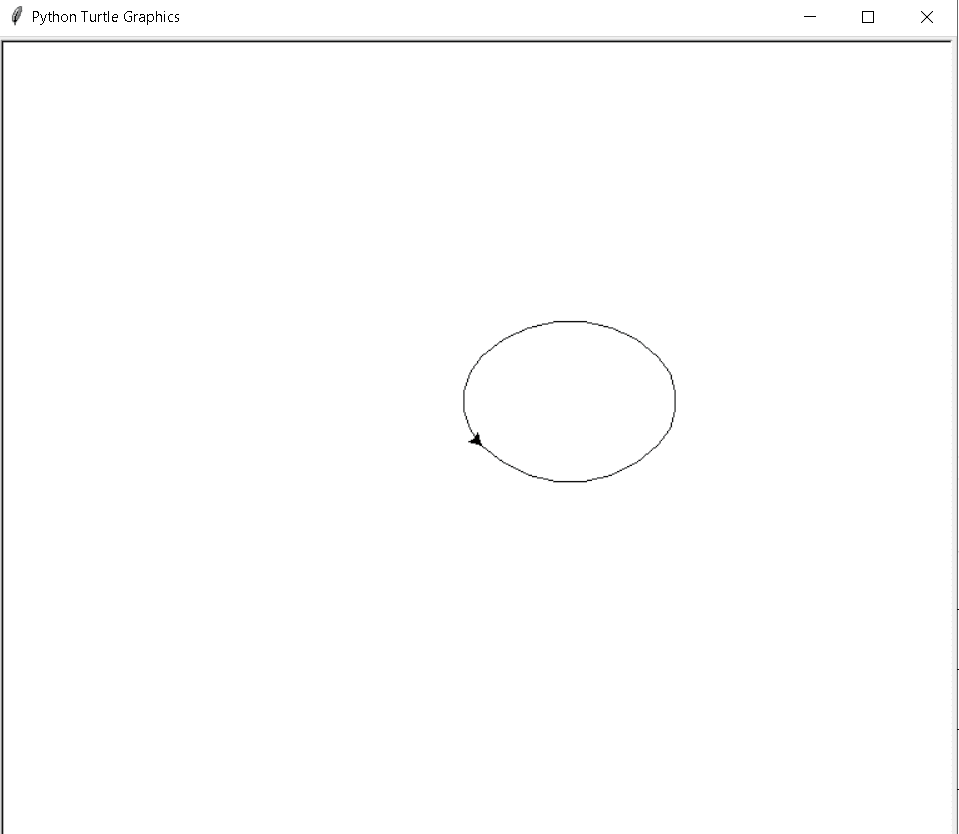
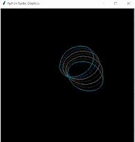

# 蟒蛇龟椭圆形

> 原文：<https://pythonguides.com/python-turtle-oval/>

[](https://sharepointsky.teachable.com/p/python-and-machine-learning-training-course)

在本[蟒蛇龟教程](https://pythonguides.com/turtle-programming-in-python/)中，我们将学习**如何在**蟒蛇龟**中创建一个椭圆形**，我们还将涵盖与乌龟椭圆形相关的不同示例。我们将讨论这些话题。

*   蟒蛇龟椭圆形
*   蟒蛇龟椭圆形视觉效果

目录

[](#)

*   [蟒蛇龟椭圆形](#Python_turtle_oval "Python turtle oval ")
*   [蟒蛇龟椭圆形视觉效果](#Python_turtle_oval_visuals "Python turtle oval visuals")

## 蟒蛇龟椭圆形

在这一节中，我们将学习**如何在 python turtle 中的乌龟的帮助下创建一个椭圆形**。

椭圆形是一个封闭曲线的圆形图形。它看起来像一个鸡蛋。它没有角或直线，我们可以说它只是看起来像一个圆，但不是一个完美的圆。这里我们在一只乌龟的帮助下画了一个椭圆形。乌龟充当一支笔，在画板上画出椭圆形，还有一个屏幕充当画板。

**代码:**

在下面的代码中，我们将从 turtle import *中导入海龟库**，` `导入海龟` `作为 tur** 。

*   **tur.circle(rad，90)** 用于绘制椭圆形。
*   `tur.seth(-45)` 用于将形状倾斜到负 45°。
*   `drawoval(100)` 用于调用 draw 方法。

```py
from turtle import*

import turtle as tur

def drawoval(rad):

  for x in range(2):

    tur.circle(rad,90)
    tur.circle(rad//2,90)

tur.seth(-45)

drawoval(100)
tur.done()
```

**输出:**

运行上述代码后，我们将得到以下输出，其中我们可以看到屏幕上绘制了一个椭圆形，看起来像鸡蛋或椭圆。



Python turtle oval

还有，检查:[分形蟒龟](https://pythonguides.com/fractal-python-turtle/)

## 蟒蛇龟椭圆形视觉效果

在这一部分，我们将学习**如何在巨蟒之龟中的乌龟的帮助下绘制椭圆形视觉艺术**。

视觉艺术是一种用于绘画和创作视频的艺术，它也专注于创作作品。在这里，椭圆形视觉效果是在一只乌龟的帮助下绘制的，并绘制出一个可以吸引人们眼球的美丽形状，这个椭圆形视觉效果是在绘图板上绘制的，这里屏幕充当绘图板。

**代码:**

在下面的代码中，我们将从 turtle import * 导入 turtle 库**，导入 turtle 包 `import turtle as tur` 。**龟()**法是用来做物件的。**

*   **ws.setup(500，500)** 用于设置屏幕尺寸。
*   **ws.bgcolor('black')** 用于给笔赋予颜色。
*   **col=['青色'，'蓝色'，'粉色'，'紫色'，'黄色'，'绿色']** 用于在不同颜色的帮助下给绘制形状的笔赋予颜色。
*   `tur.speed(100)` 用来给乌龟速度。
*   `drawoval(80)` 用于调用绘制椭圆形的函数。
*   **值+=10** 用于改变方向。
*   `tur . hideturt()`用于在屏幕上隐藏乌龟。

```py
from turtle import *

import turtle as tur
ws = tur.Screen()

def drawoval(rad):

    for i in range(2):
        tur.circle(rad,90)
        tur.circle(rad//2,90)

ws.setup(500,500)

ws.bgcolor('black')

col=['cyan','blue','pink','purple',
     'yellow','green']

value=10
index=0

tur.speed(100)

for i in range(36):

    tur.seth(-value)

    tur.color(col[index])

    if index==5:
        index=0
    else:
        index+=1

    drawoval(80)

    value+=10

tur.hideturtle()
```

**输出:**

运行上面的代码后，我们得到下面的输出，其中我们可以看到一个美丽的椭圆形视觉艺术在一只乌龟的帮助下绘制在屏幕上。



Python turtle oval visuals

此外，查看 Python Turtle 上的更多相关帖子。

*   [蟒清龟](https://pythonguides.com/python-clear-turtle/)
*   [蟒龟随机](https://pythonguides.com/python-turtle-random/)
*   [蟒龟背景](https://pythonguides.com/python-turtle-background/)
*   [蟒龟钟](https://pythonguides.com/python-turtle-clock/)
*   [蟒龟星](https://pythonguides.com/python-turtle-star/)
*   [蟒蛇龟图形](https://pythonguides.com/python-turtle-graphics/)
*   [蟒龟圆点](https://pythonguides.com/python-turtle-dot/)
*   [蟒龟 onclick](https://pythonguides.com/python-turtle-onclick/)

因此，在本教程中，我们讨论了 `Python Turtle Oval` ,我们还讨论了与其实现相关的不同示例。这是我们已经讨论过的例子列表。

*   蟒蛇龟椭圆形
*   蟒蛇龟椭圆形视觉效果

[Bijay Kumar](https://pythonguides.com/author/fewlines4biju/)

Python 是美国最流行的语言之一。我从事 Python 工作已经有很长时间了，我在与 Tkinter、Pandas、NumPy、Turtle、Django、Matplotlib、Tensorflow、Scipy、Scikit-Learn 等各种库合作方面拥有专业知识。我有与美国、加拿大、英国、澳大利亚、新西兰等国家的各种客户合作的经验。查看我的个人资料。

[enjoysharepoint.com/](https://enjoysharepoint.com/)[](https://www.facebook.com/fewlines4biju "Facebook")[](https://www.linkedin.com/in/fewlines4biju/ "Linkedin")[](https://twitter.com/fewlines4biju "Twitter")