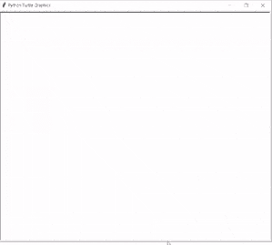

# Python 海龟笔+示例

> 原文：<https://pythonguides.com/python-turtle-pen/>

[](https://sharepointsky.teachable.com/p/python-and-machine-learning-training-course)

在这个 Python 教程中，我们将学习如何在 Python Turtle 中使用 Turtle Pen**，我们还将介绍与 Python** 中的 **Turtle Pen 相关的不同示例。我们将讨论这些话题。**

*   蟒蛇龟围栏
*   蟒蛇皮海龟笔大小
*   蟒蛇龟笔速度
*   蟒蛇龟佩努普
*   蟒蛇龟笔形状
*   蟒蛇皮海龟笔颜色 RGB
*   蟒蛇乌龟围栏
*   蟒蛇皮海龟笔颜色

目录

[](#)

*   [蟒蛇龟笔](#Python_turtle_pen "Python turtle pen")
*   [蟒蛇龟笔尺寸](#Python_turtle_pen_size "Python turtle pen size")
*   [巨蟒龟笔速](#Python_turtle_pen_speed "Python turtle pen speed")
*   [蟒龟佩努普](#Python_turtle_penup "Python turtle penup")
*   [蟒龟笔形](#Python_turtle_pen_shape "Python turtle pen shape")
*   [蟒蛇龟笔颜色 RGB](#Python_turtle_pen_color_RGB "Python turtle pen color RGB")
*   [蟒龟放下笔](#Python_turtle_pen_down "Python turtle pen down")
*   [蟒蛇龟笔颜色](#Python_turtle_pen_color "Python turtle pen color")

## 蟒蛇龟笔

本节我们将学习 python 龟中的**龟笔。**

在前进之前，我们应该有一个关于笔的知识。钢笔是一种在纸上、书上或笔记本上书写或绘制形状的工具。这里我们用一只海龟笔，它被用来在屏幕上制作图形。

**代码:**

在下面的代码中，我们将从 turtle import * 、 `import turtle` 中导入 turtle 模块**。**龟()**法是用来做物件的。**

`print(tur.pen())` 用于打印笔的默认值。

```py
from turtle import *

import turtle as tur

print(tur.pen())
```

**输出:**

运行上面的代码后，我们得到下面的输出，其中我们可以看到笔的默认值被打印在屏幕上。


Python turtle pen

另外，检查:[蟒蛇龟图形](https://pythonguides.com/python-turtle-graphics/)

## 蟒蛇龟笔尺寸

本节我们将学习 python turtle 中龟栏的**大小。**

正如我们所知道的，钢笔是用来画画、画形状的。为了使我们的形状和图片看起来漂亮，我们给笔一个尺寸。根据他们需要的形状来改变尺寸，这样我们的形状看起来更有吸引力。

**代码:**

在下面的代码中，我们将从 turtle import * 、**导入 turtle 模块**。****龟()**法用于制作造型。**

*   `tur.forward(100)` 用于向前移动笔。
*   `tur.width(4)` 用于给出笔的大小或宽度。
*   `tur.right(90)` 用于向右移动乌龟。

```py
from turtle import *

import turtle as tur

tur.forward(100)

tur.width(4)

tur.forward(100)
tur.right(90)
tur.forward(100)
tur.done()
```

**输出:**

运行上面的代码后，我们得到下面的输出，其中我们可以看到笔在向前移动，并带有一条细线。增加钢笔大小后，线条的形状发生了变化，线条看起来变粗了。


Python turtle pen size

阅读:[蟒蛇龟屏幕尺寸](https://pythonguides.com/python-turtle-screen-size/)

## 巨蟒龟笔速

在这一节中，我们将了解蟒蛇龟的龟笔速度。

速度用来增加笔的速度。这里我们使用 `speed()` 函数通过给定一个值作为参数来改变笔的速度。笔的速度在 0-10 之间。

*   速度字符串由速度值以下列方式绘制:
*   最快:0
*   最慢:1
*   慢速:3
*   正常:6
*   快速:10

**代码:**

在下面的代码中，我们将从 turtle import * 、 `import turtle` 中导入 turtle 模块**。**龟()**法是用来做物件的。**

在这里，我们创建一个屏幕，这个屏幕就像一个画板，用户可以在笔的帮助下以较慢的速度绘制形状。

*   `tur.speed(1)` 用来给笔最慢的速度。
*   `tur.forward(200)` 用于向前移动笔。

```py
from turtle import *

import turtle as tur

tur.speed(1)

tur.forward(200)  
tur.exitonclick() 
```

**输出:**

运行上面的代码后，我们得到下面的输出，我们可以看到钢笔以最慢的速度向前移动。


Python turtle pen speed

阅读:[蟒龟 onclick](https://pythonguides.com/python-turtle-onclick/)

## 蟒龟佩努普

在这一节中，我们将学习如何在 python turtle 中使用 penup。

从单词 pen up 可以清楚地看出，它的意思是拿起笔，海龟停止画画，它在移动的时候不画蚂蚁线。这里我们可以看到 `penup()` 函数开始绘制海龟停止图的地方。

**代码:**

在下面的代码中，我们将从 turtle import * 、 `import turtle` 中导入 turtle 模块**。**龟()**法是用来做物件的。**

*   `tur.color("brown")` 用来给笔上色。
*   `tur.speed(1)` 用于给笔速度。
*   `tur.left(90)` 用于向左移动乌龟。
*   `tur.width(5)` 用于给笔宽度。
*   `tur.penup()` 用于停止绘图。

```py
from turtle import *
import turtle as tur
tur.color("brown")
tur.hideturtle()
tur.speed(1)
tur.left(90)

for i in range(4):
    tur.width(5)
    tur.forward(30)
    tur.penup()
    tur.forward(30)    

tur.exitonclick()
```

**输出:**

运行上面的代码后，我们将得到下面的输出，其中我们可以看到由于使用了 `penup()` 方法，屏幕上只画了一行。


Python turtle pen up

阅读:[蟒龟赛跑](https://pythonguides.com/python-turtle-race/)

## 蟒龟笔形

在这一节中，我们将学习如何在巨蟒龟的笔的帮助下绘制形状。

我们可以借助 `pen.shape()` 函数绘制不同的形状。我们可以在参数中添加形状，并改变钢笔的形状。

**代码:**

在下面的代码中，我们将从 turtle import * 、 `import turtle` 、**中导入 turtle 模块**作为 tur** 。使用 `turtle()` 方法来制作对象。**

*   `tur.forward(100)` 用于向前移动乌龟。
*   `tur.shape("circle")` 用于赋予钢笔圆形。
*   `tur.right(60)` 用于向右移动乌龟。
*   **tur.shape("三角形")**用来给笔一个三角形。
*   `tur.shape("square")` 用来给笔一个方形。
*   **tur.shape("箭头")**用于给笔赋予箭头形状。
*   **tur.shape("龟")**用于给笔赋予龟形。

```py
from turtle import *

import turtle as tur

tur.forward(100)

tur.shape("circle")
tur.right(60)
tur.forward(100)

tur.shape("triangle")
tur.right(60)
tur.forward(100)

tur.shape("square")
tur.right(60)
tur.forward(100)

tur.shape("arrow")
tur.right(60)
tur.forward(100)

tur.shape("turtle")
tur.right(60)
tur.forward(100)
tur.done()
```

**输出:**

运行上面的代码后，我们得到了下面的输出，其中我们可以看到钢笔随着向前移动而改变形状。


Python turtle shape

阅读:[蟒龟示踪器](https://pythonguides.com/python-turtle-tracer/)

## 蟒蛇龟笔颜色 RGB

在本节中，我们将学习 python turtle 中的龟笔颜色 RGB。

正如我们所知，笔是用来在画板上画画的。这里的屏幕是作为一个画板。我们可以借助钢笔在画板上画出任何形状，还可以使用 `tur.pencolor()` 函数给图片上色，让图片看起来更有吸引力。我们创建一个 **RGB 颜色**来制作一个形状。

**代码:**

在下面的代码中，我们将从 turtle import *导入 turtle 模块，导入 turtle。**龟()**法是用来做造型的。

*   `tur.shape("triangle")` 用于给笔赋予三角形形状。
*   `tur.forward(100)` 用于向前移动乌龟。
*   `tur.pencolor("red")` 用于给笔赋予红色。
*   `tur.right(90)` 用于向右移动笔。
*   `tur.forward(100)` 用于向前移动笔。
*   `tur.pencolor("blue")` 用于给笔赋予蓝色。
*   `tur.pencolor("green")` 用来给钢笔上绿色。

```py
from turtle import *

import turtle as tur

tur.shape("triangle")

tur.colormode(255)

tur.forward(100)

tur.pencolor("red")

tur.right(90)
tur.forward(100)

tur.pencolor("blue")

tur.right(90)
tur.forward(100)

tur.pencolor("green")

tur.right(90)
tur.forward(100)
tur.done()
```

**输出:**

运行上面的代码后，我们得到了下面的输出，我们可以看到屏幕上绘制了一个漂亮的 RGB 颜色的正方形。


Python turtle pen color RGB

阅读:[蟒龟三角](https://pythonguides.com/python-turtle-triangle/)

## 蟒龟放下笔

在本节中，我们将学习 python turtle 中的 `turtle pen down` 。

从落笔这个词可以清楚地看出，落笔的意思是放下笔，开始画画。 `pendown()` 方法用于回到它以前的绘制状态和状态来绘制图片、形状。

**代码:**

在下面的代码中，我们将从 turtle import * 、**导入 turtle 模块**。**用**龟()**的方法制作物品。**

*   `tur.color("blue")` 用来给钢笔上色。
*   `tur . hideturt()`用于将乌龟隐藏在屏幕之外。
*   `tur.speed(1)` 用于给笔速度。
*   `tur.left(90)` 用于向左移动乌龟。
*   `tur.forward(30)` 用于向前移动乌龟。
*   `tur.right(90)` 用于向右移动乌龟。
*   `tur.pendown()` 用于开始绘图。

```py
from turtle import *
import turtle as tur
tur.color("blue")
tur.hideturtle()

tur.left(90)

for i in range(4):
    tur.forward(30)
    tur.right(90)
    tur.forward(50)    
    tur.pendown()

tur.exitonclick()
```

**输出:**

运行上面的代码后，我们将得到下面的输出，其中我们可以看到在使用 `pendown()` 方法后，它返回到先前的绘制状态并开始绘制。



Python turtle pen down

阅读:[蟒龟大小](https://pythonguides.com/python-turtle-size/)

## 蟒蛇龟笔颜色

在这一部分，我们将学习如何给蟒蛇龟的笔上色。

正如我们所知，笔是用来在画板上画图、画形状的。在这里，屏幕就像一个画板，我们还可以给笔上色，让它在画板上画出美丽多彩的形状，吸引用户看图片。

**代码:**

在下面的代码中，我们将从 turtle import *中导入 turtle 模块**，导入 turtle** 。**龟()**法是用来做物件的。

*   **tur.shape("龟")**用于给笔赋予形状。
*   **向前转动(100)** 用于向前移动笔。
*   `tur.right(90)` 用于向右移动笔。
*   **tur.pencolor("青色")**用来给笔上色。
*   `tur.backward(120)` 用于向后移动笔。

```py
from turtle import *

import turtle as tur

tur.shape("turtle")

tur.colormode(255)

tur.forward(100)
tur.right(90)

tur.pencolor("cyan")

tur.forward(120)
tur.right(90)
tur.backward(120)
tur.right(90)
tur.done()
```

**输出:**

运行上述代码后，我们得到以下输出，其中我们可以看到钢笔的默认颜色是黑色，我们在 `pencolor()` 函数的帮助下更改了钢笔的颜色。


Python turtle pen color

您可能也喜欢阅读以下关于 python Turtle 的文章。

*   [蟒蛇龟广场——实用指南](https://pythonguides.com/python-turtle-square/)
*   [Python 海龟窗口示例](https://pythonguides.com/python-turtle-window/)
*   [蟒蛇龟艺术——如何绘制](https://pythonguides.com/python-turtle-art/)
*   [Python 龟写函数](https://pythonguides.com/python-turtle-write-function/)
*   [Python 龟输入示例](https://pythonguides.com/python-turtle-input/)
*   [蟒龟画字母](https://pythonguides.com/python-turtle-draw-letters/)

因此，在本教程中，我们讨论了 `Python Turtle Pen` ,我们还讨论了与其实现相关的不同示例。这是我们已经讨论过的例子列表。

*   蟒蛇龟围栏
*   蟒蛇皮海龟笔大小
*   蟒蛇龟笔速度
*   蟒蛇龟佩努普
*   蟒蛇龟笔形状
*   蟒蛇皮海龟笔颜色 RGB
*   蟒蛇乌龟围栏
*   蟒蛇皮海龟笔颜色

[Bijay Kumar](https://pythonguides.com/author/fewlines4biju/)

Python 是美国最流行的语言之一。我从事 Python 工作已经有很长时间了，我在与 Tkinter、Pandas、NumPy、Turtle、Django、Matplotlib、Tensorflow、Scipy、Scikit-Learn 等各种库合作方面拥有专业知识。我有与美国、加拿大、英国、澳大利亚、新西兰等国家的各种客户合作的经验。查看我的个人资料。

[enjoysharepoint.com/](https://enjoysharepoint.com/)[](https://www.facebook.com/fewlines4biju "Facebook")[](https://www.linkedin.com/in/fewlines4biju/ "Linkedin")[](https://twitter.com/fewlines4biju "Twitter")