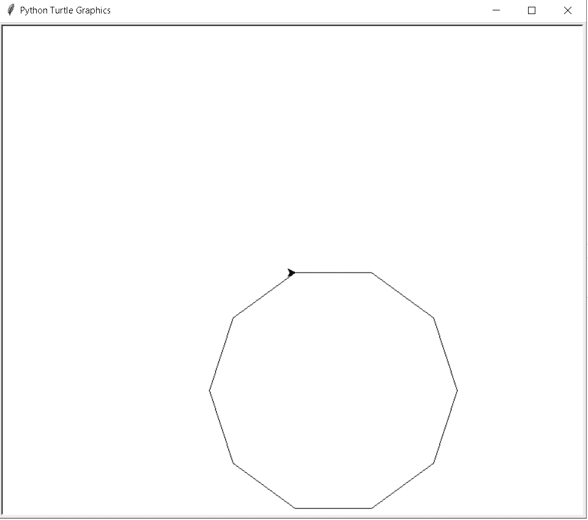
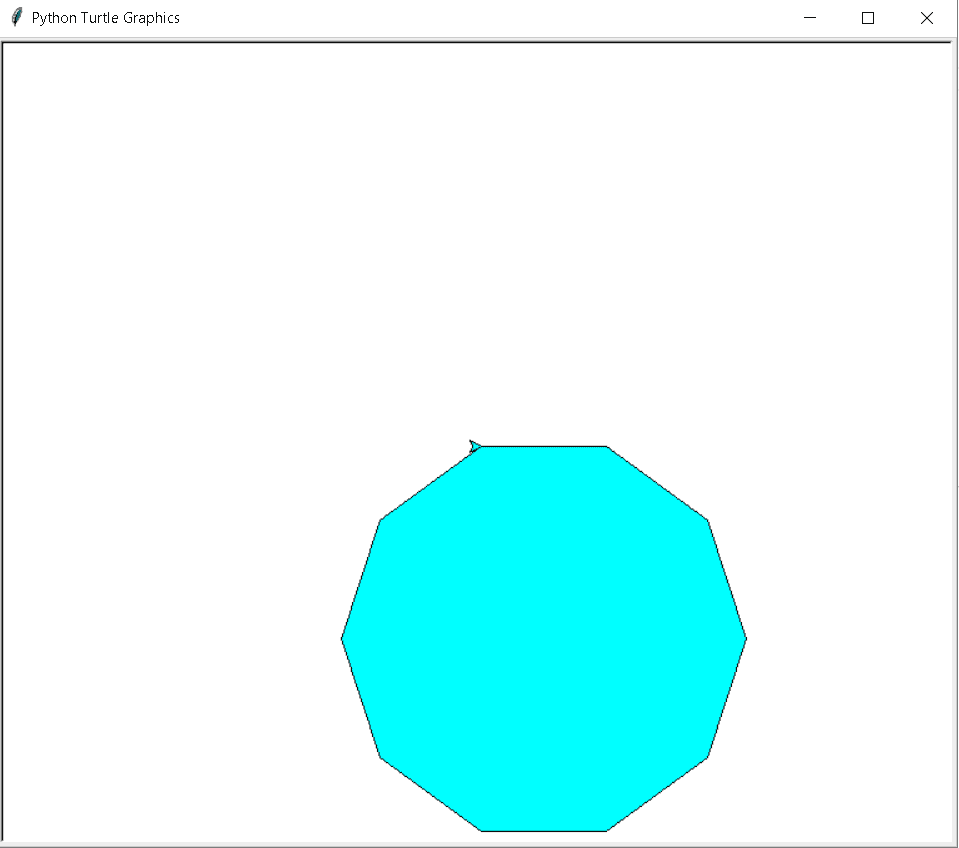

# 蟒蛇龟多边形

> 原文：<https://pythonguides.com/python-turtle-polygon/>

[](https://sharepointsky.teachable.com/p/python-and-machine-learning-training-course)

在这个 [Python 教程](https://pythonguides.com/python-hello-world-program/)中，我们将学习**如何在 Python Turtle** 中绘制多边形，我们还将涵盖与 `Turtle Polygon` 相关的不同示例。我们将讨论这些话题。

*   蟒蛇龟多边形
*   Python 海龟填充多边形

目录

[](#)

*   [蟒龟多边形](#Python_turtle_polygon "Python turtle polygon")
*   [蟒龟填充多边形](#Python_turtle_fill_polygon "Python turtle fill polygon")

## 蟒龟多边形

在这一节中，我们将学习**如何在 python turtle 中的乌龟的帮助下绘制多边形**。

在前进之前，我们应该有一些关于多边形的知识。多边形被定义为二维几何图形。它有有限数量的边相互连接，形成一个多边形。

我们称三角形为多边形，因为它是平面图形。同样，圆也有一个平面图形，但我们不叫它多边形，因为它是弯曲的，没有边。

**代码:**

在下面的代码中，我们将从乌龟导入* 、**导入**、**乌龟**中导入乌龟库**。使用 `turtle()` 方法来制作对象。**

*   `sides = 10` 这是多边形边数的输入。
*   `length = 100` 输入多边形的边长。
*   **turt.forward(长度)**用于向前移动乌龟。
*   **turt . right(360°/sides)**用于向右移动乌龟。

```py
 from turtle import * 
import turtle as turt

tur = turt.Turtle()

sides = 10

length = 100

for _ in range(sides):
    turt.forward(length)
    turt.right(360 / sides)
turt.done()
```

**输出:**

运行上面的代码后，我们得到了下面的输出，其中我们可以看到在一只乌龟的帮助下，屏幕上绘制了一个多边形。



Python turtle polygon

阅读[蟒龟随机](https://pythonguides.com/python-turtle-random/)

## 蟒龟填充多边形

在这一节，我们将学习**如何在蟒蛇龟的帮助下填充多边形**内部的颜色。

众所周知，多边形是一个平面图形，它至少有三条直边和有限条边。这些直线首尾相连，就形成了多边形。

两点连接的线段称为多边形的角或边。由此，我们可以说多边形具有二维形状，但并不是所有的二维形状都叫做多边形。

如上所述，多边形有二维形状。二维形状定义为有三个顶点和三条边。三角形是一个有三条边的多边形，它有三个顶点和三条边。

我们可以在乌龟的帮助下绘制不同类型的多边形，在绘制后，我们还可以在我们选择的多边形内填充颜色。

**代码:**

在下面的代码中，我们将从海龟导入* 、**导入海龟**中导入海龟库**。**

*   **tur =乌龟。**龟()是用来制造物体的方法。
*   **tur.fillcolor("青色")**用于填充形状内部的颜色，使我们的形状看起来美丽迷人。
*   `tur.begin_fill()` 用于开始填充形状内部的颜色。
*   `tur.forward(100)` 用于向前移动乌龟。
*   `tur.right(36)` 用于向右移动乌龟。
*   `tur.end_fill()` 用于结束填充颜色。

```py
from turtle import *
import turtle

tur = turtle.Turtle()
tur.fillcolor("cyan")
tur.begin_fill()
for _ in range(10):
  tur.forward(100)
  tur.right(36)
tur.end_fill() 
turtle.done()
```

**输出:**

运行上面的代码后，我们得到了下面的输出，从中我们可以看到一个多边形用漂亮的颜色绘制出来，看起来很吸引人，吸引了用户的眼球。



Python turtle fill polygon

相关 Python 海龟教程:

*   [蟒龟之窗](https://pythonguides.com/python-turtle-window/)
*   [巨蟒龟 3d 造型](https://pythonguides.com/python-turtle-3d-shapes/)
*   [巨蟒龟 Setworldcoordinates](https://pythonguides.com/python-turtle-setworldcoordinates/)
*   [蟒龟藏附例](https://pythonguides.com/python-turtle-hide/)
*   [蟒龟背景](https://pythonguides.com/python-turtle-background/)
*   [蟒龟小抄](https://pythonguides.com/python-turtle-cheat-sheet/)
*   [蟒蛇龟椭圆形](https://pythonguides.com/python-turtle-oval/)

因此，在本教程中，我们将讨论 `Python Turtle Polygon` ,我们还涵盖了与其实现相关的不同示例。这是我们已经讨论过的例子列表。

*   蟒蛇龟多边形
*   Python 海龟填充多边形

[Bijay Kumar](https://pythonguides.com/author/fewlines4biju/)

Python 是美国最流行的语言之一。我从事 Python 工作已经有很长时间了，我在与 Tkinter、Pandas、NumPy、Turtle、Django、Matplotlib、Tensorflow、Scipy、Scikit-Learn 等各种库合作方面拥有专业知识。我有与美国、加拿大、英国、澳大利亚、新西兰等国家的各种客户合作的经验。查看我的个人资料。

[enjoysharepoint.com/](https://enjoysharepoint.com/)[](https://www.facebook.com/fewlines4biju "Facebook")[](https://www.linkedin.com/in/fewlines4biju/ "Linkedin")[](https://twitter.com/fewlines4biju "Twitter")