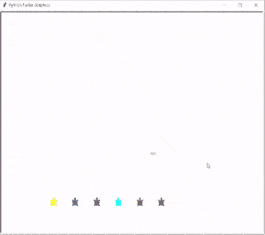
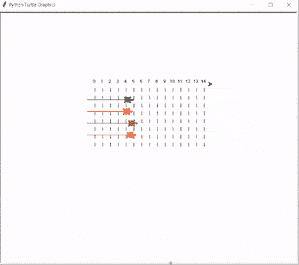
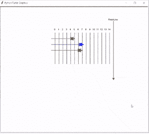

# 蟒蛇龟赛跑

> 原文：<https://pythonguides.com/python-turtle-race/>

[](https://sharepointsky.teachable.com/p/python-and-machine-learning-training-course)

在这个[蟒蛇龟教程](https://pythonguides.com/numpy/)中，我们将学习蟒蛇龟中的龟族，我们还将涵盖与**蟒蛇龟族**相关的不同例子。我们将讨论这些话题。

*   蟒蛇龟赛跑
*   蟒蛇饰品龟比赛
*   蟒蛇龟比赛终点线

目录

[](#)

*   [蟒龟赛跑](#Python_turtle_race "Python turtle race")
*   [蟒蛇饰品乌龟大赛](#Python_trinket_turtle_race "Python trinket turtle race")
*   [蟒蛇龟赛跑终点线](#Python_turtle_race_finish_line "Python turtle race finish line")

## 蟒龟赛跑

在这一节中，我们将了解 Python turtle 中的**海龟比赛。**

在 Python 海龟赛跑中，我们在海龟模块的帮助下介绍了循环的使用，其中循环通过使用许多步骤来帮助海龟(玩家)从稳定的位置移动。

**代码:**

在下面的代码中，我们将导入海龟模块，还将导入海龟比赛的数学模块。

*   **turtle.screensize(wn_length，wn_height)** 用于设置给定长度和高度的屏幕。
*   **random.randrange(1，20)** 用于生成随机数。
*   **self.tur.shape('龟')**用于给笔赋予龟形。
*   **self.tur.color(颜色)**用于给乌龟赋予颜色。
*   `self . tur . setpos(position)`用于设置海龟开始比赛的位置。

```py
from turtle import *
import math
import random
import turtle

wn_length = 500
wn_height = 500

turtles = 8

turtle.screensize(wn_length, wn_height)

class racer(object):
    def __init__(self, color, position):
        self.position = position
        self.color = color
        self.tur = turtle.Turtle()
        self.tur.shape('turtle')
        self.tur.color(color)
        self.tur.penup()
        self.tur.setpos(position)
        self.tur.setheading(90)

    def move1(self):
        rand = random.randrange(1, 20)
        self.position = (self.position[0], self.position[1] + rand)
        self.tur.pendown()
        self.tur.forward(rand)

    def reset1(self):
        self.tur.penup()
        self.tur.setposition(self.position)

def setupfile(name, colors):
    file1 = open(name, 'w')
    for color in colors:
        file1.write(color + ' 0 \n')
    file1.close()

def startGame1():
    t_List = []
    turtle.clearscreen()
    turtle.hideturtle()
    colors = ["yellow", "blue", "green", 'cyan', 'red', 'purple', 'pink', 'brown', 'black']
    start = -(wn_length/2) + 20
    for t in range(turtles):
        newpositionX = start + t*(wn_length)//turtles
        t_List.append(racer(colors[t],(newpositionX, -230)))
        t_List[t].tur.showturtle()

    run = True
    while run:
        for t in t_List:
            t.move1()

        maxcolor = []
        maxdis = 0
        for t in t_List:
            if t.position[1] > 230 and t.position[1] > maxdis:
                maxdis = t.position[1]
                maxcolor = []
                maxcolor.append(t.color)
            elif t.position[1] > 230 and t.position[1] == maxdis:
                maxDis = t.pos[1]
                maxcolor.append(t.color)

        if len(maxcolor) > 0:
            run = False
            print('The winner is: ')
            for win in maxcolor:
                print(win)

    oldscore1 = []
    file = open('scores.txt', 'r')
    for line in file:
        l = line.split()
        color = l[0]
        score = l[1]
        oldscore1.append([color, score])

    file.close()

    file = open('scores.txt', 'w')

    for entry in oldscore1:
        for winner in maxcolor:
            if entry[0] == winner:
                entry[1] = int(entry[1]) + 1

        file.write(str(entry[0]) + ' ' + str(entry[1]) + '\n')

    file.close()

start = input('Would you like to play this game')
startGame1()

while True:
    print('-----')
    start = input('Would you like to play again')
    startGame1()
```

**输出:**

运行上面的代码后，我们得到了下面的输出，我们可以看到海龟们在起点，比赛开始了。比赛开始后，他们从初始位置移动到目标位置以赢得比赛。



Python turtle race Output

*   [蟒龟广场](https://pythonguides.com/python-turtle-square/)

## 蟒蛇饰品乌龟大赛

在这一节中，我们将了解 Python turtle 中的**小饰品龟比赛**。

饰品龟比赛中，乌龟被放在起跑线上，乌龟扮演玩家的角色。当游戏开始时，他们移动起点，跑到终点，赢得游戏。

在这个游戏中，环被用来画出轨迹，并通过一系列步骤将海龟从稳定的位置移开。

**代码:**

在下面的代码中，我们将从 turtle import * 、 `import turtle` 中导入 turtle 模块**，还将导入用于生成随机值的 **randint 模块**。**

*   **速度(0)** 用来给乌龟速度， `0` 是最快的速度。
*   **前进(10)** 功能用于向前移动乌龟。
*   **【160】**功能是用来向后方向移动乌龟。
*   **tur1.color('green')** 用来给乌龟绿色。
*   **tur1.forward(randint(1，5))** 用于向前移动随机步数。

```py
from turtle import *
import turtle
from random import randint

speed(0)
penup()
goto(-140, 140)

for step in range(15):
  write(step, align='center')
  right(90)
  for num in range(8):
    penup()
    forward(10)
    pendown()
    forward(10)
  penup()
  backward(160)
  left(90)
  forward(20)

tur1 = Turtle()
tur1.color('green')
tur1.shape('turtle')

tur1.penup()
tur1.goto(-160, 100)
tur1.pendown()

for turn in range(10):
  tur1.right(36)

tur2 = Turtle()
tur2.color('red')
tur2.shape('turtle')

tur2.penup()
tur2.goto(-160, 70)
tur2.pendown()

for turn in range(72):
  tur2.left(5)

tur3 = Turtle()
tur3.shape('turtle')
tur3.color('brown')

tur3.penup()
tur3.goto(-160, 40)
tur3.pendown()

for turn in range(60):
  tur3.right(6)

tur4 = Turtle()
tur4.shape('turtle')
tur4.color('orange')

tur4.penup()
tur4.goto(-160, 10)
tur4.pendown()

for turn in range(30):
  tur4.left(12)

for turn in range(100):
  tur1.forward(randint(1,5))
  tur2.forward(randint(1,5))
  tur3.forward(randint(1,5))
  tur4.forward(randint(1,5)) 
```

**输出:**

运行上面的代码后，我们得到下面的输出，我们可以看到比赛是由海龟们完成的，我们可以看到循环的使用，它是如何一步一步地工作，从它的位置移动，并试图到达最后一行。



Python trinket turtle race Output

*   [蟒龟艺术](https://pythonguides.com/python-turtle-art/)

## 蟒蛇龟赛跑终点线

在这一节中，我们将了解 Python turtle 中的**乌龟比赛终点线**。

在接下来的蟒蛇龟比赛中，乌龟作为一个玩家被放在起点，为了赢得比赛，他们到达终点。

谁跑得快，谁第一个到达终点，谁就赢了，比赛结束。回环帮助海龟从起始位置移动到终点。

**代码:**

在下面的代码中，我们将从 turtle import * 、 `import turtle` 中导入 turtle 库**，还将导入 **randint 函数**用于生成随机数。**

```py
from turtle import *
import turtle
from random import randint

speed(0)
penup()
goto(-100,200)
for step in range(15):
    write(step, align='center')
    right(90)
    forward(10)
    pendown()
    forward(160)
    penup()
    backward(170)
    left(90)
    forward(20)

goto(200,250)
write("FinishLine", align='center')
pendown()
right(90)
forward(300)

tur = Turtle()
tur.color('red')
tur.shape('turtle')
tur.penup()
tur.goto(-120,160)
tur.pendown()

tur1 = Turtle()
tur1.color('blue')
tur1.shape('turtle')
tur1.penup()
tur1.goto(-120,130)
tur1.pendown()

tur2 = Turtle()
tur2.color('green')
tur2.shape('turtle')
tur2.penup()
tur2.goto(-120,100)
tur2.pendown()

for turn in range(100):
    speed(0)
    tur.forward(randint(1,5))
    tur1.forward(randint(1,5))
    tur2.forward(randint(1, 5))
```

**输出:**

运行上面的代码后，我们得到了下面的输出，我们可以看到比赛开始了，海龟在移动，想要到达他们的目标，也就是赢得比赛的终点线。



Python turtle race finish line Output

您可能会喜欢以下 Python turtle 教程:

*   [蟒龟示踪器](https://pythonguides.com/python-turtle-tracer/)
*   [蟒龟圆点](https://pythonguides.com/python-turtle-dot/)
*   [蟒龟钟](https://pythonguides.com/python-turtle-clock/)
*   [蟒蛇龟图形](https://pythonguides.com/python-turtle-graphics/)
*   [蟒龟获得位置](https://pythonguides.com/python-turtle-get-position/)
*   [蟒龟三角](https://pythonguides.com/python-turtle-triangle/)
*   [Replit 蟒蛇龟](https://pythonguides.com/replit-python-turtle/)
*   [巨蟒龟大小](https://pythonguides.com/python-turtle-size/)
*   [蟒龟字体](https://pythonguides.com/python-turtle-font/)

因此，在本教程中，我们讨论了 `Python turtle race` ,我们还讨论了与其实现相关的不同示例。这是我们已经讨论过的例子列表。

*   蟒蛇龟赛跑
*   蟒蛇饰品龟比赛
*   蟒蛇龟比赛终点线

[Bijay Kumar](https://pythonguides.com/author/fewlines4biju/)

Python 是美国最流行的语言之一。我从事 Python 工作已经有很长时间了，我在与 Tkinter、Pandas、NumPy、Turtle、Django、Matplotlib、Tensorflow、Scipy、Scikit-Learn 等各种库合作方面拥有专业知识。我有与美国、加拿大、英国、澳大利亚、新西兰等国家的各种客户合作的经验。查看我的个人资料。

[enjoysharepoint.com/](https://enjoysharepoint.com/)[](https://www.facebook.com/fewlines4biju "Facebook")[](https://www.linkedin.com/in/fewlines4biju/ "Linkedin")[](https://twitter.com/fewlines4biju "Twitter")