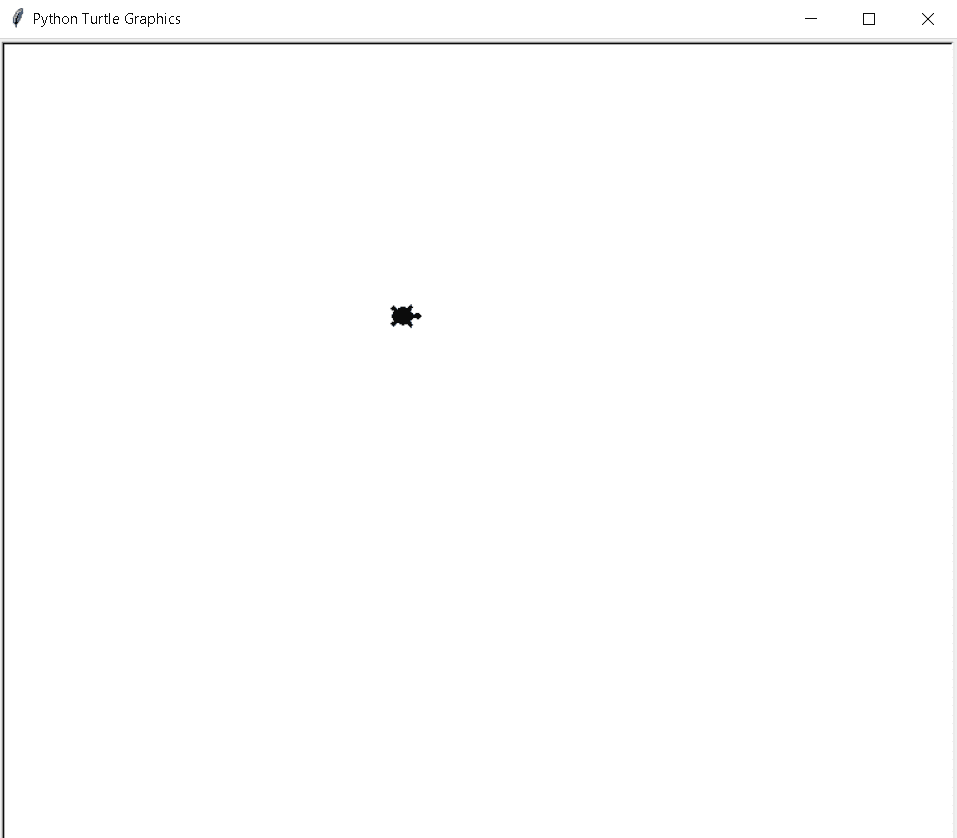
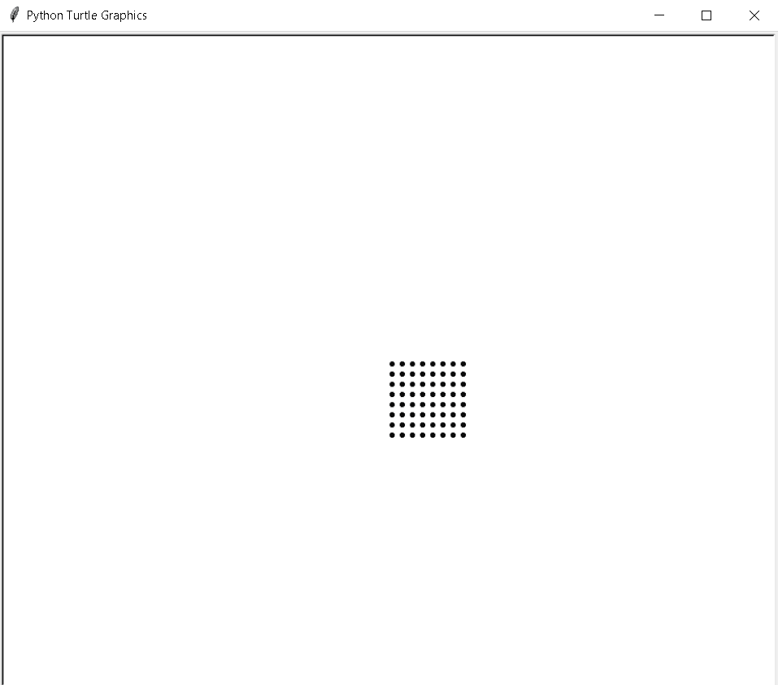
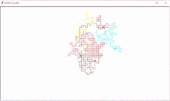
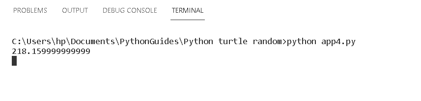
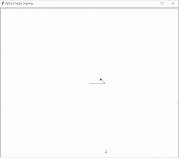
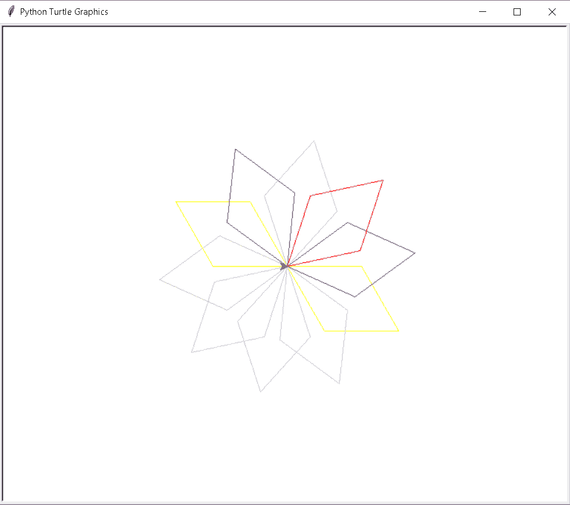
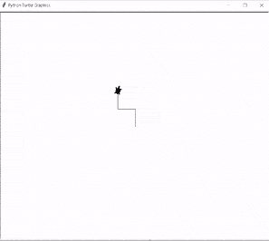
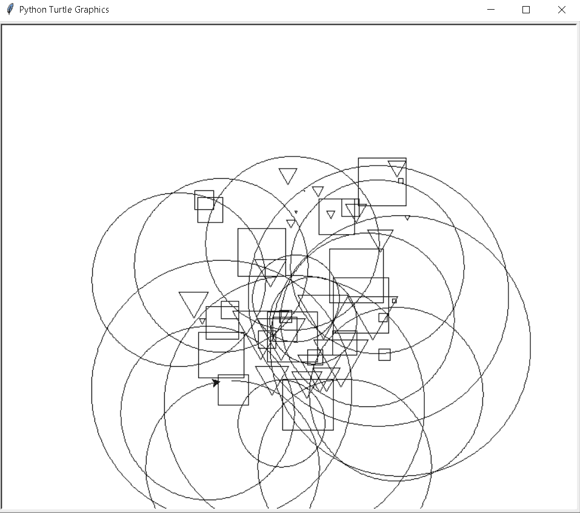
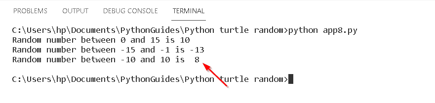
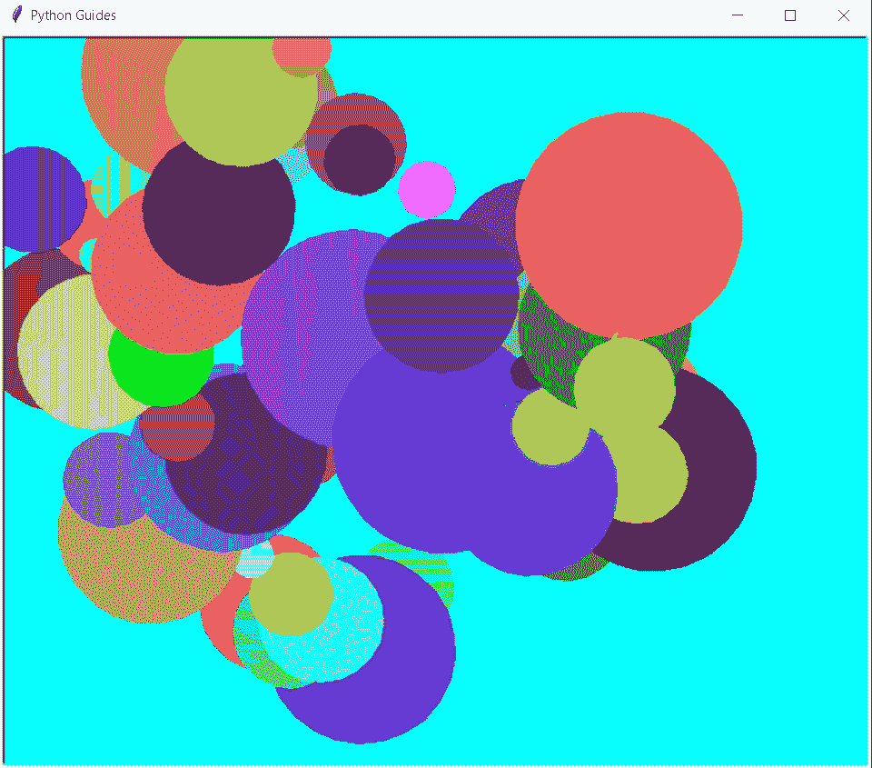

# 巨蟒龟随机+例子

> 原文：<https://pythonguides.com/python-turtle-random/>

[](https://sharepointsky.teachable.com/p/python-and-machine-learning-training-course)

在这个[巨蟒龟教程](https://pythonguides.com/turtle-programming-in-python/)中，我们将学习**如何在**巨蟒龟**中创建随机函数**，我们还将涵盖与龟随机相关的不同例子。我们将讨论这些话题。

*   巨蟒龟随机
*   蟒蛇龟随机圆点
*   蟒蛇龟颜色随机
*   巨蟒龟随机漫步
*   蟒蛇龟随机移动
*   蟒蛇乌龟笔颜色随机
*   巨蟒龟随机方向
*   蟒蛇龟随机形状
*   巨蟒龟随机数
*   巨蟒龟随机 randint

目录

[](#)

*   [蟒龟随机](#Python_turtle_random "Python turtle random")
*   [蟒龟随机圆点](#Python_turtle_random_dots "Python turtle random dots")
*   [蟒蛇龟随机颜色](#Python_turtle_random_colors "Python turtle random colors")
*   [蟒龟随机漫步](#Python_turtle_random_walk "Python turtle random walk")
*   [蟒龟随机运动](#Python_turtle_random_movement "Python turtle random movement")
*   [蟒蛇龟随机笔颜色](#Python_turtle_random_pen_color "Python turtle random pen color")
*   [蟒龟随机方向](#Python_turtle_random_direction "Python turtle random direction")
*   [巨蟒龟随机造型](#Python_turtle_random_shapes "Python turtle random shapes")
*   [蟒龟随机数](#Python_turtle_random_number "Python turtle random number")
*   [蟒龟随机 randint](#Python_turtle_random_randint "Python turtle random randint")

## 蟒龟随机

在这一节中，我们将学习如何在 python turtle 中创建一个随机函数。

在继续之前，我们应该了解一下**随机函数**。

**随机**被定义为一个没有任何方法发生的行为，或者我们可以说它对我们来说是陌生的或不确定的。乌龟随机函数是随机选择放置乌龟的位置、方向并开始做出形状的函数。

**代码:**

在下面的代码中，我们将从 turtle import * 、 `import` 、 `turtle` 中导入 turtle 库**，还将从 random import randint** 中导入随机函数**来生成随机对象。**

*   使用 `turtle()` 方法制作对象。
*   **tur.shape('turtle')** 用于给笔赋予乌龟形状。
*   `tur.penup()` 用于停止绘图。
*   **tur.goto(randint(-150，0)，randint(0，150))** 用于生成屏幕上随机出现的东西。

```py
from turtle import *
import turtle
from random import randint

tur = turtle.Turtle()

tur.shape('turtle')
tur.penup()
tur.goto(randint(-150,0),randint(0,150))

turtle.done()
```

O **输出:T1**

运行上面的代码后，我们得到下面的输出，我们可以看到乌龟被放在随机生成的位置上。



Python turtle random

阅读:[蟒龟画字母](https://pythonguides.com/python-turtle-draw-letters/)

## 蟒龟随机圆点

在这一节中，我们将学习如何在 python turtle 中创建随机点。

正如我们所知，随机意味着我们不熟悉或随机产生的东西。这里我们也可以使用生成随机数的函数 `randint()` ，在这些随机数的帮助下，生成随机点。这些随机的点是在一只乌龟的帮助下画出来的。

**代码:**

在下面的代码中，我们将从乌龟导入* 、**导入**、**乌龟**中导入乌龟库**。使用 `turtle()` 方法来制作对象。**

*   `tur.dot()` 用于生成圆点。
*   `tur.forward(spce)` 用于向前移动乌龟。
*   `tur.backward(spce*a)` 用于向后移动乌龟。
*   `tur.right(90)` 用于向右移动乌龟。
*   `tur.left(90)` 用于向左移动乌龟。
*   `tur.penup()` 用于绘图的顶部。
*   `tur . hideturt()`用于将乌龟隐藏在屏幕之外。

```py
from turtle import *
import turtle 

tur = turtle.Turtle()

def draw(spce,a):
  for i in range(a):
    for j in range(a):

        tur.dot()

        tur.forward(spce)
    tur.backward(spce*a)

    tur.right(90)
    tur.forward(spce)
    tur.left(90)

tur.penup()
draw(10,8) 

tur.hideturtle()
turtle.done()
```

**输出:**

运行上面的代码后，我们得到下面的输出，我们可以看到屏幕上生成了随机的点。



Python turtle random dots

阅读: [Python 龟输入示例](https://pythonguides.com/python-turtle-input/)

## 蟒蛇龟随机颜色

在这一节，我们将学习如何在 python turtle 中创建随机颜色。

我们知道随机函数是用来产生随机数的，这些随机数帮助海龟产生随机的颜色。乌龟随机选择颜色，这个随机选择的颜色显示在屏幕上。

**代码:**

在下面的代码中，我们将从 turtle import * 、 `import turtle` 中导入 turtle 库**，还将从 random import randint** 中导入 random 模块**用于生成随机数。使用 `turtle()` 方法来制作对象。**

*   `tur.speed(0)` 用来给乌龟速度。
*   `tur.pensize(10)` 用来给乌龟一个大小。
*   `tur.colormode(255)` 用于显示每种颜色类型。
*   **tur.color(randint(0，255)** 用于生成随机颜色。
*   `begin_fill()` 用于填充形状内部的颜色。
*   `tur.circle(20)` 用于在乌龟的帮助下生成圆。
*   `end_fill()` 用于结束填充颜色。
*   **tur.goto(randint(-500，500)，randint(-300，270))** 用于表示生成颜色的准确位置。

```py
from turtle import *

import turtle as tur
from random import randint

tur.speed(0)

tur.pensize(10)

tur.colormode(255)

while True:

    tur.color(randint(0, 255),
          randint(0, 255),
          randint(0, 255))

    begin_fill()

    tur.circle(20)

    end_fill()

    tur.penup()

    tur.goto(randint(-500, 500), randint(-300, 270))

    tur.pendown()
```

**输出:**

运行上面的代码后，我们得到下面的输出，我们可以看到屏幕上生成了随机颜色。


Python turtle random colors

阅读:[蟒龟网格](https://pythonguides.com/python-turtle-grid/)

## 蟒龟随机漫步

在这一节中，我们将学习 python turtle 中屏幕上的**乌龟如何随机行走**。

正如我们所知，乌龟被用来在屏幕上画不同的形状和图片。我们也知道随机函数被用来产生一个随机数，帮助海龟在屏幕上随机行走。

**代码:**

在下面的代码中，我们将从乌龟导入* 、**导入乌龟**、**作为 tur** 导入乌龟库**，还将随机模块**导入随机**。turtle()方法来制作对象。**

*   `tur . title(" Python Guides ")`用于给屏幕加标题。
*   **a1.color('青色')**用来给乌龟上色。
*   `tur.speed(0)` 用来给乌龟速度。

```py
from turtle import *
import turtle as tur
import random
import math

tur.setup(900,500)
tur.title("Python Guides")
a1 = tur.Turtle()
b1 = tur.Turtle()
c1 = tur.Turtle()
d1 = tur.Turtle()
e1 = tur.Turtle()

a1.color('cyan')
b1.color('red')
c1.color('purple')
d1.color('yellow')
e1.color('red')

turtlist = []
turtlist.append(a1)
turtlist.append(b1)
turtlist.append(c1)
turtlist.append(d1)
turtlist.append(e1)

tur.speed(0)
tur.tracer(0)
tur.hideturtle()
sum = 0
count = 0
for j in range(100):  
    for i in range(10000):
        for turt in turtlist:
            turt.seth(random.randrange(0,360,90))
            turt.fd(10)
        tur.update()
    for turt in turtlist:
        sum += math.sqrt(turt.xcor()*turt.xcor() + turt.ycor()*turt.ycor())/10*2*math.sqrt(turt.xcor()*turt.xcor() + turt.ycor()*turt.ycor())/10*2/100
        count += 1
    for turt in turtlist:
        turt.clear()
        turt.up()
        turt.goto(0,0)
        turt.down()
    print(sum/count) 
```

**输出:**

运行上面的代码后，我们得到了下面的输出，我们可以看到使用了多个海龟，每个海龟朝不同的方向行走，并画出了模式。



Python turtle random walk

在下面的输出中，我们可以看到乌龟行走后走了多远。



Python turtle random walk output

阅读:[蟒龟笔+例题](https://pythonguides.com/python-turtle-pen/)

## 蟒龟随机运动

在本节中，我们将学习 python turtle 中的**turtle 如何随机移动**。

正如我们所知，乌龟被用来在屏幕上画形状和图片。这里我们可以看到海龟的随机运动。在随机函数的帮助下，乌龟在屏幕上随机移动。随机函数产生随机数，借助这些随机数龟随机移动。

**代码:**

在下面的代码中，我们将从 turtle import *导入 turtle 库，将 turtle 作为 tur 导入。使用 `turtle()` 方法制作对象。

*   **tur.right(random.randint(0，360))** 用于生成帮助海龟移动的随机数。
*   `tur.right(180)` 用于向右移动乌龟。
*   `tur.forward(300)` 用于向前移动乌龟。

```py
from turtle import *
import turtle as tur
import random

count = 0
while count <51:
    count += 1
    if (tur.xcor() >-300 and tur.xcor() <300) and\
       (tur.ycor() >-300 and tur.ycor() <300):
        tur.forward(random.randint(30,100))
        tur.right(random.randint(0,360))
    else:
        tur.right(180)
        tur.forward(300)
```

**输出:**

运行上面的代码后，我们得到了下面的输出，我们可以让乌龟在屏幕上随机移动。



Python turtle random movement

阅读:[蟒龟星——如何画](https://pythonguides.com/python-turtle-star/)

## 蟒蛇龟随机笔颜色

在本节中，我们将了解**如何在 python turtle 中生成` `随机钢笔颜色**。

正如我们所知， `randint()` 函数用于生成随机数，这些随机数帮助笔随机选择笔的颜色，并在屏幕上绘制形状和图片。

**代码:**

在下面的代码中，我们将从海龟导入* 、**导入海龟**中导入海龟库**。**龟()**法是用来做物件的。**

*   `tur.color("yellow")` 用来给笔上色。
*   `tur.forward(100)` 用于向前移动乌龟。
*   `tur.right(60)` 用于向右移动乌龟。
*   `tur . color(random . choice(colors))`用于为笔随机选择颜色。

```py
from turtle import *
import turtle
import random
tur=turtle.Turtle()
colors=["yellow","pink","red","purple","light blue"]
tur.color("yellow")
for i in range(10):
    for i in range(2):
        tur.forward(100)
        tur.right(60)
        tur.forward(100)
        tur.right(120)
    tur.right(36)
    tur.color(random.choice(colors))
turtle.done() 
```

**输出:**

运行上面的代码后，我们得到下面的输出，我们可以看到随机的钢笔颜色是在这些钢笔颜色的帮助下生成的，我们可以在屏幕上绘制形状。



Python turtle random pen color

阅读:[蟒龟小抄](https://pythonguides.com/python-turtle-cheat-sheet/)

## 蟒龟随机方向

在这一节中，我们将学习如何在 python turtle 中获得龟随机方向。

众所周知，随机函数是用来产生随机数的，这些随机数帮助海龟辨别方向。乌龟向任意方向随机移动，画出形状。

**代码:**

在下面的代码中，我们从 turtle import * 、 **import turtle、**以及 `import random` 模块中导入 turtle 库**，用于生成随机数。**龟()**方法用于制作对象。**

*   **tur.shape('龟')**用于给笔赋予龟形。
*   `tur.left(90)` 用于向左移动乌龟。
*   `tur.right(90)` 用于向右移动乌龟。
*   `tur.forward(50)` 用于向前移动乌龟。

```py
from turtle import *
import random
import turtle

def screen(ws, tur):
    if random.random() > 0.1:
        return True
    else:
        return False

tur = turtle.Turtle()
ws = turtle.Screen()

tur.shape('turtle')
while screen(ws, tur):
    coin = random.randrange(0, 2)
    if coin == 0:              
        tur.left(90)
    else:                      
        tur.right(90)

    tur.forward(50)

ws.exitonclick()
```

**输出:**

运行上面的代码后，我们得到下面的输出，从中我们可以看到乌龟随机地向任何方向移动。



Python turtle random direction

阅读:[蟒蛇龟椭圆形](https://pythonguides.com/python-turtle-oval/)

## 巨蟒龟随机造型

在这一节中，我们将学习如何在 python turtle 中绘制随机形状。

在前进之前，我们应该有一些关于形状的知识。形状是物体的形式。有不同的形状，如正方形、长方形和椭圆形。这些形状是在随机函数的帮助下随机生成的。

**代码:**

在下面的代码中，我们将从 turtle import * 、 **import turtle、**以及 `import random` 模块中导入 turtle 库**来生成随机数。使用 `turtle()` 方法来制作对象。**

*   **random.randrange(-150，150)** 用于生成带有开始和结束位置的随机形状。
*   **drawSquare(冷)**用于绘制正方形的形状。
*   **drawTriangle(冷)**用来绘制三角形的形状。
*   **drawCircle(冷)**用来画圆的形状。
*   **龟.前进(冷)**用于向前移动龟。
*   `turtle.right(ang)` 用于向右移动 turtle。
*   `turtle.penup()` 用于停止绘图。
*   **turtle.goto(a，b)** 用于将乌龟移动到其绝对位置。
*   `turtle.pendown()` 用于开始绘图。

```py
from turtle import *
import turtle
import random

def drawRandom():
    a = random.randrange(-150, 150)
    b = random.randrange(-150, 150)
    leng = random.randrange(75)
    shape = random.randrange(1,4)

    moveturtle(a,b)

    if shape == 1:
        drawSquare(leng)
    elif shape == 2:
        drawTriangle(leng)
    elif shape == 3:
        leng = leng % 4
        drawCircle(leng)

import turtle

def drawshape(side, leng):
    ang = 360.0 / side
    for side in range(side):
        turtle.forward(leng)
        turtle.right(ang)

def moveturtle(a, b):
    turtle.penup()
    turtle.goto(a, b)
    turtle.pendown()

def drawSquare(leng):
    drawshape(4, leng)

def drawTriangle(leng):
    drawshape(3, leng)

def drawCircle(leng):
    drawshape(360, leng)

for shape in range(100):
    drawRandom()
turtle.done()
```

**输出:**

运行上面的代码后，我们得到下面的输出，从中我们可以看到屏幕上生成了随机的形状。



Python turtle random shapes

阅读:[蟒龟背景](https://pythonguides.com/python-turtle-background/)

## 蟒龟随机数

在这一节中，我们将学习 python turtle 中的随机数是如何产生的。

随机数是在随机函数的帮助下随机生成的。随机函数随机选择数字并显示在屏幕上。

**代码:**

在下面的代码中，我们将学习从 turtle import *、、**导入 turtle** 、**导入 turtle 库**，并且**还导入了用于生成随机数的随机模块。**

*   **random.randint(0，15)** 用于生成给定正范围之间的随机数。
*   **print(" 0 到 15 之间的随机数是% s" % (a1))** 用于打印生成后的随机数。

```py
from turtle import *
import turtle

import random

a1 = random.randint(0, 15)
print("Random number between 0 and 15 is % s" % (a1))

a2 = random.randint(-15, -1)
print("Random number between -15 and -1 is % d" % (a2))

a3 = random.randint(-10, 10)
print("Random number between -10 and 10 is % d" % (a3))
```

输出:

运行上面的代码后，我们得到下面的输出，我们可以看到随机数是在随机函数的帮助下生成的。



python turtle random numbers

阅读:[蟒龟隐藏](https://pythonguides.com/python-turtle-hide/)

## 蟒龟随机 randint

在这一节，我们将学习**如何在 python turtle 中使用 turtle random randint 函数**。

randint()函数返回特定范围内的整数值。这是随机模块的内置函数。这个随机函数用于生成随机数。

**代码:**

在下面的代码中，我们将从 turtle import *导入 turtle 库，导入 turtle，同时还导入一个用于生成随机数的 `random` 模块。**龟()**法是用来做物件的。

*   **ws.bgcolor("青色")**是用于屏幕的背景色。
*   `tur.begin_fill()` 用于填充形状中的颜色。
*   `tur.circle(a)` 用来画圆的形状。
*   `tur.end_fill()` 用于结束填充颜色。
*   `tur.up()` 用来拿起笔。
*   `tur.forward(c)` 用于向前移动乌龟。
*   `tur.down()` 用于开始绘图。

```py
from turtle import *
import random
import time
import turtle
tur = turtle.Pen()

ws = turtle.Screen()
ws.bgcolor("cyan")
ws.title("Python Guides")

def drawcircle(yellow, blue, red):
	tur.color(yellow, blue, red)
	tur.begin_fill()
	a = random.randint(10,100)
	tur.circle(a) 
	tur.end_fill()
	tur.up() 
	b = random.randint(0,360)
	tur.seth(b)
	# t.acor() is turtle's x; t.ycor() is turtle's y
	if tur.xcor() < -300 or tur.xcor() > 300:
		tur.goto(0, 0)  
	elif tur.ycor() < -300 or tur.ycor() > 300:
		tur.goto(0, 0) 
	c = random.randint(0,100)
	tur.forward(c) 
	tur.down() 

for x in range(0, 100):
	i = random.randint(0,100)/100.0
	j = random.randint(0,100)/100.0
	k = random.randint(0,100)/100.0
	drawcircle(i, j, k)

time.sleep(10)
```

**输出:**

运行上面的代码后，我们得到下面的输出，我们可以看到屏幕上生成了随机的圆圈。



Python turtle random randint

你可能也喜欢阅读以下关于 Python Turtle 的教程。

*   [蟒龟画线](https://pythonguides.com/python-turtle-draw-line/)
*   [蟒龟嵌套循环](https://pythonguides.com/python-turtle-nested-loop/)
*   [蟒龟获得位置](https://pythonguides.com/python-turtle-get-position/)
*   [蟒清龟](https://pythonguides.com/python-clear-turtle/)
*   [蟒龟钟](https://pythonguides.com/python-turtle-clock/)

因此，在本教程中，我们讨论了 `Python Turtle Random` ，并且我们还涵盖了与其实现相关的不同示例。这是我们已经讨论过的例子列表。

*   巨蟒龟随机
*   蟒蛇龟随机圆点
*   蟒蛇龟颜色随机
*   巨蟒龟随机漫步
*   蟒蛇龟随机移动
*   蟒蛇乌龟笔颜色随机
*   巨蟒龟随机方向
*   蟒蛇龟随机形状
*   巨蟒龟随机数
*   巨蟒龟随机 randint

[Bijay Kumar](https://pythonguides.com/author/fewlines4biju/)

Python 是美国最流行的语言之一。我从事 Python 工作已经有很长时间了，我在与 Tkinter、Pandas、NumPy、Turtle、Django、Matplotlib、Tensorflow、Scipy、Scikit-Learn 等各种库合作方面拥有专业知识。我有与美国、加拿大、英国、澳大利亚、新西兰等国家的各种客户合作的经验。查看我的个人资料。

[enjoysharepoint.com/](https://enjoysharepoint.com/)[](https://www.facebook.com/fewlines4biju "Facebook")[](https://www.linkedin.com/in/fewlines4biju/ "Linkedin")[](https://twitter.com/fewlines4biju "Twitter")