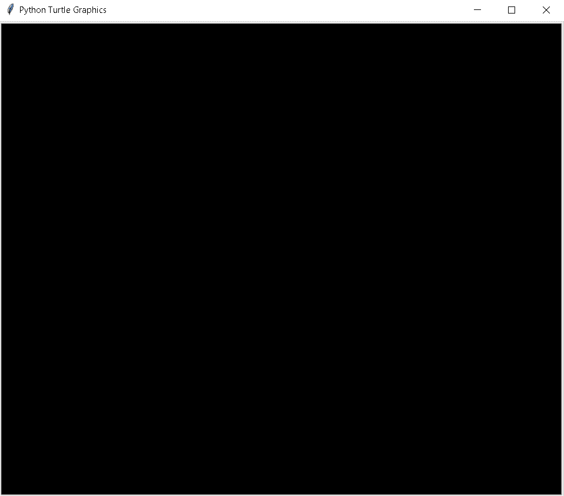
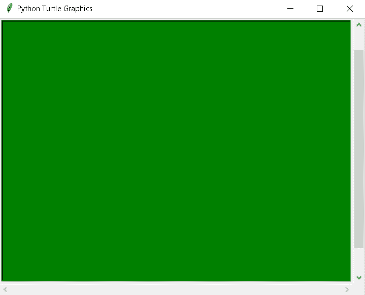
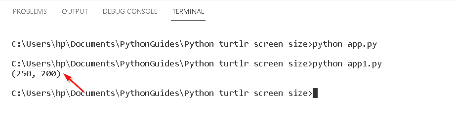
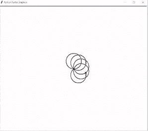
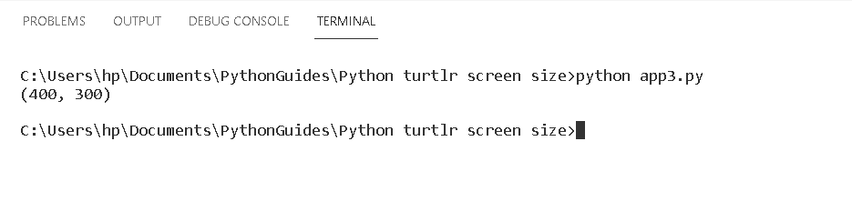

# 蟒蛇龟屏幕尺寸

> 原文：<https://pythonguides.com/python-turtle-screen-size/>

[](https://sharepointsky.teachable.com/p/python-and-machine-learning-training-course)

在本 Python 教程中，我们将学习**如何控制 [Python 龟](https://pythonguides.com/turtle-programming-in-python/) 中的屏幕尺寸**，我们还将涵盖与**龟屏幕尺寸**相关的不同示例。我们将讨论这些话题。

*   蟒蛇龟屏幕尺寸
*   Python turtle 窗口大小
*   Python 海龟屏幕尺寸
*   巨蟒龟获取屏幕大小
*   Python turtle 默认屏幕尺寸

目录

[](#)

*   [巨蟒龟屏幕尺寸](#Python_turtle_screen_size "Python turtle screen size")
*   [蟒龟窗口大小](#Python_turtle_window_size "Python turtle window size")
*   [蟒蛇龟屏尺寸](#Python_turtle_screen_dimension "Python turtle screen dimension")
*   [巨蟒龟获取屏幕尺寸](#Python_turtle_get_screen_size "Python turtle get screen size")
*   [巨蟒龟默认屏幕尺寸](#Python_turtle_default_screen_size "Python turtle default screen size")

## 巨蟒龟屏幕尺寸

在这一节，我们将学习如何在 Python turtle 中控制屏幕尺寸。

屏幕大小类似于窗口大小，我们可以运行应用程序，甚至可以根据窗口要求定制屏幕。我们使用 `screensize()` 函数给出宽度和高度。

**代码:**

在下面的代码中，我们将从 turtle import * 、 `import turtle` 中导入 turtle 模块**。**

而**turtle . screensize(canv width = 500，canvheight=300，bg="black")** 用于设置屏幕大小。

```py
from turtle import *

import turtle

turtle.screensize(canvwidth=500, canvheight=300,
                  bg="black")
turtle.done()
```

**输出:**

在下面的输出中，我们可以看到下面的空白控制台，其中应用程序的标题被命名为 Python Turtle Graphics。



Python turtle screen size Output

阅读: [Python 龟写函数](https://pythonguides.com/python-turtle-write-function/)

## 蟒龟窗口大小

在本节中，我们将学习如何在 python turtle 中控制窗口大小。

窗口大小用于给出窗口的宽度和高度。其中，我们使用了 `screensize()` 函数，该函数有助于为用户可见的窗口控制台提供窗口大小和颜色。甚至我们可以根据用户的要求给出改变窗口背景主题的选项。

**代码:**

在下面的代码中，我们将从 turtle import * 、 `import turtle` 中导入 turtle 模块**。**

**turtle . screensize(canv width = 500，canvheight=500，bg="green")** 用于设置窗口大小。

```py
from turtle import *

import turtle

turtle.screensize(canvwidth=500, canvheight=500,
                  bg="green")
turtle.done()
```

**输出:**

运行上面的代码后，我们得到下面的输出，在其中我们可以看到窗口。我们可以相应地调整窗口大小，设置它们的高度和宽度。



Python turtle window size

阅读:[蟒龟圈](https://pythonguides.com/python-turtle-circle/)

## 蟒蛇龟屏尺寸

在本节中，我们将了解 Python turtle 中的**屏幕尺寸**。

屏幕尺寸用于给出屏幕大小，我们在这里指定屏幕的宽度和高度。并使用 `screensize()` 函数分配给它的维度。

**代码:**

下面，我们将从海龟导入* 、**导入海龟**中导入海龟模块**。**

*   **turtle.screensize(250，200)** 用于设置屏幕尺寸。
*   `print(turtle . screensize())`用于在命令行上打印尺寸。

```py
from turtle import *

import turtle

turtle.screensize(250,200)
print(turtle.screensize())
```

**输出:**

运行上面的代码后，我们得到下面的输出，其中我们可以看到屏幕尺寸打印在命令提示符上。



Python turtle screen size dimension Output

另外，查看: [Python 龟速示例](https://pythonguides.com/python-turtle-speed/)

## 巨蟒龟获取屏幕尺寸

在这一节中，我们将学习如何在 Python turtle 中获得屏幕尺寸。

Screensize 用于给出屏幕的高度和宽度。我们从 `screensize()` 函数中得到屏幕尺寸，我们也可以通过改变屏幕的高度和宽度来调整屏幕尺寸。

**代码:**

在下面的代码中，我们将从 turtle import * 、 `import turtle as tur` 中导入 turtle 模块**，这样我们只需给出屏幕的高度和宽度就可以得到屏幕的大小。**

*   `tur.width(2)` 用于设置乌龟的宽度。
*   `tur.speed(10)` 用于设定龟速， `10` 为正常速度。
*   **tur . screensize(canv width = 400，canvheight=300，bg="cyan")** 用于通过简单地设置屏幕尺寸来获得屏幕，并给屏幕赋予背景颜色。

```py
from turtle import *

import turtle as tur

tur.width(2)
tur.speed(10)

for i in range(10):
    tur.circle(40)
    tur.right(36)

tur.screensize(canvwidth=400, canvheight=300,
                  bg="cyan")
tur.done()
```

**输出:**

运行上面的代码后，我们得到了下面的输出，在这个输出中，我们可以看到在 turtle 的帮助下绘制了形状，颜色也显示在背景中。



Python turtle get the screen size Output

阅读:[蟒龟颜色](https://pythonguides.com/python-turtle-colors/)

## 巨蟒龟默认屏幕尺寸

在本节中，我们将了解 Python turtle 中的 **turtle 默认大小**。

在继续之前，我们应该了解一些关于违约的知识。当没有给出其他命令来描述屏幕尺寸时，使用默认值。

`turtle.screensize()` 函数将给出默认尺寸，显示在命令提示符上。在 `screensize()` 函数中，没有给出设置屏幕的高度和宽度，因此屏幕以默认尺寸显示。

**代码:**

在下面的代码中，我们将从海龟导入* 、**导入海龟**中导入海龟库**。**

`print(turtle . screensize())`用于获取屏幕的默认大小。

```py
from turtle import *
import turtle

print(turtle.screensize())
```

**输出:**

运行上面的代码后，我们得到下面的输出，其中我们可以看到默认大小显示在命令提示符上。



Python turtle default screen size Output

另外，看看更多关于 Python turtle 的教程。

*   [蟒蛇龟广场——实用指南](https://pythonguides.com/python-turtle-square/)
*   [蟒蛇龟艺术——如何绘制](https://pythonguides.com/python-turtle-art/)
*   [蟒蛇龟图形](https://pythonguides.com/python-turtle-graphics/)
*   [蟒龟获得位置](https://pythonguides.com/python-turtle-get-position/)
*   [蟒蛇龟大小——详细指南](https://pythonguides.com/python-turtle-size/)
*   [蟒龟三角+例题](https://pythonguides.com/python-turtle-triangle/)

因此，在本教程中，我们将讨论 **Python 海龟屏幕大小**，我们也已经涵盖了与其实现相关的不同示例。这是我们已经讨论过的例子列表。

*   蟒蛇龟屏幕尺寸
*   Python turtle 窗口大小
*   Python 海龟屏幕尺寸
*   巨蟒龟获取屏幕大小
*   Python turtle 默认屏幕尺寸

[Bijay Kumar](https://pythonguides.com/author/fewlines4biju/)

Python 是美国最流行的语言之一。我从事 Python 工作已经有很长时间了，我在与 Tkinter、Pandas、NumPy、Turtle、Django、Matplotlib、Tensorflow、Scipy、Scikit-Learn 等各种库合作方面拥有专业知识。我有与美国、加拿大、英国、澳大利亚、新西兰等国家的各种客户合作的经验。查看我的个人资料。

[enjoysharepoint.com/](https://enjoysharepoint.com/)[](https://www.facebook.com/fewlines4biju "Facebook")[](https://www.linkedin.com/in/fewlines4biju/ "Linkedin")[](https://twitter.com/fewlines4biju "Twitter")