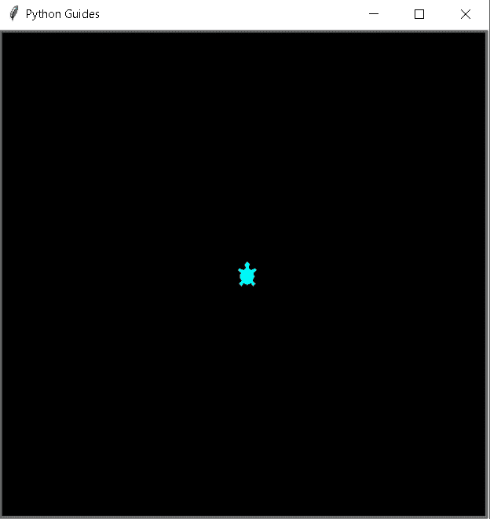
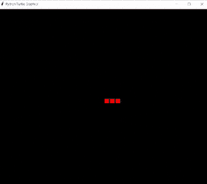
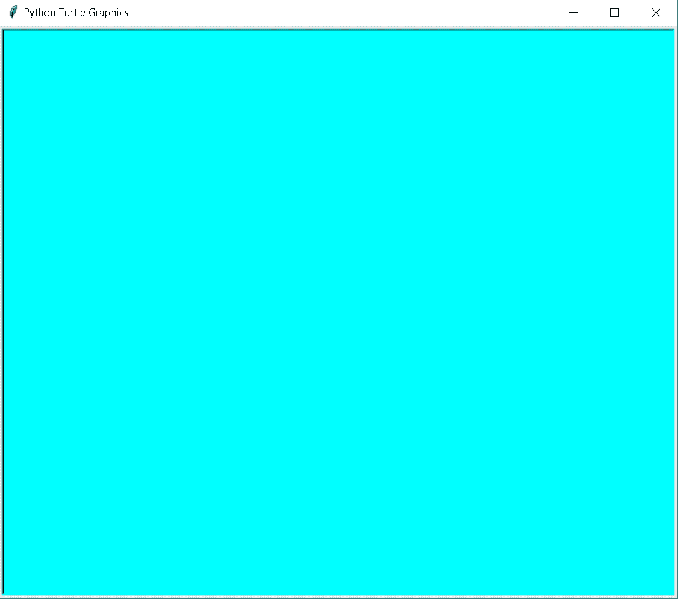
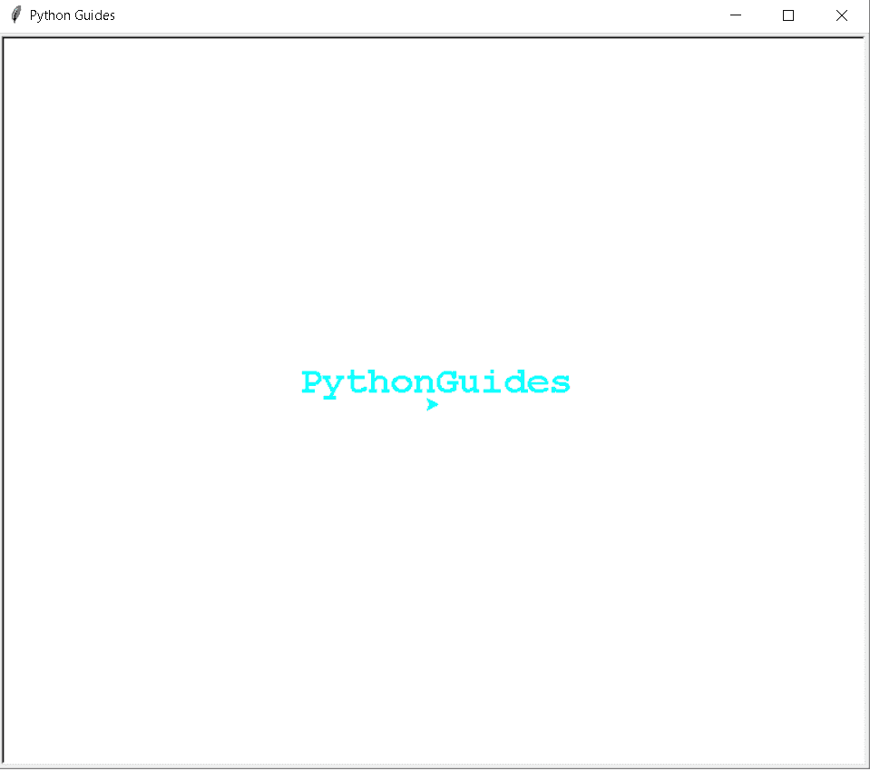
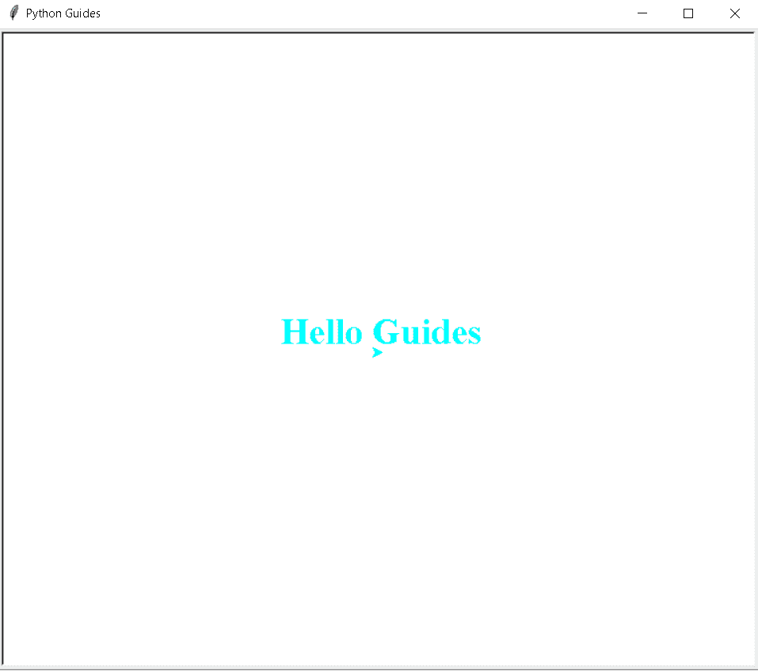
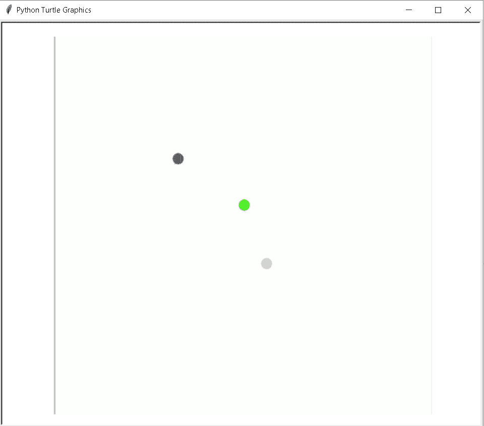
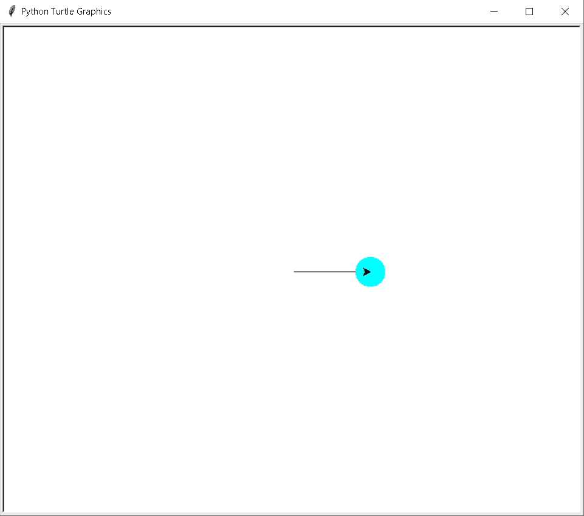

# 蟒蛇龟大小——详细指南

> 原文：<https://pythonguides.com/python-turtle-size/>

[](https://sharepointsky.teachable.com/p/python-and-machine-learning-training-course)

在这个[蟒蛇龟](https://pythonguides.com/turtle-programming-in-python/)教程中，我们将学习**如何在蟒蛇龟**中控制龟的大小，我们还将涵盖与龟大小相关的不同示例。我们将讨论这些话题。

*   蟒蛇龟大小
*   蟒蛇龟的像素大小
*   蟒蛇龟屏幕尺寸
*   蟒蛇皮海龟笔大小
*   蟒蛇龟字体大小
*   蟒蛇龟图像大小
*   蟒蛇龟圆点大小

目录

[](#)

*   [巨蟒龟大小](#Python_turtle_size "Python turtle size")
*   [巨蟒龟大小像素](#Python_turtle_size_in_pixel "Python turtle size in pixel")
*   [巨蟒龟屏幕尺寸](#Python_turtle_screen_size "Python turtle screen size")
*   [蟒蛇龟笔尺寸](#Python_turtle_pen_size "Python turtle pen size")
*   [蟒龟字号](#Python_turtle_font_size "Python turtle font size")
*   [巨蟒龟图像尺寸](#Python_turtle_image_size "Python turtle image size")
*   [蟒龟圆点大小](#Python_turtle_dot_size "Python turtle dot size")

## 巨蟒龟大小

在这一节中，我们将学习如何在 Python turtle 中控制或改变龟的大小。

乌龟的默认大小是 20 像素，我们也可以根据我们的要求改变乌龟的大小。如果我们想要一只大乌龟，我们就增加乌龟的尺寸。如果我们想要一只小乌龟，我们就缩小乌龟的尺寸。

**代码:**

在下面的代码中，我们将从 turtle import * 、 `import turtle` 中导入 turtle 模块**。**

*   我们将使用 `ws=turtle.screen()` 创建一个屏幕对象。
*   **turtle.setup(500，500)** 用于设置主窗口的大小和位置。
*   `ws.title("Python Guides")` 用于设置窗口的标题。
*   `ws.bgcolor("black")` 用于给**【黑色】**背景色。
*   **incr = tuple([2 * num for num in size])**用于增加龟的大小。

```py
from turtle import *
import turtle
turtle.setup(500,500)
ws = turtle.Screen()
ws.title("Python Guides")
ws.bgcolor("black")

tur = turtle.Turtle()
tur.shape("turtle")
tur.color("cyan")
tur.left(90)

def increaseSize():
    size = tur.turtlesize()
    incr = tuple([2 * num for num in size])
    tur.turtlesize(incr) #this is where the error occurs

ws.onkey(increaseSize, "x")
ws.listen()
turtle.done()
```

**输出:**

运行上面的代码后，我们得到下面的输出，我们可以看到乌龟以新的大小被放在屏幕上。



Python turtle size Output

另外，请阅读: [Python Turtle 命令](https://pythonguides.com/python-turtle-commands/)

## 巨蟒龟大小像素

在本节中，我们将了解 python turtles 中的 **turtle 像素大小**。

在继续之前，我们应该有一个关于**像素**的知识。一个**像素**是一个数字图像的单位，或者我们可以说一个小点或小方块在屏幕上构建了一个图像，并且还可以调整图像像素的大小。

**代码:**

在下面的代码中，我们将从 turtle import * 、 `import turtle` 中导入 turtle 模块**。**

*   我们将使用 **wn= turtle 创建一个屏幕对象。屏幕()**。
*   `tur.speed(0)` 用于给海龟速度， `0` 为最快速度。
*   `tur.forward(20)` 用于向前移动乌龟。
*   `tur.begin_fill()` 在绘制要填充的形状之前使用。
*   `tur.end_fill()` 用于结束颜色的填充。

```py
from turtle import *
import turtle
wn=turtle.Screen()
wn.bgcolor("Black")
tur=turtle.Turtle()
tur.speed(0)
tur.pensize(4)
def square():
  for i in range(4):
    tur.forward(20)
    tur.right(90)

def square_box():
  for i in range(4):
   tur.begin_fill()
   square()
   tur.color("red")
   tur.end_fill()
   tur.color("Black")
   tur.forward(20)   

square_box()

tur.penup()
tur.forward(100)
tur.pendown()

turtle.done()
```

**输出:**

运行上面的代码后，我们得到下面的输出，其中我们可以看到海龟的像素大小。我们还可以通过简单地增加或减少像素的大小来调整像素的大小。



Python turtle size in pixel Output

阅读:[如何使用 Turtle](https://pythonguides.com/snake-game-in-python/) 创建 Python 中的贪吃蛇游戏

## 巨蟒龟屏幕尺寸

在本节中，我们将学习如何在 python turtle 中自定义屏幕尺寸。

**屏幕尺寸**用于调整我们绘制图片、图像、形状等的画布的大小。屏幕大小用于调整窗口的宽度和高度。

**代码:**

在下面的代码中，我们用 python 导入了一个 turtle 模块，其中我们使用了一个 **screensize()函数**，它通过给窗口指定宽度和高度来帮助调整屏幕大小。

```py
from turtle import *

import turtle

turtle.screensize(canvwidth=400, canvheight=300,
                  bg="cyan")
turtle.done()
```

**输出:**

运行上述代码后，我们得到以下输出，其中我们看到了具有给定高度和宽度的屏幕。



Python turtle screen size Output

阅读:[蟒蛇龟颜色+示例](https://pythonguides.com/python-turtle-colors/)

## 蟒蛇龟笔尺寸

在这一节中，我们将学习如何在 python turtle 中改变笔的大小。

钢笔大小用于设置线条的粗细。笔是用来在屏幕上画图形的，我们可以设置笔的大小，比如画图形或写文字的粗细。

**代码:**

在下面的代码中，我们将导入 **turtle 模块**，用于借助钢笔在屏幕上绘制形状。

*   **tur.color('青色')**用于给文本赋予颜色。
*   `tur.pensize(14)` 用来给笔赋予尺寸以增加或减少文本的粗细，形状。

```py
from turtle import *
import turtle as tur

tur.color('cyan')
tur.title("Python Guides")
tur.pensize(14)
style = ('Courier',25, 'bold')
tur.write('PythonGuides', font=style, align='center')
tur.done()
```

**输出:**

运行上面的代码后，我们得到下面的输出，我们可以看到文本是在笔的帮助下写在屏幕上的。



Python turtle pen size Output

阅读:[蟒龟圈](https://pythonguides.com/python-turtle-circle/)

## 蟒龟字号

在本节中，我们将学习如何在 Python turtle 中设置字体大小。

字体大小的定义是给我们的字体一个大小，这取决于一个文件，如果它是一个标题，给大字体大小，写在段落内，我们给我们的文本一个小的大小。

**代码:**

在下面的代码中，我们将导入 turtle 模块。python 中的 `turtle()` 方法用于制作对象。

*   **tur.color('青色')**用于给文本赋予颜色。
*   `tur.write()` 用于在屏幕上书写文本。
*   **font=("Times New Roman "，28，" bold")** 用来给文本赋予字体。

```py
from turtle import *
import turtle as tur

tur.color('cyan')
tur.title("Python Guides")
tur.pensize(14)

tur.write('Hello Guides', font=("Times New Roman",28,"bold"), align='center')
tur.done()
```

**输出:**

运行上面的代码后，我们得到下面的输出，我们可以看到文本以合适的字体大小写在屏幕上。



Python turtle font size Output

阅读:[蟒蛇龟速配实例](https://pythonguides.com/python-turtle-speed/)

## 巨蟒龟图像尺寸

在本节中，我们将了解 Python turtle 中的**图像大小**。

图像的大小会根据窗口的大小自动调整。

**代码:**

在下面的代码中，我们导入了用于创建对象的 turtle 模块。

`turtle . addshape(" Python turtle image size . gif ")`用于根据窗口的形状添加相应的图像。

`tur.resizemode("auto")` 用于自动调整图像大小。

```py
import turtle

turtle.addshape("Python turtle image size.gif")

tur = turtle.Turtle()

tur.shape("Python turtle image size.gif")

tur.resizemode("auto")
tur.pensize(15)
tur.stamp()

turtle.exitonclick()
```

**输出:**

运行上面的代码后，我们得到下面的输出，我们可以看到图像在屏幕上自动调整。



Python turtle image size Output

阅读:[蟒龟艺术](https://pythonguides.com/python-turtle-art/)

## 蟒龟圆点大小

在这一节中，我们将学习如何在 Python turtle 中设置点的大小。

Dot 是在函数的帮助下创建的，我们可以简单地通过增加或减少参数中的值来调整这个点的大小。

**代码:**

在下面的代码中，我们从 turtle import * 、**导入 turtle 模块**作为 tur** 。这个 turtle()方法用于制作对象。**

*   `tur.forward(100)` 用于向前移动乌龟。
*   **tur.dot(40，“青色”)**用来画一个向前方向移动后的点。

```py
from turtle import *
import turtle as tur

# motion
tur.forward(100)

# dot with
# 60 diameter
# yellow color
tur.dot(40, "cyan")
tur.done()
```

**输出:**

运行上面的代码后，我们得到下面的输出，我们可以看到屏幕上有一个带彩色圆点的箭头。



Python turtle dot size Output

还有，多看看一些和 Python turtle 相关的教程。

*   [Python 龟写函数](https://pythonguides.com/python-turtle-write-function/)
*   [蟒龟字体](https://pythonguides.com/python-turtle-font/)
*   [Replit 蟒蛇龟](https://pythonguides.com/replit-python-turtle/)
*   [使用乌龟绘制彩色填充形状](https://pythonguides.com/draw-colored-filled-shapes-using-python-turtle/)
*   [蟒龟广场](https://pythonguides.com/python-turtle-square/)
*   [蟒龟 onclick](https://pythonguides.com/python-turtle-onclick/)

因此，在本教程中，我们讨论了 `Python Turtle Size` ，并且我们还涵盖了与其实现相关的不同示例。这是我们已经讨论过的例子列表。

*   蟒蛇龟大小
*   蟒蛇龟的像素大小
*   蟒蛇龟屏幕尺寸
*   蟒蛇皮海龟笔大小
*   蟒蛇龟字体大小
*   蟒蛇龟图像大小
*   蟒蛇龟圆点大小

[Bijay Kumar](https://pythonguides.com/author/fewlines4biju/)

Python 是美国最流行的语言之一。我从事 Python 工作已经有很长时间了，我在与 Tkinter、Pandas、NumPy、Turtle、Django、Matplotlib、Tensorflow、Scipy、Scikit-Learn 等各种库合作方面拥有专业知识。我有与美国、加拿大、英国、澳大利亚、新西兰等国家的各种客户合作的经验。查看我的个人资料。

[enjoysharepoint.com/](https://enjoysharepoint.com/)[](https://www.facebook.com/fewlines4biju "Facebook")[](https://www.linkedin.com/in/fewlines4biju/ "Linkedin")[](https://twitter.com/fewlines4biju "Twitter")