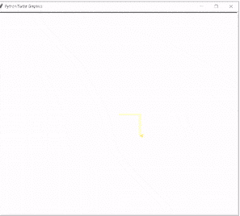
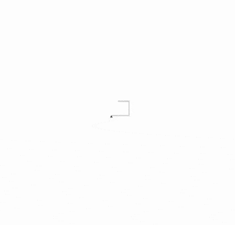
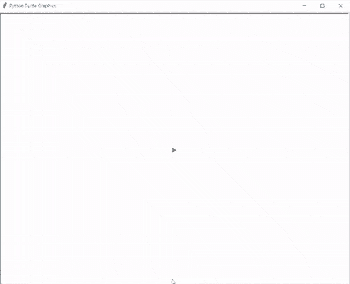
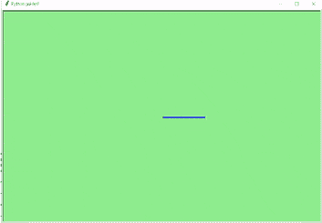
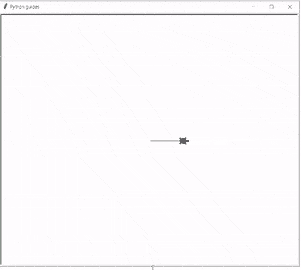
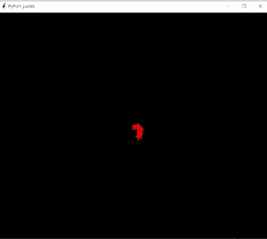
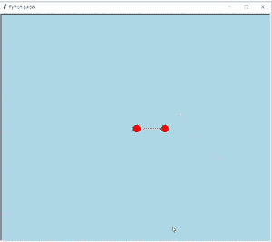
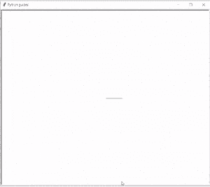

# Python 龟速配实例

> 原文：<https://pythonguides.com/python-turtle-speed/>

[](https://sharepointsky.teachable.com/p/python-and-machine-learning-training-course)

在本 Python 龟教程中，我们将学习如何在 Python 龟中管理**龟速` `，我们还将涵盖与 `Python` **龟速**相关的不同示例。我们将讨论这些话题。**

*   蟒蛇龟速
*   巨蟒龟加速
*   蟒蛇龟最大速度
*   Python turtle.speed(0)
*   蟒蛇龟笔速度
*   蟒蛇龟绘制速度
*   蟒蛇龟默认速度
*   巨蟒龟移动速度
*   蟒蛇龟转弯速度
*   Python turtle 模块速度

目录

[](#)

*   [蟒龟速度](#Python_turtle_speed "Python turtle speed")
*   [巨蟒龟提速](#Python_turtle_speed_up "Python turtle speed up")
*   [巨蟒龟最大速度](#Python_turtle_speed_max "Python turtle speed max")
*   [Python turtle.speed(0)](#Python_turtlespeed0 "Python turtle.speed(0)")
*   [蟒蛇龟笔速度](#Python_turtle_pen_speed "Python turtle pen speed")
*   [蟒龟绘制速度](#Python_turtle_draw_speed "Python turtle draw speed")
*   [蟒龟默认速度](#Python_turtle_default_speed "Python turtle default speed")
*   [蟒龟移动速度](#Python_turtle_move_speed "Python turtle move speed")
*   [蟒龟转弯速度](#Python_turtle_turn_speed "Python turtle turn speed")
*   [巨蟒龟模块速度](#Python_turtle_module_speed " Python turtle module speed")

## 蟒龟速度

本节我们将学习如何在 Python turtle 中控制乌龟的**速度**。

**速度**用于通过给定值作为参数来改变海龟的速度。海龟的速度在 0-10 之间。

**语法:**

```py
turtle.speed(speed=None)
```

**代码:**

在下面的代码中，我们使用 `import turtle` 导入 turtle 包并创建一个窗口。现在，我们使用这个窗口作为画板，在乌龟的帮助下画一些形状，并且在画之前控制乌龟的速度。

*   `turtle.speed(1)` 是给海龟的最慢速度。
*   `turtle.forward(120)` 用于定义海龟运动。

```py
 from turtle import *
import turtle
ws=turtle.Screen()
ws.title("Python guides")

turtle.speed(1)
turtle.shape("turtle")

turtle.forward(120)
ws.exitonclick()
```

**输出:**

运行上面的代码后，我们将得到下面的输出，我们看到一只乌龟在向前移动，这只乌龟的速度是最慢的。


Python turtle speed Output

阅读:[使用蟒蛇龟绘制彩色填充形状](https://pythonguides.com/draw-colored-filled-shapes-using-python-turtle/)

## 巨蟒龟提速

本节我们将学习如何在 python turtle 中**加速**乌龟。

**龟速**在范围 `0-10` 内，如果我们想增加龟速，那么我们增加输入值。从 1 加速到 10 可以更快的绘制动画线条，也可以提高乌龟的速度。

**代码:**

在下面的代码中，我们接受用户输入，该输入决定了绘制该形状需要多少个正方形，用户还可以根据自己的需要选择乌龟的颜色和 `speedup()` 乌龟。

```py
import turtle

s=int(input("Choose the number of squares ?"))
col=int(input("What colour would you like? yellow = 1, pink = 2 "))
back=int(input("What turtle colour would you like? yellow = 1, pink = 2 "))
turtle.speed(1)
i=1

x=65

while i < s:
    i=i+1
    x=x*1.05
    print ("minimise this window AS Soon As Possible!!")
    if col==1:
        turtle.pencolor("yellow")
    elif col==2:
        turtle.pencolor("pink")

    else:
        turtle.pencolor("black")
    if back==1:
        turtle.fillcolor("yellow")
    elif back==2:
        turtle.fillcolor("pink")
    else:
        turtle.fillcolor("white")
    turtle.forward(x)
    turtle.right(90)
    turtle.forward(x)
    turtle.right(90)
    turtle.forward(x)
    turtle.right(90)
    turtle.forward(x)
    turtle.right(90)
    turtle.up()
    turtle.right(12)
    turtle.down()
```

**输出:**

运行上面的代码后，我们得到下面的输出，其中我们看到用 `speed(1)` 绘制了不同的方块。现在，如果我们想提高光标的速度，那就加快速度，在参数中给出大的值。



Python turtle speed up Output

阅读:[如何使用 Turtle](https://pythonguides.com/snake-game-in-python/) 创建 Python 中的贪吃蛇游戏

## 巨蟒龟最大速度

在这一节中，我们将学习如何在 Python turtle 中最大化 turtle 的速度。

我们知道 `turtle.speed()` 是用来改变速度的方法。龟速在 `0-10` 范围内。 `0` 是乌龟速度最大化的最快速度值，也是用不同方法最大化的速度。

**代码:**

下面我们从 turtle import *导入一些包**，导入 turtle** 。并为该模式创建一个循环，并将海龟速度设置为 `turtle.speed(15-i)` 这显示了海龟的最大速度。

```py
 from turtle import *
import turtle 

for i in range(15):

  turtle.speed(15-i)

  turtle.forward(50+15*i)
  turtle.right(90)
```

**输出:**

在下面的输出中，我们看到海龟以最大速度开始移动，形成一个正方形的循环。



Python turtle speed max Output

阅读: [Python Turtle 命令(15 个有用的命令)](https://pythonguides.com/python-turtle-commands/)

## Python turtle.speed(0)

在本节中，我们将学习如何在 Python turtle 中使用 `speed(0)` 方法。

`Turtle.speed()` 用于改变 Turtle 的速度我们可以通过改变参数的值来管理速度。

速度(0) 是这种海龟转弯的最快速度，它们不需要一点点时间就能转弯。

**代码:**

在下面的代码中，我们使用了 `turtle.speed(0)` 方法，参数中的值 0 被用作最快速度值。

*   `turtle.forward(50)` 用来移动乌龟前进的方向，默认****乌龟的颜色是黑色。****
*   `****turtle.color("green")` 用于将颜色由黑色变为绿色。****

```py
from turtle import *

import turtle

turtle.speed(0)

turtle.forward(50)

turtle.color("green")

turtle.right(90)
turtle.forward(50)
turtle.pencolor(("blue"))
turtle.right(90)
turtle.forward(70)
turtle.pencolor("purple")
turtle.right(90)
turtle.forward(90)
```

**输出:**

运行上面的代码后，我们得到下面的输出，其中我们看到动画并没有花费一秒钟的时间。


Python turtle speed(0) Output

阅读:[如何在 Turtle Python 中附加图片](https://pythonguides.com/attach-image-to-turtle-python/)

## 巨蟒龟笔速

在这一节，我们将如何控制笔的速度，当我们在一只巨蟒龟上画一个形状的时候。

我们可以用一个 `turtle.speed()` 的方法来控制笔速。我们给这个值作为参数，并改变笔的**速度**。

**代码:**

在下面的代码中，我们创建了一个屏幕，在屏幕中，我们用正常速度的笔绘制了一个形状。

*   `turtle.speed(6)` 用于将笔速设置为正常。
*   `tur.pensize(3)` 用于将笔的大小设置为 3。

```py
import turtle

turtle.setup(900, 700)
turtle.speed(6)
tur = turtle.Turtle()
tur.pensize(3) 
tur.forward(300)
tur.left(90)
tur.forward(200)
exit()
```

**输出:**

运行上面的代码后，我们得到下面的输出，其中我们看到我们的笔的速度是正常的，形状是由笔绘制的。



Python turtle pen speed Output

阅读:[蟒龟颜色](https://pythonguides.com/python-turtle-colors/)

## 蟒龟绘制速度

在本节中，我们将学习如何在 Python turtle 中控制**绘制` `速度**。

*   我们可以通过 `turtle.speed()` 方法来控制或管理绘制速度。
*   速度字符串通过速度值以下列方式绘制:

*   最快:0
*   最慢:1
*   慢速:3
*   正常:6
*   快速:10

**代码:**

在下面的代码中，我们创建一个背景色为**“浅绿色”**的窗口，在这里我们用钢笔绘制形状，并测量**绘制` `速度**。笔的**宽度**为**“3”**。

```py
from turtle import *
import turtle
turtle.setup(900, 600)      
ws = turtle.Screen()        
ws.bgcolor("light green")    
ws.title("Python guides!")    

tur = turtle.Turtle()
tur.color("blue")           
tur.pensize(3)             

tur.forward(300)
tur.left(120)
tur.forward(300)

ws.exitonclick()
```

**输出:**

运行上面的代码后，我们得到了下面的输出，其中我们看到了海龟的绘制速度。



Python turtle draw speed Output

## 蟒龟默认速度

本节我们将学习 Python turtle 中 turtle 的**默认速度**。

默认速度在 0-10 范围内。如果输入值大于 10 或小于 0.5，速度设置为 0。

**代码:**

在下面的代码中，我们创建了一个窗口，这个窗口作为一个画板，在这里我们以默认的速度绘制形状。

*   `tur.speed()` 用作默认速度。
*   **转身前进(200)** 用于给乌龟运动。

```py
import turtle as tur
ws = tur.Screen()
ws.title("Python guides")

tur.speed()
tur.shape("turtle")

tur.forward(200)
tur.right(60)
tur.forward(200)
tur.right(90)
tur.forward(200)
```

**输出:**

运行上面的代码后，我们得到下面的输出，我们看到乌龟以默认速度移动。



Python turtle default speed Output

还有，查:[蟒龟艺术](https://pythonguides.com/python-turtle-art/)

## 蟒龟移动速度

本节我们将学习 Python turtle 中乌龟的**移动速度**。

速度被定义为物体的快速运动，或者我们可以说非常快速地移动。海龟移动速度是指我们的海龟移动的速度或者它们可以移动的速度。

**代码:**

在下面的代码中，我们创建了一个背景色为**“黑色”**的屏幕。乌龟在屏幕上移动，它们首先以正常速度向前移动，然后向右移动。

*   `Turtle`——这是一个预装的库，用来创建形状和图片。
*   `color()`-用于设置笔的颜色，也用于填充形状。
*   `shape()`–它将乌龟形状设置为给定名称的形状。

```py
from turtle import *
import turtle
ws = turtle.Screen()
ws.bgcolor("black")
ws.title("Python guides")
tur = turtle.Turtle()
tur.color("red")
tur.shape("turtle")

print(list(range(8, 90, 3)))
tur.up()                    
for size in range(8, 90, 3):    
    tur.stamp()                
    tur.forward(size)          
    tur.right(50)              

ws.exitonclick() 
```

**输出:**

在下面的输出中，我们看到一只乌龟以正常速度移动，一个美丽的形状被创建。



Python turtle move speed Output

阅读:[如何使用 Turtle 在 python 中绘制形状](https://pythonguides.com/turtle-programming-in-python/)

## 蟒龟转弯速度

本节我们将学习 Python turtle 中乌龟的**转弯速度**。

众所周知，速度被定义为物体的运动。所以，在这一节中，我们将学习转弯速度，从这个速度中我们可以看出海龟转弯的速度。

**代码:**

在下面的代码中，我们创建了一个屏幕，屏幕的背景是一只**【浅绿色】**颜色的乌龟，乌龟向前移动，然后以正常速度向右转弯。

`tur . stamp`——它会在画布上留下印记。

```py
from turtle import *
import turtle
ws = turtle.Screen()
ws.bgcolor("light blue")
ws.title("Python guides")
tur = turtle.Turtle()
tur.color("red")
tur.shape("circle")

tur.stamp()                
tur.forward(80)          
tur.right(50)              
tur.forward(80)
tur.right(50)
tur.forward(80)

ws.exitonclick()
```

**输出:**

运行上面的代码后，我们得到下面的输出，其中我们看到一只乌龟首先向前移动，然后转向右边。



Python turtle turn speed Output

##  巨蟒龟模块速度

在本节中，我们将学习 Python turtle 中的 turtle **模块速度**。

模块被定义为可用于构建复杂结构的每个独立单元。模块速度独立控制实际速度。

**代码:**

在下面的代码中，我们创建了一个屏幕，可以用模块速度绘制形状和图片。

*   `color()`–用于设置钢笔颜色或填充形状。
*   `speed()`–0-10 范围内的整数值。

```py
from turtle import *
import turtle
ws= turtle.Screen()
ws.title("Python guides")
turtle.speed(6)
color('green', 'pink')
begin_fill()
while True:
    forward(200)
    left(150)
    if abs(pos()) < 1:
        break
end_fill()
ws.exitonclick()
```

**输出:**

运行上面的代码后，我们得到了下面的输出，其中我们看到了一幅以模块速度绘制的美丽图片。



Python turtle module speed Output

另外，请阅读以下教程。

*   [Python 清龟配实例](https://pythonguides.com/python-clear-turtle/)
*   [蟒蛇龟钟——如何绘制](https://pythonguides.com/python-turtle-clock/)
*   [Python Turtle Grid–实用指南](https://pythonguides.com/python-turtle-grid/)
*   [蟒蛇龟笔+例题](https://pythonguides.com/python-turtle-pen/)

在本教程中，我们讨论了 `Python turtle speed` ，并且我们还讨论了与其实现相关的不同示例。这是我们已经讨论过的例子列表。

*   蟒蛇龟速
*   巨蟒龟加速
*   蟒蛇龟最大速度
*   Python turtle.speed(0)
*   蟒蛇龟笔速度
*   蟒蛇龟绘制速度
*   蟒蛇龟默认速度
*   巨蟒龟移动速度
*   蟒蛇龟转弯速度
*   Python turtle 模块速度

[Bijay Kumar](https://pythonguides.com/author/fewlines4biju/)

Python 是美国最流行的语言之一。我从事 Python 工作已经有很长时间了，我在与 Tkinter、Pandas、NumPy、Turtle、Django、Matplotlib、Tensorflow、Scipy、Scikit-Learn 等各种库合作方面拥有专业知识。我有与美国、加拿大、英国、澳大利亚、新西兰等国家的各种客户合作的经验。查看我的个人资料。

[enjoysharepoint.com/](https://enjoysharepoint.com/)[](https://www.facebook.com/fewlines4biju "Facebook")[](https://www.linkedin.com/in/fewlines4biju/ "Linkedin")[](https://twitter.com/fewlines4biju "Twitter")****