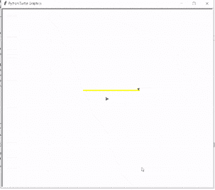
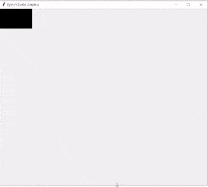
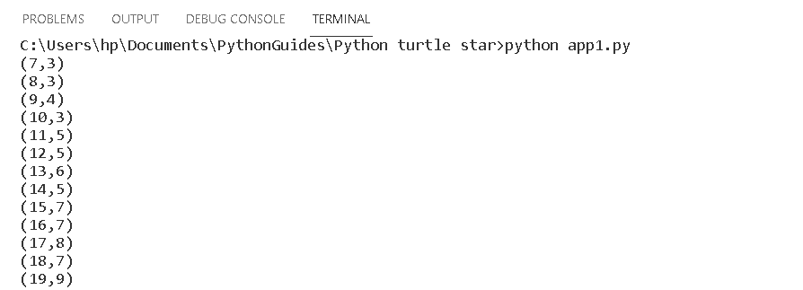
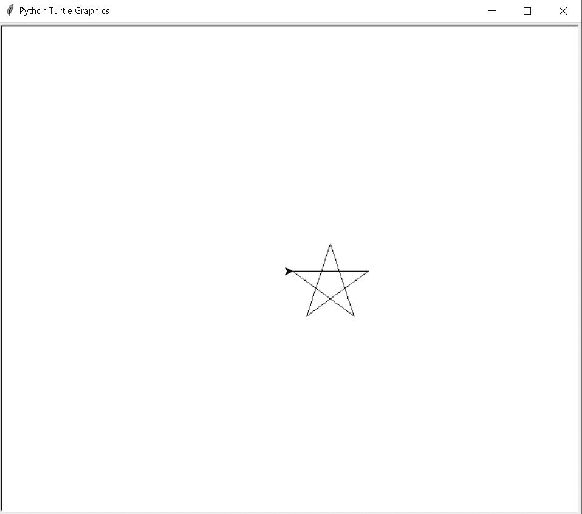
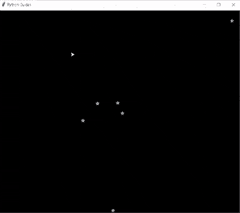

# 蟒蛇龟星——如何绘画

> 原文：<https://pythonguides.com/python-turtle-star/>

[](https://sharepointsky.teachable.com/p/python-and-machine-learning-training-course)

在这个 Python 教程中，我们将学习如何在 [Python 龟](https://pythonguides.com/turtle-programming-in-python/)中绘制**星形**，我们还将涵盖与龟星相关的不同例子。我们将讨论这些话题。

*   蟒蛇龟星
*   蟒蛇龟星位置
*   Python 龟星代码
*   蟒蛇龟星夜

目录

[](#)

*   [蟒龟星](#Python_turtle_star "Python turtle star")
*   [蟒龟星位置](#Python_turtle_star_position "Python turtle star position")
*   [蟒龟星代号](#Python_turtle_star_code "Python turtle star code")
*   [蟒龟星夜](#Python_turtle_starry_night "Python turtle starry night")

## 蟒龟星

在这一节，我们将学习如何在巨蟒龟身上画一个星形。

在前进之前，我们应该有一个关于恒星的知识。星星是夜晚可见的天体，当天空中有人时，它看起来像一个固定的光点。离地球最近的恒星是太阳。龟星是在乌龟的帮助下画在画板上的。

**代码:**

在下面的代码中，我们将从 turtle import * 、 `import turtle` 中导入 turtle 模块**。**龟()**法是用来做物件的。**

*   `tur.pensize(4)` 用来给笔的大小。
*   `tur.penup()` 用来拿起笔，龟停画画。
*   **tur.setpos(-90，30)** 用于设置乌龟的位置。
*   `tur.pendown()` 用于开始绘图。
*   **tur.pencolor(color[i])** 用于给笔赋予颜色。
*   `tur.forward(200)` 用于向前移动乌龟。
*   `tur.right(144)` 用于向右移动乌龟。

```py
from turtle import *

import turtle as tur

ws = tur.Turtle()

color= ['yellow','orange','green','cyan','blue']

tur.pensize(4)

tur.penup()
tur.setpos(-90,30)
tur.pendown()
for i in range(5):
    tur.pencolor(color[i])
    tur.forward(200)
    tur.right(144)

tur.penup()
tur.setpos(80,-140)
tur.pendown()

tur.pencolor("Black")
tur.done()
```

**输出:**

运行上面的代码后，我们将得到下面的输出，其中我们可以看到一个美丽的彩色星星被绘制在屏幕上，吸引了用户的眼球。



Python turtle star

同样，检查:[巨蟒龟获取位置](https://pythonguides.com/python-turtle-get-position/)

## 蟒龟星位置

本节我们将学习 python turtle 中的**龟星位置**。

正如我们所知，这颗星在晚上是可见的，在天空中看起来像一个固定的光点。我们还在乌龟的帮助下在画板上画出星星，并测量乌龟的位置，星星画在什么位置。

**代码:**

在下面的代码中，我们将从 turtle import * 、 `import turtle` 以及 `import sys` 中导入 turtle 库**这个模块提供了各种函数，从不同的部分处理 python 的运行时环境。**

*   `tur.color(clr)` 用来给乌龟上色。
*   `tur.position()` 用于给乌龟绘图开始的起始位置。
*   **print("Exception:"，point，file=sys.stderr)** 用于打印屏幕上的位置。
*   `tur.reset()` 用于再次设置海龟的位置。

```py
from turtle import *
import turtle as tur
import sys
from time import sleep

def gcd(a, b):
    while b != 0:
        a, b = b, a % b
    return a

def normal_star(siz, clr, point):
    if point <= 4:
        raise ValueError('Not enough point')

    tur.color(clr)

    for coprime in range(point // 2, 1, -1):
        if gcd(point, coprime) == 1:

            print("({},{})".format(point, coprime), file=sys.stderr)

            start = tur.position()

            for _ in range(point):
                tur.forward(siz)
                tur.left(360.0 / point * coprime)

            tur.setposition(start)

            return

    abnormal_star(siz, clr, point)

def abnormal_star(siz, clr, point):

    print("Exception:", point, file=sys.stderr)

for point in range(7, 20):
    tur.reset()
    normal_star(250, 'blue', point)
    sleep(6)

tur.exitonclick()
```

**输出:**

运行上面的代码后，我们将得到下面的输出，我们可以看到星星正在屏幕上绘制。



Python turtle star position

当海龟开始做一个星星时，这个星星的起始位置会在命令提示符下被捕获，如下图所示。



Python turtle star position Output

阅读:[蟒龟画线](https://pythonguides.com/python-turtle-draw-line/)

## 蟒龟星代号

在这一节中，我们将学习如何在 python turtle 中创建一个星形代码。

众所周知，星星是夜晚可见的天体。它是一个固定的发光点。当我们在晚上看到星星时，它不停地闪烁，看起来非常美丽，吸引了人们的目光。这里我们用一只乌龟来画一个星星的形状。

**代码:**

在下面的代码中，我们将从 turtle import * 、**导入 turtle 模块**作为 tur** 。**龟()**法是用来做物件的。**

*   **转身。Screen()** 用来创建一个屏幕，我们在上面画一个星星的形状。
*   `turt.forward(100)` 用于向前移动乌龟。
*   `turt.right(144)` 用于向右移动乌龟。

```py
from turtle import *

import turtle as tur

ws = tur.Screen()

turt = tur.Turtle()

for i in range(5):

        turt.forward(100)
        turt.right(144)
tur.done()
```

**输出:**

运行上面的代码后，我们得到了下面的输出，其中我们可以看到一个美丽的星形是在一只乌龟的帮助下画出来的。



Python turtle star code

阅读:[蟒龟嵌套循环](https://pythonguides.com/python-turtle-nested-loop/)

## 蟒龟星夜

本节我们将学习**如何借助 python turtle 中的 help turtle 打造星空**。

星空是一种只有在晚上才能看到的美丽景色，这种夜景是以生动的夜空绘画的形式捕捉的。正如这个词对星夜的定义一样，夜晚布满了星星。仿佛是一场梦，我们坐在星星的阴影下，附近有山和河，我们以图片的形式捕捉所有的风景。

在这里，我们在一只乌龟的帮助下绘制了这幅星夜图。海龟被当作画笔，画出一幅雄辩的夜空风景画。

**代码:**

在下面的代码中，我们将从 turtle import * ，**导入 turtle 模块**作为 turt。**我们还将导入随机模块来生成随机数。**

*   使用 `turtle()` 方法制作对象。
*   **turt。Screen()** 用于创建我们可以在其中绘制形状的屏幕。
*   `tur.speed(0)` 用于给速度给速度。
*   `ws.bgcolor("black")` 用于给屏幕背景色。
*   **tur.color("白色")**用来给乌龟上色。
*   `ws.title("Python Guides")` 用来给屏幕加标题。
*   **random.randint(-640，640)** 用于生成 x 和 y 的随机整数值。
*   `stars()` 调用函数 star 画一颗星。
*   `tur.up()` 用于拿起笔停止绘图。
*   `tur.down()` 用于开始绘图。
*   `tur.begin_fill()` 用于填充形状中的颜色。
*   `tur.circle(80)` 用于绘制圆形。
*   `tur.end_fill()` 用于停止在形状中填充颜色。

```py
from turtle import *

import turtle as turt
import random

tur = turt.Turtle()

ws = turt.Screen()

tur.speed(0)

ws.bgcolor("black")

tur.color("white")

ws.title("Python Guides")

def stars():
    for x in range(5):
        tur.fd(10)
        tur.right(144)

for x in range(100):

    a = random.randint(-640, 640)
    b = random.randint(-330, 330)

    stars()

    tur.up()

    tur.goto(a, b)

    tur.down()

tur.up()

tur.goto(0, 170)

tur.down()

tur.color("white")

tur.begin_fill()

tur.circle(80)

tur.end_fill()

tur.hideturtle()

ws.exitonclick()
```

**输出:**

运行上面的代码后，我们将得到下面的输出，在输出中我们可以看到星空，其中大量的星星是随机生成的，天空看起来非常漂亮。



Python turtle starry night

你可能也喜欢阅读以下关于 python Turtle 的教程。

*   [蟒龟画字母](https://pythonguides.com/python-turtle-draw-letters/)
*   [蟒龟鼠](https://pythonguides.com/python-turtle-mouse/)
*   [蟒蛇龟笔](https://pythonguides.com/python-turtle-pen/)
*   [蟒龟随机](https://pythonguides.com/python-turtle-random/)
*   [蟒蛇龟椭圆形](https://pythonguides.com/python-turtle-oval/)
*   [蟒龟输入](https://pythonguides.com/python-turtle-input/)
*   [蟒龟网格](https://pythonguides.com/python-turtle-grid/)
*   [蟒龟多边形](https://pythonguides.com/python-turtle-polygon/)

因此，在本教程中，我们讨论了 `Python Turtle Star` ,我们还涵盖了与其实现相关的不同示例。这是我们已经讨论过的例子列表。

*   蟒蛇龟星
*   蟒蛇龟星位置
*   Python 龟星代码
*   蟒蛇龟星夜

[Bijay Kumar](https://pythonguides.com/author/fewlines4biju/)

Python 是美国最流行的语言之一。我从事 Python 工作已经有很长时间了，我在与 Tkinter、Pandas、NumPy、Turtle、Django、Matplotlib、Tensorflow、Scipy、Scikit-Learn 等各种库合作方面拥有专业知识。我有与美国、加拿大、英国、澳大利亚、新西兰等国家的各种客户合作的经验。查看我的个人资料。

[enjoysharepoint.com/](https://enjoysharepoint.com/)[](https://www.facebook.com/fewlines4biju "Facebook")[](https://www.linkedin.com/in/fewlines4biju/ "Linkedin")[](https://twitter.com/fewlines4biju "Twitter")