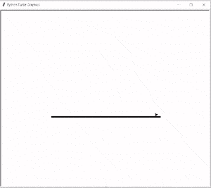
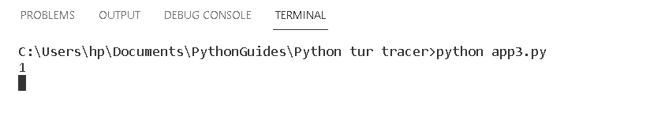
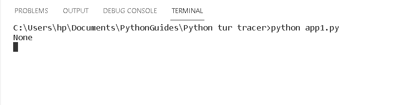

# Python 海龟示踪器——如何使用

> 原文：<https://pythonguides.com/python-turtle-tracer/>

[](https://sharepointsky.teachable.com/p/python-and-machine-learning-training-course)

在这个 Python 海龟教程中，我们将学习如何在 [Python 海龟](https://pythonguides.com/turtle-programming-in-python/)中创建一个海龟追踪器，我们还将介绍与海龟追踪器相关的不同例子。我们将讨论这些话题。

*   蟒蛇海龟追踪仪
*   巨蟒龟开启追踪器
*   巨蟒龟关闭跟踪器

目录

[](#)

*   [蟒龟示踪器](#Python_turtle_tracer "Python turtle tracer")
*   [巨蟒龟开启追踪器](#Python_turtle_turn_On_tracer "Python turtle turn On tracer")
*   [巨蟒龟关闭追踪器](#Python_turtle_turn_Off_tracer "Python turtle turn Off tracer")

## 蟒龟示踪器

在这一节中，我们将学习如何在 Python turtle 中创建一个追踪器。

Turtle()方法用于制作对象。我们使用 `turtle.tracer()` 函数来绘制形状图片。Tracer 用于打开和关闭动画，并设置更新绘图对象的延迟。

**语法:**

```py
turtel.tracer(n,delay=None)
```

*   `n` 用于常规屏幕更新。它验证对象是否真的被执行。
*   **延迟**用于设置延迟值。

**代码:**

在下面的代码中，我们从 turtle import * 、**导入 turtle 模块**作为 tur** 。**

`tur.tracer(delay=0)` 用于 turn 动画的开关，并为更新动画设置延迟。

```py
from turtle import *
import turtle as tur
tur.width(5)
yd=xd=-64
tur.tracer(delay=0) 
for i in range(2):
    tur.up()
    tur.goto(-197.5,yd)
    tur.down()
    tur.seth(0)
    tur.fd(394)
    yd+=128
    tur.up()
    tur.goto(xd,197.5)
    tur.down()
    tur.seth(270)
    tur.fd(394)
    xd+=128
tur.mainloop()
```

**输出:**

运行上面的代码后，我们得到下面的输出，我们可以看到在屏幕上绘制的形状。



Python turtle tracer Output

阅读:[如何在 Turtle Python 中附加图片](https://pythonguides.com/attach-image-to-turtle-python/)

## 巨蟒龟开启追踪器

本节我们将学习 Python turtle 中的 **turtle 开启跟踪器**。

众所周知， `Turtle.tracer()` 函数用于打开和关闭动画，以及定义更新图形的延迟。这里我们使用一个**开启**跟踪器来开启跟踪器动画。

**代码:**

*   在下面的代码中，我们导入 **turtle 模块**进行跟踪。
*   `print(turtle.tracer())` 用于打开海龟示踪动画。

```py
 import turtle

print(turtle.tracer())
turtle.done()
```

**输出:**

运行上面的代码后，我们得到了下面的输出，其中我们可以看到命令提示符上写了 `1` ，这意味着 tracer 动画打开了。



Python turtle turn on tracer Output

阅读:[巨蟒龟命令](https://pythonguides.com/python-turtle-commands/)

## 巨蟒龟关闭追踪器

在这一节中，我们将学习如何在 Python turtle 中关闭 tracer 。

正如我们所知 `Turtle.tracer()` 函数用于打开或关闭动画，并设置更新图形的延迟。在这里，我们使用一个**关闭**跟踪动画关闭。

**代码:**

*   在下面的代码中，我们导入**海龟` `模块**进行追踪。
*   `print(turtle.tracer(0))` 用于关闭 turtle tracer 动画。

```py
from turtle import *
import turtle

print(turtle.tracer(0))
turtle.done()
```

**输出:**

运行上面的代码后，我们得到了下面的输出，其中我们可以看到在命令提示符上写了 `None` ，这意味着关闭了跟踪动画。



Python turtle turn off tracer Output

你可能也喜欢读下面的文章。

*   [蟒龟三角](https://pythonguides.com/python-turtle-triangle/)
*   [Replit 蟒蛇龟](https://pythonguides.com/replit-python-turtle/)
*   [巨蟒龟大小](https://pythonguides.com/python-turtle-size/)
*   [蟒龟字体](https://pythonguides.com/python-turtle-font/)
*   [蟒龟圆点](https://pythonguides.com/python-turtle-dot/)
*   [蟒龟广场](https://pythonguides.com/python-turtle-square/)
*   [蟒龟赛跑](https://pythonguides.com/python-turtle-race/)

因此，在本教程中，我们讨论了 `Python turtle tracer` ,我们还涵盖了与其实现相关的不同示例。这是我们已经讨论过的例子列表。

*   蟒蛇海龟追踪仪
*   巨蟒龟开启追踪器
*   巨蟒龟关闭跟踪器

[Bijay Kumar](https://pythonguides.com/author/fewlines4biju/)

Python 是美国最流行的语言之一。我从事 Python 工作已经有很长时间了，我在与 Tkinter、Pandas、NumPy、Turtle、Django、Matplotlib、Tensorflow、Scipy、Scikit-Learn 等各种库合作方面拥有专业知识。我有与美国、加拿大、英国、澳大利亚、新西兰等国家的各种客户合作的经验。查看我的个人资料。

[enjoysharepoint.com/](https://enjoysharepoint.com/)[](https://www.facebook.com/fewlines4biju "Facebook")[](https://www.linkedin.com/in/fewlines4biju/ "Linkedin")[](https://twitter.com/fewlines4biju "Twitter")