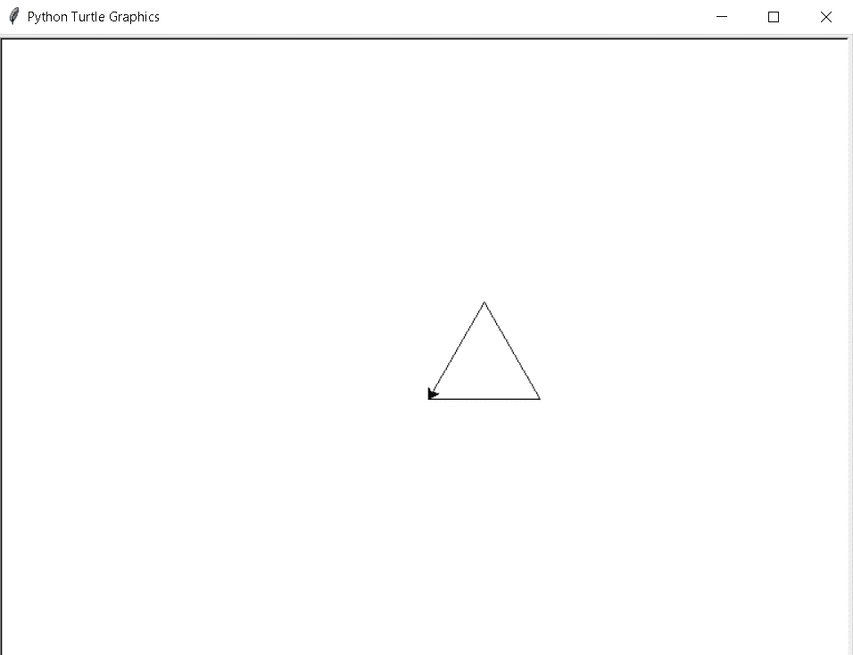
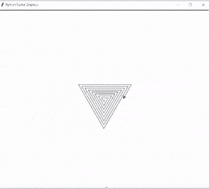
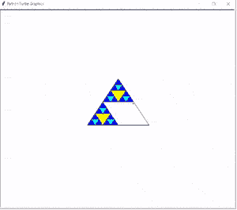
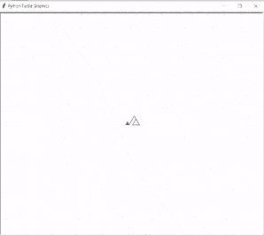

# Python 海龟三角+示例

> 原文：<https://pythonguides.com/python-turtle-triangle/>

[](https://sharepointsky.teachable.com/p/python-and-machine-learning-training-course)

在这个 [Python Turtle](https://pythonguides.com/turtle-programming-in-python/) 教程中，我们将学习**如何在 Python Turtle** 中创建三角形，我们还将涵盖与乌龟三角形相关的不同示例。我们将讨论这些话题。

*   蟒蛇龟三角
*   Python 海龟三角螺旋代码
*   蟒蛇龟 Sierpinski 三角
*   蟒蛇龟嵌套三角形

目录

[](#)

*   [蟒龟三角](#Python_turtle_triangle "Python turtle triangle")
*   [蟒龟三角螺旋码](#Python_turtle_triangle_Spiral_code "Python turtle triangle Spiral code")
*   [蟒龟 Sierpinski 三角](#Python_turtle_Sierpinski_triangle "Python turtle Sierpinski triangle")
*   [蟒龟嵌套三角形](#Python_turtle_Nested_triangle "Python turtle Nested triangle")

## 蟒龟三角

在这一节，我们将学习如何在巨蟒龟身上画一个三角形。

三角形有三条边和三个顶点。它是一个封闭的二维形状。

**代码:**

在下面的代码中，我们导入了 turtle 模块。这种**龟()**法一般用来做物件。

*   `tur.forward(100)` 用于向前移动乌龟。
*   `tur.left(120)` 用于龟移动到前进后向左移动。

```py
from turtle import *
import turtle

tur = turtle.Turtle()

tur.forward(100)  
tur.left(120)
tur.forward(100)

tur.left(120)
tur.forward(100)

turtle.done()
```

**输出:**

运行上面的代码后，我们得到下面的输出，我们可以看到一个三角形是在一只乌龟的帮助下画出来的。



Python turtle triangle Output

阅读: [Replit 蟒蛇龟](https://pythonguides.com/replit-python-turtle/)

## 蟒龟三角螺旋码

本节我们将学习**如何在 Python turtle 中绘制三角形螺旋代码**。

螺旋被定义为一条从一个中心点绕圈运动的长曲线。类似地，三角形螺旋是一条长曲线，绕着它的中心点旋转，形成一个螺旋三角形。

**代码:**

在下面的代码中，我们从 turtle import *导入 turtle 模块**，导入 turtle** 。这种**龟()**的方法主要用于制作物品。

`tur.right(120)` 用于将笔的方向顺时针改变 120 度。

```py
from turtle import *

import turtle 

n = 8

tur = turtle.Turtle() 

for i in range(n * 4): 

    tur.forward(i * 8) 

    tur.right(120)

turtle.done() 
```

**输出:**

运行代码后，我们得到下面的输出，可以看到屏幕上画了一个螺旋三角形。



Python turtle triangle spiral code Output

阅读:[蟒龟大小](https://pythonguides.com/python-turtle-size/)

## 蟒龟 Sierpinski 三角

本节我们将学习**如何在 Python turtle 中绘制 turtle Sierpinski 三角形**。

Sierpinski 定义为将形状细分成更小的副本。Sierpinski 三角形是一个用三路递归算法绘制的三角形。我们可以简单地用手画出 Sierpinski 三角形。

**代码:**

在下面的代码中，我们将导入 turtle 模块来绘制 Sierpinski 三角形。Sierpinski 在三角形内部创建了一个美丽的图案。

*   **乌龟。Screen()** 用于创建一个屏幕。
*   **Sierpinski(mypoints，3，tur)** 用于绘制一些点来创建图案。
*   **turtle.goto(points[0][0]，points[0][1])** 用于将乌龟移动到绝对位置。
*   `turtle.begin_fill()` 用于在绘制要填充的形状之前调用。
*   `turtle.end_fill()` 是在绘制一个要填充的形状后调用。

```py
from turtle import *
import turtle

def drawTriangle(points,color,turtle):
    turtle.fillcolor(color)
    turtle.up()
    turtle.goto(points[0][0],points[0][1])
    turtle.down()
    turtle.begin_fill()
    turtle.goto(points[1][0],points[1][1])
    turtle.goto(points[2][0],points[2][1])
    turtle.goto(points[0][0],points[0][1])
    turtle.end_fill()

def getmid(p1,p2):
    return ( (p1[0]+p2[0]) / 2, (p1[1] + p2[1]) / 2)

def Sierpinski(points,degree,myTurtle):
    colormap = ['blue','cyan','yellow','white','green',
                'purple','yellow']
    drawTriangle(points,colormap[degree],myTurtle)
    if degree > 0:
        Sierpinski([points[0],
                        getmid(points[0], points[1]),
                        getmid(points[0], points[2])],
                   degree-1, myTurtle)
        Sierpinski([points[1],
                        getmid(points[0], points[1]),
                        getmid(points[1], points[2])],
                   degree-1, myTurtle)
        Sierpinski([points[2],
                        getmid(points[2], points[1]),
                        getmid(points[0], points[2])],
                   degree-1, myTurtle)

def mainwin():
   tur = turtle.Turtle()
   ws = turtle.Screen()
   mypoints = [[-100,-50],[0,100],[100,-50]]
   Sierpinski(mypoints,3,tur)
   ws.exitonclick()

mainwin()
```

**输出:**

运行上面的代码后，我们得到下面的输出，其中我们看到一个美丽的 Sierpinski 三角形被绘制在屏幕上。



Python turtle Sierpinski triangle Output

阅读:[蟒龟字体](https://pythonguides.com/python-turtle-font/)

## 蟒龟嵌套三角形

在这一节，我们将讲述**如何在 Python turtle 中绘制一个海龟嵌套三角形**。

在继续之前，我们应该了解一些关于嵌套的知识。嵌套是集合的有序集合，每个集合包含前一个集合。

嵌套三角形被定义为一个三角形，它包含许多由嵌套循环产生的三角形。

**代码:**

在下面的代码中，我们从 turtle import * 、 `import turtle` 中导入 turtle 模块**，用于绘制嵌套三角形。**

*   **右(90)** 用于向右移动乌龟。
*   向右移动后**向前(8 +形状)**功能用于向前移动乌龟。
*   **左(120)** 用于向左移动乌龟。

```py
from turtle import *
import turtle
numberoftriangle = 6

for shape in range(1, numberoftriangle + 1):

    for sides in range(1, 5):
        forward(10 + shape * 10 )
        left(120)
right(90)
forward(8 + shape)
turtle.done()
```

**输出:**

运行上面的代码后，我们得到下面的输出，其中我们看到屏幕上绘制了一个嵌套的三角形。



Python turtle nested triangle Output

你可能也喜欢阅读下面的教程。

*   [蟒龟广场](https://pythonguides.com/python-turtle-square/)
*   [蟒龟示踪器](https://pythonguides.com/python-turtle-tracer/)
*   [蟒龟艺术](https://pythonguides.com/python-turtle-art/)
*   [蟒龟圈](https://pythonguides.com/python-turtle-circle/)
*   [蟒龟速度](https://pythonguides.com/python-turtle-speed/)
*   [蟒龟写函数](https://pythonguides.com/python-turtle-write-function/)
*   [蟒龟赛跑](https://pythonguides.com/python-turtle-race/)
*   [如何在蟒蛇龟身上画花](https://pythonguides.com/draw-flower-in-python-turtle/)

因此，在本教程中，我们讨论了 `Python turtle triangle` ,我们还涵盖了与其实现相关的不同示例。这是我们已经讨论过的例子列表。

*   蟒蛇龟三角
*   Python 海龟三角螺旋代码
*   蟒蛇龟 Sierpinski 三角
*   蟒蛇龟嵌套三角形

[Bijay Kumar](https://pythonguides.com/author/fewlines4biju/)

Python 是美国最流行的语言之一。我从事 Python 工作已经有很长时间了，我在与 Tkinter、Pandas、NumPy、Turtle、Django、Matplotlib、Tensorflow、Scipy、Scikit-Learn 等各种库合作方面拥有专业知识。我有与美国、加拿大、英国、澳大利亚、新西兰等国家的各种客户合作的经验。查看我的个人资料。

[enjoysharepoint.com/](https://enjoysharepoint.com/)[](https://www.facebook.com/fewlines4biju "Facebook")[](https://www.linkedin.com/in/fewlines4biju/ "Linkedin")[](https://twitter.com/fewlines4biju "Twitter")