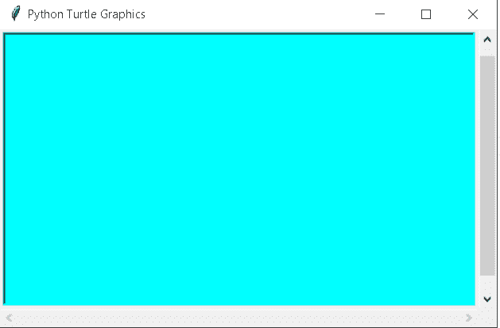

# 带示例的 Python Turtle 窗口

> 原文：<https://pythonguides.com/python-turtle-window/>

[](https://sharepointsky.teachable.com/p/python-and-machine-learning-training-course)

在这个[巨蟒龟教程](https://pythonguides.com/turtle-programming-in-python/)中，我们将学习**如何在**巨蟒龟**中创建一个窗口**，我们还将涵盖与**龟窗口**相关的不同例子。我们将讨论这些话题。

*   蟒蛇龟窗
*   Python turtle 窗口大小
*   蟒蛇龟窗口消失
*   Python 海龟窗口位置
*   Python turtle 窗口设置
*   Python turtle 窗口标题
*   Python 海龟窗口背景色

目录

[](#)

*   [蟒龟之窗](#Python_turtle_window "Python turtle window")
*   [蟒龟窗口大小](#Python_turtle_window_size "Python turtle window size")
*   [蟒龟窗口消失](#Python_turtle_window_disappear "Python turtle window disappear")
*   [蟒龟窗口位置](#Python_turtle_window_position "Python turtle window position")
*   [巨蟒龟窗口设置](#Python_turtle_window_setup "Python turtle window setup")
*   [蟒龟窗口标题](#Python_turtle_window_title "Python turtle window title")
*   [蟒蛇龟窗口背景色](#Python_turtle_window_background_color "Python turtle window background color")

## 蟒龟之窗

在这一节中，我们将学习如何在 python turtle 中创建 turtle 窗口。

蟒蛇龟窗是一个乌龟可以画出不同形状和图片的地方。这里 TurtleScreen 类定义了窗口。我们还可以通过应用一个简单的方法来调整窗口的大小。我们可以运行不同的 turtle 命令，也可以在窗口上得到运行输出。

**代码:**

在下面的代码中，我们将从 turtle import * 、**导入 turtle 库**。**用**龟()**的方法制作物品。**

*   **ws.bgcolor("青色")**用于给窗口背景色。

```py
from turtle import *

import turtle

ws = turtle.Screen()

ws.bgcolor("cyan")
turtle.done()
```

**输出:**

运行上面的代码后，我们得到了下面的输出，其中我们可以看到一个带有漂亮背景色的窗口。


Python turtle window

还有，检查:[蟒龟隐藏](https://pythonguides.com/python-turtle-hide/)

## 蟒龟窗口大小

在这一节中，我们将学习如何在 python turtle 中获得默认的窗口大小。

正如我们所知，所有的图像，图片和形状都显示在窗口。我们也可以借助 `ScreenSize()` 函数得到窗口的默认大小。

**代码:**

在下面的代码中，我们将从海龟导入* 、**导入海龟**中导入海龟库**。**龟()**法是用来做物件的。而`print(turtle . screensize())`用于在命令行提示符下打印窗口的默认大小。**

```py
from turtle import *

import turtle

print(turtle.screensize())
```

**输出:**

运行上面的代码后，我们得到了下面的输出，其中我们可以看到默认的窗口大小显示在命令提示符中。


Python turtle window size

阅读:[蟒龟背景](https://pythonguides.com/python-turtle-background/)

## 蟒龟窗口消失

在这一节中，我们将了解**窗口如何在 python turtle 中消失**。

在前进之前，我们应该有一个关于消失的知识。消失是指不可能找到或在某处失踪的东西。这里我们可以看到，当我们的程序结束时，我们的窗口会在几分之一秒内消失。

**代码:**

在下面的代码中，我们将从海龟导入* 、**导入海龟**、**的海龟库**作为 tur** 。使用 `turtle()` 方法来制作对象。**

*   `tur.forward(100)` 用于向前移动乌龟。
*   `tur.left(90)` 用于向左移动乌龟。

```py
from turtle import *
import turtle as tur

tur.forward(100)
tur.left(90)
tur.forward(100)
```

**输出:**

运行上面的代码后，我们得到下面的输出，我们可以看到，几秒钟后，我们的窗口消失了。


python turtle window disappear

阅读:[蟒龟小抄](https://pythonguides.com/python-turtle-cheat-sheet/)

## 蟒龟窗口位置

本节我们将学习 python turtle 中的**龟寡妇位置**。

位置被定义为对象所处的位置或想要被放置在该位置的地方。这里我们可以看到窗户从一个位置移动到另一个位置。

**代码:**

在下面的代码中，我们将从 turtle import turtle 中导入 Turtle 库。使用 `turtle()` 方法制作对象。

*   **ws.setup(width=0.333，height=0.333，startx=offset，starty=offset)** 用于给出屏幕的尺寸。
*   `turtle.dot(offset)` 用于在窗口内创建圆点。
*   `winpos()` 用于获取窗口的位置。

```py
from turtle import Turtle, Screen

def winpos():
    global offset

    ws.setup(width=0.333, height=0.333, startx=offset, starty=offset)

    turtle.dot(offset)

    offset += 10

    if offset < 300:
        ws.ontimer(winpos, 100)

ws = Screen()

turtle = Turtle()

offset = 30

winpos()

ws.exitonclick()
```

**输出:**

运行上面的代码后，我们得到下面的输出，我们可以看到窗口从开始位置移动到结束位置。


Python turtle window position

阅读:[蟒蛇龟椭圆形](https://pythonguides.com/python-turtle-oval/)

## 巨蟒龟窗口设置

在这一节中，我们将学习如何在 python turtle 中设置窗口。

在 python turtle 中我们使用 `Screen.setup()` 函数来设置窗口的大小和位置。在 `setup()` 功能的帮助下，我们可以给窗口一个不同的尺寸。

**代码:**

在下面的代码中，我们将从 turtle import * 、**导入 turtle 库**。**用**龟()**的方法制作物品。**

*   **ws.setup(500，300)** 用于通过给定参数内的高度和宽度来设置窗口的大小。
*   **ws.bgcolor("青色")**用于给窗口背景色。

```py
from turtle import *

import turtle

ws = turtle.Screen()

ws.setup(500,300)

ws.bgcolor("cyan")
turtle.done()
```

**输出:**

运行上面的代码后，我们得到了下面的输出，其中我们可以看到一个给定大小的窗口被创建。



Python turtle window setup

阅读:[蟒龟星](https://pythonguides.com/python-turtle-star/)

## 蟒龟窗口标题

在这一节中，我们将学习如何在 python turtle 的屏幕上显示标题。

窗口标题指定我们当前在窗口中工作的任务的名称。我们可以给我们选择的窗口起任何适合任务的标题。

**代码:**

在下面的代码中，我们将从 turtle import *导入 turtle 库**，导入 turtle** 。**龟()**法是用来做物件的。

*   **ws.setup(500，400)** 用于给窗口大小。
*   `turtle . title(" Python Guides ")`用于给窗口一个标题。

```py
from turtle import *

import turtle

ws = turtle.Screen()
ws.setup(500,400)

turtle.title("Python Guides")
turtle.done() 
```

**输出:**

运行上面的代码后，我们得到下面的输出，我们可以看到一个窗口，在这个窗口的左上角有一个标题，告诉我们关于任务或公司的信息。


Python turtle window title

阅读:[如何在蟒蛇龟身上画花](https://pythonguides.com/draw-flower-in-python-turtle/)

## 蟒蛇龟窗口背景色

在这一节中，我们将学习如何给 python turtle 中的窗口赋予背景色。

颜色用来使物体变得美丽和有吸引力。这里我们给窗口的背景颜色，从这里我们的窗口看起来很吸引人，用户想在这个窗口里面画形状和图片。

**代码:**

在下面的代码中，我们将从 turtle import *导入 turtle 库，导入 turtle。使用 `turtle()` 方法制作对象。

*   **乌龟。屏幕()。bgcolor("浅蓝色")**用于给窗口背景颜色。
*   `turtle.forward(100)` 用于向前移动乌龟。
*   `turtle.right(90)` 用于向右移动乌龟。

```py
from turtle import *
import turtle

turtle.Screen().bgcolor("light blue")
turtle.forward(100)
turtle.right(90)
turtle.done()
```

**输出:**

运行上面的代码后，我们得到了下面的输出，其中我们可以看到窗口美丽的背景色。


Python turtle window background-color

您可能也喜欢阅读以下关于 Python turtle 的文章。

*   [Python Turtle Grid–实用指南](https://pythonguides.com/python-turtle-grid/)
*   [蟒蛇龟笔+例题](https://pythonguides.com/python-turtle-pen/)
*   [Python 龟输入示例](https://pythonguides.com/python-turtle-input/)
*   [蟒龟画字母](https://pythonguides.com/python-turtle-draw-letters/)

因此，在本教程中，我们讨论了 `Python Turtle Window` ,我们还涵盖了与其实现相关的不同示例。这是我们已经讨论过的例子列表。

*   蟒蛇龟窗
*   Python turtle 窗口大小
*   蟒蛇龟窗口消失
*   Python 海龟窗口位置
*   Python turtle 窗口设置
*   Python turtle 窗口标题
*   Python 海龟窗口背景色

[Bijay Kumar](https://pythonguides.com/author/fewlines4biju/)

Python 是美国最流行的语言之一。我从事 Python 工作已经有很长时间了，我在与 Tkinter、Pandas、NumPy、Turtle、Django、Matplotlib、Tensorflow、Scipy、Scikit-Learn 等各种库合作方面拥有专业知识。我有与美国、加拿大、英国、澳大利亚、新西兰等国家的各种客户合作的经验。查看我的个人资料。

[enjoysharepoint.com/](https://enjoysharepoint.com/)[](https://www.facebook.com/fewlines4biju "Facebook")[](https://www.linkedin.com/in/fewlines4biju/ "Linkedin")[](https://twitter.com/fewlines4biju "Twitter")