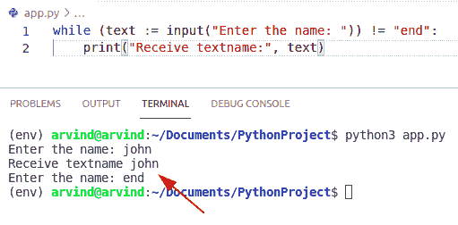

# Python While 循环条件

> 原文：<https://pythonguides.com/python-while-loop-condition/>

[](https://sharepointsky.teachable.com/p/python-and-machine-learning-training-course)

在本 Python 教程中，我们将讨论 **Python While 循环条件**。在这里，我们还将介绍以下示例:

*   Python while 循环条件结束
*   Python while 无条件循环
*   Python while 循环字符串条件
*   Python while 循环 if 条件
*   Python while 循环退出条件
*   Python while 循环双重条件
*   Python while 循环检查条件
*   while 循环条件中的 Python 赋值
*   Python while 循环中断条件
*   Python while 循环布尔条件

目录

[](#)

*   [Python while 循环条件](#Python_while_loop_condition "Python while loop condition")
*   [Python while 循环条件结束时](#Python_while_loop_condition_at_the_end "Python while loop condition at the end")
*   [Python while 循环字符串条件](#Python_while_loop_string_condition "Python while loop string condition")
*   [Python while 循环 if 条件](#Python_while_loop_if_condition "Python while loop if condition")
*   [Python while 循环退出条件](#Python_while_loop_exit_condition "Python while loop exit condition")
*   [Python while 循环双条件](#Python_while_loop_double_condition "Python while loop double condition")
*   [检查如何在 while 循环中使用 double 条件的另一个示例](#Another_example_to_check_how_to_use_double_condition_in_while_loop "Another example to check how to use double condition in while loop")
*   [Python while 循环检查条件](#Python_while_loop_check_condition "Python while loop check condition")
*   [while 循环条件中的 Python 赋值](#Python_assignment_in_while_loop_condition "Python assignment in while loop condition")
*   [Python while 循环中断条件](#Python_while_loop_break_condition "Python while loop break condition")
*   [Python while 循环布尔条件](#Python_while_loop_boolean_condition "Python while loop boolean condition")

## Python while 循环条件

*   让我们看看如何在 Python 中使用 while 循环条件。
*   该语句用于构造循环。
*   条件是准备检查它是真还是假。
*   如果 while 条件为真，则执行表示循环的语句。
*   当条件为假时，循环条件将停止，程序在循环之外继续。

**语法:**

以下是 while 循环条件的语法

```py
while expression:
   statement(s)
```

**举例:**

让我们举一个例子，看看如何在 Python 中使用 while 循环条件

```py
x = 4

while x < 8:
    print(x)
    x += 1
```

在上面的代码中，我们在条件 x 小于 8 (x<8)的循环中编写了这段代码。循环以三种方式完成，当 x 等于 8 时停止。

下面是以下代码的截图


Python while loop condition

检查如何在 Python 中使用 while 循环条件的另一个示例

**举例:**

```py
y = 0
while (y < 4):     
    y = y + 1
    print("George") 

print()

b = [9, 5, 2, 1]
while b:
    print(b.pop())
```

下面是以下给定代码的输出


Python while loop condition method

阅读: [Python 字典长度](https://pythonguides.com/python-dictionary-length/)

## Python while 循环条件结束时

*   在这里我们可以看到如何在循环条件结束时使用它们。
*   在这个例子中，我们可以很容易地使用 continue 语句方法，它总是将控制返回到循环的开始。

**举例:**

```py
x = 0
b = 'JohnMIcheal'  
while x < len(b): 
    if b[x] == 'e' or b[x] == 'c': 
        x += 1
        continue
    print('Present :', b[x])
    x += 1
```

下面是以下给定代码的执行过程


Python while loop condition at the end

## Python while 循环字符串条件

*   让我们看看如何在 Python 中循环字符串条件时使用它们。
*   首先，我们初始化一个空字符串，用于在 while 循环中接收用户的输入。
*   在本例中，while 后面是变量“name”。这里我们可以看到变量“name”是否被设置为字符串“name”。
*   这里我们可以检查，如果用户输入字符串“name”，那么循环将停止，代码将在循环之外执行。
*   在 while 循环条件中，代码运行一个产生“name”的 print 语句。然后将变量“name”设置为用户的输入。

**举例:**

让我们举一个例子，看看如何在 Python 中循环字符串条件时使用它们

```py
name = ''

while name != 'name':
    print('What is your name?')
    name = input()

print('Yes, the name is ' + name + '. You may enter.')
```

下面是以下给定代码的实现


Python while loop string condition

检查如何在 Python 中使用 while 循环字符串条件的另一个示例

在这个例子中，我们必须计算一年后的资本变量 t，包括利息。这个问题可以通过使用 while 循环条件来解决。

```py
a = int(input("new capital "))
b = int(input("Interest rate "))
c = int(input(" years "))

x = 0
while x < c:
    a +=  a * b / 100.0

    x += 1
    print(x, a)
print("Capital after " + str(c) + " ys: " + str(a))
```

下面是以下代码的截图


Python while loop string condition

阅读:[创建 Python 变量](https://pythonguides.com/create-python-variable/)

## Python while 循环 if 条件

*   这里我们可以看到如何在 while 循环中使用 if 条件。
*   在这个例子中，我们可以很容易地使用 `continue` 语句来终止当前循环，并将控制权返回到循环的顶部。

**举例:**

```py
x = 0
b = 'Java is a complex programming language'

while x < len(b): 
    if b[x] == 'o' or b[x] == 'a': 
        x += 1
        continue
    print('str_ :', b[x])
    x += 1
```

在上面的代码中，我们必须打印除' o '和' a '以外的所有字母。

给出的代码截图如下。


Python while loop if condition

检查如何在 while 循环中使用 if 条件的另一个示例

在这个例子中，我们可以使用 if 语句来检查条件，break 关键字用于退出 while 循环。

**举例:**

```py
m = 2
n = 2
while (m<8):
  print ('Iterate_value:',m)
  m = m + 1
  m = m + 1
  if (m == 6):
    break
print ('loop will terminated')
```

下面给出了以下代码的输出。


Python while loop if condition

阅读: [Python Tkinter 图片](https://pythonguides.com/python-tkinter-image/)

## Python while 循环退出条件

*   让我们看看如何在 Python 中退出 while 循环条件。
*   在这个例子中，我们将只在控制语句返回时匹配条件。
*   通过使用 `break` 语句，我们可以很容易地退出 while 循环条件。
*   该语句完全终止循环。

**举例:**

让我们举一个例子，看看如何在 Python 中退出 while 循环条件

```py
a = 4
while a > 0:
    a -= 1
    if a == 2:
        break
    print(a)
print('while Loop end.',a)
```

下面是以下给定代码的执行。


Python while loop exit condition

## Python while 循环双条件

*   这里可以看到 if-else 方法如何在 while 循环中使用 double 条件。
*   在这个例子中，循环重复，直到条件被消耗。
*   在 while 循环中使用了 If-else 条件。

**举例:**

让我们举一个例子，检查如何在整个循环中使用双重条件

```py
b = 6
while b > 0:
    b -= 1
    print(b)
    if b == 2:
        break
else:
    print('Loop double condition.')
```

以下给定代码的执行如下。


Python while loop double condition

阅读: [Python NumPy to list](https://pythonguides.com/python-numpy-to-list/)

## 检查如何在 while 循环中使用 double 条件的另一个示例

在这个例子中，我们可以将两个条件表达式合并成一个循环。为了完成这个任务，我们可以使用逻辑运算符。

**举例:**

```py
import random
m = 2
n = 8
max_val = random.randint(0,10)

cou_new = 0
while cou_new < m or cou_new < n and not cou_new >= max_val:
    print(f"count: {cou_new}, a: {m}, b: {n}")
    cou_new += 1
```

下面是以下代码的截图


Python while loop double condition method

## Python while 循环检查条件

*   让我们看看如何在 Python 中检查 while 循环条件。
*   在 while 循环中，只有当 while 条件为真时，控件才会在循环内移动，当 while 条件为真时，控件将执行循环体，然后再返回查看条件是否仍然为真，如果条件仍然为真，则控件将再次执行循环体。

**举例:**

让我们举一个例子，看看如何在 Python 中检查 while 循环条件

```py
m = 2

while(m <= 8):
	print(m)
	m = m+1
```

在本例中，我们将打印从 2 到 8 的数字。您可以在上面的代码中看到，只有当 m 小于或等于 8 时，循环才会运行。

给定代码的实现如下。


Python while loop check condition

## while 循环条件中的 Python 赋值

*   这里我们可以看到如何在 while 循环条件中使用赋值表达式。
*   赋值表达式是用(:=)写的。这个赋值表达式允许我们将更多的上下文折叠到循环条件中，并在同一个表达式中返回一个值。
*   在这个例子中，我们在 while 循环中使用了一个用户输入函数。
*   赋值 text:= input("Enter the name:")将文本的值附加到 input 函数内来自用户的值 rectify。

**举例:**

让我们举一个例子，看看如何在 while 循环条件中使用赋值表达式

```py
while (text := input("Enter the name: ")) != "end":
    print("Receive textname:", text)
```

下面是以下代码的截图



Python assignment in while loop condition

阅读: [Python NumPy where](https://pythonguides.com/python-numpy-where/)

## Python while 循环中断条件

*   让我们看看如何在 while 循环条件下使用 break 语句。
*   在 Python 中，break 语句终止循环迭代。对程序执行的控制进一步前进到循环体之后的语句。
*   如果 break 语句在嵌套循环中，那么 break 语句将执行循环的内部。

**举例:**

让我们举一个例子，检查如何在 while 循环中使用 break 语句

```py
p = 6
while p > 0:
    p -= 1
    if p == 3:
        break
    print(p)
```

下面是以下给定代码的输出。


Python while loop break condition

检查如何在 while 循环中使用 break 语句的另一个示例

在这个例子中，只要它看到“u”和“a ”,我们就可以中断循环

**举例:**

```py
z = 0
y = 'Australia Germany'

while z < len(y): 
    if y[z] == 'u' or y[z] == 'a': 
        z += 1
        break
    print('present Letter :', y[z])
    z += 1
```

下面给出了以下代码的实现。


Python while loop break condition method

## Python while 循环布尔条件

*   要检查 while 循环条件中的布尔表达式，我们可以简单地使用 while if 条件。
*   它检查“a”变量是否为真，循环将在 3 次迭代值(n=n+1)后退出，必须终止 3 次，直到 n==4。

**举例:**

让我们举一个例子，看看在布尔表达式的情况下如何使用 while 循环条件

```py
a = True
n = 1

while a:
    n=n+1
    print(a)
    if n == 4:
        a = False
```

下面是以下给定代码的实现。


Python while loop boolean condition

你可能会喜欢读下面的文章。

*   [Python NumPy 串接](https://pythonguides.com/python-numpy-concatenate/)
*   [Python 排序 NumPy 数组](https://pythonguides.com/python-sort-numpy-array/)
*   [Python NumPy 矩阵](https://pythonguides.com/python-numpy-matrix/)
*   [Python 字典删除](https://pythonguides.com/python-dictionary-remove/)
*   [Python while 循环继续](https://pythonguides.com/python-while-loop-continue/)
*   [Python 中 For 循环 vs while 循环](https://pythonguides.com/for-loop-vs-while-loop-in-python/)

在本 Python 教程中，我们已经讨论了 **Python While 循环条件**。在这里，我们还介绍了以下示例:

*   Python while 循环条件结束
*   Python while 无条件循环
*   Python while 循环字符串条件
*   Python while 循环 if 条件
*   Python while 循环退出条件
*   Python while 循环双重条件
*   Python while 循环检查条件
*   while 循环条件中的 Python 赋值
*   Python while 循环中断条件
*   Python while 循环布尔条件

[Bijay Kumar](https://pythonguides.com/author/fewlines4biju/)

Python 是美国最流行的语言之一。我从事 Python 工作已经有很长时间了，我在与 Tkinter、Pandas、NumPy、Turtle、Django、Matplotlib、Tensorflow、Scipy、Scikit-Learn 等各种库合作方面拥有专业知识。我有与美国、加拿大、英国、澳大利亚、新西兰等国家的各种客户合作的经验。查看我的个人资料。

[enjoysharepoint.com/](https://enjoysharepoint.com/)[](https://www.facebook.com/fewlines4biju "Facebook")[](https://www.linkedin.com/in/fewlines4biju/ "Linkedin")[](https://twitter.com/fewlines4biju "Twitter")