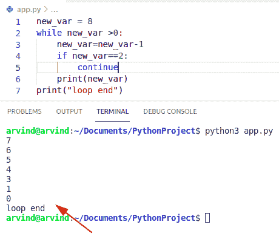
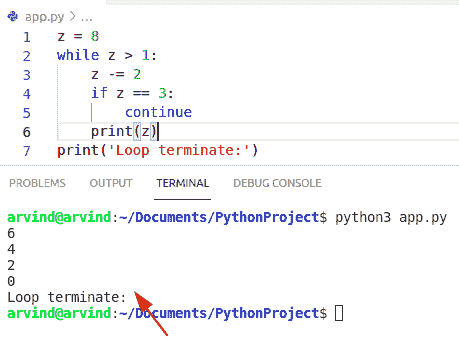
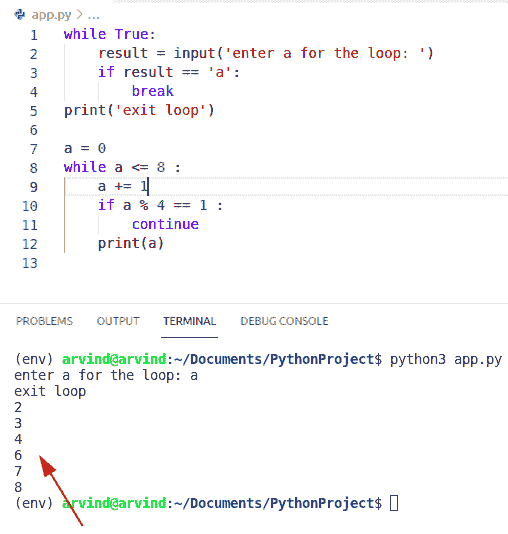
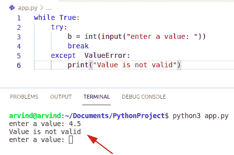
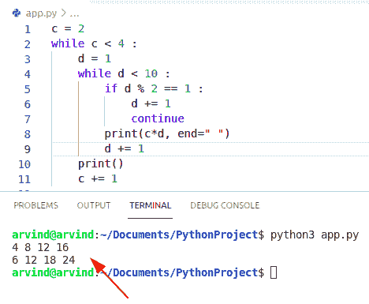
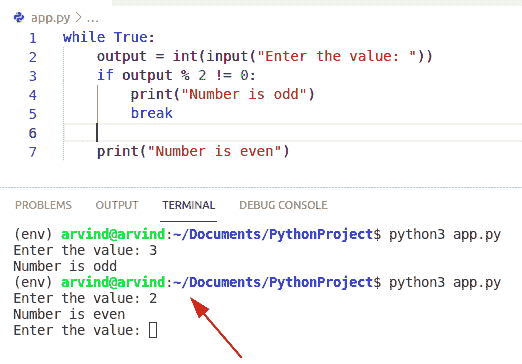
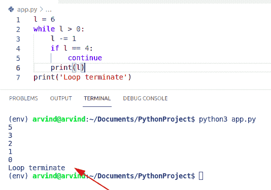
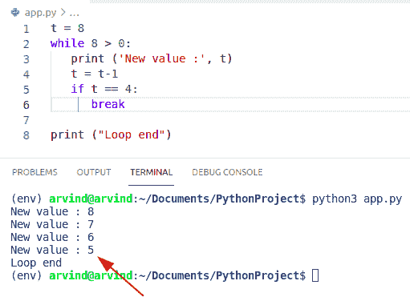
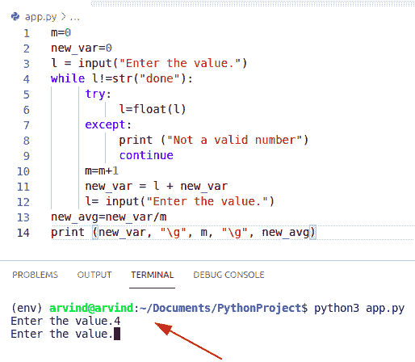
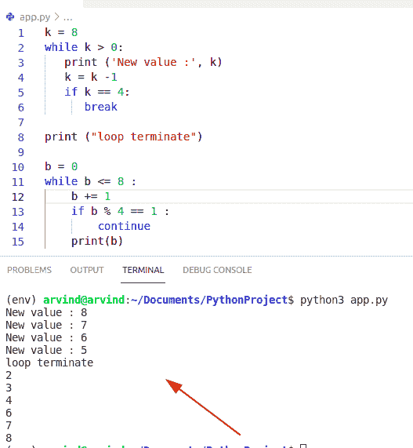

# Python while 循环继续+示例

> 原文：<https://pythonguides.com/python-while-loop-continue/>

[](https://sharepointsky.teachable.com/p/python-and-machine-learning-training-course)

在本 Python 教程中，我们将讨论 **Python While 循环继续**。在这里，我们还将介绍以下示例:

*   Python while 循环继续中断
*   Python while 循环异常继续
*   Python 嵌套 while 循环继续
*   Python while true 循环继续
*   While 循环继续 python 示例
*   异常后 Python 继续 while 循环
*   Python 尝试除了 continue while 循环
*   Python while 循环中断并继续

目录

[](#)

*   [Python while 循环继续](#Python_while_loop_continue "Python while loop continue")
*   [Python while 循环继续中断](#Python_while_loop_continue_break "Python while loop continue break")
*   [Python while 循环异常继续](#Python_while_loop_exception_continue "Python while loop exception continue")
*   [Python 嵌套 while 循环继续](#Python_nested_while_loop_continue "Python nested while loop continue")
*   [Python while true 循环继续](#Python_while_true_loop_continue "Python while true loop continue ")
*   [While 循环继续 Python 示例](#While_loop_continue_Python_example "While loop continue Python example")
*   [Python 尝试除了 continue while 循环](#Python_try_except_continue_while_loop "Python try except continue while loop")
*   [Python while 循环中断并继续](#Python_while_loop_break_and_continue "Python while loop break and continue")

## Python while 循环继续

*   让我们看看如何在 Python 的 `While` 循环中使用 `continue` 语句。
*   **继续**用于跳过循环的部分。该语句执行循环以继续下一次迭代。
*   在 python 中，continue 语句总是返回并将控制移回到 while 循环的顶部。

**举例:**

让我们举一个例子，检查如何在 while 循环中使用 continue 语句

```py
new_var = 8
while new_var >0:
    new_var=new_var-1
    if new_var==2:
        continue
    print(new_var)
print("loop end")
```

在上面的代码中，我们将首先用 8 初始化一个变量，并检查 8 是否大于 0。在这里，您可以看到这是真的，因此我将使用减量语句 8-1，它将变量值显示为 7。它将检查变量是否等于 2。在上面的代码中，您将检查它是否不等于变量，它将打印值 7。

下面是上面代码的输出



Python while loop continue

另一个例子是检查如何在 Python 中的 while 循环中使用 continue 语句。

示例:

```py
z = 8
while z > 1:
    z -= 2
    if z == 3:
        continue
    print(z)
print('Loop terminate:')
```

下面是以下代码的截图



Python while loop continue

阅读: [Python For 循环](https://pythonguides.com/python-for-loop/)

## Python while 循环继续中断

*   在 python 中，break 和 continue 语句是跳转语句。break 语句用于终止循环，而 continue 语句用于继续循环中的下一次迭代。
*   在 break 语句中，控制被转移到循环之外，而在 continue 语句中，控制仍在同一个循环中。

**举例:**

```py
while True:
    result = input('enter a for the loop: ')
    if result == 'a':
        break
print('exit loop')

a = 0
while a <= 8 :
    a += 1
    if a % 4 == 1 :
        continue
    print(a)
```

在上面的代码中，我们将创建一个 while 循环并打印结果 2 到 8，但是当我们在 while 循环中得到一个奇数时，我们将继续下一个循环。而在 break 语句的例子中，我们给出的条件是，如果用户把输入当作‘a ’,它将退出循环。

输出



Python while loop continue break

阅读: [Python While 循环](https://pythonguides.com/python-while-loop/)

## Python while 循环异常继续

*   让我们看看如何在 Python 中的 while 循环 continue 语句中使用 exception 方法。
*   异常是在程序执行过程中正常发生的事件。
*   如果一个语句是系统正确的，那么它执行程序。异常意味着执行过程中的错误检测。
*   在这个例子中，我们可以很容易地使用 try-except 块来执行代码。Try 基本上是用于保存代码段的关键字，而在 except 的情况下，它是实际用于处理异常的代码段。

**举例:**

```py
while True:
    try:
        b = int(input("enter a value: "))
        break
    except  ValueError:
        print("Value is not valid")
```

给定代码的屏幕截图



Python while loop exception continue

阅读: [Python While 循环条件](https://pythonguides.com/python-while-loop-condition/)

## Python 嵌套 while 循环继续

*   让我们看看如何在 Python 中使用**嵌套 while 循环。**
*   在这个例子中，我们将根据一些重要的条件在 while 循环的结构中使用 continue 语句。

**举例:**

让我们举个例子，看看如何在 Python 中使用嵌套 while 循环

```py
c = 2
while c < 4 :
    d = 1
    while d < 10 :
        if d % 2 == 1 :
            d += 1
            continue
        print(c*d, end=" ")
        d += 1
    print()
    c += 1
```

下面是以下给定代码的执行过程



Python nested while loop continue

这就是如何在 python 中使用嵌套 while 循环。

## Python while true 循环继续

在 Python 中，如果给定的条件评估为真，则 while 循环开始。如果在循环执行期间在任何缺少的语法中发现 break 关键字，循环将立即结束。

**举例:**

```py
while True:
    output = int(input("Enter the value: "))
    if output % 2 != 0:
        print("Number is odd")
        break

    print("Number is even")
```

在上面的代码中，我们将创建一个 while 循环并打印结果，无论它是否是偶数，当我们在 while 循环中得到一个奇数时，我们将继续下一个循环。在这个例子中，我们接受一个用户输入，当用户输入值时，它将检查条件，如果它被 2 除，那么这个数字是偶数，否则是奇数。

下面是以下给定代码的实现



Python while true loop continue

阅读: [Python while 循环多个条件](https://pythonguides.com/python-while-loop-multiple-conditions/)

## While 循环继续 Python 示例

*   这里我们可以看到如何使用 continue 语句 while 循环。
*   首先在这个例子中，我们将取一个变量并给它们赋值。现在，当 n 为 4 时，continue 语句将执行该迭代。因此，不打印值 4，执行返回到循环的开始。

**举例:**

让我们举一个例子，检查如何在 while 循环中使用 continue 语句

```py
l = 6
while l > 0:
    l -= 1
    if l == 4:
        continue
    print(l)
print('Loop terminate')
```

输出



while loop continue python example

检查如何在 while 循环中应用 continue 语句的另一个示例

**举例:**

```py
t = 8                  
while 8 > 0:              
   print ('New value :', t)
   t = t-1
   if t == 4:
      break

print ("Loop end")
```

这是程序的输出



While loop continue Python example

阅读: [Python 字典长度](https://pythonguides.com/python-dictionary-length/)

## Python 尝试除了 continue while 循环

*   这里我们可以检查如何在 continue while 循环中应用 try-except 方法。
*   在这个例子中，我想将 while 循环中的输入值转换为 int。在这种情况下，如果值不是整数，它将显示一个错误并继续循环。

**举例:**

```py
m=0
new_var=0
l = input("Enter the value.")
while l!=str("done"):
     try:
          l=float(l)
     except:
          print ("Not a valid number")
          continue
     m=m+1
     new_var = l + new_var      
     l= input("Enter the value.")
new_avg=new_var/m
print (new_var, "\g", m, "\g", new_avg)
```

下面是以下给定代码的实现



Python try-except continue while loop

## Python while 循环中断并继续

*   在 Python 中，有两个语句可以轻松处理这种情况并控制循环流。
*   break 语句执行当前循环。该语句将执行最内部的循环，可用于两种情况**而**和**用于循环**。
*   continue 语句总是将控制返回到 while 循环的顶部。该语句不会执行，但会继续处理下一个迭代项。

**举例:**

让我们举一个例子，看看如何在 while 循环中使用 break and continue 语句

```py
k = 8                    
while k > 0:              
   print ('New value :', k)
   k = k -1
   if k == 4:
      break

print ("loop terminate")

b = 0
while b <= 8 :
    b += 1
    if b % 4 == 1 :
        continue
    print(b) 
```

**输出:**



Python while loop break and continue

这就是如何在 while 循环中使用 break and continue 语句

你可能也喜欢读下面的文章。

*   [使用 Tkinter 的 Python 注册表](https://pythonguides.com/registration-form-in-python-using-tkinter/)
*   [从 PDF Python 中提取文本](https://pythonguides.com/extract-text-from-pdf-python/)
*   [Python 循环遍历一个列表](https://pythonguides.com/python-loop-through-a-list/)
*   [Python 中 For 循环 vs while 循环](https://pythonguides.com/for-loop-vs-while-loop-in-python/)
*   [Python for 循环索引](https://pythonguides.com/python-for-loop-index/)

在本 Python 教程中，我们已经讨论了 **Python While 循环继续**。在这里，我们还介绍了以下示例:

*   Python while 循环继续中断
*   Python while 循环异常继续
*   Python 嵌套 while 循环继续
*   Python while true 循环继续
*   While 循环继续 python 示例
*   异常后 Python 继续 while 循环
*   Python 尝试除了 continue while 循环
*   Python while 循环中断并继续

[Bijay Kumar](https://pythonguides.com/author/fewlines4biju/)

Python 是美国最流行的语言之一。我从事 Python 工作已经有很长时间了，我在与 Tkinter、Pandas、NumPy、Turtle、Django、Matplotlib、Tensorflow、Scipy、Scikit-Learn 等各种库合作方面拥有专业知识。我有与美国、加拿大、英国、澳大利亚、新西兰等国家的各种客户合作的经验。查看我的个人资料。

[enjoysharepoint.com/](https://enjoysharepoint.com/)[](https://www.facebook.com/fewlines4biju "Facebook")[](https://www.linkedin.com/in/fewlines4biju/ "Linkedin")[](https://twitter.com/fewlines4biju "Twitter")