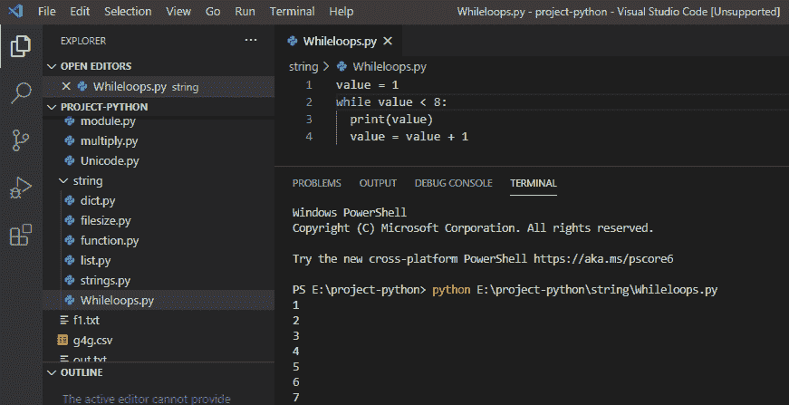
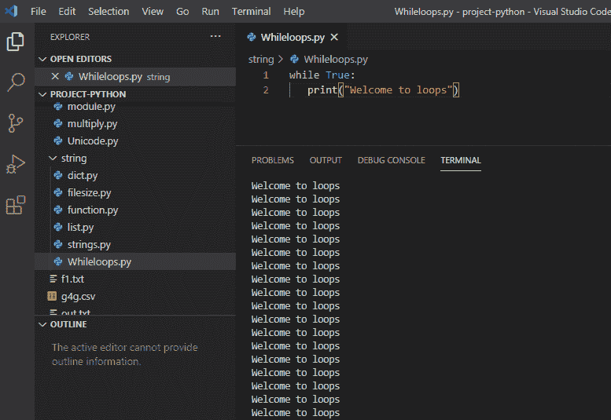
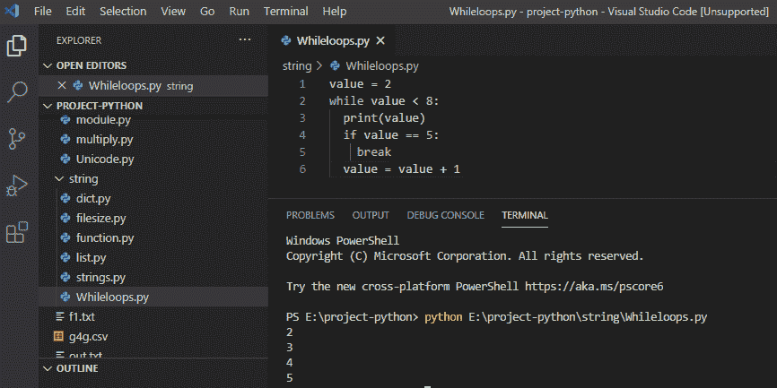
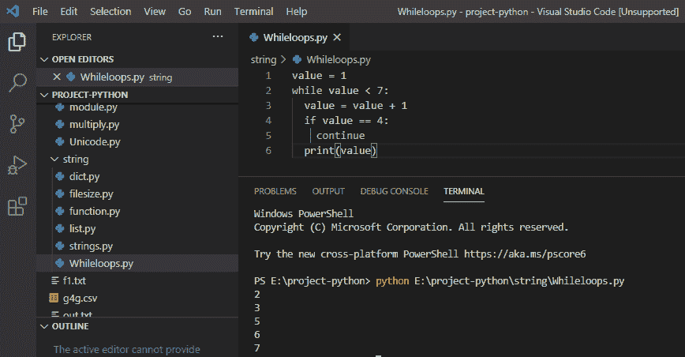
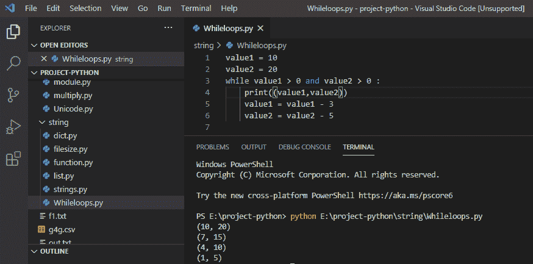
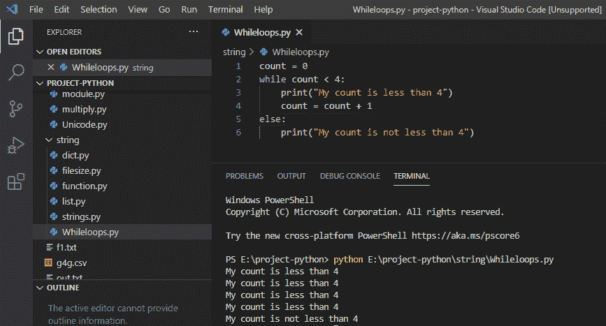
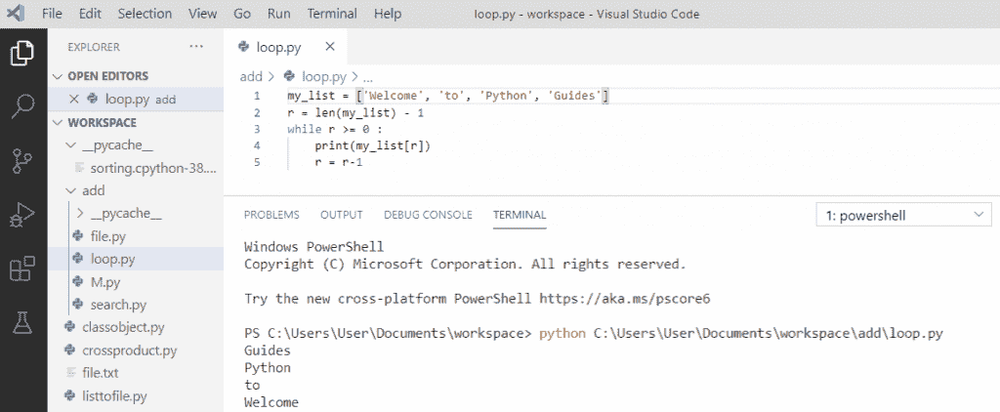
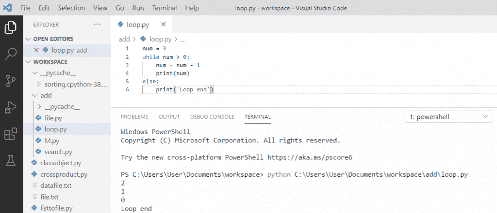

# Python While 循环示例

> 原文：<https://pythonguides.com/python-while-loop/>

[](https://sharepointsky.teachable.com/p/python-and-machine-learning-training-course)

在本 [Python 教程](https://pythonguides.com/python-programming-for-the-absolute-beginner/)中，我们将通过几个例子介绍如何在 python 中使用 **while 循环。此外，我们还将讨论:**

*   Python while 循环
*   python 中的无限 while 循环
*   python 中的 Break 语句
*   python 中的 Continue 语句
*   Python while 循环多个条件
*   使用 else 语句的 Python while 循环
*   python 中的传递与继续
*   反向使用 while 循环 python
*   Python while else

目录

[](#)

*   [python 中的 While 循环](#While_loop_in_python "While loop in python")
*   [python 中的无限 while 循环](#Infinite_while_loop_in_python "Infinite while loop in python")
*   [python 中的 Break 语句](#Break_statement_in_python "Break statement in python")
*   [python 中的 Continue 语句](#Continue_statement_in_python "Continue statement in python")
*   [Python while 循环多个条件](#Python_while_loop_multiple_conditions "Python while loop multiple conditions")
*   [带 else 语句的 Python while 循环](#Python_while_loop_with_else_statement "Python while loop with else statement")
*   [python 中的 Pass vs continue](#Pass_vs_continue_in_python "Pass vs continue in python")
*   [反向使用 while 循环 python](#Reverse_using_while_loop_python "Reverse using while loop python")
*   [Python while else](#Python_while_else "Python while else")

## python 中的 While 循环

在 [python](https://pythonguides.com/python-programming-for-the-absolute-beginner/) 中， **while 循环**被用来迭代代码，直到给定的条件为假。

**举例:**

```py
value = 1
while value < 8:
print(value)
value = value + 1
```

写完上面的代码(python 中的 while 循环)，你将打印出 `" value "` ，然后输出将显示为 `" 1 2 3 4 5 6 7 "` 。

这里，while 循环用于迭代一个代码块，直到它变为 false。可以参考截图`python`中的 while 循环。



## python 中的无限 while 循环

在 python 中，**无限 while 循环**是 while 条件永远不会为假并且循环永远不会结束的循环。

**举例:**

```py
while True:
print("Welcome to loops")
```

写完上面的代码(python 中的无限 while 循环)，你将打印出 `" Welcome to loops "` ，然后输出将显示为 `" Welcome to loops "` ，它将一直持续到无限。

这里，while 循环用于无限期打印，因为条件将保持为真。可以参考 python 中的截图**无限 while 循环。**



## python 中的 Break 语句

在 python 中， `break` 语句用于停止 **while 循环**，即使条件为真。

**举例:**

```py
value = 2
while value < 8:
print(value)
if value == 5:
break
value = value + 1
```

写完上面的代码(python 中的 break 语句)，你将打印出 `" value "` ，然后输出将显示为 `" 2 3 4 5 "` 。

在这里，即使我的 while 条件为真，我们也可以使用 break 语句来停止该条件。可以参考 python 中的截图 break 语句。



## python 中的 Continue 语句

在 python 中， `continue` 语句用于停止当前迭代，然后继续下一次迭代，直到最后一次迭代。

**举例:**

```py
value = 1
while value < 7:
value = value + 1
if value == 4:
continue
print(value)
```

写完上面的代码(python 中的 continue 语句)，你将打印出 `" value "` ，然后输出将显示为 `" 2 3 5 6 7 "` 。

这里，我们将使用 continue 语句来停止当前的迭代，它将继续下一次迭代。可以参考下面截图`python`中的 continue 语句。



## Python while 循环多个条件

在 python 中，当两个简单的布尔条件由逻辑运算符**和**连接时，使用 **while 循环**多个条件。

**举例:**

```py
value1 = 10
value2 = 20
while value1 > 0 and value2 > 0
print((value1, value2))
value1 = value1 - 3
value2 = value2 - 5
```

写完上面的代码(python while 循环多个条件)，你将打印出 **" value 1，value2 "** ，然后输出将显示为 **" (10，20) (7，15) (4，10) (1，5) "** 。

这里，我们将使用逻辑运算符**和**来连接条件。可以参考下面截图 **python while 循环多个条件**。



## 带 else 语句的 Python while 循环

在 python 中， `else` 部分与 **while 循环**语句相关联。当条件为假时，执行 else 部分。

**举例:**

```py
count = 0
while count < 4:
print("My count is less than 4")
count = count + 1
else:
print("My count is not less than 4")
```

写完上面的代码(python while loop with else 语句)，你将打印出，然后输出将显示为**“我的计数小于 4”**，它将被打印 4 次**，直到条件为真，当条件为假时，它转到 else 部分并打印出“**我的计数不小于 4** ”。**

 **这里，当 while 循环条件评估为 false 时，则执行 else 部分。可以参考下面截图 **python while 循环带 else 语句**。



## python 中的 Pass vs continue

| **通过** | **继续** |
| Pass 语句什么也不做 | Where continue 语句跳过循环中所有剩余的语句，并将控件移回循环的顶部。 |
| 当您需要一些空函数、类或循环以供将来实现时，可以使用 Pass | 当循环中满足某个条件，并且您需要跳过当前迭代并转到下一个迭代时，使用 Continue。 |
| **例:**
str = " Guides "
for I in str:
if I = = ' d '
print(' Pass executed ')
Pass
print(I)
print() | **例:**
str = " Guides "
for I in str:
if I = = ' d '
print(' Continue executed ')
Continue
print(I) |

## 反向使用 while 循环 python

Python while 循环用于重复执行一些语句，直到条件为真。为了获得**逆序**中的元素，我们将使用 **while 循环**，该循环将迭代到第一个元素，并继续递减**“r”**。

**举例:**

```py
my_list = ['Welcome', 'to', 'Python', 'Guides']
r = len(my_list) - 1
while r >= 0 :
    print(my_list[r])
    r = r-1
```

写完上面的代码(反向使用 while 循环 python)，你会打印出 **"my_list[r]"** 然后输出会显示为 `" Guides Python to Welcome "` 。这里，while 循环用于遍历列表并反向访问元素，即从(大小-1)到 0。

可以参考下面截图反向使用 while 循环 python



Reverse while loop python

## Python while else

Python 允许在 **while 循环**的末尾有一个可选的 `else` 子句。当 while 循环终止时，将执行 else 子句中指定的附加语句。

**举例:**

```py
num = 3
while num > 0:
    num = num - 1
    print(num)
else:
    print('Loop end')
```

写完上面的代码(python 而 else)，你将打印出 `" num "` ，然后输出将显示为 **" 2 1 0 循环结束"**。这里， **while 循环**用于迭代，直到条件用尽，当 while 循环终止时，将执行 `else` 子句。

你可以参考下面的截图



Python while else

这样，我们就可以在 python 中使用 **while 循环。**

您可能会喜欢以下 Python 教程:

*   [Python 中的字符串方法及示例](https://pythonguides.com/string-methods-in-python/)
*   [Python 检查变量是否为整数](https://pythonguides.com/python-check-if-the-variable-is-an-integer/)
*   [检查一个数是否是素数 Python](https://pythonguides.com/check-if-a-number-is-a-prime-python/)
*   [Python 将元组转换为列表](https://pythonguides.com/python-convert-tuple-to-list/)
*   [python 中的百分号是什么意思](https://pythonguides.com/percent-sign-mean-in-python/)
*   [Python 内置函数示例](https://pythonguides.com/python-built-in-functions/)
*   [获取当前目录 Python](https://pythonguides.com/get-current-directory-python/)
*   [Python 数组与示例](https://pythonguides.com/python-array/)
*   [Python 中的排序算法](https://pythonguides.com/sorting-algorithms-in-python/)
*   [Python 中的优先级队列](https://pythonguides.com/priority-queue-in-python/)

在本教程中，我们通过例子学习了如何在 python 中使用 **while 循环:**

*   python 中的 While 循环
*   python 中的无限 while 循环
*   python 中的 Break 语句
*   python 中的 Continue 语句
*   Python while 循环多个条件
*   使用 else 语句的 Python while 循环
*   python 中的传递与继续
*   反向使用 while 循环 python
*   Python while else

[Bijay Kumar](https://pythonguides.com/author/fewlines4biju/)

Python 是美国最流行的语言之一。我从事 Python 工作已经有很长时间了，我在与 Tkinter、Pandas、NumPy、Turtle、Django、Matplotlib、Tensorflow、Scipy、Scikit-Learn 等各种库合作方面拥有专业知识。我有与美国、加拿大、英国、澳大利亚、新西兰等国家的各种客户合作的经验。查看我的个人资料。

[enjoysharepoint.com/](https://enjoysharepoint.com/)[](https://www.facebook.com/fewlines4biju "Facebook")[](https://www.linkedin.com/in/fewlines4biju/ "Linkedin")[](https://twitter.com/fewlines4biju "Twitter")**