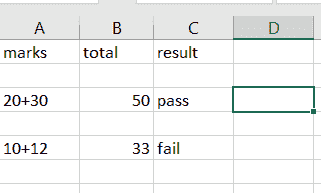

# Python 写一个列表到 CSV

> 原文：<https://pythonguides.com/python-write-a-list-to-csv/>

[](https://sharepointsky.teachable.com/p/python-and-machine-learning-training-course)

在这个 [Python 教程](https://pythonguides.com/python-programming-for-the-absolute-beginner/)中，我们将学习 **Python 写列表到 CSV，**并且我们也将涉及这些主题:

*   Python 将列表写入 CSV 行
*   Python 写一个列表到 CSV 头
*   Python 给 CSV 熊猫写列表
*   Python 向 CSV numpy 写一个列表
*   Python 向 CSV 换行写一个列表
*   Python 将嵌套列表写入 CSV
*   Python 写了一个列表列表到 CSV
*   Python 将列表附加到 CSV
*   Python 将列表写入 CSV 列

目录

[](#)

*   [Python 向 CSV 写列表](#Python_write_a_list_to_CSV "Python write a list to CSV")
*   [Python 向 CSV 行写入列表](#Python_write_a_list_to_CSV_row "Python write a list to CSV row")
*   [Python 写一个列表到 CSV 头](#Python_write_a_list_to_CSV_header "Python write a list to CSV header")
*   [Python 给 CSV 熊猫写列表](#Python_write_a_list_to_CSV_pandas "Python write a list to CSV pandas")
*   [Python 写一个列表给 CSV numpy](#Python_write_a_list_to_CSV_numpy "Python write a list to CSV numpy")
*   [Python 写一个列表给 CSV 换行](#Python_write_a_list_to_CSV_newline "Python write a list to CSV newline")
*   [Python 将嵌套列表写入 csv](#Python_write_a_nested_list_to_csv "Python write a nested list to csv")
*   [Python 写一个列表列表到 CSV](#Python_write_a_list_of_list_to_CSV "Python write a list of list to CSV")
*   [Python 向 CSV 追加列表](#Python_append_a_list_to_CSV "Python append a list to CSV")
*   [Python 向 CSV 列写列表](#Python_write_a_list_to_CSV_column "Python write a list to CSV column")

## Python 向 CSV 写列表

在这里，我们可以看到**用 python 写了一个列表到 csv**

*   在这个例子中，我导入了一个名为 csv 的**模块，并声明了一个**变量作为细节**。**
*   而另一个变量叫做 rows as **rows = [ ['sushma '，' 2nd '，' 2023 '，' Physics']，['john '，' 3rd '，' 2022 '，' M2']，['kushi '，' 4th '，' 2021 '，' M4 ']**然后打开 csv 文件，我已经用 with **open('student.csv '，' w')** as f:用来打开文件。
*   `student.csv` 是文件名，使用**【w】**模式写入文件，将列表写入 csv 文件 `write = csv.writer(f)` ，将列表的每一行写入 CSV 文件**使用 writer.writerow()** 。

示例:

```py
import csv 
Details = ['Name', 'class', 'passoutYear', 'subject']  
rows = [ ['sushma', '2nd', '2023', 'Physics'],  ['john', '3rd', '2022', 'M2'],  ['kushi', '4th', '2021', 'M4']] 
with open('student.csv', 'w') as f: 
    write = csv.writer(f) 
    write.writerow(Details) 
    write.writerows(rows) 
```

您可以在下面的屏幕截图中看到该列表的输出。


Python write a list to CSV

## Python 向 CSV 行写入列表

在这里，我们可以看到**如何用 python 写一个列表到 csv 行**。

*   在这个例子中，我已经导入了一个名为 csv 的**模块，并调用了变量**数据**和赋值**数据=[' 1 ']，['3']，['5']，['7']]** ，并创建了一个文件为 `odd.csv` ，使用 `"w+"` 模式写入文件。**
*   而**newline =“”**用于获取换行符中的值。 `csv.writer(file)` 用于将列表中的所有数据写入 csv 文件， `write.writerows` 用于将所有行写入文件。

示例:

```py
import csv 
data = [['1'], ['3'], ['5'],['7']] 
file = open('odd.csv', 'w+', newline ='') 
with file:     
    write = csv.writer(file) 
    write.writerows(data) 
```

我们可以看到行格式的输出。您可以参考下面的输出截图


Python write a list to CSV row

## Python 写一个列表到 CSV 头

在这里，现在我们可以看到**如何用 python 写一个列表到 csv 头**。

*   在这个例子中，我导入了一个名为 csv 的**模块，并将一个变量作为**列表**。然后要打开文件，我已经用 **with open('result.csv '，' w')** 作为 f**
*   `result.csv` 是文件名，csv writer 是用于将列表写入 csv 的函数。
*   为了将列表中的行写入 CSV 文件，我使用了 **writer.writerow(['marks '，' total '，' result'])** 。
*   再有 `writerows()` 方法也用来写列表头， **'marks '，' total '，' result'** 是列表头。

示例:

```py
import csv
list = [['20+30', '50', 'pass'],['10+12', '33', 'fail']]
with open('result.csv','w') as f:
    writer = csv.writer(f)
    writer.writerow(['marks', 'total', 'result'])
    writer.writerows(list)
```

在下面的截图中，你可以看到列表和标题



Python write a list to CSV header

## Python 给 CSV 熊猫写列表

在这里，我们可以看到**如何在 python 中使用熊猫**编写 list csv。

*   在这个例子中，我导入了一个名为 `pandas` 的模块作为 `pd` ，并且我取了一个变量作为**的名字。**
*   然后声明一个字典并将**键和值对**赋值为 **dictionary = {'name': name，' subjects': subjects，' marks': marks}** 。
*   数据框是二维表格，其中表格列的类型可能不同。
*   **data frame . to _ csv(' name . CSV ')**用于将列表中的数据写入 CSV 文件。

示例:

```py
import pandas as pd  
name = ["sonu", "monu"] 
subjects= ["Maths", "English"]
marks = [45, 65,] 
dictionary = {'name': name, 'subjects': subjects, 'marks': marks}  
dataframe = pd.DataFrame(dictionary) 
dataframe.to_csv('name.csv')
```

您可以参考下面的输出截图:


Python write a list to CSV pandas

## Python 写一个列表给 CSV numpy

在这里，我们可以看到**如何使用 python 中的 numpy** 将列表写入 csv

*   在这个例子中，我将一个名为 **numpy 的模块作为 np** 导入，并将一个变量作为**行。**
*   `np.savetxt()` 方法用于将列表写入并保存到 CSV 文件中，即**学生。csv** 是文件名，使用分隔符， **fmt = %s** 是占位符。

示例:

```py
import numpy as np 
rows = [ ['Sonu', 'maths', '45'],  
         ['Monu', 'english', '25'],  
         ['Ammu', 'hindi', '35']] 
np.savetxt("student.csv",rows, delimiter =" ",  fmt ='% s') 
```

该列表可以被视为输出，您可以参考下面的 thr 输出截图:


Python write a list to CSV numpy

## Python 写一个列表给 CSV 换行

现在，我们可以看到**如何用 python 中的换行符**将列表写入 csv

*   在这个例子中，我已经导入了一个名为 CSV 的**模块，并采用了一个变量作为 `Even_list` 。**
*   **使用 def write_to_csv(Even_list)** 然后用 open('even.csv '，' w '，newline=") 打开文件**为 csvfile。**
*   `even.csv` 是文件的名称，为了在一个新的单独的行中获得列表，**换行符**被用作**换行符= ' '**,`writer . writerows`被用于将列表的每一行写入 csv 文件。
*   write_to_csv 用于写入所有内容。

示例:

```py
import csv
Even_list= ['2','4','6','8']
def write_to_csv(Even_list):
     with open('even.csv', 'w', newline='') as csvfile:
         writer = csv.writer(csvfile)
         writer.writerows(Even_list)
write_to_csv(Even_list) 
```

您可以参考下面的输出截图:


Python write a list to CSV newline

## Python 将嵌套列表写入 csv

现在，我们可以看到**如何用 python 写嵌套列表到 csv**

*   在这个例子中，我导入了一个名为 csv 的模块，并取了一个变量 `items` 。
*   为了打开文件，我使用了带有 open('fruits.csv '，' w ')的**作为 f** 。 `write.writerrows(items)` 用于将列表的每一行写入 CSV 文件。

示例:

```py
import csv 
items = [(('fruits', 'apple'), 25), (('vegetables', 'tomato'), 23), (('chocolate', 'kitkat'), 42)]
with open('fruits.csv', 'w') as f: 
    write = csv.writer(f) 
    write.writerows(items)
```

在下面的截图中，我们可以看到嵌套列表的输出。


Python write a nested list to csv

## Python 写一个列表列表到 CSV

在这里，我们可以看到**如何用 python 写一个列表到 csv** 中

*   在这个例子中，我已经导入了名为 csv 的**模块，并将一个变量作为**数据**。**
*   为了打开这个文件，我使用了 **with open("student.csv "，" w "，newline="` " `)作为 f** 。 `student.csv` 是文件的名称，使用了一个**换行符**。
*   `writer = csv.writer(f)` 用于将数据写入 csv 文件， `writer.writerows(data)` 用于将每一行写入 csv 文件。

示例:

```py
import csv
data = [['name','sonu'],['age','6'],['gender','male']]
with open("student.csv", "w", newline="") as f:
   writer = csv.writer(f)
   writer.writerows(data)
```

在下面的截图中，您可以看到输出:


Python write a list of list to CSV

## Python 向 CSV 追加列表

在这里，我们可以看到**如何在 python 中将一个列表追加到一个已经存在的 csv 文件**中

*   在这个例子中，我已经导入了一个名为 CSV 的**模块来追加列表，我已经将已经存在的文件作为**打开，open('result.csv '，' a ')作为 f** 。 `result.csv` 是文件的名称。**
*   模式 `"a"` 用于追加文件， `writer = csv.writer(f)` 用于将列表中的所有数据写入 csv 文件。
*   `writer.writerow` 用于将列表中的每一行写入 CSV 文件。 **['等级'，' B']** 是追加到现有文件中的新列表。

示例:

```py
import csv
with open('result.csv','a') as f:
    writer = csv.writer(f)
    writer.writerow(['grade','B']) 
```

我们可以在输出中看到追加的新列表， **['grade '，' B']** 是新列表。您可以参考下面的输出截图。


Python append a list to CSV

## Python 向 CSV 列写列表

现在，我们可以看到**如何用 python 写一个列表到 csv 列**

*   在这个例子中，我导入了一个名为 CSV 的**模块，并从 **itertools 导入了 zip_longest** 模块。这个模块主要用于迭代它，它以序列格式打印可迭代的值。**
*   我取了两个变量作为**项 1** 和**项 2** ，这两个变量的值赋给了另一个变量**数据**。
*   为了从文件中移动数据并填充值，我使用了**export _ data = zip _ longest(* data，fillvalue = ")** 。
*   并且打开了文件名为 `items.csv` 的文件用**“w”**模式写文件并对值进行编码然后将数据写入 csv 文件，我用过 **write = csv.writer(file)。**
*   `write.writerow()` 用于将所有行的数据写入 CSV 文件。

示例:

```py
import csv
from itertools import zip_longest
item1 = ['toys', 'ball', 'cot', 'doll']
item2 = ['fan', 'goat', 'ink', 'jug']
data = [item1, item2]
export_data = zip_longest(*data, fillvalue = '')
with open('items.csv', 'w', encoding="ISO-8859-1", newline='') as file:
      write = csv.writer(file)
      write.writerow(("item1", "item2"))
      write.writerows(export_data) 
```

在下面的截图中，我们可以看到数据以列格式输出。


Python write a list to CSV column

您可能会喜欢以下 Python 教程:

*   [使用 if-else 理解 Python 列表](https://pythonguides.com/python-list-comprehension-using-if-else/)
*   [Python 从列表中选择](https://pythonguides.com/python-select-from-a-list/)
*   [Python 中的链表](https://pythonguides.com/linked-lists-in-python/)
*   [Python 列表理解λ](https://pythonguides.com/python-list-comprehension/)
*   [Python 类型错误:“列表”对象不可调用](https://pythonguides.com/python-typeerror-list-object-is-not-callable/)
*   [Python 将列表写入文件，并附有示例](https://pythonguides.com/python-write-list-to-file/)
*   [检查一个列表是否存在于另一个列表中 Python](https://pythonguides.com/check-if-a-list-exists-in-another-list-python/)
*   [如何在 Turtle Python 中附加图像](https://pythonguides.com/attach-image-to-turtle-python/)
*   [Python 字典到 CSV](https://pythonguides.com/python-dictionary-to-csv/)

在本教程中，我们已经了解了 **Python 向 CSV** 写入列表，并且我们已经涵盖了以下主题:

*   Python 将列表写入 CSV 行
*   Python 写一个列表到 CSV 头
*   Python 给 CSV 熊猫写列表
*   Python 向 CSV numpy 写一个列表
*   Python 向 CSV 换行写一个列表
*   Python 将嵌套列表写入 CSV
*   Python 写了一个列表列表到 CSV
*   Python 将列表附加到 CSV
*   Python 将列表写入 CSV 列

[Bijay Kumar](https://pythonguides.com/author/fewlines4biju/)

Python 是美国最流行的语言之一。我从事 Python 工作已经有很长时间了，我在与 Tkinter、Pandas、NumPy、Turtle、Django、Matplotlib、Tensorflow、Scipy、Scikit-Learn 等各种库合作方面拥有专业知识。我有与美国、加拿大、英国、澳大利亚、新西兰等国家的各种客户合作的经验。查看我的个人资料。

[enjoysharepoint.com/](https://enjoysharepoint.com/)[](https://www.facebook.com/fewlines4biju "Facebook")[](https://www.linkedin.com/in/fewlines4biju/ "Linkedin")[](https://twitter.com/fewlines4biju "Twitter")