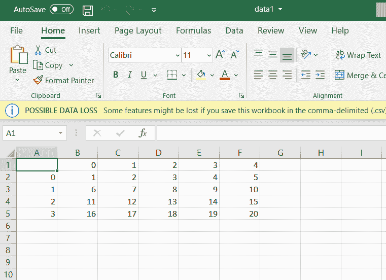
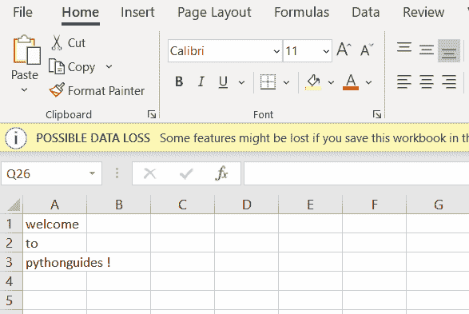
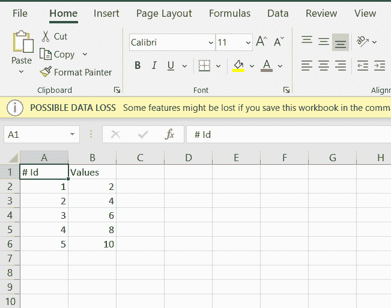
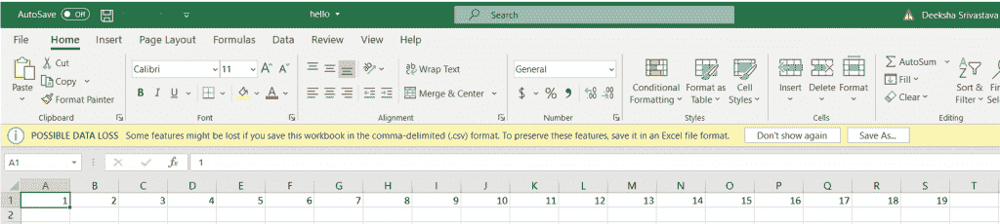
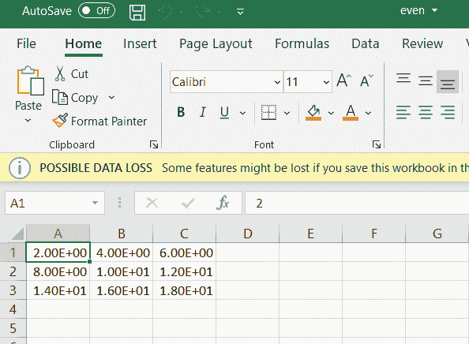
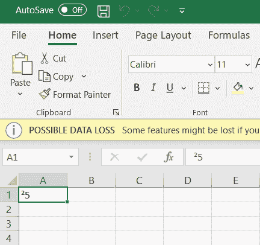
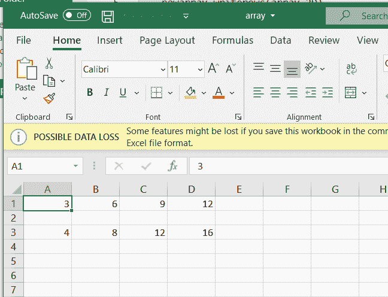
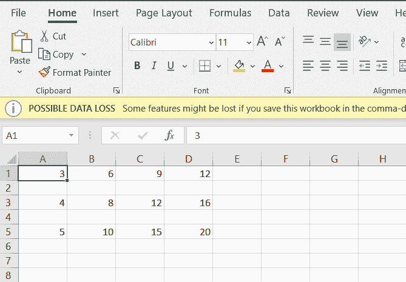

# 如何将 Python 数组写入 CSV

> 原文：<https://pythonguides.com/python-write-array-to-csv/>

[](https://sharepointsky.teachable.com/p/python-and-machine-learning-training-course)

在本 [Python 教程](https://pythonguides.com/python-programming-for-the-absolute-beginner/)中，我们将学习 **Python 将数组写入 CSV，**并且我们将涵盖以下主题:

*   如何将 [Python 数组](https://pythonguides.com/python-array/)写入 CSV 文件
*   Python 将数组写入 CSV 行
*   Python 将数组写入 CSV 头
*   Python 使用 np.arange 将数组写入 CSV 文件
*   Python 使用 numpy.savetxt 将数组写入 CSV 文件
*   Python 将字节文字写入 CSV 文件
*   Python 将 2Darray 写入 CSV 文件
*   Python 将 3D 数组写入 CSV 文件

目录

[](#)

*   [Python 将数组写入 CSV](#Python_write_array_to_CSV "Python write array to CSV")
*   [Python 将数组写入 CSV 行](#Python_write_array_to_CSV_row "Python write array to CSV row")
*   [Python 将数组写入 CSV 头](#Python_write_array_to_CSV_header "Python write array to CSV header")
*   [Python 使用 np.arange 将数组写入 CSV 文件](#Python_write_array_to_CSV_file_using_nparange "Python write array to CSV file using np.arange")
*   [Python 使用 numpy.savetxt 将数组写入 CSV 文件](#Python_write_array_to_CSV_file_using_numpysavetxt "Python write array to CSV file using numpy.savetxt")
*   [Python 将字节文字写入 CSV 文件](#Python_write_byte_literals_to_CSV_file "Python write byte literals to CSV file")
*   [Python 将 2Darray 写入 CSV 文件](#Python_write_2Darray_to_CSV_file "Python write 2Darray to CSV file")
*   [Python 将 3D 数组写入 CSV 文件](#Python_write_3D_array_to_CSV_file "Python write 3D array to CSV file")

## Python 将数组写入 CSV

在这里，我们可以看到**如何用 python 写一个数组到 csv 文件**。

*   在这个例子中，我导入了一个名为 **pandas 的模块作为 pd** 和 **numpy 作为 np。**
*   然后将一个变量声明为一个**数组**并赋值**数组= np.arange(1，21)。整形(4，5)。**
*   arange 是一个内置的 numpy 包，它返回 nd 个数组对象， **(1，21)** 是给定的范围，shape(4，5)用于获得数组的形状。
*   数据框是一种二维数据结构，数据以行和列的表格形式排列。
*   **pd。DataFrame(array)** 是 panda 的数据框架，这是一个具有行和列的二维可变异构表格数据结构。
*   将值传递给 csv 文件**data frame . to _ CSV(r " C:\ Users \ Administrator。SharePoint sky \ Desktop \ Work \ data1 . CSV ")**使用。
*   使用文件的路径和文件名， `data1.csv` 是文件名。

示例:

```py
import pandas as pd 
import numpy as np 
array = np.arange(1,21).reshape(4,5) 
dataframe = pd.DataFrame(array) 
dataframe.to_csv(r"C:\Users\Administrator.SHAREPOINTSKY\Desktop\Work\data1.csv")
```

您可以看到数组作为输出存储在 CSV 文件中。您可以参考下面的输出截图。



Python write array to CSV

## Python 将数组写入 CSV 行

现在，我们可以看到**如何在 python 中将数组写入 CSV 行**。

*   在这个例子中，我导入了一个名为 `CSV` 和 **numpy 的模块作为 np。**`CSV`文件是最常用的平面文件，用于跨平台存储和共享数据。
*   我将一个变量作为数组并给**数组= [['welcome']，['to']，[' python guides！]]].**
*   file = open(r ' c:\ Users \ Administrator。SharePoint sky \ Desktop \ Work \ site . CSV '，' w+'，newline =") 这是路径， `site.csv` 是文件名。
*   `write = csv.writer(file)` 用于创建写对象，写行用于将单行写入文件。

示例:

```py
import csv 
import numpy as np
array = [['welcome'], ['to'], ['pythonguides !']] 
file = open(r'C:\Users\Administrator.SHAREPOINTSKY\Desktop\Work\site.csv', 'w+', newline ='') 
with file:     
    write = csv.writer(file) 
    write.writerows(array) 
```

在下面的屏幕截图中可以看到行格式的输出。



Python write array to CSV row

## Python 将数组写入 CSV 头

在这里，我们可以看到**如何用 python 写数组到 csv 头**。

*   在这个例子中，我导入了一个名为 `numpy` 的模块作为 np，并取了一个名为 **array = np.array([2，4，6，8，10])** 的变量。
*   使用 `np.array` 创建一个数组，创建另一个变量 newfile，并赋值**new file = NP . save txt(" header . CSV "，np.dstack((np.arange(1，array.size+1)，array))[0]，" %d，%d "，header="Id，Values ")。**
*   `np.savetxt` 用于将数组保存到文件中， `header.csv` 是文件的名称。
*   `np.dstack` 是用于 3 维数组的函数为了得到一个数组的大小，我用过 **(1，array.size+1)，array)) [0]。**
*   **%d** 用于占位符 **header="Id，Values"** 用于随 header 一起获取 number 的值。为了得到输出，我使用了 `print(newfile)` 。

示例:

```py
import  numpy as np
array = np.array([2 ,4, 6, 8, 10])
newfile = np.savetxt("header.csv", np.dstack((np.arange(1, array.size+1),array))[0],"%d,%d",header="Id,Values")
print(newfile)
```

在这里，我们可以看到这些值以及标题 **id =标题**和 **value =值。**您可以参考下面的输出截图。



Python write array to CSV header

## Python 使用 np.arange 将数组写入 CSV 文件

现在，我们可以看到**如何在 python 中使用 np.arange** 将数组写入 ccsv 文件。

*   在这个例子中，我将一个名为 **numpy 的模块作为 np** 导入，并创建了一个名为**数组**的变量，并将**数组赋值为 np.arange(1，20)** 。
*   `np.arange` 用于创建一个范围为(1，20)的数组，是给定的范围。
*   `array.tofile` 用于将所有条目写入 file 对象， **'hello.csv'** 是文件名 **sep = '，'**是分隔符。

示例:

```py
import numpy as np 
array = np.arange(1,20) 
print(array) 
array.tofile('hello.csv', sep = ',')
```

给定范围之间的数字作为输出显示在下面的屏幕截图中。



Python write array to CSV file using np.arange

## Python 使用 numpy.savetxt 将数组写入 CSV 文件

在这里，我们可以**如何使用 python 中的 numpy.savetxt** 将数组写入 csv 文件

*   在这个例子中，我已经导入了一个名为 numpy 的模块，并创建了一个变量作为 `array` ，并将 **array = numpy.array([[2，4，6]，[8，10，12]，[14，16，18]])。**
*   我用过 **numpy.savetxt("even.csv "，a，delimiter = "，"，"，**save txt 是 numpy 用来保存 numpy 数组到文件的函数。
*   分隔符是一个字符序列，用于指定分隔符之间的边界。

示例:

```py
import numpy 
array = numpy.array([[2, 4, 6], 
                 [8, 10, 12], 
                 [14, 16, 18]]) 
numpy.savetxt("even.csv", array, delimiter = ",")
```

您可以参考下面的输出截图:



Python write array to CSV file using NumPy.savetxt

## Python 将字节文字写入 CSV 文件

在这里，我们可以看到**如何用 python 将字节文字写入 csv 文件**。

*   在这个例子中，我已经导入了类似 `CSV` 的模块，打开了一个名为 `bytes.csv` 的文件，并使用**“w”**模式写入文件，使用 `newline=" "` 将数据放入新的一行，
*   然后赋值 byte = b'\xb25 '，为了对这个字节进行编码，我调用了另一个变量作为 `encode` ，赋值为**encode = byte . decode(" iso-8859-1 ")。**
*   为了写入到 `CSV` 文件中，我使用了 `csv.writer(file)` 将行写入到编码值的文件中，我使用了 **file.writerow([encode])** 。

示例:

```py
import csv
    with open("bytes.csv", "w", newline="") as csvfile:
        byte = b'\xb25'
        encode = byte.decode("iso-8859-1")
        file = csv.writer(csvfile)
        file.writerow([encode])
```

字节文字值以 csv 文件格式存储。您可以参考下面的输出截图:



Python write byte literals to CSV file

## Python 将 2Darray 写入 CSV 文件

在这里，我们可以看到**如何用 python 写 2Darray 到 CSV 文件**

*   在这个例子中，我导入了一个名为 `csv` 的模块，变量被创建为 **array_2D as array_2D = [[3，6，9，12]，[4，8，12，16]]。**
*   打开我用 open("array.csv "，" w+")作为 my_csv 的文件:array.csv 是文件名 `"w+"` 是用来写文件的模式。
*   另一个变量 new array 称为 **newarray = csv.writer(my_csv，delimiter= '，')。**CSV 写入器用于将数据插入 CSV 文件。
*   分隔符是一个字符序列，用于指定分隔符之间的边界。
*   `new array . writerows(array _ 2D)`用于写入 csv 文件中的每一行。

示例:

```py
import csv
array_2D = [[3,6,9,12],[4,8,12,16]]
with open("array.csv","w+") as my_csv:
    newarray = csv.writer(my_csv,delimiter=',')
    newarray.writerows(array_2D)
```

在下面的屏幕截图中，您可以看到 2D 阵列存储在 csv 文件中。您可以参考下面的输出截图。



Python write 2Darray to CSV file

## Python 将 3D 数组写入 CSV 文件

在这里，我们可以看到**如何用 python 写 3Darray 到 CSV 文件**

*   在这个例子中，我导入了一个名为 `csv` 的模块，变量被创建为 **array_3D as array_2D = [[3，6，9，12]，[4，8，12，16]，[5，10，15，20]]。**
*   为了打开这个文件，我使用了带有 open 的**(" array . CSV "，" w+")作为 my _ CSV**:`array . CSV`是这个文件的名字**，" w+"** 是用来写这个文件的模式。
*   另一个变量 new array 称为 **newarray = csv.writer(my_csv，delimiter= '，')。**CSV 写入器用于将数据插入 CSV 文件。
*   分隔符是一个字符序列，用于指定分隔符之间的边界。
*   `new array . writerows(array _ 3D)`用于写入 CSV 文件中的每一行。

示例:

```py
import csv
array_3D = [[3,6,9,12],[4,8,12,16],[5,10,15,20]]
with open("array_3D.csv","w+") as my_csv:
    newarray = csv.writer(my_csv,delimiter=',')
    newarray.writerows(array_3D)
```

在下面的截图中，您可以看到 3D 数组存储在 csv 文件中的输出。



Python write 3D array to CSV file

您可能会喜欢以下 Python 教程:

*   [Python 形状的一个数组](https://pythonguides.com/python-shape-of-an-array/)
*   [如何将 Python 字符串转换成字节数组并举例](https://pythonguides.com/python-string-to-byte-array/)
*   [在 Python 中创建一个空数组](https://pythonguides.com/create-an-empty-array-in-python/)
*   [Python 读取二进制文件](https://pythonguides.com/python-read-a-binary-file/)
*   [Python 文件方法(附有用例子)](https://pythonguides.com/python-file-methods/)
*   [如何用 Python 制作矩阵](https://pythonguides.com/make-a-matrix-in-python/)
*   [Python Tkinter 窗口大小](https://pythonguides.com/python-tkinter-window-size/)
*   [检查一个列表是否存在于另一个列表中 Python](https://pythonguides.com/check-if-a-list-exists-in-another-list-python/)

在本教程中，我们已经了解了 **Python 将数组写入 CSV 文件**，并且我们已经涵盖了以下主题:

*   Python 将数组写入 CSV 文件
*   Python 将数组写入 CSV 行
*   Python 将数组写入 CSV 头
*   Python 使用 np.arange 将数组写入 CSV 文件
*   Python 使用 numpy.savetxt 将数组写入 CSV 文件
*   Python 将字节文字写入 CSV 文件
*   Python 将 2Darray 写入 CSV 文件
*   Python 将 3D 数组写入 CSV 文件

[Bijay Kumar](https://pythonguides.com/author/fewlines4biju/)

Python 是美国最流行的语言之一。我从事 Python 工作已经有很长时间了，我在与 Tkinter、Pandas、NumPy、Turtle、Django、Matplotlib、Tensorflow、Scipy、Scikit-Learn 等各种库合作方面拥有专业知识。我有与美国、加拿大、英国、澳大利亚、新西兰等国家的各种客户合作的经验。查看我的个人资料。

[enjoysharepoint.com/](https://enjoysharepoint.com/)[](https://www.facebook.com/fewlines4biju "Facebook")[](https://www.linkedin.com/in/fewlines4biju/ "Linkedin")[](https://twitter.com/fewlines4biju "Twitter")