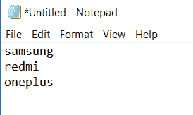
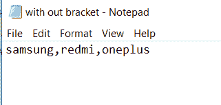
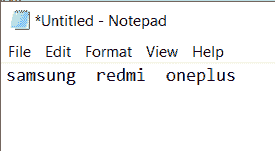
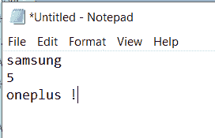

# Python 将列表写入文件，并附有示例

> 原文：<https://pythonguides.com/python-write-list-to-file/>

[](https://sharepointsky.teachable.com/p/python-and-machine-learning-training-course)

在本 [Python 教程](https://pythonguides.com/python-programming-for-the-absolute-beginner/)中，我们将讨论**如何用 Python** 将列表写入文件。我们还将检查:

*   Python 使用换行符将列表写入文件
*   Python 将列表写入文件并读取
*   Python 将列表写入文件，不带括号
*   python 将列表写入文件，用逗号分隔
*   Python 使用空格将列表写入文件
*   python 将列表以 CSV 格式写入文件

目录

[](#)

*   [Python 将列表写入文件](#Python_write_list_to_file "Python write list to file")
*   [Python 用换行符将列表写入文件](#Python_write_list_to_file_with_newline "Python write list to file with newline")
*   [Python 将列表写入文件，不带括号](#Python_write_list_to_file_without_brackets "Python write list to file without brackets")
*   [Python 将列表写入文件，用逗号分隔](#Python_write_list_to_file_with_comma-separated "Python write list to file with comma-separated")
*   [Python 用空格将列表写入文件](#Python_write_list_to_file_with_space "Python write list to file with space")
*   [Python 将列表以 csv 格式写入文件](#Python_write_list_to_file_as_csv "Python write list to file as csv")

## Python 将列表写入文件

让我们从一个例子开始，**如何用 Python** 将列表写入文件。

示例:

```py
mobile=['samsung','redmi','oneplus']

file=open('f1.txt','w')
for items in mobile:
    file.writelines([items])

file.close()
```

在这里我们可以看到**如何用 Python 写列表到文件**。

在这个例子中，我将一个列表作为移动列表，并为其分配一些项目，为了将一个 [Python 列表](https://pythonguides.com/create-list-in-python/)的项目写入一个文件，我使用了 `file.writelines()` 。

> 你可能喜欢用 Python Turtle 绘制彩色填充的形状。

## Python 用换行符将列表写入文件

现在我们可以看到，**如何用 python 中的换行符**将列表写入文件。

在这个例子中，我采用了一个 Python 项目列表，并将它们分配给一个 list mobile。和 **file=open('filename.txt '，mode)** 打开一个文件。

**for 循环**用于迭代一个序列 `file.write lines()` 用于将列表写入文件， **"\n** 用于将列表项写入新行， `file.close()` 关闭文件。

例子

```py
mobile=['samsung','redmi','oneplus']
file=open('f1.txt','w')
for items in mobile:
    file.writelines(items+'\n')
file.close()
```

下图显示了文件中的项目列表:



Python write list to file

## Python 将列表写入文件，不带括号

这里我们可以看到**如何在 python 中不用括号**将列表写入文件。

在这个例子中，我们可以看到如何将 mobile = ["samsung "，" redmi "，" oneplus"]转换为 **Samsung，redmi，oneplus** 和 `*` 用于**解包列表**和 **sep = "，"**用于**分离列表**

例子

```py
mobile = ["samsung","redmi","oneplus"]
sourceFile = open('f2.txt', 'w')
print(*mobile, sep = ",", file = sourceFile)
sourceFile.close()
```

下图显示了输出:



Python write list to file without brackets

## Python 将列表写入文件，用逗号分隔

现在我们可以**如何用 Python 中的逗号分隔**将列表写入文件。

在这个例子中，我们可以看到一个移动的列表包含了一些条目。这里我用了**“，”。join** (字符串)加入列表。现在我们可以看到每一项都用逗号隔开。

例子

```py
mobile = ["samsung",   "redmi",   "oneplus"]
sourceFile = open('f3.txt', 'w')
joined_list = ",".join(mobile)
print(joined_list , file = sourceFile)
sourceFile.close()
```

下图显示了输出:


Python write list to file with comma separated

## Python 用空格将列表写入文件

现在我们可以通过一个将 mobile = **[“三星”、“红米”、“oneplus”]**转换为**三星红米 oneplus** 的例子来看**如何在 Python 中用空格**将 list 写入文件。

在这个例子中，我创建了一个移动列表，用空格**"将列表写到文件中。join()** 用于获取列表中每一项之间的空间。

例子

```py
mobile = ["samsung","redmi","oneplus"]
sourceFile = open('f3.txt', 'w')
joined_list = "  ".join(mobile)
print(joined_list , file = sourceFile)
sourceFile.close()
```

在下面的图片中，你可以用空格来表示物品。



Python write list to file with space

## Python 将列表以 csv 格式写入文件

CSV 文件是一个逗号分隔的值文件，它是一个纯文本文件，使用某种结构以表格格式排列列表项。

在这个例子中，我已经导入了 `CSV` 模块并分配了一个移动列表，为了打开这个文件，我使用了 open('filename.csv '，' mode '，newline = ' ') **newline = ' '** 用于添加一个新的文本行或在行间添加空格。 `writerows()` 以行格式写入项目。

示例:

```py
import csv 
mobile = [['samsung'], [5], ['oneplus !']] 
file = open('f6.csv', 'w+', newline ='') 
with file:     
    write = csv.writer(file) 
    write.writerows(mobile) 
file.close()
```

以下示例显示了输出:



Python write list to file as csv

您可能会喜欢以下 Python 教程:

*   [Python 将元组转换为列表](https://pythonguides.com/python-convert-tuple-to-list/)
*   [Python 类型错误:“列表”对象不可调用](https://pythonguides.com/python-typeerror-list-object-is-not-callable/)
*   [在 Python 中检查列表是否为空](https://pythonguides.com/check-if-a-list-is-empty-in-python/)
*   [Python 元组排序列表](https://pythonguides.com/python-sort-list-of-tuples/)
*   [11 Python 列表方法](https://pythonguides.com/python-list-methods/)
*   [Python 将列表转换成字符串](https://pythonguides.com/python-convert-list-to-string/)
*   [Python 将字符串写入文件](https://pythonguides.com/python-write-string-to-a-file/)
*   [Python 中的优先级队列](https://pythonguides.com/priority-queue-in-python/)
*   [Python 递归](https://pythonguides.com/python-recursion/)
*   [Python Tkinter 菜单栏–如何使用](https://pythonguides.com/python-tkinter-menu-bar/)
*   [如何在 Python 中把字符串转换成日期时间](https://pythonguides.com/convert-a-string-to-datetime-in-python/)
*   [如何将 Python 数组写入 CSV](https://pythonguides.com/python-write-array-to-csv/)

在本教程中，我们学习了**如何将 python 列表写入文件**。

*   Python 将列表写入文件
*   Python 使用换行符将列表写入文件
*   Python 将列表写入文件，不带括号
*   Python 将列表写入文件，用逗号分隔
*   Python 使用空格将列表写入文件
*   Python 将列表以 csv 格式写入文件

[Bijay Kumar](https://pythonguides.com/author/fewlines4biju/)

Python 是美国最流行的语言之一。我从事 Python 工作已经有很长时间了，我在与 Tkinter、Pandas、NumPy、Turtle、Django、Matplotlib、Tensorflow、Scipy、Scikit-Learn 等各种库合作方面拥有专业知识。我有与美国、加拿大、英国、澳大利亚、新西兰等国家的各种客户合作的经验。查看我的个人资料。

[enjoysharepoint.com/](https://enjoysharepoint.com/)[](https://www.facebook.com/fewlines4biju "Facebook")[](https://www.linkedin.com/in/fewlines4biju/ "Linkedin")[](https://twitter.com/fewlines4biju "Twitter")