# Python 将字符串写入文件

> 原文：<https://pythonguides.com/python-write-string-to-a-file/>

[](https://sharepointsky.teachable.com/p/python-and-machine-learning-training-course)

在本 [Python 教程](https://pythonguides.com/python-programming-for-the-absolute-beginner/)中，我们将结合实例讨论**如何在** `Python` 中将字符串写入文件。在这里，我们将检查

*   Python 将字符串写入文件
*   Python 使用换行符将字符串写入文件
*   Python 将字符串写入文件覆盖
*   Python 将字符串写入文件，不换行
*   Python 将字符串写入文件追加
*   Python 将字符串写入 csv 文件
*   Python 向 csv 文件中写入一行
*   Python 写文件循环
*   Python 将二进制字符串写入文件
*   Python 写入文件连接字符串
*   Python 将字符串以 utf-8 格式写入文件
*   Python 将字符串写入 csv 文件，不带引号

目录

[](#)

*   [Python 将字符串写入文件](#Python_write_a_string_to_a_file "Python write a string to a file")
*   [Python 用换行符将字符串写入文件](#Python_write_string_to_a_file_with_newline "Python write string to a file with newline")
*   [Python 写一个字符串到一个文件覆盖](#Python_write_a_string_to_a_file_overwrite "Python write a string to a file overwrite")
*   [Python 将字符串写入文件追加](#Python_write_string_to_a_file_append "Python write string to a file append")
*   [Python 将字符串写入一个没有换行符的文件](#Python_write_string_to_a_file_without_newline "Python write string to a file without newline")
*   [Python 将字符串写入 csv 文件](#Python_write_string_to_csv_file "Python write string to csv file")
*   [Python 向 csv 文件写入一行](#Python_write_a_single_row_to_a_csv_file "Python write a single row to a csv file")
*   [Python 写文件进行循环](#Python_write_to_file_for_loop "Python write to file for loop")
*   [Python 将二进制字符串写入文件](#Python_write_binary_string_to_a_file "Python write binary string to a file")
*   [Python 写文件连接字符串](#Python_write_to_file_concatenate_string "Python write to file concatenate string")
*   [Python 将字符串以 utf-8 格式写入文件](#Python_write_string_to_file_as_utf-8 "Python write string to file as utf-8")
*   [Python 向 csv 文件写入不带引号的字符串](#Python_write_string_to_csv_files_without_quotes "Python write string to csv files without quotes")

## Python 将字符串写入文件

现在让我们看看**如何用 Python** 将字符串写入文件。

在这个例子中，我已经采取了 textfile =**open(" filename . txt，mode)** 来打开文件，并以" w "模式写入文件，文件中还有其他模式如:

*   `r`–读取模式。
*   `a`–追加模式。
*   `w`–书写模式。
*   `r+`–读写模式。
*   这里，**a = textfile . write(' string ')**用于在新创建的文件中写入一个字符串。我已经把文件名定为**“example . txt”**textfile。 `close()` 用于关闭文件。

示例:

```py
textfile = open("example.txt", "w")
a = textfile.write('pythonguides')
textfile.close()
```

下图显示了我们可以在文件中看到字符串的输出

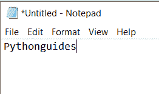

Python write a string to a file

> 你可能会喜欢[用 Python 海龟](https://pythonguides.com/draw-colored-filled-shapes-using-python-turtle/)和[绘制彩色填充形状，以及如何用海龟](https://pythonguides.com/snake-game-in-python/)在 Python 中创建一个贪吃蛇游戏。

## Python 用换行符将字符串写入文件

现在，我们将在 Python 中看到，**如何用换行符**字符 **"\n"** 将字符串写入文件。

在这个例子中，我使用了 **open("filename.txt，mode)** 来打开文件。然后调用 **file.write('string\n')** 将字符串写入新创建的文件中。

然后使用 **"\n** "它在输出中给出一个换行符，输出生成器将转到下一行，然后我使用了 `file.close()` 来关闭文件。

例子；

```py
file = open("example.txt", "w")
file.write('Hello all! \nwelcome to pythonguides')
file.close
```

下图显示了输出:

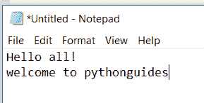

Python write string to a file with newline

这里我们可以看到两根弦在不同的线上。

## Python 写一个字符串到一个文件覆盖

这里我们可以看到**如何在 Python** 中覆盖文件中的一个字符串。

在这个例子中，我使用了 **file = open("file.txt "，mode)** 来打开文件。

然后我取了一个字符串变量作为水果=(“芒果是黄色的”)。

然后使用 `file.writelines(fruits)` 将字符串序列写入文件，使用 `file.close()` 关闭文件。

示例:

```py
file = open("example.txt", "w") 
fruits = ("mango is yellow") 
file.writelines(fruits) 
file.close() 
```

以下示例显示了输出:

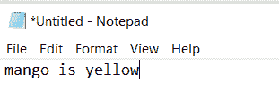

Python write string to a file overwrite

在这个例子中，我使用了**“w**”模式在已经打开的文件中写入一个新的字符串

示例:

```py
file = open("example.txt", "w") 
file.write("vegetables \n") 
file.close() 
```

以下示例显示了输出:

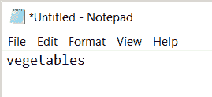

Python write string to a file overwrite

在这个例子中，我使用了 `file.read()` 方法来覆盖 string .和 `file.close()` 来关闭文件。

示例:

```py
file = open("example.txt", "r") 
print("Output of Readlines after writing") 
print(file.read()) 
print() 
file.close()
```

以下示例显示了输出:

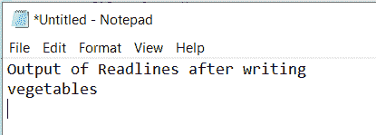

Python write string to a file overwrite

这是覆盖字符串的最后一段代码。

```py
file = open("example.txt", "w") 
fruits = ("mango is yellow") 
file.writelines(fruits) 
file.close() 

file = open("example.txt", "w") 
file.write("vegetables \n") 
file.close()

file = open("example.txt", "r") 
print("Output of Readlines after writing") 
print(file.read()) 
print() 
file.close()
```

## Python 将字符串写入文件追加

现在，让我们看看**如何在 Python** 中将字符串追加到文件中。

**追加**是指在书面文档(已有文档)的末尾增加一些东西。

在本例中，**和绿色的**被添加到现有的字符串中，并给出最终的字符串。

追加**模式使用****file = open(" example . txt "，" a")** )， `file.read()` 用于读取追加的字符串。

示例:

```py
file = open("example.txt", "w") 
fruit = ("mangoes are yellow")
file.writelines(fruit) 
file.close() 

file = open("example.txt", "a")  
file.write(" and green \n") 
file.close() 

file = open("example.txt", "r") 
print("Output of Readlines after appending") 
print(file.read()) 
print() 
file.close()
```

下图显示了输出:

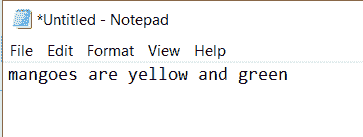

Python write string to a file append

## Python 将字符串写入一个没有换行符的文件

现在我们可以看到**如何在 Python** 中不用换行符将字符串写入文件。

在这个例子中，我使用了 **"\r"** 而不是 **"\n"**

```py
file = open("hello.txt", "w")
file.write('Hello all'"\r")
file.write('welcome to pythonguides')
file.close
```

下图显示了输出:

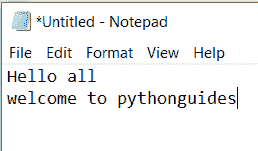

Python write string to a file without newline

## Python 将字符串写入 csv 文件

让我们看看**如何用 Python** 在 csv 文件中写字符串。

CSV 文件是**逗号分隔值文件**，它是一种简单的文件格式，以表格形式存储数据。比如 excel 表格，数据库。csv 文件应该有**。csv** 一个扩展。

**举例:**

在这个例子中，我将字符串列表作为水果:

```py
fruits = ['apple','cherry','orange','pineapple','strawberry']
```

然后我已经用 **open("filename.csv，mode)** 打开了文件。 **dialect='excel'** 用来定义 excel 格式它包含一组参数。 `writerow(item)` 是在指定文件中写入一行数据的方法。

**举例:**

```py
import csv

fruits = ('apple','cherry','orange','pineapple','strawberry')

fruitfile = open("fruits.csv",'w')
wr = csv.writer(fruitfile, dialect='excel')
for item in fruits:
wr.writerow(item)
```

下图显示了输出:

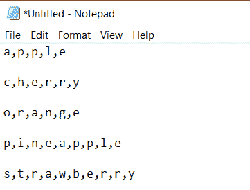

Python write string to csv file

在这个输出中，我们可以看到所有的字符串都用逗号分隔。

## Python 向 csv 文件写入一行

这里我们可以看到如何在 csv 文件中获取一个**单行**。在这个例子中，我已经导入了 csv 模块 **file = open("filename.csv "，mode)** `csv.writer()` 方法用于创建 write object`writerow(item)`函数用于在 csv 文件中写入单行。

示例:

```py
import csv
file = open("dict.csv", "w")
writer = csv.writer(file)
writer.writerow(["pen", "pencil"])
file.close()
```

下图显示了输出:

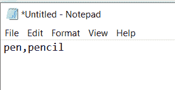

`Python write a single row to a csv file`

## Python 写文件进行循环

这里我们可以看到**如何用 Python** 为 loop 写一个文件。

一个 **for 循环**用来迭代一个序列，我们也可以使用 **range 函数()**。**测距函数**返回一系列数字，默认情况下从 0 开始递增 1。

```py
file = open("example.txt", "w")
file.write("python guides")
a = "python guides"
for x in a:
print(a)
file.close()
```

下图显示了输出:

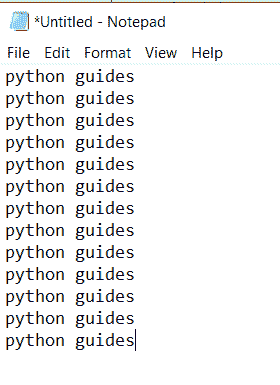

Python write to file for loop

## Python 将二进制字符串写入文件

现在让我们看看如何将二进制字符串转换成文件。

在这个例子中，我使用了 **file = open(filename.txt，mode)** 来打开一个文件，并使用了' **w+b'** 模式，该模式用于以**二进制格式写入一个文件**。

分配了一个`binary string = " 01100011 01100011 01100001"`和 binary values =`binary string . split()`来拆分空白字符串。

**an_integer = int(binaryvalue，2)** 这个用来转换 `base2` 十进制整数。

`ascii _ character = chr(an _ integer)`它用来转换成 ASCII 字符 ascii_string += ascii_character 这个用来给字符串追加一个字符 `print(ascii_string)` 用来打印一个字符串， `file.close()` 关闭文件。

示例:

```py
file = open('binary.txt', 'w+b')

binarystring ="01100011 01100011 01100001"

binaryvalues = binarystring.split()

ascii_string = ""

for binaryvalue in binaryvalues:
    an_integer = int(binaryvalue, 2)

    ascii_char = chr(an_integer)

    ascii_string += ascii_char
print(ascii_string)
file.close()
```

下图显示了转换后字符串的输出。

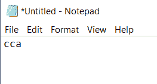

Python write binary string to a file

## Python 写文件连接字符串

这里我们可以看到**如何用 python 写一个文件来连接一个字符串**。串联是指两个字符串**首尾相连**，例如**【脚】****【球】**的串联就是**【足球】**

示例:

```py
file = open('o.txt' ,'w')
str1 = "foot"
str2 = "ball"
print("".join([str1, str2])) 
str3 = " ".join([str1, str2]) 
file.write(str3)
file.close() 
```

在这个例子中，我使用了**file = open(' filename . txt ' ' mode ')**来打开文件，并使用了两个字符串 str1="foot "和 str2="ball "， **print(")。join([str1，str 2])**用于连接两个字符串 **.str3 = " "。join([str1，str2])** 用分隔符连接字符串，将连接的字符串写入文件**使用 file.write(str3)** ， `file.close() t` 关闭文件。

下图显示了输出:

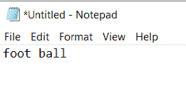

Python write to file concatenate string

## Python 将字符串以 utf-8 格式写入文件

utf-8- **Unicode 转换格式**，是 Unicode 的编码系统，通常用于电子邮件和网页的编码。

这里我们可以看到**如何用 python 将一个字符串写成 utf-8 格式**的文件。

示例:

```py
file = open('q.txt', 'w+b')
utf8 = "python, guides!".encode()
print(utf8)
b =utf8.decode()
print(utf8.decode())
str(b'abc','utf-8')
file.write(utf8)
arr = bytes(b, 'utf-8')
file.write(arr)
file.close()
```

在这个例子中，我使用了 file = open('q.txt '，' mode)来打开文件， **'w+b'** 模式仅用于以二进制格式写入。

**utf8 = "python，guides！"。encode()** ，调用 `string.encode()` 将**字符串编码为 utf-8 字节**接下来调用 `bytes.decode()` 将 utf-8 编码的字节解码为 unicode a 字符串。

`file.write(utf8)` 将编码值写入文件。将字符串转换为字节**使用 str(b'abc '，' utf-8 ')**并将字节转换为字符串 **arr = bytes(b，' utf-8')** 和 `file.write(arr)` 将解码值写入文件，最后 `file.close()` 关闭文件。

下图显示了编码值和解码值。

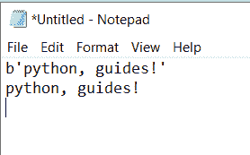

Python write string to file as utf-8

下图显示了输出:

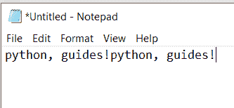

Python write string to file as utf-8

## Python 向 csv 文件写入不带引号的字符串

现在我们可以看到**如何用 python 写一个不带引号的 csv 文件**。

在这个例子中，我已经导入了 `CSV` 模块，为了打开一个文件，我使用了 f= open("filename.csv "，" mode ")和 **csv。writer ()** 用于**将数据插入到 CSV 文件**中，因为我们需要将不带引号的字符串写入 CSV 文件，所以我使用 `QUOTE_NONE` 来获得不带引号的文件。

使用 writer.writerow() 来写入行**中的所有元素。**

示例:

```py
import csv
f = open("fruit.csv", "w")
writer = csv.writer(f, quoting=csv.QUOTE_NONE)
writer.writerows([["mango",1],["orange",2]])
f.close()
```

下图显示了输出:

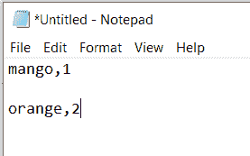

Python write string to csv files without quotes

您可能会喜欢以下 Python 教程:

*   [Python 中的优先级队列](https://pythonguides.com/priority-queue-in-python/)
*   [Python 历元到日期时间+示例](https://pythonguides.com/python-epoch-to-datetime/)
*   [Python 将变量写入文件+示例](https://pythonguides.com/python-write-variable-to-file/)
*   [如何在 Python 中把字符串转换成日期时间](https://pythonguides.com/convert-a-string-to-datetime-in-python/)
*   [Python 中的转义序列](https://pythonguides.com/escape-sequence-in-python/)
*   [Python 列表理解λ](https://pythonguides.com/python-list-comprehension/)
*   [Python 线程和多线程](https://pythonguides.com/python-threading-and-multithreading/)
*   [如何将 Python 角度转换为弧度](https://pythonguides.com/python-degrees-to-radians/)
*   [Python 比较运算符](https://pythonguides.com/python-comparison-operators/)
*   [Python 命名空间教程](https://pythonguides.com/python-namespace-tutorial/)
*   [Python Tkinter 帧](https://pythonguides.com/python-tkinter-frame/)
*   [如何将 Python 字符串转换成字节数组并举例](https://pythonguides.com/python-string-to-byte-array/)
*   [Python 读取二进制文件](https://pythonguides.com/python-read-a-binary-file/)
*   [如何将 Python 数组写入 CSV](https://pythonguides.com/python-write-array-to-csv/)
*   [Python 逐行读取文件示例](https://pythonguides.com/python-read-a-file-line-by-line/)

在本教程中，我们学习了**如何向文件**中写入字符串，并涵盖了以下主题:

*   Python 将字符串写入文件
*   Python 使用换行符将字符串写入文件
*   Python 将字符串写入文件覆盖
*   Python 将字符串写入文件，不换行
*   Python 将字符串写入文件追加
*   Python 将字符串写入 csv 文件
*   Python 向 csv 文件中写入一行
*   Python 写文件循环
*   Python 写入文件连接字符串
*   Python 将字符串以 utf-8 格式写入文件
*   Python 将字符串写入 csv 文件，不带引号

[Bijay Kumar](https://pythonguides.com/author/fewlines4biju/)

Python 是美国最流行的语言之一。我从事 Python 工作已经有很长时间了，我在与 Tkinter、Pandas、NumPy、Turtle、Django、Matplotlib、Tensorflow、Scipy、Scikit-Learn 等各种库合作方面拥有专业知识。我有与美国、加拿大、英国、澳大利亚、新西兰等国家的各种客户合作的经验。查看我的个人资料。

[enjoysharepoint.com/](https://enjoysharepoint.com/)[](https://www.facebook.com/fewlines4biju "Facebook")[](https://www.linkedin.com/in/fewlines4biju/ "Linkedin")[](https://twitter.com/fewlines4biju "Twitter")