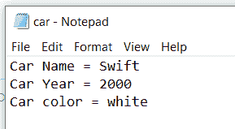
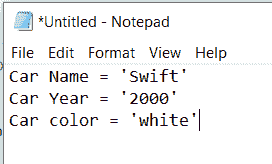
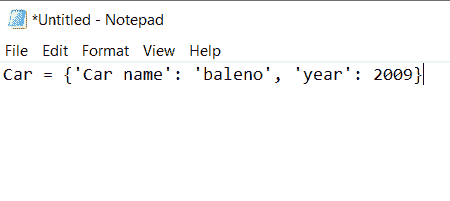
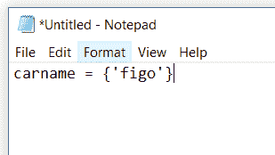
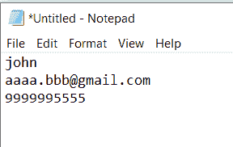
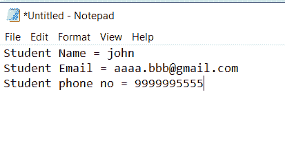
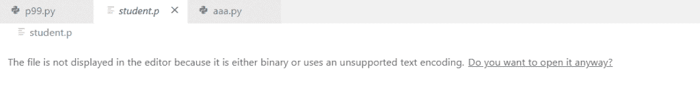
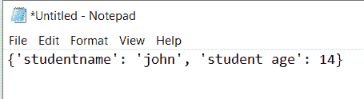

# Python 将变量写入文件+示例

> 原文：<https://pythonguides.com/python-write-variable-to-file/>

[](https://sharepointsky.teachable.com/p/python-and-machine-learning-training-course)

在这个 [python 教程中，](https://pythonguides.com/python-hello-world-program/)你将会学习到关于 **Python 写变量到文件**的例子。此外，我们还将讨论以下主题:

*   python 使用 open 将变量写入文件
*   python 将变量写入文件换行
*   python 将值写入文件
*   python 将多个变量写入文件
*   python 将变量保存到 pickle 文件中

目录

[](#)

*   [如何用 Python 将变量写入文件？](#How_to_write_variable_to_a_file_in_Python "How to write variable to a file in Python?")
    *   [字符串串联](#String_Concatenation "String Concatenation")
    *   [字符串格式化](#string_formatting "string formatting")
*   [Python 将变量写入打开的文件](#Python_write_variable_to_file_with_open "Python write variable to file with open")
*   [Python 将变量写入文件换行](#Python_write_variable_to_file_newline "Python write variable to file newline")
*   [Python 将值写入文件](#Python_write_values_to_file "Python write values to file")
*   [Python 将多个变量写入文件](#Python_write_multiple_variables_to_file "Python write multiple variables to file")
*   [Python 将变量保存到 pickle 文件](#Python_save_variable_to_file_pickle "Python save variable to file pickle")

## 如何用 Python 将变量写入文件？

现在，我们将看到**如何用 Python** 将变量值写入文本文件。

在这个例子中，我将展示两种将 Python 中的变量值写入文本文件的方法。

*   [字符串串联](https://pythonguides.com/concatenate-strings-in-python/)
*   字符串格式

你也可以检查， [Python 将字符串写入文件](https://pythonguides.com/python-write-string-to-a-file/)

### 字符串串联

我将三个 [Python 变量](https://pythonguides.com/create-python-variable/)作为 carname、caryear 和 carcolor，并给它们赋值，然后打开一个文件。

我用的是 **file = open("filename.txt "，" mode")** ，用的文件名是 car.txt，我们可以用 **"w "模式写文件**，文件里还有其他模式，比如

*   r–读取模式。
*   a–附加模式。
*   w–写入模式。
*   r+–读写模式。

打开文件后，我用 `file.write()` 方法将内容写入文件中。这里的内容是 carname、caryear 和 carcolor。然后使用 `file.close()` 方法关闭创建的文件。

```py
carname="Swift"
caryear="2000"
carcolor="white"
file = open("car.txt", "w")
file.write("Car Name = " + carname + "\n" +"Car Year = "+caryear + "\n"+"Car color = "+carcolor )
file.close
```

下图显示了输出。该输出显示在新创建的名为“car.txt”的文件中。



write variable to a file in Python

另一个**函数 repr()** 用于**将变量转换成字符串**。

**举例:**

```py
 carname="Swift"
caryear="2000"
carcolor="white"
file = open("car.txt", "w")
carname = repr(carname)
caryear = repr(caryear)
carcolor = repr(carcolor)
file.write("Car Name = " + carname + "\n" +"Car Year = "+caryear + "\n"+"Car color = "+carcolor )
file.close
```

在上面的例子中，我使用了 **repr 函数将一个变量转换成字符串**。打开文件后，为每个变量分配 **repr 函数**。

下图显示了输出。



write variable to a file in Python

在这个特殊的例子中，我采用了一个字典类型的 `car_dictionary` var 变量，它有一些默认值。一旦您执行了代码，它将**创建一个. txt 文件，并将变量的值添加到该文件中**。

示例:

```py
car_dictionary = {"Car name" : "baleno"  , "year" : 2009}

file = open("car.txt", "w")
file.write("Car = " + repr(car_dictionary) + "\n")
file.close
```

我们甚至可以[创建字典变量](https://pythonguides.com/create-a-dictionary-in-python/)。



Python write variable to file

我们将输出作为新文件中的一个变量。在上面的例子中，我们使用文件的路径名作为文件名 car_dictionary，使用模式作为" `w` "来打开文件进行写入。包含变量名 car_dictionary 的字符串。

### 字符串格式化

我取了一个变量比如 `carname` 和 **file = open("filename.txt "，mode)** 打开文件，调用**文件。**write()【方法】将内容写入文件。它包含一些数据。

诸如**字符串格式的数据%s** ，并且具有由变量名和变量组成的元组。\n 是换行符，当我们想在新的一行上显示时使用。

示例:

```py
carname = {"figo"}

file = open("car.txt", "w")
file.write("%s = %s\n" %("carname",carname))

file.close()
```

下图显示了输出。



## Python 将变量写入打开的文件

让我们看看**如何在打开**的情况下将变量写入文件。在下面的代码中，我使用 **file.open("file.txt "，mode)** 打开文件。

示例:

```py
carname="Swift"
caryear="2000"
carcolor="white"
file = open("car.txt", "w")
file.write("Car Name = " + carname + "\n" +"Car Year = "+caryear + "\n"+"Car color = "+carcolor )
file.close
```

## Python 将变量写入文件换行

让我们看看如何用 Python 中的换行符**将变量写入文件。**

在 Python 中， **\n** 是换行符，当我们想要在新的一行上书写时使用。

在下面的例子中，你可以看到，我已经用\n 在新的行中写了汽车名称、汽车年份和汽车颜色。

示例:

```py
carname="Belano"
caryear="2000"
carcolor="silver"
file = open("car.txt", "w")
file.write("Car Name = " + carname + "\n" +"Car Year = "+caryear + "\n"+"Car color = "+carcolor )
file.close
```

## Python 将值写入文件

在这个例子中，我已经取了三个变量和 **file = open("filename.txt，mode)** 来打开文件并使用了**文件。编写**(‘变量的值’)来获取分配给创建的文本文件中的变量的值。 `file.close()` 关闭文件。

示例:

```py
StudentName = "john"
StudentEmail = "aaaa.bbb@gmail.com"
Studentphoneno = "9999995555"
file = open("stud.txt" ,"w")
file.write('john\n')
file.write('aaaa.bbb@gmail.com\n')
file.write('9999995555\n')
file.close()
```

下图显示了输出，其中变量值显示在创建的新文件中。



Python write values to file

## Python 将多个变量写入文件

在下面的例子中，你可以看到，我采用了多个变量，如学生姓名，学生电子邮件，学生电话号码。

下面的代码可以用来在 Python 中将多个变量写入文件。

示例:

```py
StudentName = "john"
StudentEmail = "aaaa.bbb@gmail.com"
Studentphoneno = "9999995555"
file = open("Student.txt" ,"w")
file.write("Student Name = "+StudentName + "\n" +"Student Email = "+StudentEmail + "\n"+"Student phone no = "+Studentphoneno )
file.close()
```

下图显示了输出。该输出显示在创建的名为“Student”的新文件中。



Python write multiple variables to file

## Python 将变量保存到 pickle 文件

转换 python 对象的过程，如[列表](https://pythonguides.com/create-list-in-python/)、[字典](https://pythonguides.com/python-dictionary-methods/)、[元组](https://pythonguides.com/create-a-tuple-in-python/)等。转换成字节流(0，1)的过程称为**酸洗**，相反的过程，即把字节流转换成对象的过程称为**解酸洗**。

[泡菜是一个模块](https://docs.python.org/3/library/pickle.html)。只有通过**导入泡菜**命令导入泡菜模块后才能使用。

示例:

```py
student = {"studentname" : "john","student age" : 14,}

import pickle              

file = open('student.p', 'wb')  
pickle.dump(student, file)          
file.close()
```

在这个例子中，我使用学生字典并分配键和值对，即键为“学生名”，值为“约翰”。

接下来导入一个模块 pickle，然后使用 **file =open('student.p '，mode)** 打开文件，使用 **pickle.dump()方法**将变量转储到创建的新文件中。

转换输出是下图的形式。



Python save variable to file pickle

加载文件。

示例:

```py
import pickle              

file = open('student.p', 'rb')
student = pickle.load(file)      
file.close()                       

print(student)
```

在这里，我使用`student = pickle . load(file)`来加载一个字典的变量。

下图显示了输出:



Python save variable to file pickle

您可能会喜欢以下 Python 教程:

*   [Python 3 pickle typeerror 需要一个类似字节的对象，而不是“str”](https://pythonguides.com/python-3-pickle-typeerror-a-bytes-like-object-is-required-not-str/)
*   [Python 二分搜索法和线性搜索](https://pythonguides.com/python-binary-search/)
*   [Python 点积和叉积](https://pythonguides.com/python-dot-product/)
*   [Python 退出命令(quit()、exit()、sys.exit())](https://pythonguides.com/python-exit-command/)
*   [Python 输入和 raw_input 函数](https://pythonguides.com/python-input-and-raw_input-function/)
*   [Python 中的排序算法](https://pythonguides.com/sorting-algorithms-in-python/)
*   [在 Python 中使用 JSON 数据](https://pythonguides.com/json-data-in-python/)
*   [使用 Python 发送电子邮件](https://pythonguides.com/send-email-using-python/)
*   [Python 将列表写入文件，并附有示例](https://pythonguides.com/python-write-list-to-file/)
*   [Python tkinter 标签–如何使用](https://pythonguides.com/python-tkinter-label/)
*   [Python 逐行读取文件示例](https://pythonguides.com/python-read-a-file-line-by-line/)

在本教程中，我们学习了如何用 Python 将变量**写入文件，并涵盖了以下主题:**

*   如何用 Python 写变量到文件？
*   Python 使用 open 将变量写入文件
*   Python 将变量写入文件换行
*   Python 将值写入文件
*   Python 将多个变量写入文件
*   Python 将变量保存到文件 pickle

[Bijay Kumar](https://pythonguides.com/author/fewlines4biju/)

Python 是美国最流行的语言之一。我从事 Python 工作已经有很长时间了，我在与 Tkinter、Pandas、NumPy、Turtle、Django、Matplotlib、Tensorflow、Scipy、Scikit-Learn 等各种库合作方面拥有专业知识。我有与美国、加拿大、英国、澳大利亚、新西兰等国家的各种客户合作的经验。查看我的个人资料。

[enjoysharepoint.com/](https://enjoysharepoint.com/)[](https://www.facebook.com/fewlines4biju "Facebook")[](https://www.linkedin.com/in/fewlines4biju/ "Linkedin")[](https://twitter.com/fewlines4biju "Twitter")