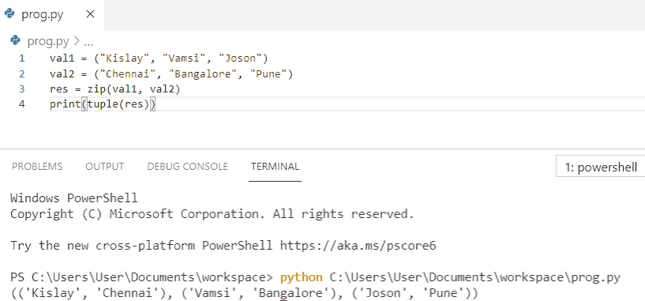

# Python zip()函数示例

> 原文：<https://pythonguides.com/python-zip/>

[](https://sharepointsky.teachable.com/p/python-and-machine-learning-training-course)

在这个 [python 教程中，](https://pythonguides.com/python-hello-world-program/)你将了解到 **Python zip()函数**，我们还将检查 **:**

*   python zip 函数是什么？
*   Python zip()示例
*   Python zip()方法
*   Python 压缩两个列表
*   Python 压缩三个列表
*   Python zip 字典
*   Python 使用 zip()解压值
*   Python zip 文件夹
*   Python zip for 循环
*   Python 列表的 zip 列表
*   Python zip 字符串
*   Python zip 不同长度
*   Python zip 空列表
*   Python zip 对象

目录

[](#)

*   [Python zip 函数是什么？](#What_is_Python_zip_function "What is Python zip function?")
*   [Python zip()示例](#Python_zip_example "Python zip() example")
*   [Python 的 zip()方法](#Python_zip_method "Python zip() method")
*   [Python 压缩两个列表](#Python_zip_two_lists "Python zip two lists")
*   [Python zip 三列表](#Python_zip_three_lists "Python zip three lists")
*   [Python zip 字典](#Python_zip_dictionary "Python zip dictionary")
*   [Python 使用 zip()](#Python_unzipping_the_Value_Using_zip "Python unzipping the Value Using zip()") 解压值
*   [Python zip 文件夹](#Python_zip_folder "Python zip folder")
*   [Python zip for loop](#Python_zip_for_loop "Python zip for loop")
*   [Python 列表的 zip 列表](#Python_zip_list_of_lists "Python zip list of lists")
*   [Python zip 字符串](#Python_zip_string "Python zip string")
*   [Python zip 不同长度](#Python_zip_different_length "Python zip different length")
*   [Python zip 空列表](#Python_zip_empty_list "Python zip empty list")
*   [Python zip 对象](#Python_zip_object "Python zip object")

## Python zip 函数是什么？

**Python zip()函数**返回一个 zip 对象，zip()函数获取 iterables，将它们聚集在一个 tuple 中，然后返回。

## Python zip()示例

Python `zip()` 是一个内置的 Python 函数，它为我们提供了一个元组迭代器。让我们看看下面 python zip 函数的例子。

**举例:**

```py
for i in zip([11,12,13],['j','k','l']):
            print(i)
```

您可以参考下面的截图来查看 **python zip()示例**的输出。


Python zip() example

上面这个是 Python 中一个非常简单的 **zip()方法例子。**

阅读:[将 float 转换为 int Python](https://pythonguides.com/convert-float-to-int-python/)

## Python 的 zip()方法

让我们看看 **Python 的 zip()方法**。

Python `zip()` 方法返回一个 zip 对象，它是一个元组的迭代器，其中每个传递的迭代器中的第一项配对在一起，然后每个传递的迭代器中的第二项配对在一起。

**举例:**

```py
val1 = ("Kislay", "Vamsi", "Joson")
val2 = ("Chennai", "Bangalore", "Pune")
res = zip(val1, val2)
print(tuple(res))
```

你可以参考下面的截图来看看 **python zip()方法**的输出。



Python zip() method

## Python 压缩两个列表

我们来看看 **Python zip 二列表**。

Python **压缩两个列表**将第一个列表中的元素与第二个列表中的元素配对。我们使用 list()将 zip 对象转换为一个列表，该列表包含来自最初两个列表的压缩对。

**举例:**

```py
l1 = [101, 103, 105]
l2 = [102, 104, 106]
res = zip(l1, l2)
zippedlist = list(res)
print(zippedlist)
```

你可以参考下面的截图来看看 `python zip two lists` 的输出。


Python zip two lists

你可能会喜欢，[如何给 Python 列表](https://pythonguides.com/add-string-to-list-python/)添加字符串？

## Python zip 三列表

现在，我们将看到 **python zip 三列表**

Python **使用 zip()函数压缩三个列表**，需要尽可能多的输入 iterables。结果元组的长度将始终等于作为参数传递的 iterables 的数量。

**举例:**

```py
val1 = [56, 57, 58]
val2 = ['a', 'b', 'c']
val3 = [1.0, 2.0, 3.0]
zipped = zip(val1, val2, val3)
print(list(zipped))
```

你可以参考下面的截图来查看 **python zip 三列表**的输出


Python zip three lists

这就是我们如何用 Python 压缩三个列表。

## Python zip 字典

让我们看看 **python zip 字典**

*   首先，我们将创建一个结合这两个列表的字典。在这里，zip(k，v)返回一个迭代器，然后我们必须打印以获得带有键和值的 zip 字典。

**举例:**

```py
k = ['F_Name', 'L_Name', 'Age']
v = ['Kislay', 'Kumar', '35']
res_dict = dict(zip(k, v))
print(res_dict)
```

你可以参考下面的截图来查看 **python zip 字典**的输出。


Python zip dictionary

上面的代码，我们可以用到了 Python 中的 **zip 字典。**

## Python 使用 zip() 解压值

现在，我们将看到 **python 使用 zip()** 解压该值

***操作符**与 zip()一起使用来解压列表。

**举例:**

```py
val1 = ['a', 'b', 'c']
val2 = [1, 2, 3]
res = zip(val1, val2)
res_list = list(res)
print(res_list)
v1, v2 =  zip(*res_list)
print('v1 =', v1)
print('v2 =', v2)
```

你可以参考下面的截图来看看 **python 使用 zip()** 解压值的输出。


Python unzipping the Value Using zip()

## Python zip 文件夹

让我们看看**如何用 python 压缩文件夹**

*   为了在 python 中压缩文件夹，我们将使用 zipfile 模块来创建一个目录的 zip 存档。
*   os.walk 用于遍历目录树，它会递归地将所有文件添加到目录树中。
*   zip 文件将在当前目录下创建。

**举例:**

```py
import os
import zipfile
def zipdir(path, ziph):
    # ziph is zipfile handle
    for root, dirs, files in os.walk(path):
        for file in files:
            ziph.write(os.path.join(root, file))
zipf = zipfile.ZipFile('Zipped_file.zip', 'w', zipfile.ZIP_DEFLATED)
zipdir('News', zipf)
zipf.close()
```

你可以参考下面的截图来查看 **python zip 文件夹**的输出。


Python zip folder

这就是我们如何在 Python 中**压缩文件夹。**

## Python zip for loop

现在，我们将看到 `python zip for loop` 。

在 **python zip for 循环中，**我们有多个可迭代的对象，可以使用 zip()来处理，for 循环用于迭代。

**举例:**

```py
f_name = ['kislay', 'Kunal', 'Mohit']
age = [24, 50, 18]
for f_name, age in zip(f_name, age):
    print(f_name, age)
```

你可以参考下面的截图来看看 `python zip for loop` 的输出。


Python zip for loop

你可能喜欢，[Python For Loop with Examples](https://pythonguides.com/python-for-loop/)。

## Python 列表的 zip 列表

在这里，我们将看到 **python 列表的 zip 列表**

**Python 列表的 zip 列表**定义了三个不同的列表，具有相同的条目数，并将这些列表传递给 zip()方法，该方法将返回元组迭代器，然后使用 list()方法将其转换为列表。

**举例:**

```py
comp = ['Google', 'Tsinfo', 'tcs']
rate = [2860, 2000, 2650]
sector = ['IT', 'IT', 'IT']
zipped = zip(comp, rate, sector)
print(list(zipped))
```

您可以参考下面的截图来查看 `python zip list of lists` 的输出。


Python zip list of lists

## Python zip 字符串

现在，我们将看到 **python zip 字符串**。

在这个例子中，三个不同长度的字符串作为 zip()函数的参数给出。

**举例:**

```py
str1 = "Grey"
str2 = "Pink"
str3 = "Blue"
print(list(zip(str1, str2, str3)))
```

您可以参考下面的截图来查看 **python zip 字符串**的输出。


Python zip string

上面的代码，我们可以用 Python 中的来**压缩字符串。**

你可能会喜欢，[如何在 Python 中创建一个字符串](https://pythonguides.com/create-a-string-in-python/)？

## Python zip 不同长度

我们来看看 **python zip 不同长度**。

*   在这个例子中，我们定义了不同长度的迭代器，所有迭代器的第一个元素都连接在一起。类似地，它们的第二、第三和第四元素被连接在一起。
*   但是没有第五元素，所以输出中不包括剩余的迭代器。

**举例:**

```py
list1 = ['Rohan', 'Preeti', 'Kislay', 'Ankita']
list2 = ['Red', 'Blue', 'Green', 'Pink', 'Black']
list3 = ['101', '201', '301', '401', '501']
result = zip(list1, list2, list3)
print(list(result))
```

你可以参考下面的截图来看看 **python zip 不同长度**的输出


Python zip different length

## Python zip 空列表

在这里，我们将看到 **python zip 空列表**。

在下面的例子中，我们使用了空的 zip()函数，没有传递任何迭代器。

```py
list1 = [11,12,13,14,15]
res = zip()
print(list(res))
```

你可以参考下面的截图来查看 **python zip 空列表**的输出。


Python zip empty list

这就是我们如何**压缩 Python 空列表**。

你可能也喜欢，[用 Python](https://pythonguides.com/check-if-a-list-is-empty-in-python/) 检查一个列表是否为空。

## Python zip 对象

现在，我们将看到 **python zip 对象**

在这个例子中，它返回指定列表的元组的迭代器。Python zip 对象作为迭代器工作并返回 zip 对象。

**举例:**

```py
val1 = [101,102,103]
val2 = ['One','Two','Three']
result = zip(val1, val2)
print(result)
print(list(result))
```

您可以参考下面的截图来查看 **python zip 对象的输出。**


Python zip object

您可能会喜欢以下 Python 教程:

*   [使用 Python Tkinter 的身体质量指数计算器](https://pythonguides.com/bmi-calculator-using-python-tkinter/)
*   [如何在 Python Pandas 中使用 drop_duplicates()函数删除重复项](https://pythonguides.com/python-pandas-drop-duplicates/)
*   [Python 程序检查闰年](https://pythonguides.com/python-program-to-check-leap-year/)
*   [Python 程序求正方形的面积](https://pythonguides.com/python-program-to-find-the-area-of-square/)
*   [如何在 Python 中求三角形的面积](https://pythonguides.com/find-area-of-a-triangle-in-python/)
*   [如何在 Python 中计算圆的面积](https://pythonguides.com/calculate-area-of-a-circle-in-python/)
*   [Python 程序求矩形的面积](https://pythonguides.com/python-program-to-find-an-area-of-a-rectangle/)

在本 Python 教程中，我们学习了 `Python zip()` 。此外，我们还讨论了以下主题:

*   python zip 函数是什么？
*   Python zip()示例
*   Python zip()方法
*   Python 压缩两个列表
*   Python 压缩三个列表
*   Python zip 字典
*   Python 使用 zip()解压值
*   Python zip 文件夹
*   Python zip for 循环
*   Python 列表的 zip 列表
*   Python zip 字符串
*   Python zip 不同长度
*   Python zip 空列表
*   Python zip 对象

[Bijay Kumar](https://pythonguides.com/author/fewlines4biju/)

Python 是美国最流行的语言之一。我从事 Python 工作已经有很长时间了，我在与 Tkinter、Pandas、NumPy、Turtle、Django、Matplotlib、Tensorflow、Scipy、Scikit-Learn 等各种库合作方面拥有专业知识。我有与美国、加拿大、英国、澳大利亚、新西兰等国家的各种客户合作的经验。查看我的个人资料。

[enjoysharepoint.com/](https://enjoysharepoint.com/)[](https://www.facebook.com/fewlines4biju "Facebook")[](https://www.linkedin.com/in/fewlines4biju/ "Linkedin")[](https://twitter.com/fewlines4biju "Twitter")