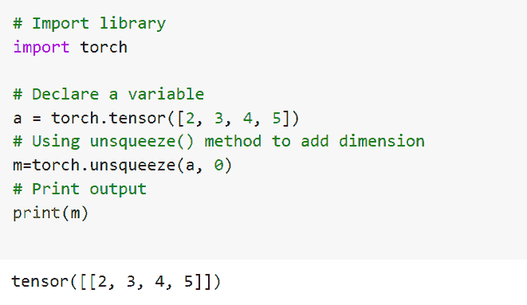
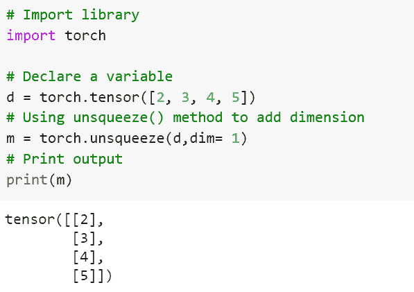
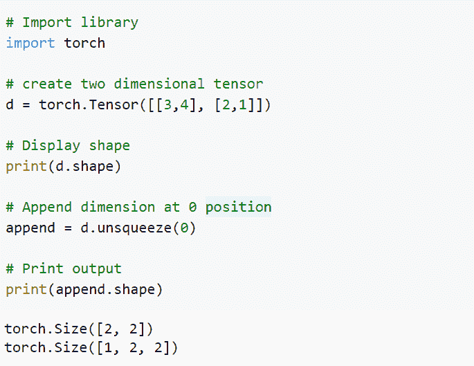
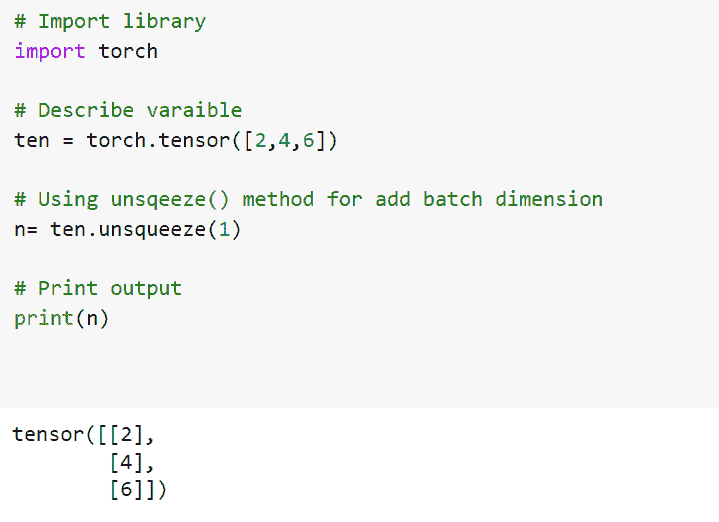
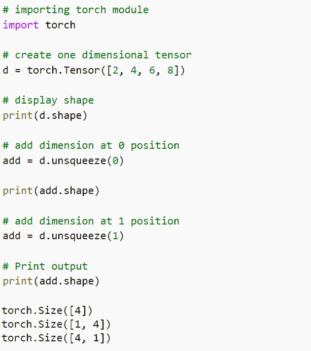
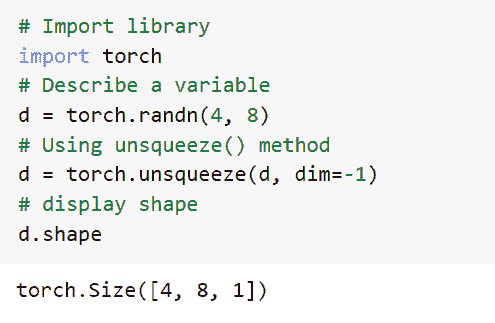

# PyTorch 添加维度[有 6 个示例]

> 原文：<https://pythonguides.com/pytorch-add-dimension/>

[](https://sharepointsky.teachable.com/p/python-and-machine-learning-training-course)

在本 [Python 教程](https://pythonguides.com/learn-python/)中，我们将学习 Python 中的 **PyTorch 添加维度**。在我们制作机器学习模型时，为张量添加维度是一个重要的部分。为了添加一个维度，我们使用了 `unsqueeze()` 方法。

我们还将介绍与 **PyTorch 添加维度**相关的不同示例。我们将讨论这些话题。

*   PyTorch 添加维度
*   PyTorch 添加大小为 1 的维度
*   PyTorch append 维度
*   PyTorch 添加批量维度
*   PyTorch 添加多个维度
*   PyTorch 为张量增加维度

目录

[](#)

*   [PyTorch 添加尺寸](#PyTorch_Add_Dimension "PyTorch Add Dimension")
*   [PyTorch 添加尺寸为 1 的尺寸](#PyTorch_Add_Dimension_Of_Size_1 "PyTorch Add Dimension Of Size 1")
*   [PyTorch 附加尺寸](#PyTorch_Append_Dimension "PyTorch Append Dimension")
*   [PyTorch 添加批量维度](#PyTorch_Add_Batch_Dimension "PyTorch Add Batch Dimension")
*   [PyTorch 添加多个维度](#PyTorch_Add_Multiple_Dimension "PyTorch Add Multiple Dimension")
*   [PyTorch 向张量添加维度](#PyTorch_Add_Dimension_To_Tensor "PyTorch Add Dimension To Tensor")

## PyTorch 添加尺寸

在本节中，我们将学习 Python 中的 **PyTorch 添加维度**。

当我们在制作机器学习模型时，添加维度是一个重要的部分。为了添加一个维度，我们使用了 `unsqueeze()` 方法。

`unsqueeze()` 函数返回一个新的张量，其维数为 1，插入到定义的位置。

**代码:**

在下面的代码中，首先我们导入 torch 库，比如 import torch。

*   **a = torch.tensor([2，3，4，5]:** 这里我们用 torch.tensor()函数来描述一个变量。
*   **m=torch.unsqueeze(a，0):** 这里我们使用 unsqueeze()方法添加维度。
*   `print(m)` 用于借助print()功能打印输出。

```py
# Import library
import torch

# Declare a variable
a = torch.tensor([2, 3, 4, 5])
# Using unsqueeze() method to add dimension
m=torch.unsqueeze(a, 0)
# Print output
print(m)
```

**输出:**

运行上面的代码后，我们得到下面的输出，其中我们可以看到，在添加一个维度后，张量值被打印在屏幕上。



PyTorch add dimension

这样，我们明白了如何在 python 中添加维度。

阅读: [Jax Vs PyTorch](https://pythonguides.com/jax-vs-pytorch/)

## PyTorch 添加尺寸为 1 的尺寸

在本节中，我们将学习 python 中大小为 1 的 **PyTorch 添加维度。**

unsqueeze 方法用于添加大小为 1 的维度。这里我们把新的维度放在最后，dim = 1 这就是我们如何确定新轴应该去哪里。

**代码:**

在下面的代码中，首先我们将导入 torch 库，如 import torch。

*   **d = torch.tensor([2，3，4，5]):** 这里我们用 torch.tensor()函数声明一个变量。
*   **m = torch.unsqueeze(d，dim= 1):** 这里我们使用 unsqueeze()函数添加尺寸为 1 的维度。
*   `print(m)` 用于借助 print()函数打印输出。

```py
# Import library
import torch

# Declare a variable
d = torch.tensor([2, 3, 4, 5])
# Using unsqueeze() method to add dimension
m = torch.unsqueeze(d,dim= 1)
# Print output
print(m)
```

**输出:**

运行上面的代码后，我们得到下面的输出，其中我们可以看到，通过添加尺寸为 1 的维度，我们得到了新的轴。



PyTorch add dimension of size 1

这样，我们就理解了 PyTorch add 维度的大小为 1。

阅读: [PyTorch Numpy to Tensor](https://pythonguides.com/pytorch-numpy-to-tensor/)

## PyTorch 附加尺寸

在本节中，我们将学习 python 中的 **PyTorch 追加维度**。

这里，我们使用 unsqueeze()方法追加了维度。 `unsqueeze()` 函数返回一个新的张量，其维数为 1，插入到定义的位置。

这里我们把新的维度放在最后，dim = 0，这就是我们如何确定新轴应该去哪里。

**代码:**

在下面的代码中，首先我们将导入 torch 库，如 import torch。

*   d =火炬。张量([[3，4]，[2，1]]): 这里我们使用 torch.tensor()函数创建二维张量。
*   `print(d.shape)` 用于借助 print()功能显示形状。
*   `append = d.unsqueeze(0)` 用于在 0 位置追加维度。
*   `print(append.shape)` 用于通过 print()函数打印输出。

```py
# Import library
import torch

# Creating the two dimensional tensor
d = torch.Tensor([[3,4], [2,1]]) 

# Showing the shape
print(d.shape)

# Append dimension at 0 position
append = d.unsqueeze(0)

# Print output
print(append.shape)
```

**输出:**

运行上面的代码后，我们得到下面的输出，其中我们可以看到，在添加维度后，张量可以移动到新的轴。



PyTorch append dimension

这样，我们了解了如何在 python 中添加维度。

阅读: [PyTorch 全连接层](https://pythonguides.com/pytorch-fully-connected-layer/)

## PyTorch 添加批量维度

在本节中，我们将学习 python 中的 **PyTorch 添加批量维度**。

PyTorch 添加批量维度被定义为我们批量添加维度的过程。

这里，我们使用 unsqueeze()方法追加了维度。 `unsqueeze()` 函数返回一个新的张量，其维数为 1，插入到定义的位置。

**代码:**

在下面的代码中，首先我们将导入 torch 库，如 import torch。

*   **ten = torch.tensor([2，4，6]):** 这里我们用 torch.tensor()函数来描述变量。
*   `n= ten.unsqueeze(1)` 这里我们使用 unsqueeze()方法来添加 batvh 维度。
*   `print(n)` 用于通过 print()函数打印输出。

```py
# Import library
import torch

# Describe varaible
ten = torch.tensor([2,4,6])

# Using unsqueeze() method for add batch dimension
n= ten.unsqueeze(1)

# Print output
print(n)
```

**输出:**

运行上面的代码后，我们得到下面的输出，其中我们可以看到 PyTorch 批处理维值被打印在屏幕上。



PyTorch add batch dimension

至此，我们了解了 python 中的 PyTorch add 批处理维度。

阅读: [PyTorch MNIST 教程](https://pythonguides.com/pytorch-mnist/)

## PyTorch 添加多个维度

在本节中，我们将学习 python 中的 **PyTorch 添加多维度**。

这里我们可以添加多个维度。为了添加一个维度，我们使用了 `unsqueeze()` 方法。

unsqueeze 用于在给定的维度上插入一个新维度，并返回张量。

**代码:**

在下面的代码中，首先我们将导入 torch 库，如 import torch。

*   d =火炬。张量([2，4，6，8]): 这里我们使用 torch.tensor()函数创建一个张量。
*   `print(d.shape)` 这里我们使用 print()函数显示形状。
*   `add = d.unsqueeze(0)` 用于添加 0 位置的维度。
*   `add = d.unsqueeze(1)` 用于添加 1 个位置的维度。
*   `print(add.shape)` 用于通过 print()函数打印输出。

```py
# importing torch module
import torch

# Creating a one dimensional tensor
d = torch.Tensor([2, 4, 6, 8]) 

# Showing shape
print(d.shape)

# Adding dimension at Zero position
add = d.unsqueeze(0)

print(add.shape)

# Adding dimension at One position
add = d.unsqueeze(1)

# Print output
print(add.shape)
```

**输出:**

运行上面的代码后，我们得到了下面的输出，其中我们可以看到 PyTorch add multiple dimension values 被打印在屏幕上。



PyTorch add multiple dimension

这就是我们如何在 PyTorch 中添加多维度。

阅读: [PyTorch 车型总结](https://pythonguides.com/pytorch-model-summary/)

## PyTorch 向张量添加维度

在本节中，我们将学习 python 中的 **PyTorch 向张量**添加维度。

向张量添加维度是构建机器学习模型的主要部分。

为了给张量增加一个维度，我们使用一个 unsqueeze()函数。unsqueeze()函数返回一个新的张量，它的尺寸放在定义的位置。

**代码:**

在下面的代码中，首先我们将导入 torch 库，如 import torch。

*   **d = torch.randn(4，8):** 这里我们用 torch.tensor()函数来描述一个变量。
*   **d = torch.unsqueeze(d，dim=-1):** 这里我们使用 unsqueeze()方法为张量增加维度。
*   `d.shape` 用于显示形状。

```py
# Import library
import torch
# Describe a variable 
d = torch.randn(4, 8)
# Using unsqueeze() method
d = torch.unsqueeze(d, dim=-1)
# display shape
d.shape
```

**输出:**

运行上面的代码后，我们得到下面的输出，其中我们可以看到 PyTorch add dimension 值被打印在屏幕上。



PyTorch add dimension to tensor

这就是我们如何在 PyTorch 中增加张量的维度。

另外，看看更多的 Python PyTorch 教程。

*   [PyTorch 查看教程](https://pythonguides.com/pytorch-view/)
*   [PyTorch Conv3d](https://pythonguides.com/pytorch-conv3d/)
*   [PyTorch 逻辑回归](https://pythonguides.com/pytorch-logistic-regression/)
*   [数据加载器指针+示例](https://pythonguides.com/pytorch-dataloader/)
*   [PyTorch 预训练模型](https://pythonguides.com/pytorch-pretrained-model/)
*   [PyTorch 批量归一化](https://pythonguides.com/pytorch-batch-normalization/)
*   [PyTorch nn 线性+示例](https://pythonguides.com/pytorch-nn-linear/)

因此，在本教程中，我们讨论了 `PyTorch add dimension` ,我们还讨论了与其实现相关的不同示例。这是我们已经讨论过的例子列表。

*   PyTorch 添加维度
*   PyTorch 添加大小为 1 的维度
*   PyTorch append 维度
*   PyTorch 添加批量维度
*   PyTorch 添加多个维度
*   PyTorch 为张量增加维度

[Bijay Kumar](https://pythonguides.com/author/fewlines4biju/)

Python 是美国最流行的语言之一。我从事 Python 工作已经有很长时间了，我在与 Tkinter、Pandas、NumPy、Turtle、Django、Matplotlib、Tensorflow、Scipy、Scikit-Learn 等各种库合作方面拥有专业知识。我有与美国、加拿大、英国、澳大利亚、新西兰等国家的各种客户合作的经验。查看我的个人资料。

[enjoysharepoint.com/](https://enjoysharepoint.com/)[](https://www.facebook.com/fewlines4biju "Facebook")[](https://www.linkedin.com/in/fewlines4biju/ "Linkedin")[](https://twitter.com/fewlines4biju "Twitter")