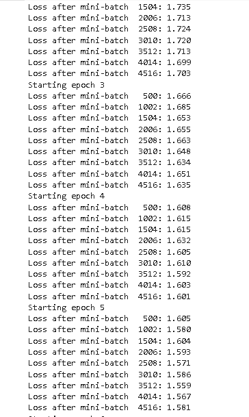

# PyTorch 批处理规范化

> 原文：<https://pythonguides.com/pytorch-batch-normalization/>

[](https://sharepointsky.teachable.com/p/python-and-machine-learning-training-course)

在本 [Python 教程](https://pythonguides.com/learn-python/)中，我们将学习 `python` 中的 **PyTorch 批处理规范化**，我们还将涵盖与使用 PyTorch 进行批处理规范化**相关的不同示例。我们将讨论这些话题。**

*   PyTorch 批处理规范化
*   PyTorch 批处理规范化示例
*   PyTorch 批处理规范化实现
*   PyTorch 批次标准化 1d
*   PyTorch 批处理规范化 2d
*   PyTorch 批量标准化 3d
*   PyTorch 批量标准化 lstm
*   PyTorch 批处理规范化 conv2d
*   PyTorch 批量标准化运行均值
*   PyTorch 批处理规范化评估模式

目录

[](#)

*   [PyTorch 批量归一化](#PyTorch_batch_normalization "PyTorch batch normalization")
*   [PyTorch 批量标准化示例](#PyTorch_batch_normalization_example "PyTorch batch normalization example")
*   [PyTorch 批量归一化实现](#PyTorch_batch_normalization_implementation "PyTorch batch normalization implementation")
*   [PyTorch 批量标准化 1d](#PyTorch_batch_normalization_1d "PyTorch batch normalization 1d")
*   [PyTorch 批量标准化 2d](#PyTorch_batch_normalization_2d "PyTorch batch normalization 2d")
*   [PyTorch 批量标准化 3d](#PyTorch_batch_normalization_3d "PyTorch batch normalization 3d")
*   [PyTorch 批量标准化 lstm](#PyTorch_batch_normalization_lstm "PyTorch batch normalization lstm")
*   [PyTorch 批量标准化 conv2d](#PyTorch_batch_normalization_conv2d "PyTorch batch normalization conv2d")
*   [PyTorch 批量归一化运行均值](#PyTorch_batch_normalization_running_mean "PyTorch batch normalization running mean")
*   [PyTorch 批量标准化评估模式](#PyTorch_batch_normalization_eval_mode "PyTorch batch normalization eval mode")

## PyTorch 批量归一化

在这一节中，我们将学习**在 python 中 bach 规范化是如何工作的**。为了实现，我们将使用 [PyTorch Python](https://pythonguides.com/what-is-pytorch/) 包。

*   批量标准化被定义为训练神经网络的过程，该神经网络对每个小批量的层的输入进行标准化。
*   这个过程稳定了学习过程，也减少了训练模型所需的历元数。

**代码:**

在下面的代码中，我们将导入一些库，从中我们可以训练深度神经网络。

*   **nn。BatchNorm1d** 用于将数据归一化为 0 均值和单位方差。
*   **inputval = torch.randn(22，102)** 用于生成随机数。
*   `outputval = n(input)` 用于得到输出值。
*   `print(outputval)` 用于在屏幕上打印输出。

```py
import torch
import torch.nn as nn
n = nn.BatchNorm1d(102)
**# Without Learnable Parameters**
n = nn.BatchNorm1d(102, affine=False)
inputval = torch.randn(22, 102)
outputval = n(input)
print(outputval)
```

**输出:**

运行上面的代码后，我们得到下面的输出，从中我们可以看到屏幕上的批处理规范化已经完成。


Pytorch batch normalization

另外，检查: [PyTorch 保存模型](https://pythonguides.com/pytorch-save-model/)

## PyTorch 批量标准化示例

在本节中，我们将了解 **PyTorch 批处理规范化示例**如何在 python 中运行。

Pytorch 批处理规范化是训练神经网络的过程。在训练网络期间，这一层继续猜测其计算的平均值和方差。

**代码:**

在下面的代码中，我们将导入一些库，从这些库中我们可以训练神经网络，还可以评估它的计算平均值和方差。

*   **nn。**(flatten())用来定义一个连续的 dim 成张量的范围。
*   **nn。线性()**用于创建一个前馈网络。
*   **nn。BatchNorm1d()** 用于将数据归一化为 0 均值和单位方差。
*   `torch.manual_seed(44)` 用于设置固定随机数种子。
*   `MLP = Multilayerpercepron()`用于初始化多层感知器。
*   `currentloss = 0.0` 用于设置当前损耗值。
*   `optimizer.zero_grad()` 用于将梯度归零。

```py
import torch
import os
from torch import nn
from torchvision.datasets import CIFAR10
from torch.utils.data import DataLoader
from torchvision import transforms

class Multilayerpercepron(nn.Module):

  def __init__(self):
    super().__init__()
    self.layers = nn.Sequential(
      nn.Flatten(),
      nn.Linear(32 * 32 * 3, 64),
      nn.BatchNorm1d(64),
      nn.ReLU(),
      nn.Linear(64, 32),
      nn.BatchNorm1d(32),
      nn.ReLU(),
      nn.Linear(32, 10)
    )

  def forwardfun(self, y):
    '''Forward pass'''
    return self.layers(y)

if __name__ == '__main__':

  torch.manual_seed(44)

  # Prepare CIFAR-10 dataset
  dataset = CIFAR10(os.getcwd(), download=True, transform=transforms.ToTensor())
  trainloader = torch.utils.data.DataLoader(dataset, batch_size=10, shuffle=True, num_workers=1)

  mlp = Multilayerpercepron()

  # Define the loss function and optimizer
  lossfunction = nn.CrossEntropyLoss()
  optimizer = torch.optim.Adam(mlp.parameters(), lr=1e-4)

  # Run the training loop
  for epoch in range(0, 7): 

    # Print epoch
    print(f'Starting epoch {epoch+1}')

    currentloss = 0.0

    # Iterate over the DataLoader for training data
    for i, data in enumerate(trainloader, 0):

      # Get inputs
      inputs, targets = data
      optimizer.zero_grad()
      # Perform forward pass
      outputs = mlp(inputs)

      # Compute loss
      loss = lossfunction(outputs, targets)

      # Perform backward pass
      loss.backward()

      # Perform optimization
      optimizer.step()

      # Print statistics
      currentloss += loss.item()
      if i % 502 == 499:
          print('Loss after mini-batch %5d: %.3f' %
                (i + 1, currentloss / 502))
          currentloss = 0.0

  print('Training process has been finished.')
```

**输出:**

在下面的输出中，我们可以看到训练神经网络对每个小批量的层输入进行标准化，同时减少了历元的数量。



Pytorch batch normalization example

另外，请阅读:[Python 中的 tensor flow](https://pythonguides.com/tensorflow/)

## PyTorch 批量归一化实现

在本节中，我们将了解**如何在 Python 中实现 PyTorch 批处理规范化**。

PyTorch 批量标准化实现用于训练深度神经网络，该网络对每个小批量的层的输入进行标准化。

**代码:**

在下面的代码中，我们将导入一些库，从中我们可以实现批量规范化。

*   **train _ dataset =数据集。使用 MNIST()** 作为训练数据集。
*   **测试数据集=数据集。使用 MNIST()** 作为测试数据集。
*   **nn。BatchNorm2d()** 作为从最后一层输出并进入批量定额层的维数。
*   **nn。Dropout()** 用作神经网络中的一个脱落单元。
*   `torch.flatten()` 通过将其整形为一维张量，用作更平坦的输入。
*   **test _ loss+= f . nll _ loss(output，label，reduction='sum ')。**项用于计算测试损失。
*   **pred=output.argmax(dim=1，keepdim=True)** 用于预测输出。
*   **精度+=pred.eq(label.view_as(pred))。sum()。**项用于预测准确度。
*   **打印(' \ n 测试集:平均损耗:{:.6f}，精度:{} '。format( test_loss，accuracy))** 用于打印测试集。

```py
import torch
import torch.nn as nn
import torch.nn.functional as fun
import torch.optim as opt

from torchvision import datasets,transforms
from torch.optim.lr_scheduler import StepLR
torch.manual_seed(52)
batch_size=34
epochs=12
lr=0.01
is_cuda=torch.cuda.is_available()
device=torch.device("cuda" if is_cuda else "cpu")
print(device)
transform=transforms.Compose([
                              transforms.ToTensor(),
                              transforms.Normalize((0.1309,),(0.3082,))])

train_dataset=datasets.MNIST('../data',train=True,download=True,transform=transform)
test_dataset=datasets.MNIST('../data',train=False,transform=transform)
train_loader=torch.utils.data.DataLoader(train_dataset,batch_size)
test_loader=torch.utils.data.DataLoader(test_dataset,batch_size)
class model(nn.Module):
  def __init__(self):
    super(model,self).__init__()
    self.conv=nn.Conv2d(1,32,3,1)
    self.conv_bn=nn.BatchNorm2d(32)

    self.conv1=nn.Conv2d(32,64,3,1)
    self.conv1_bn=nn.BatchNorm2d(64)

    self.dropout=nn.Dropout(0.25)

    self.fc=nn.Linear(9216,128)
    self.fc_bn=nn.BatchNorm1d(128)

    self.fc1=nn.Linear(128,10)
  def forwardfun(self,y):
    y=self.conv(y)
    y=fun.relu(self.conv_bn(y))

    y=self.conv1(y)
    y=fun.relu(self.conv1_bn(y))

    y=fun.max_pool2d(y,2)
    y=self.dropout(y)

    y=torch.flatten(y,1)

    y=self.fc(y)
    y=fun.relu(self.fc_bn(y))

    y=self.fc1(y)
    output=fun.log_softmax(y,dim=1)
    return output
model=model().to(device)
print(model)
optimizer=opt.Adadelta(model.parameters(),lr=lr)
def train(epoch):
  model.train()
  for batch_id,(image,label) in enumerate(train_loader):
    image,label=image.to(device),label.to(device)
    optimizer.zero_grad()
    output=model(image)
    loss=fun.nll_loss(output,label)
    loss.backward()
    optimizer.step()

    if batch_id % 1000==0:
      print('Train Epoch: {} \tLoss: {:.8f}'.format(epoch,loss.item()))

def test():
  model.eval()
  test_loss=0
  accuracy=0
  with torch.no_grad():
    for image,label in test_loader:
      image,label=image.to(device),label.to(device)
      output=model(image)

      test_loss+=fun.nll_loss(output,label,reduction='sum').item()

      pred=output.argmax(dim=1,keepdim=True)

      accuracy+=pred.eq(label.view_as(pred)).sum().item()

    test_loss/=len(test_loader.dataset)

    print('\nTest Set: Average loss: {:.6f}, Accuracy: {}'.format(
test_loss, accuracy))
#after batch normalization
scheduler=StepLR(optimizer,step_size=1,gamma=0.7)
for epoch in range(1,epochs+1):
  train(epoch)
  test()
  scheduler.step()
```

**输出:**

运行上面的代码后，我们得到下面的输出，其中我们可以看到火车历元丢失被打印在屏幕上。


PyTorch batch normalization implementation

阅读:[蟒蛇皮里的熊猫](https://pythonguides.com/pandas-in-python/)

## PyTorch 批量标准化 1d

在本节中，我们将学习 python 中的 PyTorch 批处理规范化 1d 。

PyTorch batch normalization 1d 是一种用于更快、更稳定地构建神经网络的技术。

**语法:**

下面的语法属于批处理规范化 1d。

```py
torch.nn.BatchNorm1d(num_features,eps=1e-05,momentum=0.1,affine=True,track_running_status=True,device=None,dtype=None)
```

**批量标准化 1d** 中使用的参数:

*   `num_features` 被定义为 C 期望输入的尺寸(N，C，L)。
*   `eps` 用作演示器，为数值稳定性添加一个值。
*   **动量**用作 running_mean 和 running_var 计算值。
*   **仿射**被定义为一个布尔值，如果该值被设置为真，则该模块具有可学习的仿射参数。
*   `track_running_status` 被定义为一个布尔值，如果该值设置为 true，则该模块跟踪运行平均值和方差。如果该值设置为 false，则该模块不会跟踪运行平均值和方差。

示例:

在下面的例子中，我们将导入一些库，我们将从这些库中创建批处理规范化 1d。

*   **a = nn。BatchNorm1d(120)** 是一个可学习的参数。
*   **a = nn。BatchNorm1d(120，affine=False)** 用作无学习参数。
*   **inputs = torch.randn(40，120)** 用于生成随机输入。
*   **打印(输出)**用于打印输出值。

```py
import torch
from torch import nn

a = nn.BatchNorm1d(120)

a = nn.BatchNorm1d(120, affine=False)
inputs = torch.randn(40, 120)
outputs = a(inputs)
print(outputs)
```

**输出:**

在下面的输出中，我们可以看到屏幕上打印了批处理归一化 1d 值。


PyTorch batch normalization 1d

阅读: [PyTorch 张量到 Numpy](https://pythonguides.com/pytorch-tensor-to-numpy/)

## PyTorch 批量标准化 2d

在本节中，我们将学习 python 中的 **PyTorch 批处理规范化 2d** 。

PyTorch 批处理规范化 2d 是一种构造深度神经网络的技术，批处理 norm2d 应用于 4D 输入之上的批处理规范化。

**语法:**

下面的语法是批处理规范化 2d。

```py
torch.nn.BatchNorm2d(num_features,eps=1e-05,momentum=0.1,affine=True,track_running_statats=True,device=None,dtype=None)
```

**自然归一化 2d 中使用的参数:**

*   `num_features` 被定义为 C 期望输入的尺寸(N，C，H，W)。
*   `eps` 用作演示器，为数值稳定性添加一个值。
*   **动量**用作 running_mean 和 running_var 计算值。
*   **仿射**被定义为一个布尔值，如果该值被设置为真，则该模块具有可学习的仿射参数。
*   `track_running_status` 被定义为一个布尔值，如果该值设置为 true，则该模块跟踪运行平均值和方差。如果该值设置为 false，则该模块不会跟踪运行平均值和方差。

**举例:**

在下面的例子中，我们将导入一些库，我们将从这些库中创建批处理规范化 2d。

*   **a = nn。BatchNorm2d(120)** 与可学习参数一起使用。
*   **a = nn。使用 BatchNorm2d(120，affine=False)** 时没有可学习的参数。
*   **inputs = torch.randn(20，120，55，65)** 用于生成随机数。
*   **outputs = a(输入)**用于得到输出。
*   **打印(输出)**用于打印输出。

```py
import torch
from torch import nn

a = nn.BatchNorm2d(120)

a = nn.BatchNorm2d(120, affine=False)
inputs = torch.randn(20, 120, 55, 65)
outputs = a(inputs)
print(outputs)
```

**输出:**

运行上述代码后，我们得到以下输出，其中我们可以看到 PyTorch 批处理规范化 2d 数据打印在屏幕上。


PyTorch batch normalization 2d

阅读:[Python 中的 Scikit 学的是什么](https://pythonguides.com/what-is-scikit-learn-in-python/)

## PyTorch 批量标准化 3d

在本节中，我们将学习 python 中的 **PyTorch 批处理规范化 3d** 。

PyTorch bach normalization 3d 被定义为创建深度神经网络的过程，bachnorm3d 被应用于 5D 输入之上的批量归一化。

**语法:**

以下语法属于批量规范化 3d。

```py
torch.nn.BatchNorm3d(num_features,eps=1e-05,momentum=0.1,affine=True,track_running_status=True,device=None,dtype=None)
```

**批量归一化 3d 中使用的参数:**

*   `num_features` 定义为 C 预期输入的尺寸(N，C，D，H，W)。
*   `eps` 用作演示器，为数值稳定性添加一个值。
*   **动量**用作 running_mean 和 running_var 计算值。
*   **仿射**被定义为一个布尔值，如果该值被设置为真，则该模块具有可学习的仿射参数。
*   `track_running_status` 被定义为一个布尔值，如果该值设置为 true，则该模块跟踪运行平均值和方差。如果该值设置为 false，则该模块不会跟踪运行平均值和方差。

**举例:**

在以下示例中，我们将导入一些库，从中我们可以创建一个批量标准化 3d。

*   **a = nn。BatchNorm3d(130)** 与可学习参数一起使用。
*   **a = nn。BatchNorm3d(130，affine=False)** 在没有可学习参数的情况下使用。
*   **inputs = torch.randn(50，130，65，75，40)** 用于生成随机数的输入。
*   **打印(输出)**用于打印输出。

```py
import torch
from torch import nn

a = nn.BatchNorm3d(130)
a = nn.BatchNorm3d(130, affine=False)
inputs = torch.randn(50, 130, 65, 75, 40)
outputs = a(inputs)
print(outputs)
```

**输出:**

运行上述代码后，我们得到以下输出。在输出中，我们可以看到 `BatchNorm3d` 应用于 5D 输入上面的批处理归一化 3d，并且输出被打印在屏幕上。


PyTorch batch normalization 3d

读取 [PyTorch 双星交叉熵](https://pythonguides.com/pytorch-binary-cross-entropy/)

## PyTorch 批量标准化 lstm

在本节中，我们将学习 python 中的 **PyTorch 批处理规范化 lstm** 。

*   `LSTM` 代表**长短期记忆**。 `LSTM` 是一类**递归神经网络**，递归神经网络是一类人工神经网络。
*   在 [PyTorch](https://pythonguides.com/what-is-pytorch/) 中，批量标准化 lstm 被定义为自动标准化深度神经网络层输入的过程。

**代码:**

在下面的代码中，我们将导入一些库，从中我们可以创建深度神经网络，并自动将输入规范化到层。

*   **nn。Flatten()** 通过将其重新整形为一维张量来用作 Flatten 输入。
*   **nn。线性()**用于创建一个前馈网络。
*   `torch.manual_seed(44)` 用于设置固定的随机种子数。
*   `dataset = CIFAR10()` 用于准备一个 CIFAR-10 数据集。
*   `mlp = mlp()` 用于初始化多层感知器。
*   **损失函数= nn。**用来定义损失函数。
*   **print(f ' starting epoch { epoch+1 } ')**用于打印 epoch。
*   `currentloss = 0.0` 用于设置当前损耗值。
*   **loss = lossfunction(output，target)** 用于计算损失。
*   `loss.backward()` 用于执行向后传递。
*   `optimizer . step()`用于执行优化。

```py
import torch
import os
from torch import nn
from torchvision.datasets import CIFAR10
from torch.utils.data import DataLoader
from torchvision import transforms

class mlp(nn.Module):

  def __init__(self):
    super().__init__()
    self.layers = nn.Sequential(
      nn.Flatten(),
      nn.Linear(32 * 32 * 3, 64),
      nn.BatchNorm1d(64),
      nn.ReLU(),
      nn.Linear(64, 32),
      nn.BatchNorm1d(32),
      nn.ReLU(),
      nn.Linear(32, 10)
    )

  def forwardfun(self, y):
    '''Forward pass'''
    return self.layers(y)

if __name__ == '__main__':

  torch.manual_seed(44)

  dataset = CIFAR10(os.getcwd(), download=True, transform=transforms.ToTensor())
  trainloader = torch.utils.data.DataLoader(dataset, batch_size=10, shuffle=True, num_workers=1)

  mlp = mlp()

  lossfunction = nn.CrossEntropyLoss()
  optimizers = torch.optim.Adam(mlp.parameters(), lr=1e-4)
  **
  # Run the training loop**
  for epoch in range(0, 10): 

    print(f'Starting epoch {epoch+1}')

    currentloss = 0.0

    **# Iterate over the DataLoader for training data**
    for i, data in enumerate(trainloader, 0):

      input, target = data

      optimizers.zero_grad()

      output = mlp(input)

      loss = lossfunction(output, target)

      loss.backward()

      optimizers.step()

      # Print statistics
      currentloss += loss.item()
      if i % 550 == 499:
          print(' Loss After Mini-batch  %5d: %.3f' %
                (i + 1, currentloss / 550))
          currentloss = 0.0
```

**输出:**

运行上面的代码后，我们得到下面的输出，其中我们可以看到 PyTorch 批处理规范化 lstm 打印在屏幕上。


PyTorch batch normalization lstm

阅读 [PyTorch 逻辑回归](https://pythonguides.com/pytorch-logistic-regression/)

## PyTorch 批量标准化 conv2d

在本节中，我们将了解 python 中的 **PyTorch 批处理规范化 conv2d 如何工作**。

*   在继续前进之前，应该了解一下关于 `conv2d` 的知识。 `conv2d` 是一个 **2d 卷积层**，用于创建卷积内核。
*   它还与层输入绑定，并有助于产生张量输出。
*   批处理规范化是一种使神经网络更快、更稳定的技术。

**代码:**

在下面的代码中，我们将导入一些库，在 `conv2d` 的帮助下，我们可以从这些库中创建一个神经网络。

*   **变换=变换。Compose()** 用于转换数据。
*   **train _ dataset =数据集。MNIST()** 用于创建训练数据集。
*   **测试数据集=数据集。MNIST()** 用于创建测试数据集。
*   train _ loader = torch . utils . data . data loader()用于加载列车数据。
*   `test _ loader = torch . utils . data . data loader()`用于加载测试数据。
*   **nn。BatchNorm2d()** 作为从最后一层输出并进入批量定额层的维数。
*   **nn。Dropout()** 用作神经网络中的一个脱落单元。
*   `torch.flatten()` 通过将其整形为一维张量，用作更平坦的输入。

```py
import torch
import torch.nn as nn
import torch.nn.functional as fun
import torch.optim as opt

from torchvision import datasets,transforms
from torch.optim.lr_scheduler import StepLR
torch.manual_seed(52)
batch_size=34
epochs=12
lr=0.01
is_cuda=torch.cuda.is_available()
device=torch.device("cuda" if is_cuda else "cpu")
print(device)
transform=transforms.Compose([
                              transforms.ToTensor(),
                              transforms.Normalize((0.1309,),(0.3082,))])

train_dataset=datasets.MNIST('../data',train=True,download=True,transform=transform)
test_dataset=datasets.MNIST('../data',train=False,transform=transform)
train_loader=torch.utils.data.DataLoader(train_dataset,batch_size)
test_loader=torch.utils.data.DataLoader(test_dataset,batch_size)
class model(nn.Module):
  def __init__(self):
    super(model,self).__init__()
    self.conv=nn.Conv2d(1,32,3,1)
    self.conv_bn=nn.BatchNorm2d(32)

    self.conv1=nn.Conv2d(32,64,3,1)
    self.conv1_bn=nn.BatchNorm2d(64)

    self.dropout=nn.Dropout(0.25)

    self.fc=nn.Linear(9216,128)
    self.fc_bn=nn.BatchNorm1d(128)

    self.fc1=nn.Linear(128,10)
  def forwardfun(self,y):
    u=self.conv1(y)
    y=fun.relu(self.conv1_bn(y))

    y=self.conv2(y)
    y=fun.relu(self.conv2_bn(y))

    y=fun.max_pool2d(y,2)
    y=self.dropout1(y)

    y=torch.flatten(y,1)

    y=self.fc(y)
    y=fun.relu(self.fc_bn(y))

    y=self.fc1(y)
    output=fun.log_softmax(y,dim=1)
    return output
model=model().to(device)
print(model)
```

**输出:**

运行上述代码后，我们得到以下输出，其中我们可以看到卷积层与输入绑定，并有助于产生张量输出。


PyTorch batch normalization conv2d

## PyTorch 批量归一化运行均值

本节我们将学习**如何在 Python 中计算 PyTorch 批处理规范化运行均值**。

*   **PyTorch 批量归一化运行均值**定义为训练神经网络的过程。
*   在训练层保持运行期间，并且在运行过程中，他们估计计算的平均值。

**代码:**

在下面的代码中，我们将导入一些库，从中我们可以计算运行平均值。

*   `index _ average _ factor = 1.0/float(self . num _ batches _ tracked)`是使用累计移动平均线。
*   **指数平均因子=自动量**采用指数移动平均。
*   **var = input.var([0，2，3]，无偏=假)**是在训练中使用的偏置 var。
*   **self . running_var = exponential _ average _ factor * var * m/(m–1)\+(1-exponential _ average _ factor)* self . running _ var**用于用无偏 var 更新 running _ var。
*   `print(" printing bn1 running mean from NET during forward ")`用于打印输出。

```py
import torch
import torch.nn as nn
import torch.nn.functional as fun
import torch.optim as opt
from torch.distributions import uniform
import torch.backends.cudnn as cudnn
import torchvision
import torchvision.transforms as transforms
from torch.nn.parameter import Parameter

class BatchNorm2d(nn.BatchNorm2d):
    def __init__(self, num_features, eps=1e-5, momentum=0.1,
                 affine=True, track_running_stats=True):
        super(BatchNorm2d, self).__init__(
            num_features, eps, momentum, affine, track_running_stats)

    def forward(self, input):
        self._check_input_dim(input)

        exponential_average_factor = 0.0

        if self.training and self.track_running_stats:
            if self.num_batches_tracked is not None:
                self.num_batches_tracked += 1
                if self.momentum is None: 
                    exponential_average_factor = 1.0 / float(self.num_batches_tracked)
                else:  
                    exponential_average_factor = self.momentum

        # calculate running estimates
        if self.training:
            mean = input.mean([0, 2, 3])

            var = input.var([0, 2, 3], unbiased=False)
            m = input.numel() / input.size(1)
            with torch.no_grad():
                self.running_mean = exponential_average_factor * mean\
                    + (1 - exponential_average_factor) * self.running_mean

                self.running_var = exponential_average_factor * var * m / (m - 1)\
                    + (1 - exponential_average_factor) * self.running_var
        else:
            mean = self.running_mean
            var = self.running_var

        input = (input - mean[None, :, None, None]) / (torch.sqrt(var[None, :, None, None] + self.eps))
        if self.affine:
            input = input * self.weight[None, :, None, None] + self.bias[None, :, None, None]

        return input

class Net(nn.Module):
    def __init__(self):
        super(Net, self).__init__()
        self.conv = nn.Conv2d(3, 64, kernel_size=3, padding=1)
        self.bn = BatchNorm2d(64)
        print(" printing bn mean when init")
        print(self.bn.running_mean)
        print(" printing bn when init")
        print(self.bn.running_mean)
        self.avgpool = nn.AdaptiveAvgPool2d((1, 1))
        self.pool = nn.MaxPool2d(kernel_size=2, stride=2)
        self.classifier = nn.Linear(64, 10)

    def forward(self, y):
        y = self.conv(y)
        y = self.bn(y)
        y = fun.relu(y)
        y = self.pool(y)
        y = self.avgpool(y)
        y = y.view(y.size(0), -1)
        y = self.classifier(y)

        print("printing bn running mean from NET during forward")
        print(net.module.bn.running_mean)
        print("printing bn running mean from SELF. during forward")
        print(self.bn.running_mean)
        print("printing bn running var from NET during forward")
        print(net.module.bn.running_var)
        print("printing bn running mean from SELF. during forward")
        print(self.bn.running_var)
        return y

# Data
print('Preparing data..')
transform_train = transforms.Compose([
    transforms.RandomCrop(32, padding=4),
    transforms.RandomHorizontalFlip(),
    transforms.ToTensor(),
    transforms.Normalize((0.4914, 0.4822, 0.4465), (0.2023, 0.1994, 0.2010))])

transform_test = transforms.Compose([
    transforms.ToTensor(),
    transforms.Normalize((0.4914, 0.4822, 0.4465), (0.2023, 0.1994, 0.2010))])

train_set = torchvision.datasets.CIFAR10(root='./data', train=True, download=True, transform=transform_train)
train_loader = torch.utils.data.DataLoader(train_set, batch_size=64, shuffle=True, num_workers=2)
test_set = torchvision.datasets.CIFAR10(root='./data', train=False, download=True, transform=transform_test)
test_loader = torch.utils.data.DataLoader(test_set, batch_size=64, shuffle=False, num_workers=2)
classes = ('plane', 'car', 'bird', 'cat', 'deer', 'dog', 'frog', 'horse', 'ship', 'truck')

# Model
print('Building model..')
net = Net()
net = torch.nn.DataParallel(net).cuda()
print('Number of GPU {}'.format(torch.cuda.device_count()))

criterion = nn.CrossEntropyLoss()
optimizer = opt.SGD(net.parameters(), lr=0.1, momentum=0.9, weight_decay=5e-4)

# Training
def train(epoch):
    print('\nEpoch: %d' % epoch)
    net.train()
    train_loss = 0
    correct = 0
    total = 0

    for batch_idx, (inputs, targets) in enumerate(train_loader):
        inputs, targets = inputs.cuda(), targets.cuda()
        outputs = net(inputs)
        loss = criterion(outputs, targets)

        print("printing bn running mean FROM net after forward")
        print(net.module.bn.running_mean)
        print("printing bn running var FROM net after forward")
        print(net.module.bn.running_var)

        break

for epoch in range(0, 1):
    train(epoch)
```

**输出:**

在下面的输出中，我们可以看到屏幕上计算了训练数据的运行平均值。


PyTorch batch normalization running mean

## PyTorch 批量标准化评估模式

在本节中，我们将学习 python 中的 **PyTorch 批处理规范化评估模式**。

PyTorch 批处理规范化被定义为训练神经网络的过程。使用**评估模式**只是一种开关，作用于训练和评估时间的某些层。

**代码:**

在下面的代码中，我们将导入一些库，从中我们可以训练网络并评估该网络。

*   `torch.manual_seed(34)` 用于设置固定的随机种子。
*   **X = torch.rand(200，1，200)** 用于生成随机数。
*   **打印(batchnormalization。【running _ var)】用于打印批量归一化运行 var。**
*   **print(f ' momentum = { momentum } yields { batch normalization(X))。mean()}**for eval mode’)用于打印 eval mode。

```py
import torch
import torch.nn as nn
for momentum in [None, 1]:
     torch.manual_seed(34)
     batchnormalization = nn.BatchNorm1d(1, momentum=momentum)
     X = torch.rand(200,1,200)

     print(batchnormalization .running_var)
     batchnormalization .train()
     print(f'momentum = {momentum} yields {batchnormalization (X).mean()} for train mode')
     print(batchnormalization .running_var)

     batchnormalization .running_var.data.mul_(1 - 1 / (200*200))
     batchnormalization .eval()
     print(f'momentum = {momentum} yields {batchnormalization (X).mean()} for eval mode')
```

**输出:**

运行上述代码后，我们得到以下输出，可以看到 PyTorch 批处理规范化评估模式数据打印在屏幕上。


PyTorch batch normalization eval mode

因此，在本教程中，我们讨论了 **PyTorch 批处理规范化**，并且涵盖了与其实现相关的不同示例。这是我们已经讨论过的例子列表。

*   PyTorch 批处理规范化
*   PyTorch 批处理规范化示例
*   PyTorch 批处理规范化实现
*   PyTorch 批次标准化 1d
*   PyTorch 批处理规范化 2d
*   PyTorch 批量标准化 3d
*   PyTorch 批量标准化 lstm
*   PyTorch 批处理规范化 conv2d
*   PyTorch 批量标准化运行均值
*   PyTorch 批处理规范化评估模式

[Bijay Kumar](https://pythonguides.com/author/fewlines4biju/)

Python 是美国最流行的语言之一。我从事 Python 工作已经有很长时间了，我在与 Tkinter、Pandas、NumPy、Turtle、Django、Matplotlib、Tensorflow、Scipy、Scikit-Learn 等各种库合作方面拥有专业知识。我有与美国、加拿大、英国、澳大利亚、新西兰等国家的各种客户合作的经验。查看我的个人资料。

[enjoysharepoint.com/](https://enjoysharepoint.com/)[](https://www.facebook.com/fewlines4biju "Facebook")[](https://www.linkedin.com/in/fewlines4biju/ "Linkedin")[](https://twitter.com/fewlines4biju "Twitter")