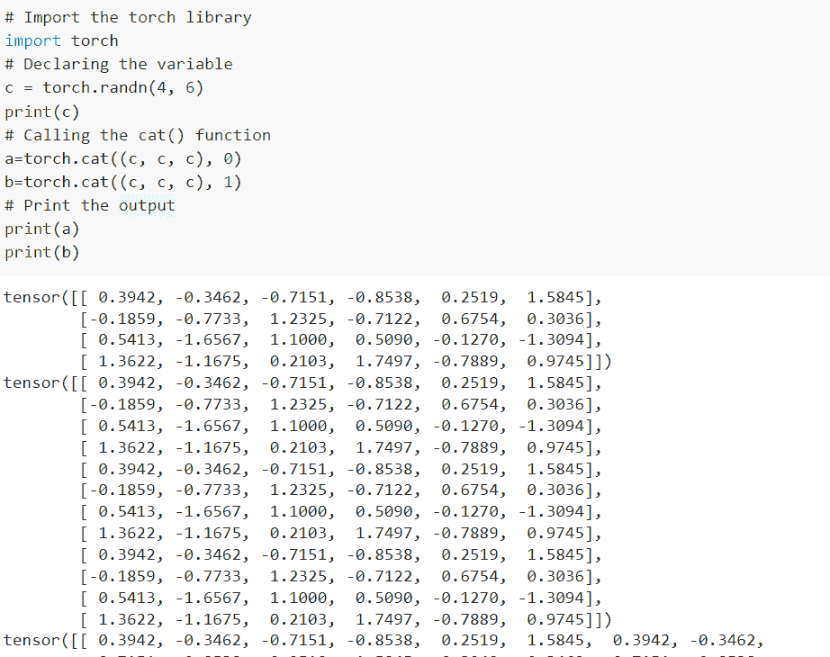
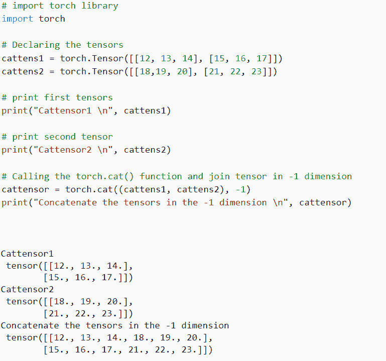
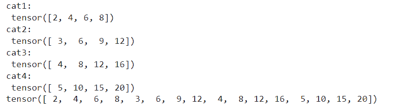
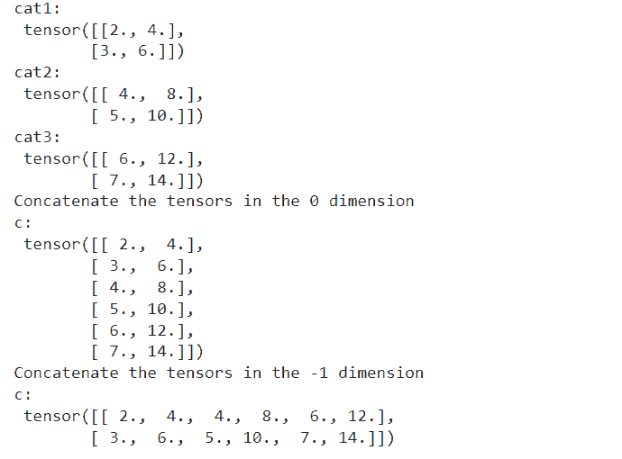
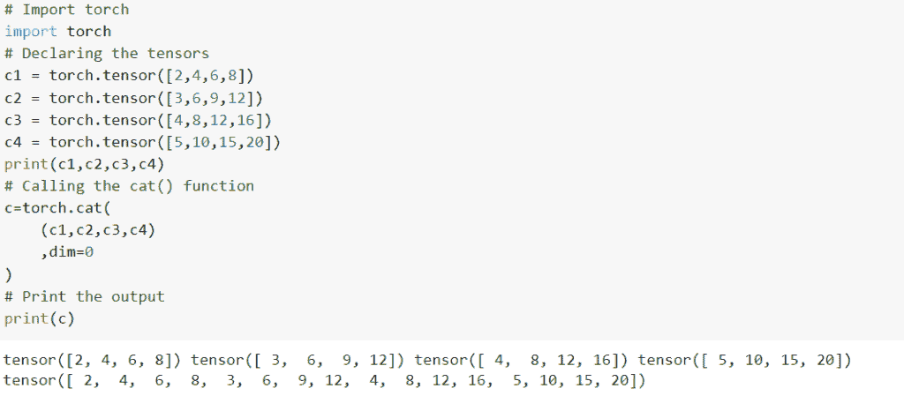
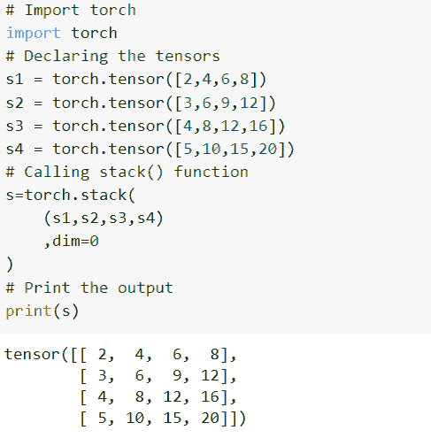

# 如何使用 PyTorch 猫功能

> 原文：<https://pythonguides.com/pytorch-cat-function/>

[](https://sharepointsky.teachable.com/p/python-and-machine-learning-training-course)

PyTorch cat 函数用于连接给定维度中给定顺序的序列张量。详细来说，我们将讨论在 Python 中使用 [PyTorch 的 cat 函数。](https://pythonguides.com/what-is-pytorch/)

此外，我们将介绍与 PyTorch Cat 函数相关的不同示例。我们将讨论这些话题。

*   PyTorch 猫功能是什么
*   PyTorch cat 函数示例
*   如何使用维数为-1 的 PyTorch cat 函数
*   使用尺寸为 0 的 PyTorch cat 函数
*   如何使用 PyTorch 3D 张量沿 0 和-1 维连接(cat)
*   PyTorch 猫 vs 栈

目录

[](#)

*   [PyTorch 猫功能](#PyTorch_cat_function "PyTorch cat function")
*   [PyTorch 猫函数示例](#PyTorch_cat_function_example "PyTorch cat function example")
*   [如何使用尺寸为-1 的 PyTorch cat 功能](#How_to_use_PyTorch_cat_function_using_dimension_as_-1 "How to use PyTorch  cat  function  using  dimension as -1")
*   [PyTorch cat 功能使用尺寸为 0](#PyTorch_cat_function_using_dimension_as_0 "PyTorch cat function using dimension as 0")
*   [如何使用 PyTorch 3D 张量沿 0 和-1 维连接(cat)](#How_to_use_PyTorch_3D_tensor_are_concatenatecat_along_0_and_-1_dimension "How to use PyTorch  3D tensor  are  concatenate(cat) along 0 and -1 dimension")
*   [PyTorch 猫 vs 栈](#PyTorch_cat_vs_stack "PyTorch cat vs stack")

## PyTorch 猫功能

在这一节中，我们将学习 python 中的 **Pytorch cat 函数**。

PyTorch cat 函数用于连接给定维度中给定顺序的序列张量，并且这些张量必须具有相同的形状。

**语法:**

PyTorch cat 函数的语法:

```py
torch.cat(tensors, dim=0, out=None)
```

**参数:**

以下是 PyTorch cat 函数的参数:

*   **张量:**张量是任何 python 序列的同类型张量的参数，所提供的非空张量必须具有相同的形状，除了在 cat 维中。
*   **dim = 0:**dim 用作一个维度，张量在其上连接。
*   **out = None:**out 定义为输出张量，out 的默认值为 None。

这样，我们通过使用一个 *`torch.cat()`* 函数来理解 Pytorch cat 函数。

阅读:[创建 PyTorch 空张量](https://pythonguides.com/pytorch-empty-tensor/)

## PyTorch 猫函数示例

在本节中，我们将学习如何借助 python 中的一个例子来实现 PyTorch cat 函数。

torch.cat()函数用于沿现有轴连接两个或多个张量。

**代码:**

在下面的代码中，我们将导入所需的库，如 import torch。

*   **c = torch.randn(4，6):** 这里我们使用 torch.randn()函数声明变量。
*   **a=torch.cat((c，c，c)，0):** 这里我们调用的是 torch.cat()函数。
*   `print(a)` 用于通过 print()函数打印变量 a。

```py
# Import the torch library
import torch
# Declaring the variable
c = torch.randn(4, 6)
print(c)
# Calling the cat() function
a=torch.cat((c, c, c), 0)
b=torch.cat((c, c, c), 1)
# Print the output
print(a)
print(b)
```

**输出:**

运行上面的代码后，我们得到下面的输出，其中我们可以看到 PyTorch cat 值被打印在屏幕上。



PyTorch cat function example

至此，我们通过一个例子了解了如何实现 Pytorch cat 函数。

阅读: [PyTorch Flatten + 8 例](https://pythonguides.com/pytorch-flatten/)

## 如何使用尺寸为-1 的 PyTorch cat 功能

在本节中，我们将学习 python 中使用 dimension as -1 的 **PyTorch cat 函数。**

这里我们使用 torch.cat()函数，该函数通过使用 dim as -1 将两个或多个张量按行连接起来。

**代码:**

在下面的代码中，我们将导入必要的库，如 import torch。

*   **cattens1 =火炬。张量([[12，13，14]，[15，16，17]]):** 这里我们用 torch.tensor()函数声明 cattensor 变量。
*   **print("Cattensor1 \n "，cattens1):** 这里我们使用 print()函数打印第一个张量。
*   **cattensor = torch.cat((cattens 1，cattens2)，-1):** 这里我们调用的是 torch . cat()函数。
*   **print(" Concatenate the tensor in-1 dimension \ n "，cattensor):** 这里我们打印的是-1 维的连接张量。

```py
# import torch library
import torch

# Declaring the tensors
cattens1 = torch.Tensor([[12, 13, 14], [15, 16, 17]])
cattens2 = torch.Tensor([[18,19, 20], [21, 22, 23]])

# print first tensors
print("Cattensor1 \n", cattens1)

# print second tensor
print("Cattensor2 \n", cattens2)

# Calling the torch.cat() function and join tensor in -1 dimension
cattensor = torch.cat((cattens1, cattens2), -1)
print("Concatenate the tensors in the -1 dimension \n", cattensor)
```

**输出:**

运行上面的代码后，我们得到下面的输出，其中我们可以看到使用 dimension as -1 值的 PyTorch cat 函数被打印在屏幕上。



PyTorch cat function using dimension as -1

这样，我们理解了 PyTorch cat 函数使用 dimension as -1。

阅读: [PyTorch 查看教程](https://pythonguides.com/pytorch-view/)

## PyTorch cat 功能使用尺寸为 0

在本节中，我们将学习 python 中使用 dimension as 0 的 **PyTorch cat 函数。**

这里我们使用 torch.cat()函数，该函数通过将 dimension 设为 0 来连接两个或多个列方向的张量。

**代码:**

在下面的代码中，我们将导入所需的库，如 import torch。

*   **c1 = torch.tensor([2，4，6，8]):** 这里我们用 torch.tensor()函数声明变量。
*   **print("cat1:\n "，c1)** 用来打印上面我们要借助 print()函数创建的张量。
*   **c=torch.cat((c1，c2，c3，c4)，dim=0 ):** 这里我们调用 torch.cat()函数来连接张量。
*   `print(c)` 用于通过 print()函数打印输出。

```py
# Import library
import torch
# Declaring the variable
c1 = torch.tensor([2,4,6,8])
c2 = torch.tensor([3,6,9,12])
c3 = torch.tensor([4,8,12,16])
c4 = torch.tensor([5,10,15,20])
# Print the above created tensors
print("cat1:\n", c1)
print("cat2:\n", c2)
print("cat3:\n", c3)
print("cat4:\n", c4)
# Calling the torch.cat() function
c=torch.cat(
    (c1,c2,c3,c4)
    ,dim=0
)
# Print the output
print(c)
```

**输出:**

运行上面的代码后，我们得到下面的输出，其中我们可以看到使用 dimension 作为 0 值的 PyTorch cat 函数被打印在屏幕上。



PyTorch cat function using dimension as 0

这就是我们如何理解使用 dimension 作为 0 的 PyTorch cat 函数。

阅读:[py torch Lenet 简介](https://pythonguides.com/pytorch-lenet/)

## 如何使用 PyTorch 3D 张量沿 0 和-1 维连接(cat)

在这一节中，我们将学习 P **yTorch 3d 张量，并在 python 中沿着 0 和-1 维**连接。

这里我们使用 torch.cat()函数，它通过使用 0 和-1 维来连接两个或多个列方向和行方向的张量。

**代码:**

在下面的代码中，我们将导入必要的库，如 import torch。

*   c1 =火炬。张量([[2，4]，[3，6]]) 用于通过使用 torch.tensor()函数创建张量。
*   **print("cat1:\n "，c1)** 用于打印我们使用 print()函数创建的上述张量。
*   c = torch.cat((c1，c2，c3)，0):这里我们调用的是 torch.cat()函数以及 0 维。
*   print(" Concatenate the tensors in the 0 dimension ")用于打印 0 维中的连接张量。
*   **c = torch.cat((c1，c2，c3)，-1):** 这里我们调用的是 torch.cat()函数连同-1 维。

```py
# import required library
import torch

# create the tensors
c1 = torch.Tensor([[2,4],[3,6]])
c2 = torch.Tensor([[4,8],[5,10]])
c3 = torch.Tensor([[6,12],[7,14]])

# print above created tensors
print("cat1:\n", c1)
print("cat2:\n", c2)
print("cat3:\n", c3)

# Print the tensor in the 0 dimension
print("Concatenate the tensors in the 0 dimension")
# Calling the torch.cat() function
c = torch.cat((c1,c2,c3), 0)
print("c:\n", c)

print("Concatenate the tensors in the -1 dimension")
c = torch.cat((c1,c2,c3), -1)
print("c:\n", c)
```

**输出:**

在下面的输出中，我们可以看到 PyTorch 3d 张量沿着屏幕上打印的 0 和-1 维值连接在一起。



PyTorch 3D tensor are concatenate(cat) along 0 and -1 dimension

这样，我们理解了 PyTorch 3D 张量是如何沿着 0 维和-1 维连接(cat)的。

阅读: [PyTorch 整形张量](https://pythonguides.com/pytorch-reshape-tensor/)

## PyTorch 猫 vs 栈

在本节中，我们将学习 python 中的 `PyTorch cat vs stack` 。

**猫():**

*`torch.cat()`* 函数用于连接给定维度中给定顺序的序列张量，并且这些张量必须具有相同的形状。

**代码:**

在下面的代码中，我们将导入所需的库，如 import torch。

*   **c1 = torch.tensor([2，4，6，8]):** 这里我们用 torch.tensor()函数来声明张量。
*   **c=torch.cat((c1，c2，c3，c4)，dim=0 ):** 这里我们调用的是 cat()函数。
*   `print(c)` 用于使用 *`print()`* 功能打印输出。

```py
# Import torch
import torch
# Declaring the tensors
c1 = torch.tensor([2,4,6,8])
c2 = torch.tensor([3,6,9,12])
c3 = torch.tensor([4,8,12,16])
c4 = torch.tensor([5,10,15,20])
print(c1,c2,c3,c4)
# Calling the cat() function
c=torch.cat(
    (c1,c2,c3,c4)
    ,dim=0
)
# Print the output
print(c)
```

**输出:**

运行上面的代码后，我们得到下面的输出，其中我们可以看到 PyTorch cat 值被打印在屏幕上。



PyTorch cat

**Stack():**

py torch`*torch . stack()*`函数用于连接具有相同维度和形状的张量。

**代码:**

在下面的代码中，我们将导入所需的库，如 import torch。

*   **s1 = torch.tensor([2，4，6，8])** 用于通过使用 torch.tensor()函数来声明张量。
*   **s=torch.stack((s1，s2，s3，s4)，dim=0 ):** 这里我们调用的是 torch.stack()函数。

```py
# Import torch
import torch
# Declaring the tensors
s1 = torch.tensor([2,4,6,8])
s2 = torch.tensor([3,6,9,12])
s3 = torch.tensor([4,8,12,16])
s4 = torch.tensor([5,10,15,20])
# Calling stack() function
s=torch.stack(
    (s1,s2,s3,s4)
    ,dim=0
)
# Print the output
print(s)
```

**输出:**

运行上面的代码后，我们得到下面的输出，其中我们可以看到 PyTorch stack()值被打印在屏幕上。



PyTorch stack

这就是我们如何理解 cat()和 stack()函数之间的区别。

您可能也喜欢阅读以下 Python 版本的 PyTorch 教程。

*   [PyTorch TanH](https://pythonguides.com/pytorch-tanh/)
*   [PyTorch 超参数调谐](https://pythonguides.com/pytorch-hyperparameter-tuning/)
*   【numpy 指针为张量
*   [如何在 PyTorch 中压缩张量](https://pythonguides.com/squeeze-a-tensor-in-pytorch/)
*   [py torch RNN–详细指南](https://pythonguides.com/pytorch-rnn/)
*   [PyTorch 全连接层](https://pythonguides.com/pytorch-fully-connected-layer/)

因此，在本教程中，我们讨论了 PyTorch cat 函数，我们还介绍了与其实现相关的不同示例。这是我们已经讨论过的例子列表。

*   PyTorch 猫功能是什么？
*   PyTorch cat 函数示例
*   如何使用维数为-1 的 PyTorch cat 函数
*   使用尺寸为 0 的 PyTorch cat 函数
*   如何使用 PyTorch 3D 张量沿 0 和-1 维连接(cat)
*   PyTorch 猫 vs 栈

[Vaishali ganotra](https://pythonguides.com/author/vaishali/)

我是一名机器学习工程师，目前作为一名 Python 开发人员在 Tsinfo Technologies 工作。我有使用各种 Python 库的经验，比如 Scikit learn、Turtle、PyTorch 等。