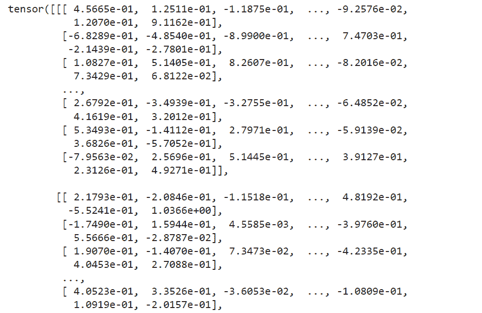
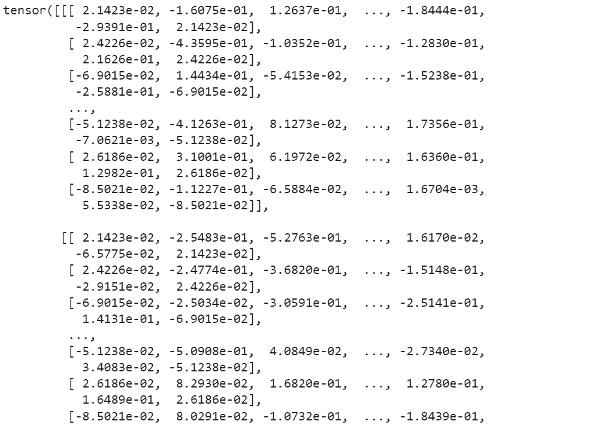
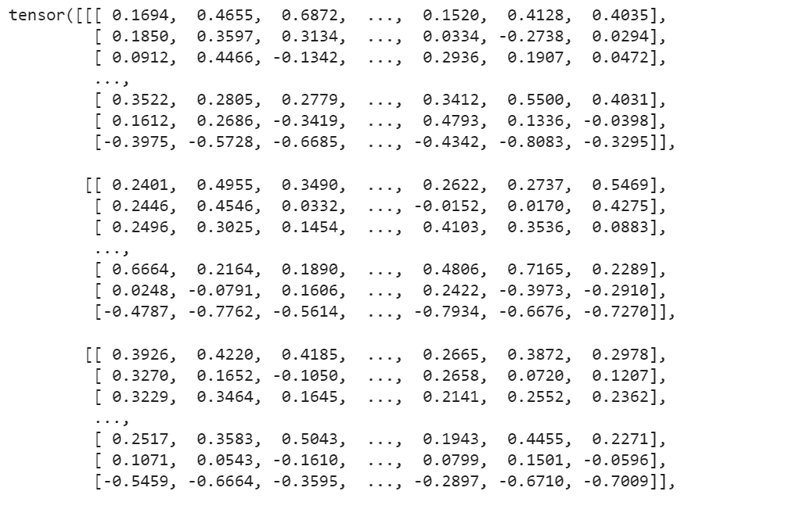
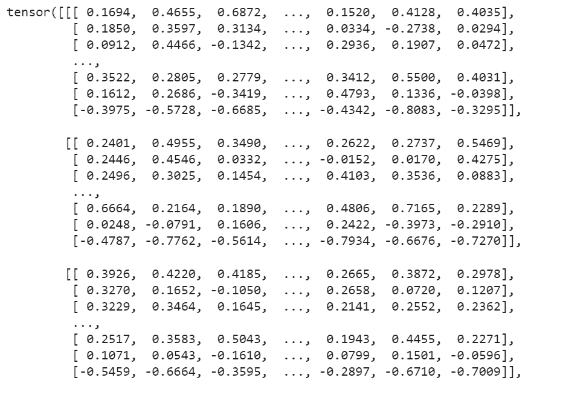
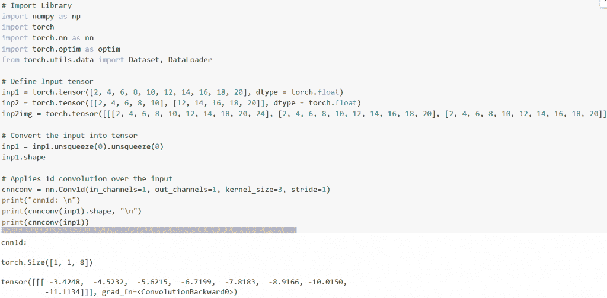
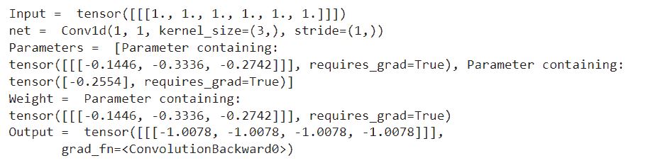
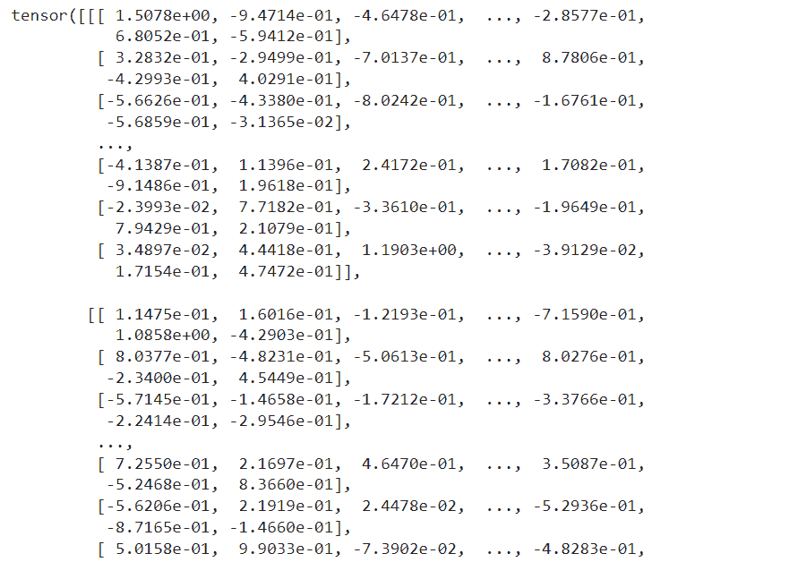
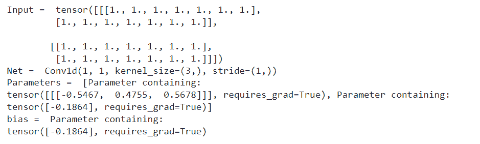
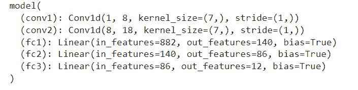

# PyTorch Conv1d【附 12 个惊人例子】

> 原文：<https://pythonguides.com/pytorch-conv1d/>

[](https://sharepointsky.teachable.com/p/python-and-machine-learning-training-course)

PyTorch conv1d 定义为一维卷积，应用于从一些输入层收集的输入信号。详细来说，我们将讨论在 python 中使用 PyTorch 的 Conv1d。此外，我们还将介绍与 `PyTorch Conv1d` 相关的不同示例。我们将讨论这些话题。

*   PyTorch Conv1d
*   PyTorch Conv1d 示例
*   PyTorch 功能转换器 1d
*   PyTorch Conv1d 衬垫
*   PyTorch Conv1d 集团
*   PyTorch Conv1d 延时
*   CNN 的 PyTorch Conv1d
*   PyTorch Conv1d 重量
*   PyTorch Conv1d 转置
*   PyTorch Conv1d 参数
*   PyTorch Conv1d 偏置
*   PyTorch Conv1d 输入通道和输出通道

目录

[](#)

*   [PyTorch Conv1d](#PyTorch_Conv1d "PyTorch Conv1d")
*   [PyTorch Conv1d 示例](#PyTorch_Conv1d_example "PyTorch Conv1d example")
*   [PyTorch 功能转换器 1d](#PyTorch_functional_Conv1d "PyTorch functional Conv1d")
*   [PyTorch Conv1d 填充](#PyTorch_Conv1d_padding "PyTorch Conv1d padding")
*   [PyTorch Conv1d 组](#PyTorch_Conv1d_group "PyTorch Conv1d group")
*   [PyTorch Conv1d 稀释](#PyTorch_Conv1d_dilation "PyTorch Conv1d dilation")
*   美国有线电视新闻网
*   [PyTorch Conv1d 权重](#PyTorch_Conv1d_weight "PyTorch Conv1d weight")
*   [PyTorch Conv1d 应答](#PyTorch_Conv1d_transpose "PyTorch Conv1d transpose")
*   [PyTorch Conv1d 参数](#PyTorch_Conv1d_parameters "PyTorch Conv1d parameters")
*   [PyTorch Conv1d 偏置](#PyTorch_Conv1d_bias "PyTorch Conv1d bias")
*   [PyTorch Conv1d 输入通道和输出通道](#PyTorch_Conv1d_input_channels_and_output_channels "PyTorch Conv1d input channels and output channels")

## PyTorch Conv1d

在本节中，我们将学习 python 中的 `PyTorch Conv1d` 。

[PyTorch](https://pythonguides.com/what-is-pytorch/) conv1d 定义为一维卷积，应用于从一些输入平面收集的输入信号。

**语法:**

PyTorch Conv1d 的语法是:

```py
torch.nn.Conv1d(in_channels, out_channels, Kernel_size, stride=1, padding=0, dilation=1, groups=1, bias=True, padding_mode='zeros', device=None, dtype=None)
```

**参数:**

以下是 PyTorch Conv1d 的参数:

*   `in_channels` 用作输入图像中的通道数。
*   `out_channels` 用作卷积产生的通道数。
*   `Kernel_size` 用于定义卷积核的大小。
*   **步距**用于控制互相关和单个数字或一元元组的步距。
*   **填充**用于控制应用于输入的填充量。它可以是字符串，也可以是给定隐式填充量的元组。填充的默认值为 0。
*   **膨胀**用于控制内核元素之间的间距，膨胀的默认值为 1。
*   **组**用于控制输入和输出之间的连接。组的默认值为 1。
*   **偏差:**偏差的默认值为真。如果这是真的，它会给输出增加一个可学习的偏差。如果为假，则不会给输出增加任何可学习的偏差。

由此，我们理解了 PyTorch Conv1d。

阅读:[交叉熵损失 PyTorch](https://pythonguides.com/cross-entropy-loss-pytorch/)

## PyTorch Conv1d 示例

在本节中，我们将借助一个例子来学习如何实现 PyTorch Conv1d 。

PyTorch Conv1d 用于生成卷积核，该卷积核与单一概念维度上的层输入一起扭曲，从而形成输出张量。

**代码:**

在下面的代码中，首先我们将导入所有必要的库，如导入火炬，导入火炬。nn 为 nn。

*   **c = nn。Conv1d(18，35，5，stride=2)** 这里我们用的是 nn。Conv1d()函数。
*   **input = torch.randn(22，18，52)** 用于通过 torch.randn()函数声明变量。
*   `output = c(input)` 用于描述输出变量。
*   **打印(输出)**用于使用 print()函数打印输出。

```py
# Import Library
import torch
import torch.nn as nn
# Using nn.Conv1d() function
c = nn.Conv1d(18, 35, 5, stride=2)
# Declaring a input variable
input = torch.randn(22, 18, 52)
output = c(input)
# Print output
print(output)
```

**输出:**

运行上面的代码后，我们得到下面的输出，其中我们可以看到 PyTorch Conv1d 值被打印在屏幕上。



PyTorch Conv1d example

所以，有了这个，我们借助一个例子理解了 PyTorch Conv1d。

阅读: [PyTorch nn 线性+例题](https://pythonguides.com/pytorch-nn-linear/)

## PyTorch 功能转换器 1d

在本节中，我们将学习 python 中的 **PyTorch 函数 Conv1d** 。

PyTorch 函数 Conv1d 对从一些输入层收集的输入信号进行一维卷积运算。

**语法:**

PyTorch 函数 Conv1d 的语法是:

```py
torch.nn.functional.conv1d(input, weight, bias=None, stride=1, padding=0, dilation=1, groups=1)
```

**参数:**

以下是 PyTorch 功能 Conv1d 的参数:

*   **输入:**输入定义为形状的输入张量(minibatch，in_channels，iW)。
*   **权重:**权重定义为形状的过滤器(out_channels)。
*   **偏差:**偏差定义为形状的可选偏差张量(out_channels)。偏差的默认值是无。
*   步幅:卷积核的步幅。stride 的默认值为 1。
*   **填充:**用于控制应用于输入的填充量。它可以是字符串，也可以是给定隐式填充量的元组。填充的默认值为 0。
*   **膨胀:**用于控制内核元素之间的间距，膨胀的默认值为 1。
*   **组**用于控制输入和输出之间的连接。组的默认值为 1。

由此，我们理解了 PyTorch 泛函 Conv1d。

阅读: [PyTorch 批量标准化](https://pythonguides.com/pytorch-batch-normalization/)

## PyTorch Conv1d 填充

在本节中，我们将学习 python 中的 **PyTorch Conv1d 填充符**。

PyTorch Conv1d 填充定义为一个参数，用于控制应用于输入的填充量。它可以是字符串，也可以是给定隐式填充量的元组。填充的默认值为 0。

**代码:**

在下面的代码中，首先我们将导入火炬库作为导入火炬。

*   **inputs = torch.rand([42，42，105]):** 这里我们用 torch.rand()函数来描述输入变量。
*   **n = torch.nn.Conv1d(42，12，kernel_size=3，stride=2，padding=3):** 这里我们用方形核和带 padding 的等步幅来描述一个变量。
*   **打印(输出)**用于借助 print()函数打印输出。

```py
# Import library
import torch

# Describe a variable
inputs = torch.rand([42, 42, 105])
# Describe a variable by using square kernels and equal stride with padding
n = torch.nn.Conv1d(42, 12, kernel_size=3, stride=2, padding=3)
output= n(inputs)
# Print the output
print(output)
print(output.shape)
```

**输出:**

运行上面的代码后，我们得到下面的输出，其中我们可以看到 PyTorch Conv1d 填充值打印在屏幕上。



PyTorch Conv1d padding

此外，检查: [Keras 与 py torch–主要差异](https://pythonguides.com/keras-vs-pytorch/)

## PyTorch Conv1d 组

在本节中，我们将学习 python 中的 **PyTorch Conv1d 组**。

PyTorch Conv1d 组被定义为用于控制输入和输出之间连接的参数。组的默认值为 1。

**代码:**

在下面的代码中，首先我们将导入火炬库作为导入火炬。

*   **inputs = torch.rand([42，42，102]:** 这里我们用 torch.rand()函数来描述输入变量。
*   **x = torch.nn.Conv1d(42，12，kernel_size=3，stride=2):** 这里我们用方形核和带填充的等步幅来描述一个变量。
*   **打印(输出)**用于借助 print()函数打印输出。

```py
# Import library
import torch

# Describe a variable
inputs = torch.rand([42, 42, 102])
# Describing a variable by using square kernels and equal stride
x = torch.nn.Conv1d(42, 12, kernel_size=3, stride=2)
output = x(inputs)
# Print the output
print(output)
```

**输出:**

在下面的输出中，您可以看到 PyTorch Conv1d 值打印在屏幕上。



PyTorch conv1d group

这样，我们就了解了 PyTorch Conv1d 组。

阅读: [PyTorch 负载模型+示例](https://pythonguides.com/pytorch-load-model/)

## PyTorch Conv1d 稀释

在本节中，我们将学习 python 中的 **PyTorch Conv1d 膨胀**。

PyTorch Conv1d 膨胀被定义为用于控制内核元素之间的间距的参数，并且膨胀的默认值是 1。

**代码:**

在下面的代码中，首先我们将导入火炬库，比如导入火炬。

*   **inputs = torch.rand([42，42，102]):** 这里我们用 torch.rand()函数来描述输入变量。
*   **x = torch.nn.Conv1d(42，12，kernel_size=3，stride=2)** :这里我们用正方形核和带填充的等步幅来描述一个变量。
*   **打印(输出)**用于借助 print()函数打印输出。

```py
# Import library
import torch

# Describe a variable
inputs = torch.rand([42, 42, 102])
# Describing a variable by using square kernels and equal stride
x = torch.nn.Conv1d(42, 12, kernel_size=3, stride=2)
output = x(inputs)
# Print the output
print(output)
```

**输出:**

运行上面的代码后，我们得到下面的输出，其中我们可以看到 PyTorch Conv1d 膨胀值打印在屏幕上。



PyTorch Conv1d dilation

由此，我们理解了 PyTorch 膨胀。

阅读: [PyTorch 全连接层](https://pythonguides.com/pytorch-fully-connected-layer/)

## 美国有线电视新闻网

在这一节中，我们将了解 CNN 的 PyTorch Conv1d。

在继续之前，我们应该有一些关于 CNN(卷积神经网络)的知识。

卷积神经网络是一种用于图像识别的人工神经网络。

这里我们用 Conv1d 来处理一个卷积神经网络。Conv1d()函数在输入上应用 1d 卷积。Conv1d 等待输入为(batch_size 和 input_channels)等的形状。

**代码:**

在下面的代码中，首先我们将导入所有必要的库，如 import numpy as np，import torch，import torch.nn as nn，import torch.optim as optim，以及从 torch.utils.data 导入 Dataset，Dataloader。

*   **inp1 = torch.tensor([2，4，6，8，10，12，14，16，18，20]，dtype = torch.float):** 这里我们用 torch.tensor()函数定义输入张量。
*   **inp1 = inp1.unsqueeze(0)。unsqueeze(0)** 用于将输入转换为张量。
*   **cnnconv = nn。Conv1d(in_channels=1，out_channels=1，kernel_size=3，stride=1)** 用于对输入应用 Conv1d。
*   **print("cnn1d: \n")** 用于通过 print()函数打印 CNN conv1d。

```py
# Import Library
import numpy as np
import torch
import torch.nn as nn
import torch.optim as optim
from torch.utils.data import Dataset, DataLoader

# Define Input tensor
inp1 = torch.tensor([2, 4, 6, 8, 10, 12, 14, 16, 18, 20], dtype = torch.float)
inp2 = torch.tensor([[2, 4, 6, 8, 10], [12, 14, 16, 18, 20]], dtype = torch.float)
inp2img = torch.tensor([[[2, 4, 6, 8, 10, 12, 14, 18, 20, 24], [2, 4, 6, 8, 10, 12, 14, 16, 18, 20], [2, 4, 6, 8, 10, 12, 14, 16, 18, 20]], [[2, 4, 6, 8, 10, 12, 14, 16, 18, 20], [2, 4, 6, 8, 10, 12, 14, 16, 18, 20], [2, 4, 6, 8, 10, 12, 14, 16, 18, 20]], [[2, 4, 6, 8, 10, 12, 14, 16, 18, 20], [2, 4, 6, 8, 10, 12, 14, 16, 18, 20], [2, 4, 6, 8, 10, 12, 14, 16, 18, 20]]], dtype = torch.float)

# Convert the input into tensor
inp1 = inp1.unsqueeze(0).unsqueeze(0)
inp1.shape

# Applies 1d convolution over the input
cnnconv = nn.Conv1d(in_channels=1, out_channels=1, kernel_size=3, stride=1)
print("cnn1d: \n")
print(cnnconv(inp1).shape, "\n")
print(cnnconv(inp1))
```

**输出:**

运行上面的代码后，我们得到下面的输出，其中我们可以看到 CNN 值中的 PyTorch Conv1d 被打印在屏幕上。



PyTorch Conv1d in CNN

所以，有了这个，我们理解了 CNN 的 PyTorch Conv1d。

阅读: [PyTorch 双星交叉熵](https://pythonguides.com/pytorch-binary-cross-entropy/)

## PyTorch Conv1d 权重

在本节中，我们将学习 python 中的 `PyTorch Conv1d weigh` t。

PyTorch Conv1d 权重用于对 1d 数据和一些附加选项(如填充)执行卷积。

**代码:**

在下面的代码中，首先我们使用 torch 模块，比如 import torch。

*   **inp = torch.ones(1，1，6):** 这里我们用 `torch.ones()` 函数来描述输入变量。
*   **print("Input = "，inp)** 用于借助 print()函数打印输入。
*   **m = torch.nn.Conv1d(in _ channels = 1，out_channels = 1，kernel_size = 3):** 这里我们通过使用 torch . nn . conv1d()函数来使用变量。
*   **print("Parameters = "，list(m.parameters()))** 用于打印参数表。
*   **print("Weight = "，m.weight)** 用于打印重量。
*   **print("Output = "，out)** 用于通过 print()函数打印输出。

```py
# Import library
import torch

# Describe the input variable
inp = torch.ones(1,1,6)

# Print input
print("Input = ",inp)

m = torch.nn.Conv1d(in_channels = 1, out_channels = 1, kernel_size = 3)

# Print the parameter list
print("net = ",m)
print("Parameters = ",list(m.parameters()))
# Print the weight
print("Weight = ",m.weight)

out = m(inp)

print("Output = ",out)
```

**输出:**

运行上面的代码后，我们得到下面的输出，其中我们可以看到 PyTorch Conv1d 权重值被打印在屏幕上。



PyTorch Conv1d weight

这就是我们如何使用 PyTorch Conv1d 砝码。

阅读: [PyTorch 数据加载器+示例](https://pythonguides.com/pytorch-dataloader/)

## PyTorch Conv1d 应答

在本节中，我们将学习 python 中的 **PyTorch Conv1d 转置**。

PyTorch Convtranspose1d 对从一些输入平面收集的输入图像应用 1d 转置卷积运算。

**语法:**

PyTorch Conv1d 转置的语法:

```py
torch.nn.ConvTranspose1d(in_channels, out_channels, kernel_size, stride=1, padding=0, output_padding=0, groups=1, bias=True, dilation=1, padding_mode='zeros', device=None, dtype=None)
```

**参数:**

以下是 PyTorch Conv1d 移调的参数

*   `in_channels` 用作输入图像中的几个通道。
*   out_channels 用作卷积产生的几个通道。
*   `kernel_size` 用作卷积核的大小。
*   **步距**用于控制来自互相关的步距。
*   **填充**:控制隐式补零的数量。
*   **output_padding:** 控制添加到输出形状一侧的附加尺寸。
*   **膨胀**:控制内核点之间的间距。
*   **组:**控制输入和输出之间的连接。

这样，我们理解了 PyTorch Conv1d 转座。

阅读: [PyTorch 提前停止+示例](https://pythonguides.com/pytorch-early-stopping/)

## PyTorch Conv1d 参数

在本节中，我们将学习 python 中的 **PyTorch Conv1d 参数**。

在继续之前，我们应该了解一些关于参数的知识。参数是可测量的因素，被认为是描述系统或设定其运行条件的集合之一。

**代码:**

在下面的代码中，我们将导入所有必要的库，如 import torch，import torch.nn as nn。

*   **c = nn。Conv1d(20，37，5，stride=2):** 这里我们用 nn 来描述变量。具有正方形核和等步长的 Conv1d()函数。
*   **inp = torch.randn(24，20，54):** 这里我们用 torch.randn()函数来描述输入变量。
*   `out = c(inp)` 用于描述输出变量。
*   `print(out)` 用于使用 print()函数打印输出。

```py
# Importing Libraries
import torch
import torch. nn as nn

# Describing the variable by using nn.Conv1d() function with square kernels and equal stride
c = nn.Conv1d(20, 37, 5, stride=2)

# Describe the variable
inp = torch.randn(24, 20, 54)

# Declare the output variable
out = c(inp)
# Print output
print(out)
```

**输出:**

在下面的输出中，您可以看到 PyTorch Conv1d 参数值打印在屏幕上。



PyTorch Conv1d parameters

至此，我们了解了 PyTorch Conv1d 参数。

阅读:[py torch ms loss–详细指南](https://pythonguides.com/pytorch-mseloss/)

## PyTorch Conv1d 偏置

在本节中，我们将学习 python 中的 `PyTorch Conv1d bias` 。

PyTorch Conv1d 偏差被定义为形状的可选偏差张量，偏差的默认值为无。

**代码:**

在下面的代码中，首先我们将导入 torch 库，如 import torch。

*   **input = torch.ones(2，2，7):** 这里我们用 torch.ones()函数来描述输入变量。
*   **m = torch.nn.Conv1d(in _ channels = 1，out_channels = 1，kernel_size = 3):** 这里我们使用的是 torch . nn . conv1d()函数。
*   **print("Parameters = "，list(m.parameters()))** 用于打印参数列表。
*   **print("bias = "，m.bias)** 用于借助 print()函数打印偏差。

```py
# Import library
import torch

# Describe the input variable
input = torch.ones(2,2,7)

print("Input = ",input)

# Using conv1d module
m = torch.nn.Conv1d(in_channels = 1, out_channels = 1, kernel_size = 3)

# Print the list of the parametrs
print("Net = ",m)
print("Parameters = ",list(m.parameters()))

# Print the bias
print("bias = ",m.bias)
```

**输出:**

运行上述代码后，我们得到以下输出，可以看到 PyTorch Conv1d 偏置值打印在屏幕上。



PyTorch Conv1d bias

由此，我们理解了 PyTorch Conv1d 偏差。

阅读: [PyTorch 添加尺寸](https://pythonguides.com/pytorch-add-dimension/)

## PyTorch Conv1d 输入通道和输出通道

在本节中，我们将学习 python 中的 **PyTorch Conv1d 输入通道和输出通道**。

PyTorch Conv1d 输入通道用作输入图像中的通道数。

PyTorch Conv1d 输出通道用作卷积产生的通道数。

**代码:**

在下面的代码中，首先我们将导入所有必要的库，如 import torch、import Variable from torch . autograded 和 import torch.nn.functional。

*   **班级模型(nn。Module):** 这里我们使用 init()和 forward()方法创建一个模型类。
*   **def numflat_featurs(self，y):** 这里我们定义了 numflat_features。
*   **model = model():** 这里我们正在初始化模型。
*   `print(model)` 用于通过 print()函数打印模型。

```py
# Importing Libraries
import torch
from torch.autograd import Variable
import torch.nn as nn
import torch.nn.functional as fun

# Create model class
class model(nn.Module):

    def __init__(self):
        super(model, self).__init__()
        # 1 input image channel, 8 output channels, 7x7 square convolution
        self.conv1 = nn.Conv1d(1, 8, 7)
        self.conv2 = nn.Conv1d(8, 18, 7)
        # an affine operation: y = Wx + b
        self.fc1 = nn.Linear(18 * 7 * 7, 140)
        self.fc2 = nn.Linear(140, 86)
        self.fc3 = nn.Linear(86, 12)

    def forward(self, y):
        # Max pooling over a (2, 2) win
        y = fun.max_pool2d(fun.relu(self.conv1(y)), (2, 2))

        y = fun.max_pool2d(fun.relu(self.conv2(y)), 2)
        y = y.view(-1, self.numflat_featurs(y))
        y = fun.relu(self.fc1(y))
        y = fun.relu(self.fc2(y))
        y = self.fc3(y)
        return y

    def numflat_featurs(self, y):
      # all dimensions except the batch dimension
        size = y.size()[1:]  
        numfeaturs = 1
        for i in size:
            numfeaturs *= i
        return numfeaturs

# Instantiate the model
model = model()
# Print the model
print(model)
```

**输出:**

运行上述代码后，我们得到以下输出，其中我们可以看到 PyTorch Conv1d 输入通道和输出通道打印在屏幕上。



PyTorch Conv1d input channels and output channels

至此，我们了解了 PyTorch Conv1d 输入通道和输出通道。

另外，再看看一些 PyTorch 教程。

*   [PyTorch 超参数调谐](https://pythonguides.com/pytorch-hyperparameter-tuning/)
*   [py torch Lenet 简介](https://pythonguides.com/pytorch-lenet/)
*   [PyTorch 线性回归](https://pythonguides.com/pytorch-linear-regression/)
*   [PyTorch 激活功能](https://pythonguides.com/pytorch-activation-function/)
*   [PyTorch 整形张量](https://pythonguides.com/pytorch-reshape-tensor/)

因此，在本教程中，我们讨论了 `PyTorch Conv1d` ，并且我们还讨论了与其实现相关的不同示例。这是我们已经讨论过的例子列表。

*   PyTorch Conv1d
*   PyTorch Conv1d 示例
*   PyTorch 功能转换器 1d
*   PyTorch Conv1d 衬垫
*   PyTorch Conv1d 集团
*   PyTorch Conv1d 延时
*   CNN 的 PyTorch Conv1d
*   PyTorch Conv1d 重量
*   PyTorch Conv1d 转置
*   PyTorch Conv1d 参数
*   PyTorch Conv1d 偏置
*   PyTorch Conv1d 输入通道和输出通道

[Bijay Kumar](https://pythonguides.com/author/fewlines4biju/)

Python 是美国最流行的语言之一。我从事 Python 工作已经有很长时间了，我在与 Tkinter、Pandas、NumPy、Turtle、Django、Matplotlib、Tensorflow、Scipy、Scikit-Learn 等各种库合作方面拥有专业知识。我有与美国、加拿大、英国、澳大利亚、新西兰等国家的各种客户合作的经验。查看我的个人资料。

[enjoysharepoint.com/](https://enjoysharepoint.com/)[](https://www.facebook.com/fewlines4biju "Facebook")[](https://www.linkedin.com/in/fewlines4biju/ "Linkedin")[](https://twitter.com/fewlines4biju "Twitter")