# py torch conv 3d–详细指南

> 原文：<https://pythonguides.com/pytorch-conv3d/>

[](https://sharepointsky.teachable.com/p/python-and-machine-learning-training-course)

`PyTorch Conv3d` 是一个在一些输入平面收集的输入信号上应用三维卷积的类。详细来说，我们将使用 python 中的 [PyTorch 来讨论 Conv3d。此外，我们还将介绍与 PyTorch Conv3d 相关的不同示例。](https://pythonguides.com/what-is-pytorch/)

*   什么是 PyTorch Conv3d
*   PyTorch Conv3d 示例
*   PyTorch 泛函 Conv3d
*   PyTorch Conv3d 填充
*   PyTorch Conv3d 集团
*   PyTorch conv3d 扩展
*   PyTorch Conv3d 偏置
*   CNN 的 PyTorch Conv3d
*   PyTorch Conv3d 转置
*   PyTorch Conv3d 参数
*   PyTorch Conv3d 权值
*   PyTorch Conv3d 输入通道和输出通道

目录

[](#)

*   [什么是 PyTorch Conv3d](#What_is_PyTorch_Conv3d " What is PyTorch Conv3d")
*   [PyTorch Conv3d 示例](#PyTorch_Conv3d_example "PyTorch Conv3d example")
*   [PyTorch functional Conv3d](#PyTorch_functional_Conv3d "PyTorch functional Conv3d ")
*   [PyTorch Conv3d 填充](#PyTorch_Conv3d_padding "PyTorch Conv3d padding")
*   [PyTorch Conv3d 组](#PyTorch_Conv3d_group "PyTorch Conv3d group")
*   [PyTorch conv3d 扩张](#PyTorch_conv3d_dilation "PyTorch conv3d dilation")
*   [PyTorch Conv3d 偏置](#PyTorch_Conv3d_bias "PyTorch Conv3d bias")
*   [美国有线电视新闻网 py torch Conv3d](#PyTorch_Conv3d_in_CNN "PyTorch Conv3d in CNN")
*   [PyTorch Conv3d 转译](#PyTorch_Conv3d_transpose "PyTorch Conv3d transpose")
*   [PyTorch Conv3d 参数](#PyTorch_Conv3d_parameters "PyTorch Conv3d parameters")
*   [PyTorch Conv3d weight](#PyTorch_Conv3d_weight "PyTorch Conv3d weight")
*   [PyTorch Conv3d 输入 _ 通道和输出 _ 通道](#PyTorch_Conv3d_input_channels_and_output_channels "PyTorch Conv3d input_channels and output_channels")

## 什么是 PyTorch Conv3d

在本节中，我们将学习 python 中的 `PyTorch Conv3d` 。

PyTorch Conv3d 定义为一种三维卷积，应用于从一些输入平面收集的输入信号。

**语法:**

PyTorch Conv3d 的语法是:

```py
torch.nn.Conv3d(in_channels, out_channels, Kernel_size, stride=1, padding=0, dilation=1, groups=1, bias=True, padding_mode='zeros', devices=None, dtype=None)
```

**参数:**

以下是 PyTorch Conv3d 的参数:

*   `in_channels` 用作输入图像中的通道数。
*   `out_channels` 用作卷积产生的通道数。
*   `Kernel_size` 用于定义卷积核的大小。
*   **步距**用于控制互相关和单个数字或一元元组的步距。
*   **填充**用于控制应用于输入的填充量。它可以是字符串，也可以是隐式填充量的元组。填充的默认值为 0。
*   **膨胀**用于控制内核元素之间的间距，膨胀的默认值为 1。
*   **组**用于控制输入和输出之间的连接。组的默认值为 1。
*   **偏差:**偏差的默认值为真。如果这是真的，它会给输出增加一个可学习的偏差。如果为假，则不会给输出增加任何可学习的偏差。

至此，我们了解了 PyTorch Conv3d 的确切含义，在下一节中，我们将展示一个与之相关的示例。

阅读: [PyTorch 提前停止+示例](https://pythonguides.com/pytorch-early-stopping/)

## PyTorch Conv3d 示例

在本节中，我们将借助 python 中的示例学习**如何实现 PyTorch Conv3d。**

PyTorch Conv3d 是一个简单的算术运算，我们在三维数据上滑动一个权重矩阵或内核，并执行数据的元素乘法。

**代码:**

在下面的代码中，我们将导入所有必要的库，如 import torch，import torch.nn as nn。

*   **c = nn。Conv3d(18，35，5，stride=2):** 这里我们通过使用平方核和等跨距来声明变量。
*   **input = torch.randn(22，18，12，52，102)** 用于通过 torch.randn()函数描述输入变量。
*   `print(output)` 用于使用 print()函数打印输出 bu。

```py
# Importing libraries
import torch
import torch.nn as nn

# Declaring the variable by using square kernels and equal stride
c = nn.Conv3d(18, 35, 5, stride=2)

# Describing the input and output variables
input = torch.randn(22, 18, 12, 52, 102)
output = c(input)

# Print output
print(output) 
```

**输出:**

运行上面的代码后，我们得到下面的输出，其中我们可以看到 PyTorch Conv3d 值被打印在屏幕上。

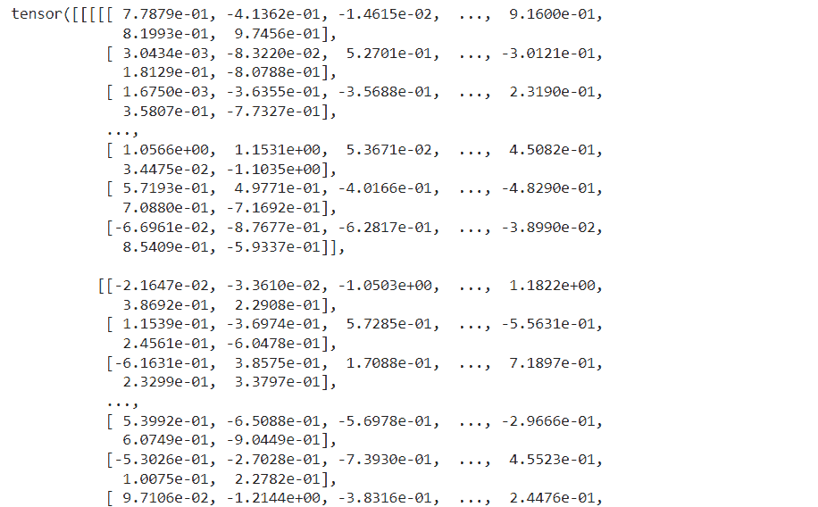

PyTorch Conv3d example

这就是我们借助一个例子来理解 PyTorch Conv3d 的方法。

阅读:[Keras Vs py torch–主要区别](https://pythonguides.com/keras-vs-pytorch/)

## PyTorch functional Conv3d

在本节中，我们将学习 python 中的 **PyTorch 函数 Conv3d** 。

PyTorch 函数 Conv3d 对从一些输入平面收集的输入图像应用三维卷积。

**语法:**

PyTorch 函数 Conv3d 的语法是:

```py
torch.nn.functional.conv3d(input, weight, bias=None, stride=1, padding=0, dilation=1, groups=1)
```

**参数:**

以下是 PyTorch 函数 conv3d 的参数:

*   **输入:**输入定义为形状的输入张量(minibatch，in_channels)。
*   **权重:**权重定义为形状的过滤器(out_channels)。
*   **偏差:**偏差定义为形状的可选偏差张量(out_channels)。偏差的默认值是无。
*   **步距:**卷积核的步距。stride 的默认值为 1。
*   **填充**用于控制应用于输入的填充量。它可以是字符串，也可以是隐式填充量的元组。填充的默认值为 0。
*   **膨胀**用于控制内核元素之间的间距，膨胀的默认值为 1。
*   **组**用于控制输入和输出之间的连接。组的默认值为 1。

**举例:**

在下面的代码中，首先我们将导入所有必要的库，如 import torch，import torch . nn . functional as function。

*   **filter = torch.randn(35，18，5，5，5):** 这里我们用 torch.randn()函数来描述变量。
*   **f=function.conv3d(input，filter)** 用于描述 function.conv3d()函数。
*   `print(f)` 用于通过 print()函数打印输出。

```py
# Importing Libraries
import torch
import torch.nn.functional as function
# Describing the variable by using torch.randn() function
filter = torch.randn(35, 18, 5, 5, 5)
input = torch.randn(22, 18, 52, 12, 22)
# Using conv3d() function
f=function.conv3d(input, filter)
# print output
print(f)
```

**输出:**

运行上面的代码后，我们得到下面的输出，可以看到 PyTorch 函数 Conv3d 值打印在屏幕上。

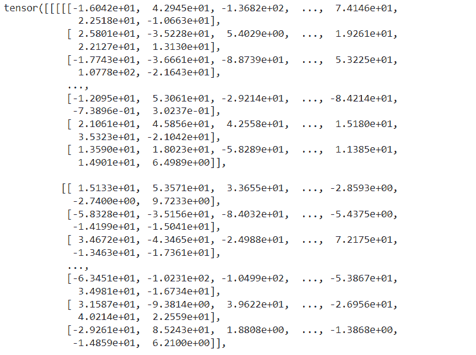

PyTorch functional Conv3d

至此，我们了解了 PyTorch 泛函 Conv3d。

阅读: [PyTorch 批量标准化](https://pythonguides.com/pytorch-batch-normalization/)

## PyTorch Conv3d 填充

在本节中，我们将学习 python 中的 **PyTorch Conv3d 填充**。

PyTorch Cpnv3d 填充用于控制应用于输入的填充量。它可以是字符串，也可以是给定隐式填充量的元组。填充的默认值为 0。

**代码:**

在下面的代码中，我们将导入所有必要的库，如 import torch，import torch.nn as nn。

*   **c = nn。Conv3d(18，35，5，stride=2):** 这里我们通过使用平方核和等跨距来声明变量。
*   **p = nn。Conv3d(18，35，(5，7，4)，stride=(4，3，3)，padding=(6，4，0)):** 这里我们通过使用非方形内核和带 padding 的不相等步幅来声明变量。
*   **input = torch.randn(22，18，12，52，102):** 这里我们用 torch.randn()函数来描述输入输出变量。
*   **打印(输出)**用于使用 print()函数打印输出。

```py
# Importing libraries
import torch
import torch.nn as nn
# Declaring the variable by using square kernels and equal stride
c = nn.Conv3d(18, 35, 5, stride=2)
# Declaring the variable by using non-square kernels and unequal stride with padding
p = nn.Conv3d(18, 35, (5, 7, 4), stride=(4, 3, 3), padding=(6, 4, 0))
# Describing the input and output variables
input = torch.randn(22, 18, 12, 52, 102)
output = p(input)
# Print output
print(output) 
```

**输出:**

在下面的输出中，我们可以看到 PyTorch Conv3d 填充值打印在屏幕上。

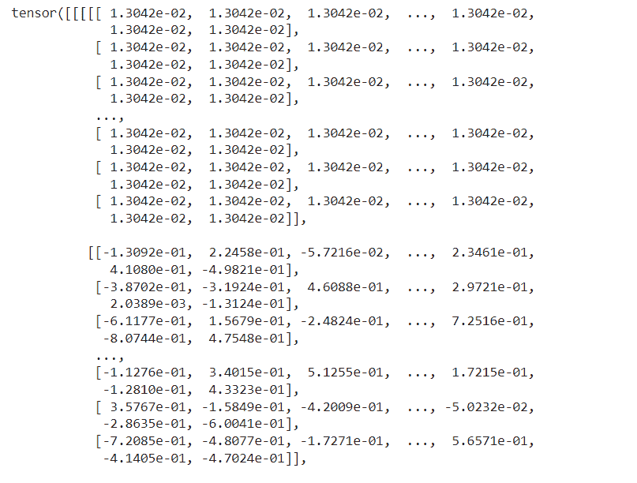

PyTorch Conv3d padding

至此，我们了解了 PyTorch Conv3d 衬垫。

阅读: [PyTorch nn 线性+例题](https://pythonguides.com/pytorch-nn-linear/)

## PyTorch Conv3d 组

在本节中，我们将学习 python 中的 **PyTorch Conv3d 组**。

PyTorch Conv3d 组用于控制输入和输出之间的连接。组的默认值为 1。

**代码:**

在下面的代码中，我们将导入所有必要的库，如 import torch 和 import torch.nn as nn。

*   **g = nn。Conv3d(20，37，7，stride=2)** 用于使用平方核和等步长声明变量。
*   **input = torch.randn(24，20，14，54，104)** 用于通过 torch.randn()函数描述输入变量。
*   **打印(输出)**用于使用 print()函数打印输出。

```py
# Importing libraries
import torch
import torch.nn as nn

# Declaring the variable by using square kernels and equal stride
g = nn.Conv3d(20, 37, 7, stride=2)

# Describing the input and output variables
input = torch.randn(24, 20, 14, 54, 104)
output = g(input)

# Print output
print(output) 
```

**输出:**

运行上面的代码后，我们得到下面的输出，其中我们可以看到 PyTorch Conv3d 组值被打印在屏幕上。

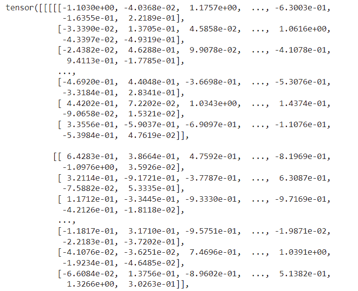

PyTorch Conv3d group

这就是我们对 PyTorch Conv3d 集团的理解。

阅读:[交叉熵损失 PyTorch](https://pythonguides.com/cross-entropy-loss-pytorch/)

## PyTorch conv3d 扩张

在本节中，我们将学习 python 中的 **PyTorch Conv3d 膨胀**。

PyTorch Conv3d 膨胀用于控制内核元素之间的间距，膨胀的默认值为 1。

**代码:**

在下面的代码中，我们将导入所有必要的库，如 import torch 和 import torch.nn as nn。

*   **c = nn。Conv3d(18，35，5，stride=2):** 这里我们通过使用平方核和等跨距来声明变量。
*   **p = nn。Conv3d(18，35，(5，7，4)，stride=(4，3，3)，padding=(6，4，0)):** 这里我们通过使用非方形内核和带 padding 的不相等步幅来声明变量。
*   **q = nn。Conv3d(18，35，(5，7，4)，stride=(4，3，3)，padding=(6，4，0)，exploation =(5，3，1)):** 这里我们通过使用非方核和带 padding 和 exploation 的不等步幅来声明变量。
*   **input = torch.randn(22，18，12，52，102):** 这里我们用 torch.randn()函数来描述变量。
*   **打印(输出)**用于使用 print()函数打印输出。

```py
# Importing libraries
import torch
import torch.nn as nn
# Declaring the variable by using square kernels and equal stride
c = nn.Conv3d(18, 35, 5, stride=2)
# Declaring the variable by using non-square kernels and unequal stride with padding
p = nn.Conv3d(18, 35, (5, 7, 4), stride=(4, 3, 3), padding=(6, 4, 0))
# Declaring the variable by using non-square kernels and unequal stride with padding and dilation
q = nn.Conv3d(18, 35, (5, 7, 4), stride=(4, 3, 3), padding=(6, 4, 0), dilation=(5,3,1))
# Describing the input and output variables
input = torch.randn(22, 18, 12, 52, 102)
output = q(input)
# Print output
print(output) 
```

**输出:**

运行上面的代码后，我们得到下面的输出，其中我们可以看到 PyTorch Conv3d 膨胀值打印在屏幕上。

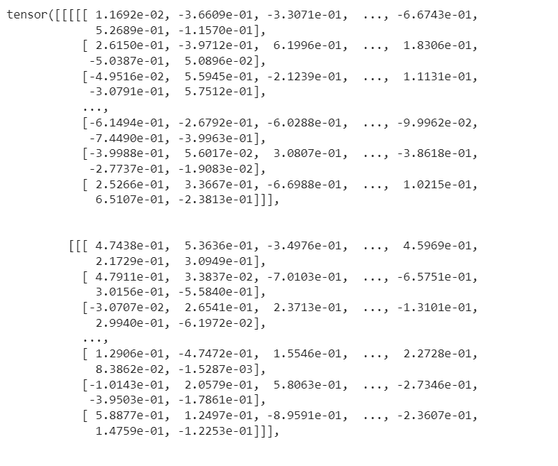

PyTorch Conv3d dilation

这样，我们理解了 python 中 PyTorch 膨胀的工作原理。

阅读: [PyTorch Numpy to Tensor](https://pythonguides.com/pytorch-numpy-to-tensor/)

## PyTorch Conv3d 偏置

在本节中，我们将学习 python 中的 `PyTorch Conv3d bias` 。

在前进之前，我们应该有一个关于偏见的知识。偏差考虑了模型预测和真实结果之间的差异。

PyTorch Conv3d 偏差在其值为真时向输出添加可学习偏差，如果为假，则不向输出添加可学习偏差。bias 的默认值为 True。

**代码:**

在下面的代码中，我们将导入 torch 库，如 import torch。

*   **inp = torch.ones(4，4，9，9):** 这里我们用 torch.ones()函数来描述输入变量。
*   **c = torch . nn . Conv3d(in _ channels = 1，out_channels = 1，kernel_size = 3):** 这里我们使用的是 Conv3d()函数。
*   **print("Parameters = "，list(c.parameters()))** 用于使用 print()函数打印参数列表。
*   **print("bias = "，c.bias)** 用于通过 print()函数打印偏差。

```py
# Import library
import torch

# Describe the input variable
inp = torch.ones(4,4,9,9)

print("Input = ",inp)

# Using conv3d module
c = torch.nn.Conv3d(in_channels = 1, out_channels = 1, kernel_size = 3)

# Print the list of the parametrs
print("Net = ",c)
print("Parameters = ",list(c.parameters()))

# Print the bias
print("bias = ",c.bias)
```

**输出:**

运行上述代码后，我们得到以下输出，可以看到 PyTorch Conv3d 偏置值打印在屏幕上。

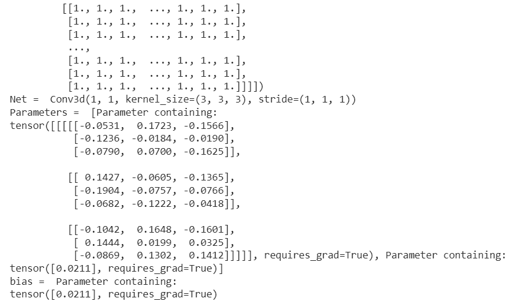

PyTorch Conv3d bias

至此，我们借助一个例子了解了 PyTorch Conv3d 偏置。

阅读: [PyTorch 车型总结](https://pythonguides.com/pytorch-model-summary/)

## 美国有线电视新闻网 py torch Conv3d

在本节中，我们将使用 python 了解 CNN 中的 **PyTorch Conv3d。**

在继续之前，我们应该有一些关于卷积神经网络(CNN)的知识。

卷积神经网络是一种用于图像识别的人工神经网络。

这里我们使用 PyTorch Conv3d 来处理卷积神经网络。这是一个简单的数学运算，其中我们在三维数据上滑动一个权重矩阵或核心，并与数据执行逐元素乘法。

**代码:**

在下面的代码中，首先我们将导入所有必要的库，如导入 torch、从 torch . autograded 导入变量、导入 torchvision.datasets、导入 torch.nn.init。

*   **traindata = dtsets。MNIST(root='MNIST 数据/'，train =真，transform =变换。ToTensor()，download=True)** 被用作训练 MNIST 数据集。
*   **print('Training dataset:\t '，traindata)** 用于使用 print()函数打印训练数据集。
*   **类 CNN(torch.nn.Module):** 用于借助 init()和 forward()方法创建模型类。
*   `CNNmodel = CNN()` 用于创建模型的实例。

```py
# Importuing libraries
import torch
from torch.autograd import Variable
import torchvision.datasets as dtsets
import torchvision.transforms as transforms
import torch.nn.init

# hyperparameters
batch_size = 24
keepprobab = 1

# MNIST dataset
traindata = dtsets.MNIST(root='MNIST_data/',
                          train=True,
                          transform=transforms.ToTensor(),
                          download=True)

testdata = dtsets.MNIST(root='MNIST_data/',
                         train=False,
                         transform=transforms.ToTensor(),
                         download=True)

# dataset loader
dataloader = torch.utils.data.DataLoader(dataset=traindata,
                                          batch_size=batch_size,
                                          shuffle=True)

# Display informations about the dataset
print('Training dataset:\t',traindata)
print('\nTesting dataset:\t',testdata)

# Define the CNN Model class
class CNN(torch.nn.Module):

    def __init__(self):
        super(CNN, self).__init__()
        self.layer1 = torch.nn.Sequential(
            torch.nn.Conv3d(1, 24, kernel_size=3, stride=1, padding=1),
            torch.nn.ReLU(),
            torch.nn.MaxPool2d(kernel_size=2, stride=2),
            torch.nn.Dropout(p=1 - keepprobab))
        self.layer2 = torch.nn.Sequential(
            torch.nn.Conv3d(24, 56, kernel_size=3, stride=1, padding=1),
            torch.nn.ReLU(),
            torch.nn.MaxPool2d(kernel_size=2, stride=2),
            torch.nn.Dropout(p=1 - keepprobab))
        self.layer3 = torch.nn.Sequential(
            torch.nn.Conv3d(56, 120, kernel_size=3, stride=1, padding=1),
            torch.nn.ReLU(),
            torch.nn.MaxPool2d(kernel_size=2, stride=2, padding=1),
            torch.nn.Dropout(p=1 - keepprobab))

        self.fc1 = torch.nn.Linear(4 * 4 * 120, 627, bias=True)
        torch.nn.init.xavier_uniform(self.fc1.weight)
        self.layer4 = torch.nn.Sequential(
            self.fc1,
            torch.nn.ReLU(),
            torch.nn.Dropout(p=1 - keepprobab))
        # L5 Final FC 627 inputs -> 12 outputs
        self.fc2 = torch.nn.Linear(627, 12, bias=True)
        # initialize parameters
        torch.nn.init.xavier_uniform_(self.fc2.weight) 

    def forward(self, y):
        output = self.layer1(y)
        output = self.layer2(output)
        output = self.layer3(output)
         # Flatten them for FC
        output = output.view(output.size(0), -1)  
        output = self.fc1(output)
        output = self.fc2(output)
        return output

#instantiate CNN model
CNNmodel = CNN()
CNNmodel
```

**输出:**

在下面的输出中，我们可以看到 CNN 模型中的 PyTorch Conv3 打印在屏幕上。

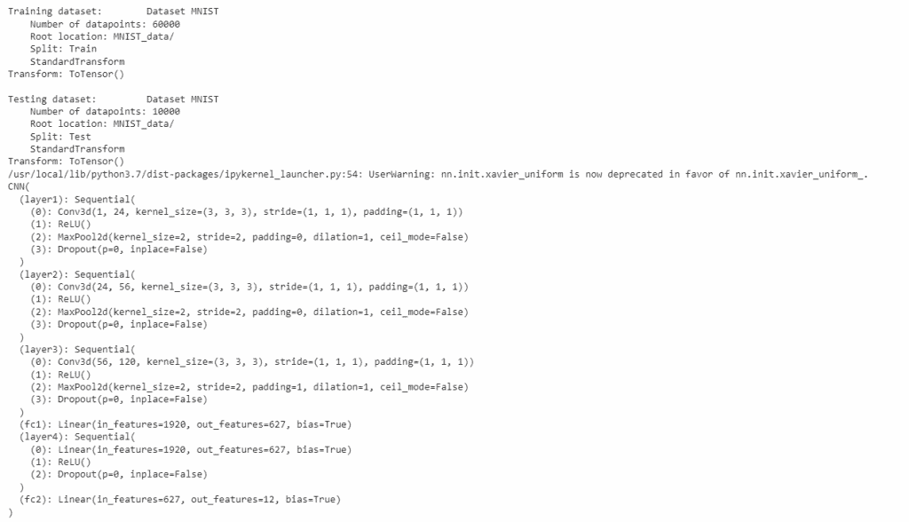

PyTorch Conv3d in CNN

这就是我们如何在 CNN 中使用 PyTorch Conv3d 并创建 CNN 模型。

阅读: [PyTorch 逻辑回归](https://pythonguides.com/pytorch-logistic-regression/)

## PyTorch Conv3d 转译

在本节中，我们将学习 python 中的 `PyTorch Conv3d transpose` 。

PyTorch Conv3d 转置对从一些输入平面收集的输入图像应用 3d 转置卷积运算符。

**语法:**

PyTorch Conv3d 转置的语法

```py
torch.nn.ConvTranspose3d(in_channels, out_channels, kernel_size, stride=1, padding=0, out_padding=0, groups=1, bias=True, dilation=1, padding_mode='zeros', device=None, dtype=None)
```

**参数:**

以下是 PyTorch Conv3d 转置的参数。

*   `in_channels` 是输入图像中的通道数。
*   `out_channels` 是卷积产生的通道数。
*   `kernel_size` 用作卷积核的大小。
*   **步距**用于根据互相关控制步距。
*   填充用于控制隐式零填充的数量。
*   outpu_padding 用于控制添加到输出形状一侧的额外大小。
*   膨胀用于控制内核点之间的间距。
*   组用于控制输入和输出之间的连接。

**举例:**

在下面的代码中，我们将导入所有必要的库，如 import torch，import torch.nn as nn。

*   **c = nn。ConvTranspose3d(16，33，3，stride=2)** 用平方核和等步距来描述变量。
*   **c = nn。ConvTranspose3d(16，33，(3，5，2)，stride=(2，1，1)，padding=(0，4，2))** 用于用非方核和带 padding 的不等步长来描述变量。
*   **inp = torch.randn(20，16，10，50，100):** 这里我们用 torch.randn()函数来描述输入变量。
*   `print(outp)` 用于使用 print()函数打印输出。

```py
# Importing Libraries
import torch
import torch.nn as nn
# Describing the variable by using square kernels and equal stride
c = nn.ConvTranspose3d(16, 33, 3, stride=2)
# Describing the variable by using non-square kernels and unequal stride and with padding
c = nn.ConvTranspose3d(16, 33, (3, 5, 2), stride=(2, 1, 1), padding=(0, 4, 2))
# Declaring the input variable
inp = torch.randn(20, 16, 10, 50, 100)
outp = c(inp)
# Print output
print(outp)
```

**输出:**

运行上面的代码后，我们得到下面的输出，其中我们可以看到 PyTorch Conv3d 转置值打印在屏幕上。

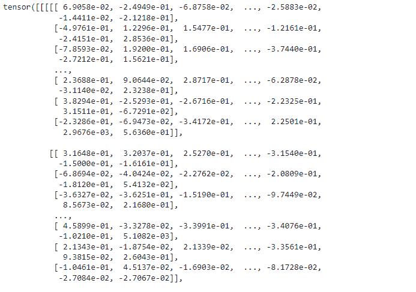

PyTorch Conv3d transpose

至此，我们借助一个例子了解了 PyTorch Conv3d 转置。

阅读: [PyTorch 模型评估+示例](https://pythonguides.com/pytorch-model-eval/)

## PyTorch Conv3d 参数

在本节中，我们将学习 python 中的 **PyTorch Conv3d 参数**。

在继续之前，我们应该了解一些关于参数的知识。参数是作为描述系统或设定其操作条件的集合之一而建立的可测量因素。

**代码:**

在下面的代码中，我们将导入所有必要的库，如 import torch 和 import torch.nn as nn。

*   **k = nn。Conv3d(22，39，9，stride=2)** 用平方核和等步距来描述变量。
*   **inp = torch.randn(26，22，16，56，106):** 这里我们用 torch.randn()函数来描述输入变量。
*   `print(out)` 用于使用 print()函数打印输出。

```py
# Importing libraries
import torch
import torch.nn as nn

# Declaring the variable by using square kernels and equal stride
k = nn.Conv3d(22, 39, 9, stride=2)

# Describing the input and output variables
inp = torch.randn(26, 22, 16, 56, 106)
out = k(inp)

# Print output
print(out)
```

**输出:**

在下面的输出中，我们可以看到 PyTorch Conv3d 参数值打印在屏幕上。

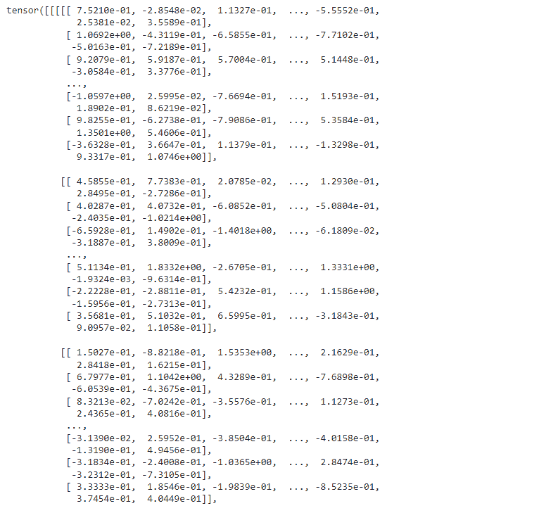

PyTorch Conv3d parameters

这就是我们描述 conv3d 参数和进行算术运算的方式。

阅读:[py torch RNN-详细指南](https://pythonguides.com/pytorch-rnn/)

## PyTorch Conv3d weight

在本节中，我们将学习 python 中的 `PyTorch Conv3d weight` 。

PyTorch Conv3d 权重用于对 3d 数据和一些附加选项(如填充等)执行卷积。

**代码:**

在下面的代码中，我们将导入 torch 库，如 import torch。

*   **inpt = torch.ones(1，1，3，3，3):** 这里我们用 torch.ones()函数来描述输入变量。
*   **print("Input = "，inpt)** 用于通过 print()函数打印输入。
*   **w = torch . nn . Conv3d(in _ channels = 1，out_channels = 1，kernel_size = 3):** 这里我们使用的是 conv 3d()函数。
*   **print("Parameters = "，list(w.parameters()))** 用于打印参数列表。
*   **print("Weight = "，w.weight)** 用于打印重量。
*   **print("Output = "，out)** 用于借助 print()函数打印输出。

```py
# Import library
import torch

# Describe the input variable
inpt = torch.ones(1,1,3,3,3)

# Print input
print("Input = ",inpt)

w = torch.nn.Conv3d(in_channels = 1, out_channels = 1, kernel_size = 3)

# Print the parameter list
print("net = ",w)
print("Parameters = ",list(w.parameters()))
# Print the weight
print("Weight = ",w.weight)
# Print the bias
print("bias = ",w.bias)

out = w(inpt)

print("Output = ",out)
```

**输出:**

运行上述代码后，我们得到以下输出，其中我们可以看到 PyTorch Conv3d 重量打印在屏幕上。

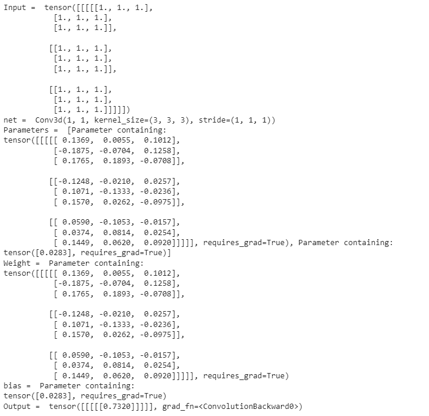

PyTorch Conv3d weight

这就是我们对 PyTorch Conv3d 重量的理解。

阅读: [PyTorch 查看教程](https://pythonguides.com/pytorch-view/)

## PyTorch Conv3d 输入 _ 通道和输出 _ 通道

在本节中，我们将学习 python 中的 **PyTorch Conv3d input_channels 和** `output_channels` 。

PyTorch Conv3d input_channels 用作输入图像中的通道数。

PyTorch Conv3d output_channels 用作卷积产生的通道数。

**代码:**

在下面的代码中，首先我们将导入所有必要的库，如导入 torch、从 torch.autograd 导入变量、将 torch.nn 作为 nn 导入、导入 torch.nn.functional。

*   **级 mod(nn。Module):** 这里我们借助 init()和 forward()函数创建一个模型类。
*   **size = y.size()[1:]** 用作除批量维度以外的所有维度。
*   `model = mod()` 被用作模型的实例。
*   `print(model)` 用于通过 print()函数打印模型。

```py
# Importing Libraries
import torch
from torch.autograd import Variable
import torch.nn as nn
import torch.nn.functional as fun

# Create model class
class mod(nn.Module):

    def __init__(self):
        super(mod, self).__init__()
        # 1 input image channel, 10 output channels, 9x9 square convolution
        self.conv1 = nn.Conv3d(1, 10, 9)
        self.conv2 = nn.Conv3d(10, 20, 9)
        # an affine operation: y = Wx + b
        self.fc1 = nn.Linear(20 * 9 * 9, 142)
        self.fc2 = nn.Linear(142, 88)
        self.fc3 = nn.Linear(88, 14)

    def forward(self, y):
        # Max pooling over a (2, 2) window
        y = fun.max_pool2d(fun.relu(self.conv1(y)), (2, 2))
        # If the size is a square you can only specify a single number
        y = fun.max_pool2d(fun.relu(self.conv2(y)), 2)
        y = y.view(-1, self.numflat_featurs(y))
        y = fun.relu(self.fc1(y))
        y = fun.relu(self.fc2(y))
        y = self.fc3(y)
        return y

    def numflat_featurs(self, y):
      # all dimensions except the batch dimension
        size = y.size()[1:]  
        numfeaturs = 1
        for i in size:
            numfeaturs *= i
        return numfeaturs

# Instantiate the model
model = mod()
# Print the model
print(model)
```

**输出:**

运行上述代码后，我们得到以下输出，其中我们可以看到 PyTorch Conv3d input_channels 和 output_channels 值打印在屏幕上。

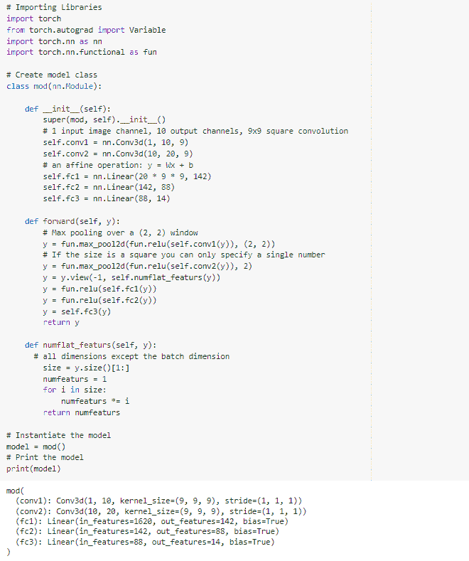

PyTorch Conv3d input_channels and output_channels

至此，我们了解了 **PyTorch Conv3d 输入通道和输出通道**。

另外，看看更多的 Python PyTorch 教程。

*   [PyTorch 整形张量](https://pythonguides.com/pytorch-reshape-tensor/)
*   [pytorch league relu](https://pythonguides.com/pytorch-leaky-relu/)
*   [PyTorch 猫功能](https://pythonguides.com/pytorch-cat-function/)
*   [PyTorch 超参数调谐](https://pythonguides.com/pytorch-hyperparameter-tuning/)

因此，在本教程中，我们讨论了 `PyTorch Conv3d` ，并且我们还讨论了与其实现相关的不同示例。这是我们已经讨论过的例子列表。

*   什么是 PyTorch Conv3d
*   PyTorch Conv3d 示例
*   PyTorch 泛函 Conv3d
*   PyTorch Conv3d 填充
*   PyTorch Conv3d 集团
*   PyTorch conv3d 扩展
*   PyTorch Conv3d 偏置
*   CNN 的 PyTorch Conv3d
*   PyTorch Conv3d 转置
*   PyTorch Conv3d 参数
*   PyTorch Conv3d 权值
*   PyTorch Conv3d 输入通道和输出通道

[Bijay Kumar](https://pythonguides.com/author/fewlines4biju/)

Python 是美国最流行的语言之一。我从事 Python 工作已经有很长时间了，我在与 Tkinter、Pandas、NumPy、Turtle、Django、Matplotlib、Tensorflow、Scipy、Scikit-Learn 等各种库合作方面拥有专业知识。我有与美国、加拿大、英国、澳大利亚、新西兰等国家的各种客户合作的经验。查看我的个人资料。

[enjoysharepoint.com/](https://enjoysharepoint.com/)[](https://www.facebook.com/fewlines4biju "Facebook")[](https://www.linkedin.com/in/fewlines4biju/ "Linkedin")[](https://twitter.com/fewlines4biju "Twitter")