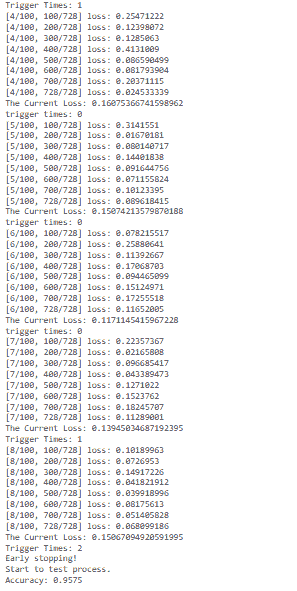
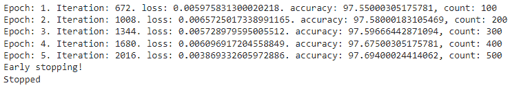
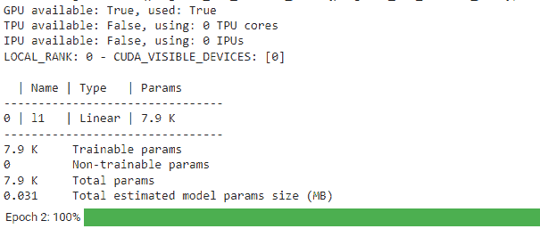
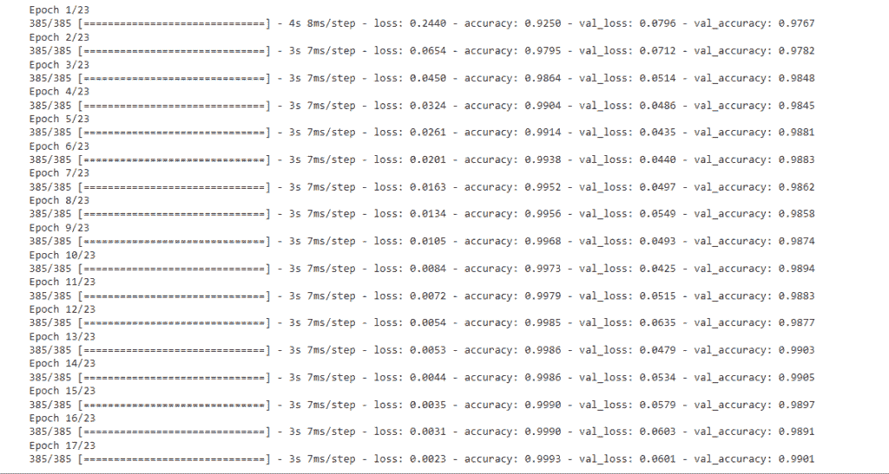
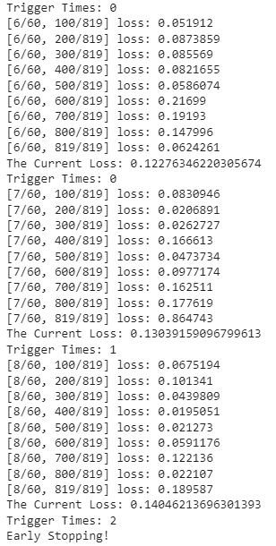
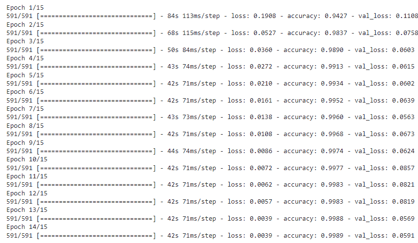

# PyTorch 提前停止+示例

> 原文：<https://pythonguides.com/pytorch-early-stopping/>

[](https://sharepointsky.teachable.com/p/python-and-machine-learning-training-course)

在这个 [Python 教程](https://pythonguides.com/learn-python/)中，我们将学习 Python 中的 **PyTorch 提前停止**，我们还将涵盖与提前停止相关的不同示例。此外，我们将涵盖这些主题。

*   PyTorch 提前停止
*   PyTorch 早期停止示例
*   PyTorch 提前停止调度程序
*   PyTorch 闪电提前停止
*   PyTorch 点火提前停止
*   PyTorch 几何提前停止
*   PyTorch lstm 提前停止
*   PyTorch 提前停止回调
*   PyTorch 验证提前停止

目录

[](#)

*   [PyTorch 提前停止](#PyTorch_early_stopping "PyTorch early stopping")
*   [PyTorch 提前停止示例](#PyTorch_early_stopping_example "PyTorch early stopping example")
*   [PyTorch 提前停止调度程序](#PyTorch_early_stopping_scheduler "PyTorch early stopping scheduler")
*   [PyTorch 闪电提前停止](#PyTorch_lightning_early_stopping "PyTorch lightning early stopping")
*   [PyTorch 点火提前停止](#PyTorch_ignite_early_stopping "PyTorch ignite early stopping")
*   [PyTorch 几何提前停车](#PyTorch_geometric_early_stopping "PyTorch geometric early stopping")
*   [PyTorch lstm 提前停止](#PyTorch_lstm_early_stopping "PyTorch lstm early stopping")
*   [PyTorch 提前停止回调](#PyTorch_early_stopping_callback "PyTorch early stopping callback")
*   [PyTorch 验证提前停止](#PyTorch_validation_early_stopping "PyTorch validation early stopping ")

## PyTorch 提前停止

在本节中，我们将学习 python 中的 **PyTorch 提前停止**。

**提前停止**被定义为避免在训练数据集上过度拟合的过程，并且它保持在验证损失的轨道上。这里我们将讨论如何在 [PyTorch](https://pythonguides.com/what-is-pytorch/) 的帮助下使用早期停止过程。

**语法:**

提前停止的语法如下:

```py
Early Stopping(monitor=None, min_delta=0.0,patience = 3, verbose = False, mode = min, strict = True, check_finite = True, stopping_threshold = None, divergence_threshold = None, check_on_train_epoch_end = None)
```

**参数:**

*   **监控器**用于监控数量。
*   `min_delta` 用于监控量中非常小的变化，以符合改善条件。
*   **耐心**用于检查没有改善的次数，超过该次数后将停止训练。
*   **详细**用作详细模式。
*   **模式:**有最小和最大两种模式。
    *   **最小模式**用于当数量监视器停止减少时，训练将停止。
    *   **最大模式**被使用，当数量监视器停止增加时，训练将停止。
*   如果在验证指标中找不到监视器，则无论如何都要使用严格的来进行崩溃训练。
*   `check_finite` 用于在监护仪变为 Nan 时停止训练。
*   `stopping_threshold` 用于当监视器数量达到该阈值时，立即停止训练。
*   `divergence_threshold` 用于在监视器数量低于该阈值时停止训练。
*   `check_on_train_epoch_end` 用于在训练时期结束时提前停止运行，如果在验证结束时检查为假。

此外，检查: [Adam optimizer PyTorch 和示例](https://pythonguides.com/adam-optimizer-pytorch/)

## PyTorch 提前停止示例

在这一节中，我们将借助 python 中的一个例子来了解提前停止的实现。

PyTorch 早期停止被定义为我们可以防止神经网络在训练数据时过度拟合的过程。

**代码:**

在下面的代码中，我们将导入一些库，从中我们可以训练数据并实现对数据的提前停止。

*   **def traindata(设备、模型、时期、优化器、loss_function、train_loader、valid_loader):** 用于定义列车数据。
*   `optimizer.zero_grad()` 用于优化零梯度。
*   **output = model(input . view(input . shape[0]，-1))** 用于获取模型的输出。
*   **loss = loss_function(output，label)** 用于计算损失。
*   **print('[{}/{}，{}/{}] loss: {:.8} '。format(epoch，epochs，times，len(train_loader)，loss.item())** 是打印模型的进度。
*   **current _ loss = validation(model，device，valid_loader，loss_function)** 用于计算当前损耗。
*   **打印('当前损失:'，current_loss)** 用于打印当前损失。
*   **print('Accuracy:'，correct / total)** 用于打印模型的精度。
*   **损失函数= nn。NLLLoss()** 用于计算损失函数。
*   **优化器= optim。Adam(model.parameters()、lr=lr)** 用于优化优化器。
*   **变换=变换。Compose()** 用于转换数据。

```py
 import torch
import torch.nn as nn
import torch.optim as optim
import torch.utils.data as data
from torchvision import datasets, transforms

 **# Model architecture**
class model(nn.Module):
    def __init__(self):
        super(Net, self).__init__()
        self.main = nn.Sequential(
            nn.Linear(in_features=786, out_features=130),
            nn.ReLU(),
            nn.Linear(in_features=130, out_features=66),
            nn.ReLU(),
            nn.Linear(in_features=66, out_features=12),
            nn.LogSoftmax(dim=1)
        )

    def forward(self, input):
        return self.main(input)

# Train
def traindata(device, model, epochs, optimizer, loss_function, train_loader, valid_loader):
   ** # Early stopping**
    last_loss = 100
    patience = 2
    triggertimes = 0

    for epoch in range(1, epochs+1):
        model.train()

        for times, data in enumerate(train_loader, 1):
            input = data[0].to(device)
            label = data[1].to(device)

            **# Zero the gradients**
            optimizer.zero_grad()

            **# Forward and backward propagation**
            output = model(input.view(input.shape[0], -1))
            loss = loss_function(output, label)
            loss.backward()
            optimizer.step()

            **# Show progress**
            if times % 100 == 0 or times == len(train_loader):
                print('[{}/{}, {}/{}] loss: {:.8}'.format(epoch, epochs, times, len(train_loader), loss.item()))

       ** # Early stopping**
        current_loss = validation(model, device, valid_loader, loss_function)
        print('The Current Loss:', current_loss)

        if current_loss > last_loss:
            trigger_times += 1
            print('Trigger Times:', trigger_times)

            if trigger_times >= patience:
                print('Early stopping!\nStart to test process.')
                return model

        else:
            print('trigger times: 0')
            trigger_times = 0

        last_loss = current_loss

    return model

def validation(model, device, valid_loader, loss_function):

    model.eval()
    loss_total = 0

    **# Test validation data**
    with torch.no_grad():
        for data in valid_loader:
            input = data[0].to(device)
            label = data[1].to(device)

            output = model(input.view(input.shape[0], -1))
            loss = loss_function(output, label)
            loss_total += loss.item()

    return loss_total / len(valid_loader)

def test(device, model, test_loader):

    model.eval()
    total = 0
    correct = 0

    with torch.no_grad():
        for data in test_loader:
            input = data[0].to(device)
            label = data[1].to(device)

            output = model(input.view(input.shape[0], -1))
            _, predicted = torch.max(output.data, 1)

            total += label.size(0)
            correct += (predicted == label).sum().item()

    print('Accuracy:', correct / total)

def main():
    **# GPU device**
    device = 'cuda:0' if torch.cuda.is_available() else 'cpu'
    print('Device state:', device)

    epochs = 100
    batch_size = 66
    lr = 0.004
    loss_function = nn.NLLLoss()
    model = Net().to(device)
    optimizer = optim.Adam(model.parameters(), lr=lr)

    **# Transform**
    transform = transforms.Compose(
        [transforms.ToTensor(),
         transforms.Normalize((0.5,), (0.5,))]
    )

    **# Data**
    trainset = datasets.MNIST(root='MNIST', download=True, train=True, transform=transform)
    testset = datasets.MNIST(root='MNIST', download=True, train=False, transform=transform)

    trainset_size = int(len(trainset) * 0.8)
    validset_size = len(trainset) - trainset_size
    trainset, validset = data.random_split(trainset, [trainset_size, validset_size])

    trainloader = data.DataLoader(trainset, batch_size=batch_size, shuffle=True)
    testloader = data.DataLoader(testset, batch_size=batch_size, shuffle=False)
    validloader = data.DataLoader(validset, batch_size=batch_size, shuffle=True)

    **# Train**
    model = traindata(device, model, epochs, optimizer, loss_function, trainloader, validloader)

    **# Test**
    test(device, model, testloader)

if __name__ == '__main__':
    main()
```

**输出:**

运行上面的代码后，我们得到下面的输出，其中我们可以看到对列车数据应用了提前停车。



PyTorch early stopping example

阅读:[交叉熵损失 PyTorch](https://pythonguides.com/cross-entropy-loss-pytorch/)

## PyTorch 提前停止调度程序

在本节中，我们将了解 python 中的 **PyTorch 提前停止调度器工作方式**。

*   PyTorch 早期停止用于防止神经网络在训练数据时过拟合。
*   如果损失止损点在训练止损点的某些时期减少，则提前停止调度程序会跟踪验证损失。

**代码:**

在下面的代码中，我们将导入一些库，从中我们可以使用提前停止调度来训练和验证数据。

*   **train dataset = PDS . read _ CSV(' train . CSV '，dtype = np.float32)** 用于加载训练数据集。
*   **test dataset = PDS . read _ CSV(' test . CSV '，dtype = np.float32)** 用于加载测试数据集。
*   **features numpy = train dataset . loc[:，train_dataset.columns！= "label"]。values/255** 用于归一化数据。
*   **featurestrain，featurestest，targetstrain，targets test = train _ test _ split(features numpy，targetsnumpy，test_size = 0.2，random_state = 42)** 用于分割训练和测试数据集。
*   **train _ loader = torch . utils . data . data loader(dataset = train _ dataset，batch_size=batch_size，shuffle=True)** 用于加载列车数据。
*   `self . layers _ dim = layers _ dim`用于获取隐藏层数。
*   **误差= nn。CrossEntropyLoss()** 用于计算交叉熵损失。
*   **images = images.view(-1，seq_dim，inputs_dim)** 用于调整图像的大小。
*   **预测= torch.max(outputs.data，1)** 用于获得最大值的预测。
*   `total += labels.size(0)` 用于获取标签总数。

```py
import torch
import torch.nn as nn
import torchvision.transforms as transforms
import torchvision.datasets as dsets
import argparse
import numpy as num
import pandas as pds
from sklearn.model_selection import train_test_split
from torch.autograd import Variable

traindataset = pds.read_csv('train.csv',dtype = np.float32)

testdataset = pds.read_csv('test.csv',dtype = np.float32)

targetsnumpy = traindataset.label.values
featuresnumpy = traindataset.loc[:,train_dataset.columns != "label"].values/255 

featurestrain, featurestest, targetstrain, targetstest = train_test_split(featuresnumpy,
                                                                             targetsnumpy,
                                                                             test_size = 0.2,
                                                                             random_state = 42) 

**# create feature and targets tensor for train set**
featuresTrain = torch.from_numpy(featurestrain)
targetsTrain = torch.from_numpy(targetstrain).type(torch.LongTensor) 

 **# create feature and targets tensor for test set.**
featuresTest = torch.from_numpy(featurestest)
targetsTest = torch.from_numpy(targetstest).type(torch.LongTensor) 

**# batch_size, epoch and iteration**
batch_size = 100
n_iters = 10000
num_epochs = n_iters / (len(featurestrain) / batch_size)
num_epochs = int(num_epochs)

**# Pytorch train and test sets**
train = torch.utils.data.TensorDataset(featuresTrain,targetsTrain)
test = torch.utils.data.TensorDataset(featuresTest,targetsTest)

**# data loader**
train_loader = torch.utils.data.DataLoader(train, batch_size = batch_size, shuffle = False)
test_loader = torch.utils.data.DataLoader(test, batch_size = batch_size, shuffle = False)

train_loader = torch.utils.data.DataLoader(dataset=train_dataset, 
                                           batch_size=batch_size, 
                                           shuffle=True)

test_loader = torch.utils.data.DataLoader(dataset=test_dataset, 
                                          batch_size=batch_size, 
                                          shuffle=False)

**# Create RNN Model**

class RnnModel(nn.Module):
    def __init__(self, inputs_dim, hidden_dim, layers_dim, outputs_dim):
        super(RnnModel, self).__init__()
        **# Hidden dimensions**
        self.hidden_dim = hidden_dim
        self.layers_dim = layers_dim

        self.rnn = nn.RNN(inputs_dim, hidden_dim, layers_dim, batch_first=True, nonlinearity='tanh')

        self.fc = nn.Linear(hidden_dim, outputs_dim)

    def forward(self, X):
        h = torch.zeros(self.layers_dim, x.size(0), self.hidden_dim).requires_grad_()
        outs, hn = self.rnn(X, h.detach())
        outs = self.fc(outs[:, -1, :]) 
        return outs
**# batch_size, epoch and iteration**
batchsize = 100
niters = 3000
num_epochs = niters / (len(featurestrain) / batchsize)
num_epochs = int(num_epochs)

train = torch.utils.data.TensorDataset(featuresTrain,targetsTrain)
test = torch.utils.data.TensorDataset(featuresTest,targetsTest)
 **# data loader**
train_loader = torch.utils.data.DataLoader(train, batch_size = batch_size, shuffle = False)
test_loader = torch.utils.data.DataLoader(test, batch_size = batch_size, shuffle = False)

**# Create RNN**
inputs_dim = 28  
hidden_dim = 100 
layers_dim = 5     
outputs_dim = 12   

models = RnnModel(inputs_dim, hidden_dim, layers_dim, outputs_dim) 
error = nn.CrossEntropyLoss()

**# SGD Optimizer**
learning_rate = 0.07
optimizer = torch.optim.SGD(model.parameters(), lr=learning_rate)

seq_dim = 28  
loss_list = []
iteration_list = []
accuracy_list = []
count = 0
min_val_loss = num.Inf
val_array = []
correct = 0
iter = 0
count = 0
iter_array = []
loss_array = []
total = 0
accuracy_array = []
n_epochs_stop = 6
epochs_no_improve = 0
early_stop = False
for epoch in range(num_epochs):
    val_loss = 0
    for i, (images, labels) in enumerate(train_loader):

        train  = Variable(images.view(-1, seq_dim, inputs_dim))
        labels = Variable(labels )

        **# Clear gradients**
        optimizer.zero_grad()

        **# Forward propagation**
        outputs = model(train)

        loss = error(outputs, labels)

        **# Calculating gradients**
        loss.backward()

        **# Update parameters**
        optimizer.step()
        val_loss += loss
        val_loss = val_loss / len(train_loader)
        # If the validation loss is at a minimum
        if val_loss < min_val_loss
             epochs_no_improve = 0
             min_val_loss = val_loss

        else:
            epochs_no_improve += 1
        iter += 1
        if epoch > 5 and epochs_no_improve == n_epochs_stop:
            print('Early stopping!' )
            early_stop = True
            break
        else:
            continue
        break
        if iter % 336 == 0:
            **# Calculate Accuracy  **       
            correct = 0
            total = 0
  **# Check early stopping condition**   
    if early_stop:
        print("Stopped")
        break
    for images, labels in test_loader:

        images = images.view(-1, seq_dim, inputs_dim)
        outputs = model(images)
        _, predicted = torch.max(outputs.data, 1)

        total += labels.size(0)

        correct += (predicted == labels).sum()

        accuracy = 100 * correct / total

       ** #Print Loss**
        count = count +1
        if iter % 336 == 0 and count % 100 == 0  : 
            iter_array.append(iter)
            loss_array.append(loss.item())
            accuracy_array.append(accuracy.item())
            print('Epoch: {}. Iteration: {}. loss: {}. accuracy: {}, count: {}'.format(epoch,iter, loss.item(),accuracy.item(),count))
```

**输出:**

在下面的输出中，我们可以看到早期停止机制防止了神经网络的过度拟合。



PyTorch early stopping scheduler

阅读: [PyTorch 保存模型–完整指南](https://pythonguides.com/pytorch-save-model/)

## PyTorch 闪电提前停止

在本节中，我们将了解 python 中的 **PyTorch lightning 如何提前停止**。

PyTorch lightning early stopping 用于提前停止一个历元，以避免在训练数据集上过度拟合。

**代码:**

在下面的代码中，我们将导入一些库，我们可以从这些库中尽早停止纪元，以避免过拟合。

*   `torch.nn.Linear()` 用于在输入和输出的帮助下创建前馈网络。
*   `torch.relu()` 用作激活功能。
*   `F.cross_entropy()` 用于计算两个概率分布之间的差异。
*   **train dataset = MNIST(PATH _ DATASETS，train =真，download =真，transform =变换。ToTensor())** 用于创建训练数据集。
*   **train loader = data loader(train dataset，batch_size=BATCHSIZE)** 用于加载列车数据。
*   **trainer.fit(mnistmodel，train_loader)** 用于拟合训练数据。

```py
import os

import torch
from pytorch_lightning import LightningModule, Trainer
from torch import nn
from torch.nn import functional as f
from torch.utils.data import DataLoader, random_split
from torchmetrics import Accuracy
from torchvision import transforms
from torchvision.datasets import MNIST

PATHDATASET = os.environ.get("PATH_DATASETS", ".")
AVAILGPUS = min(1, torch.cuda.device_count())
BATCHSIZE = 250 if AVAILGPUS else 60
class MNISTModel(LightningModule):
    def __init__(self):
        super().__init__()
        self.l1 = torch.nn.Linear(28 * 28, 10)

    def forward(self, X):
        return torch.relu(self.l1(X.view(X.size(0), -1)))

    def training_step(self, batch, batch_nb):
        X, y = batch
        loss = F.cross_entropy(self(X), y)
        return loss

    def configure_optimizers(self):
        return torch.optim.Adam(self.parameters(), lr=0.02)
# Init our model
mnistmodel = MNISTModel()

# Init DataLoader from MNIST Dataset
traindataset = MNIST(PATH_DATASETS, train=True, download=True, transform=transforms.ToTensor())
trainloader = DataLoader(traindataset, batch_size=BATCHSIZE)

# Initialize a trainer
trainer = Trainer(
    gpus=AVAILGPUS,
    max_epochs=3,
    progress_bar_refresh_rate=20,
)

# Train the model 
trainer.fit(mnistmodel, train_loader)
```

**输出:**

运行上述代码后，我们得到以下输出，其中我们可以看到 epoch 被提前停止，以避免在训练数据集上过度拟合。



PyTorch lightening early stopping

阅读: [PyTorch nn 线性+例题](https://pythonguides.com/pytorch-nn-linear/)

## PyTorch 点火提前停止

在本节中，我们将学习 python 中的 **PyTorch ignite 提前停止**。

提前停止 ignite 被定义为一个过程，该过程可用于在给定数量的事件后，当没有改善时停止训练。

**语法:**

以下语法适用于 ignite 提前停止:

```py
ignite.handler.early_stopping.EarlyStopping(patience,score_function,trainer,min_delta=0.0,cumulative_delta = False)
```

**参数:**

*   **耐心**用于等待事件次数，如果没有改善，则停止训练。
*   `score_function` 被用作一个函数，它接受一个参数并返回一个分数浮点数。
*   **训练器**用于在没有改善的情况下停止跑步。
*   `min_delta` 是符合改善条件的分数的最小增量。
*   `cumulative_delta` 如果该值为真，则 min_delta 定义为自上次耐心重置以来的增加，否则它在上次事件后增加，并且 cumulative delta 的默认值为假。

## PyTorch 几何提前停车

在本节中，我们将了解 python 中的 **PyTorch 几何提前停止是如何工作的**。

*   PyTorch 几何提前停止被定义为提前停止历元的过程。使用 Early stopping 回调基于度量提前停止。
*   **几何**与提前停止所使用的方法有关。

**代码:**

在下面的代码中，我们将导入一些库，这些库的早期停止将使纪元提前停止。

*   **(trainimage，trainlabel)，(testimage，test label)= Mn ist . load _ data()**用于加载数据。
*   **train image = train image . as type(' float 32 ')/255**用于缩小列车图像的像素值。
*   `ytrain = to _ categorial(train label)`用于将标签编码为一个二进制的类标签。
*   **提前停止=回调。early stopping(monitor = " val _ loss "，mode ="min "，patience = 7，restore_best_weights = True)** 用于提前停止历元。
*   `models.fit()` 用于拟合模型。

```py
import keras
from keras.utils.np_utils import to_categorical
from keras.datasets import mnist

(trainimage, trainlabel), (testimage, testlabel)= mnist.load_data()

**# Reshaping data-Adding number of channels** 
trainimage = trainimage.reshape((trainimage.shape[0], 
                                     trainimage.shape[1], 
                                     trainimage.shape[2], 1))

testimage = testimage.reshape((testimage.shape[0], 
                                   testimage.shape[1],
                                   testimage.shape[2], 1))

trainimage = trainimage.astype('float32')/255
testimage = testimage.astype('float32')/255

ytrain = to_categorical(trainlabel)
ytest = to_categorical(testlabel)

from keras import models
from keras import layers

models = models.Sequential()
models.add(layers.Conv2D(32, (3, 3), activation ="relu", 
                             input_shape =(28, 28, 1)))
models.add(layers.MaxPooling2D(2, 2))
models.add(layers.Conv2D(64, (3, 3), activation ="relu"))
models.add(layers.MaxPooling2D(2, 2))
models.add(layers.Flatten())
models.add(layers.Dense(64, activation ="relu"))
models.add(layers.Dense(10, activation ="softmax"))
models.compile(optimizer ="rmsprop", loss ="categorical_crossentropy",
                                             metrics =['accuracy'])
valimage = trainimage[:10000]
partialimage = trainimage[10000:]
vallabel = ytrain[:10000]
partiallabel = ytrain[10000:]

from keras import callbacks
earlystopping = callbacks.EarlyStopping(monitor ="val_loss", 
                                        mode ="min", patience = 7, 
                                        restore_best_weights = True)

history = models.fit(partialimage, partiallabel, batch_size = 130, 
                    epochs = 23, validation_data =(valimage, vallabel), 
                    callbacks =[earlystopping])
```

**输出:**

在下面的输出中，我们可以看到在早期停止的帮助下，epoch 被更早地停止。



PyTorch geometric early stopping

## PyTorch lstm 提前停止

在本节中，我们将学习 python 中的 **PyTorch lstm 提前停止**。

`LSTM` 代表**长期短期记忆**，它是一种用于深度学习领域的人工神经网络架构。

**代码:**

在下面的代码中，我们将导入一些可以应用提前停止的库。

*   **nn。Sequential()** 用于按顺序运行某一层。
*   **nn。线性()**用于创建前馈网络。
*   **定义训练(设备、模型、时期、优化器、损失函数、训练加载器、有效加载器):**用于定义训练数据。
*   `optimizer.zero_grad()` 用于优化零梯度。
*   **current _ loss = validation(model，device，valid_loader，loss_function)** 用于计算当前损耗。
*   **打印('当前损失:'，current_loss)** 用于打印当前损失。
*   **转换数据=转换。Compose()** 用于转换数据。
*   trainloader =数据。DataLoader(trainset，batch_size=batchsize，shuffle=True) 用于加载列车数据。
*   测试加载器=数据。DataLoader(testset，batch_size=batchsize，shuffle=False) 用于加载测试数据。

```py
import torch
import torch.nn as nn
import torch.optim as optimize
import torch.utils.data as data
from torchvision import datasets, transforms

class modelarc(nn.Module):
    def __init__(self):
        super(modelarc, self).__init__()
        self.main = nn.Sequential(
            nn.Linear(in_features=784, out_features=128),
            nn.ReLU(),
            nn.Linear(in_features=128, out_features=64),
            nn.ReLU(),
            nn.Linear(in_features=64, out_features=10),
            nn.LogSoftmax(dim=1)
        )

    def forward(self, Input):
        return self.main(Input)

def train(device, model, epochs, optimizer, loss_function, train_loader, valid_loader):

    the_last_loss = 100
    patience = 2
    trigger_times = 0

    for epoch in range(1, epochs+1):
        model.train()

        for times, data in enumerate(train_loader, 1):
            inputs = data[0].to(device)
            labels = data[1].to(device)

            optimizer.zero_grad()

            outputs = model(inputs.view(inputs.shape[0], -1))
            loss = loss_function(outputs, labels)
            loss.backward()
            optimizer.step()

            if times % 100 == 0 or times == len(train_loader):
                print('[{}/{}, {}/{}] loss: {:.6}'.format(epoch, epochs, times, len(train_loader), loss.item()))

        current_loss = validation(model, device, valid_loader, loss_function)
        print('The Current Loss:', current_loss)

        if current_loss > the_last_loss:
            trigger_times += 1
            print('Trigger Times:', trigger_times)

            if trigger_times >= patience:
                print('Early Stopping!\nStart to test process.')
                return model

        else:
            print('Trigger Times: 0')
            trigger_times = 0

        the_last_loss = current_loss

    return model

def validation(model, device, valid_loader, loss_function):
    model.eval()
    totalloss = 0

    with torch.no_grad():
        for data in valid_loader:
            input = data[0].to(device)
            label = data[1].to(device)

            outputs = model(input.view(input.shape[0], -1))
            loss = loss_function(outputs, label)
            totalloss += loss.item()

    return totalloss / len(valid_loader)

def test(device, model, test_loader):

    model.eval()
    total = 0
    correct = 0

    with torch.no_grad():
        for data in test_loader:
            input = data[0].to(device)
            label = data[1].to(device)

            outputs = model(input.view(input.shape[0], -1))
            _, predicted = torch.max(outputs.data, 1)

            total += label.size(0)
            correct += (predicted == label).sum().item()

    print('ModelAccuracy:', correct / total)

def main():

    device = 'cpu'
    print('Device state:', device)

    epochs = 60
    batchsize = 44
    lr = 0.002
    loss_function = nn.NLLLoss()
    model = modelarc().to(device)
    optimizer = optimize.Adam(model.parameters(), lr=lr)

    transformdata = transforms.Compose(
        [transforms.ToTensor(),
         transforms.Normalize((0.5,), (0.5,))]
    )

    trainset = datasets.MNIST(root='MNIST', download=True, train=True, transform=transformdata)
    testset = datasets.MNIST(root='MNIST', download=True, train=False, transform=transformdata)

    trainsetsize = int(len(trainset) * 0.6)
    validsetsize = len(trainset) - trainsetsize
    trainset, validset = data.random_split(trainset, [trainsetsize, validsetsize])

    trainloader = data.DataLoader(trainset, batch_size=batchsize, shuffle=True)
    testloader = data.DataLoader(testset, batch_size=batchsize, shuffle=False)
    validloader = data.DataLoader(validset, batch_size=batchsize, shuffle=True)

    model = train(device, model, epochs, optimizer, loss_function, trainloader, validloader)

    test(device, model, testloader)

if __name__ == '__main__':
    main()
```

**输出:**

运行上面的代码后，我们得到下面的输出，从中我们可以看到早期停止是为了避免过度拟合。



PyTorch lstm early stopping

读:[pytorch Leakey relu](https://pythonguides.com/pytorch-leaky-relu/)

## PyTorch 提前停止回调

在本节中，我们将了解 PyTorch 早期停止回调在 python 中是如何工作的。

回调定义为一个过程，允许我们确定要监控的绩效，以便结束培训。

**语法:**

以下是 PyTorch 回调的语法:

```py
pytorch_lightning.callbacks.EarlyStopping(monitor='val_loss', min_delta=0, patience=0, verbose=0, mode='auto', baseline=None, restore_best_weights=False)
```

**参数:**

*   `monitor` 用于指定该功能可以监控的值。该值可以是验证损失或验证准确性。
*   **模式**用于改变监视器应观察的数量。
*   `min_delta` 是为一些变化设置最小值。
*   **耐心**定义为训练的历元数。
*   `verbose` verbose 定义为整数值。
*   `restore_best_weights` 如果值为真，则恢复权重。restore_best_weight 的默认值为 false。

## PyTorch 验证提前停止

在本节中，我们将了解 python 中 PyTorch 验证的早期停止。

早期停止被定义为避免在训练数据集上过度拟合以及跟踪验证损失的过程。

**代码:**

在下面的代码中，我们将导入一些库，从中我们可以验证早期停止。

*   **(trainimages，trainlabels)，(testimages，test labels)= Mn ist . load _ data()**用于加载数据。
*   **train images = train images . shape((train images . shape[0]，trainimages.shape[1]，trainimages.shape[2]，1))** 用于重组数据-增加通道数。
*   **train images = train images . as type(' float 32 ')/255**用于缩小列车图像的像素值。
*   **test images = test images . as type(' float 32 ')/255**用于缩小测试图像的像素图像。
*   **提前停止=回调。EarlyStopping()** 用于回调提前停止，避免过拟合。
*   `data = models.fit()` 用于拟合模型。

```py
import keras
from keras.utils.np_utils import to_categorical
from keras.datasets import mnist

(trainimages, trainlabels), (testimages, testlabels)= mnist.load_data()

trainimages = trainimages.reshape((trainimages.shape[0], 
                                     trainimages.shape[1], 
                                     trainimages.shape[2], 1))

testimages = testimages.reshape((testimages.shape[0], 
                                   testimages.shape[1],
                                   testimages.shape[2], 1))

trainimages = trainimages.astype('float32')/255
testimages = testimages.astype('float32')/255

ytrains = to_categorical(trainlabels)
ytests = to_categorical(testlabels)

from keras import models
from keras import layers

models = models.Sequential()
models.add(layers.Conv2D(30, (3, 3), activation ="relu", 
                             input_shape =(28, 28, 1)))
models.add(layers.MaxPooling2D(2, 2))
models.add(layers.Conv2D(66, (3, 3), activation ="relu"))
models.add(layers.MaxPooling2D(2, 2))
models.add(layers.Flatten())
models.add(layers.Dense(66, activation ="relu"))
models.add(layers.Dense(10, activation ="softmax"))
models.compile(optimizer ="rmsprop", loss ="categorical_crossentropy",
                                             metrics =['accuracy'])
validationimage = trainimages[:999]
partialimage = trainimages[999:]
validationlabel = ytrains[:999]
partiallabel = ytrains[999:]

from keras import callbacks
earlystopping = callbacks.EarlyStopping(monitor ="val_loss", 
                                        mode ="min", patience = 7, 
                                        restore_best_weights = True)

data = models.fit(partialimage, partiallabel, batch_size = 100, 
                    epochs = 15, validation_data =(validationimage, validationlabel), 
                    callbacks =[earlystopping])
```

**输出:**

运行上面的代码后，我们得到下面的输出，从中我们可以看到，早期停止可以避免过度拟合，并保持验证损失的跟踪。



PyTorch Validation early stopping

另外，再看看一些 PyTorch 教程。

*   [PyTorch 添加尺寸](https://pythonguides.com/pytorch-add-dimension/)

因此，在本教程中，我们讨论了 **PyTorch 提前停止**,我们还讨论了与它的实现相关的不同示例。这是我们已经讨论过的例子列表。

*   PyTorch 提前停止
*   PyTorch 提前停止停止示例
*   PyTorch 提前停止调度程序
*   PyTorch 闪电提前停止
*   PyTorch 点火提前停止
*   PyTorch 几何提前停止
*   PyTorch lstm 提前停止
*   PyTorch 提前停止回调
*   PyTorch 验证提前停止

[Bijay Kumar](https://pythonguides.com/author/fewlines4biju/)

Python 是美国最流行的语言之一。我从事 Python 工作已经有很长时间了，我在与 Tkinter、Pandas、NumPy、Turtle、Django、Matplotlib、Tensorflow、Scipy、Scikit-Learn 等各种库合作方面拥有专业知识。我有与美国、加拿大、英国、澳大利亚、新西兰等国家的各种客户合作的经验。查看我的个人资料。

[enjoysharepoint.com/](https://enjoysharepoint.com/)[](https://www.facebook.com/fewlines4biju "Facebook")[](https://www.linkedin.com/in/fewlines4biju/ "Linkedin")[](https://twitter.com/fewlines4biju "Twitter")