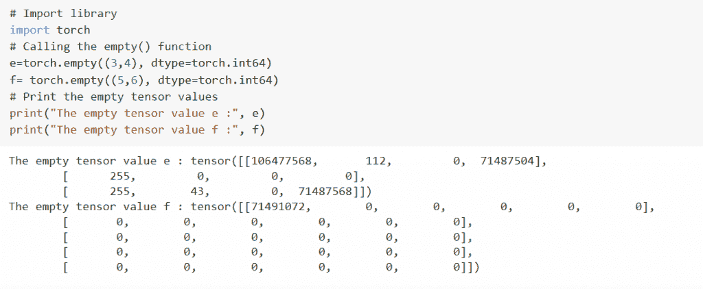
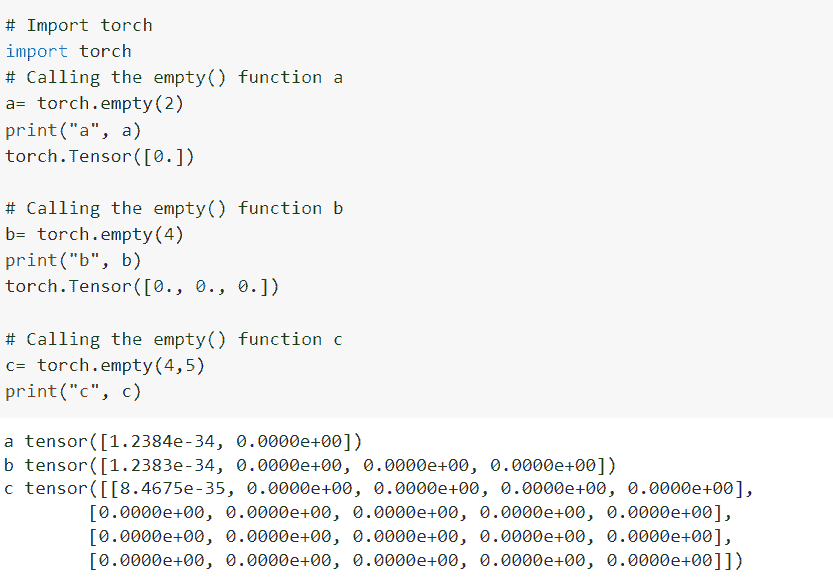
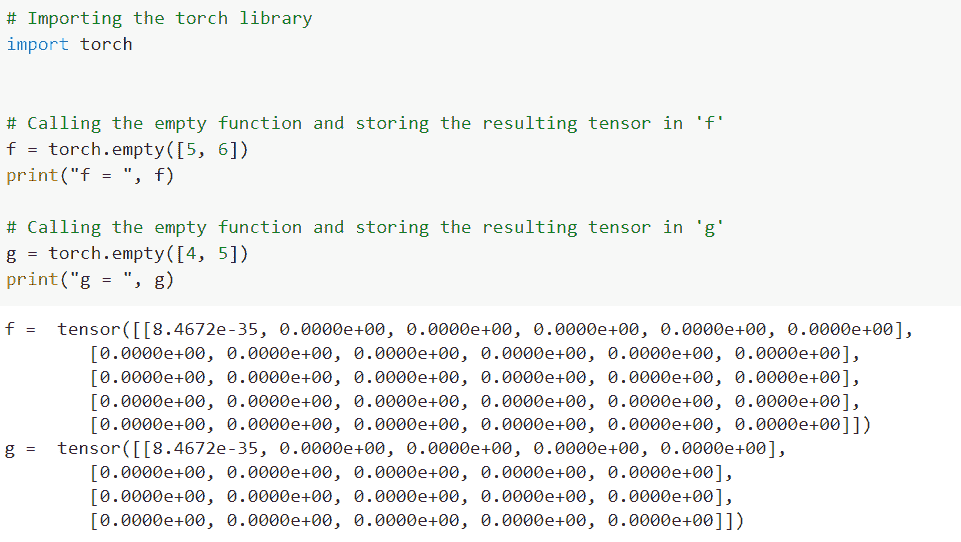
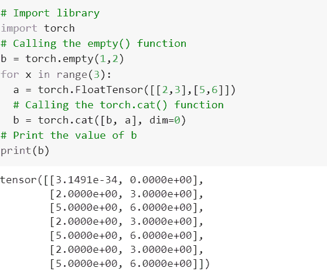
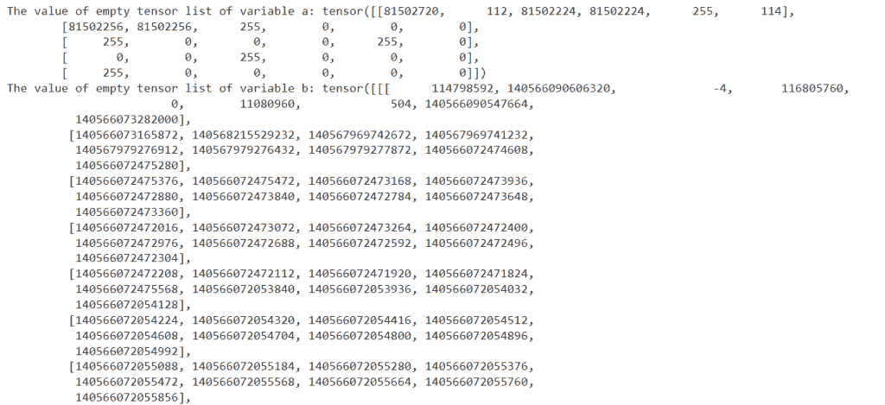

# 创建 PyTorch 空张量

> 原文：<https://pythonguides.com/pytorch-empty-tensor/>

[](https://sharepointsky.teachable.com/p/python-and-machine-learning-training-course)

*`tensor.empty()`* 函数返回填充了未初始化数据的张量。张量形状是由称为大小的变量定义的。详细来说，我们将在 Python 中使用 [PyTorch 讨论空张量。](https://pythonguides.com/what-is-pytorch/)

此外，我们将涵盖与 PyTorch 空张量相关的不同例子。我们将讨论这些话题。

*   什么是 PyTorch 空张量
*   PyTorch 空张量示例
*   如何创建 PyTorch 空张量追加
*   PyTorch 空张量检查
*   如何使用 contate 创建 pytorch 空张量
*   如何创建 PyTorch 空张量列表

目录

[](#)

*   [PyTorch 空张量](#PyTorch_empty_tensor "PyTorch empty tensor")
*   [PyTorch 空张量示例](#PyTorch_empty_tensor_example "PyTorch empty tensor example")
*   [PyTorch 空张量追加](#PyTorch_empty_tensor_append "PyTorch empty tensor append")
*   [PyTorch 空张量检查](#PyTorch_empty_tensor_check "PyTorch empty tensor check")
*   [PyTorch 空张量串联](#PyTorch_empty_tensor_concate "PyTorch empty tensor concate")
*   [PyTorch 空张量列表](#PyTorch_empty_tensor_list "PyTorch empty tensor list")

## PyTorch 空张量

在这一节中，我们将学习 python 中的 **PyTorch 空张量**。

*`tensor.empty()`* 函数返回填充了未初始化数据的张量，张量形状由变量参数 size 定义。

**语法:**

PyTorch 空张量的语法是:

```py
torch.empty(size, out=None, dtype=None, layout=torch.strided, device=None, requires_grad=False, pin_memory=False, memory_format=torch.contiguous_format)
```

**参数:**

以下是 PyTorch 空张量的参数:

*   ***size:*** Size 是定义输出张量形状的整数序列。
*   ***out:***out 是定义输出张量的参数。
*   ***dtype:*** 类型是返回张量的所需数据类型，dtype 的默认值为无。
*   ***布局:*** 布局被定义为返回张量的期望布局。布局的默认值是 ***【火炬】*** 。
*   ***设备:*** 设备定义为返回张量的期望设备，默认值为无。
*   ***requires _ grad:***requires _ grad 为参数。如果签名应该记录对返回张量的操作。requires_grad 的默认值为 False。
*   ***pin_memory:***pin _ memory 是一个参数，定义一个集合，返回的张量是否会被分配到 pinned 内存中，只对 CPU 张量有效，pin _ memory 的默认值为 False。
*   ***memory _ format:***memory _ format 定义为返回张量的期望内存格式， *`memory_format`* 的默认值是一个`*torch . contiguous _ format*`。

这就是我们借助 *`torch.empty()`* 函数对 PyTorch 空张量的理解。

阅读:[如何使用 PyTorch Full()函数](https://pythonguides.com/pytorch-full-function/)

## PyTorch 空张量示例

在这一节中，我们将学习如何借助 python 中的示例来实现 Pytorch 空张量。

在 PyTorch 空张量示例中，我们使用了 torch.empty()，它可以返回带有封闭数据的张量包，张量的形状由名为 size 的变量参数定义。

**代码:**

在下面的代码中，我们将导入火炬库作为导入火炬。

*   **e=torch.empty((3，4)，dtype=torch.int64):** 这里我们描述 e 变量，调用 empty()函数。
*   **f= torch.empty((5，6)，dtype=torch.int64):** 这里我们调用的是 empty()函数。
*   **print("空张量值 e:"，e)** 用于借助 print()函数打印空张量 e 值。

```py
# Import library
import torch
# Calling the empty() function
e=torch.empty((3,4), dtype=torch.int64)
f= torch.empty((5,6), dtype=torch.int64)
# Print the empty tensor values
print("The empty tensor value e :", e)
print("The empty tensor value f :", f)
```

**输出:**

运行上面的代码后，我们得到下面的输出，其中我们可以看到 PyTorch 空张量值被打印在屏幕上。



Pytorch empty tensor example

这样，我们借助一个使用 *`torch.empty()`* 函数的例子来理解 Pytorch 空张量。

阅读: [PyTorch Flatten + 8 例](https://pythonguides.com/pytorch-flatten/)

## PyTorch 空张量追加

在这一节中，我们将学习 python 中的 **PyTorch 空张量 append** 。

*   在继续之前，我们应该有一些关于追加的知识。
*   Append 定义为可以在书面文档的末尾添加内容的操作。
*   这里我们添加了一个空张量，它可以返回带有封闭数据的张量包。

**代码:**

在下面的代码中，我们将导入 torch 模块作为导入 torch。

*   **a= torch.empty(2):** 这里我们用变量 a 调用 torch.empty()函数。
*   **print("a "，a)** 用于通过 print()函数打印 a 的值。
*   **b= torch.empty(4):** 这里我们用变量 b 调用 torch.empty()函数。

```py
# Import torch
import torch
# Calling the empty() function a
a= torch.empty(2)
print("a", a)
torch.Tensor([0.])

# Calling the empty() function b
b= torch.empty(4)
print("b", b) 
torch.Tensor([0., 0., 0.])

# Calling the empty() function c
c= torch.empty(4,5)
print("c", c) 
```

**输出:**

运行上面的代码后，我们得到下面的输出，其中我们可以看到 PyTorch 空张量值被打印在屏幕上。



PyTorch empty tensor append

这样，我们借助 torch.empty()函数理解了 PyTorch 空张量 append。

阅读:[py torch Conv3d–详细指南](https://pythonguides.com/pytorch-conv3d/)

## PyTorch 空张量检查

在本节中，我们将学习 python 中的 **PyTorch 空张量检查**。

检查是按顺序研究或测试某物，以确信它是安全的或正确的，并处于良好状态。

**代码:**

在下面的代码中，我们将导入 torch 库来检查 python 中的空张量。

*   **f = torch.empty([5，6]):** 这里我们调用的是 empty 函数，将结果张量存储在 f 中。
*   **print("f = "，f)** 用于通过 print()函数打印 f 的值。
*   **g = torch.empty([4，5]):** 这里我们调用的是 empty()函数，将得到的张量存储在 g 中。

```py
# Importing the torch library
import torch

# Calling the empty function and storing the resulting tensor in 'f'
f = torch.empty([5, 6])
print("f = ", f)

# Calling the empty function and storing the resulting tensor in 'g'
g = torch.empty([4, 5])
print("g = ", g)
```

**输出:**

运行上面的代码后，我们得到下面的输出，其中我们可以看到 PyTorch 空张量检查值被打印在屏幕上。



PyTorch empty tensor check

这就是我们如何理解如何在 python 中检查 PyTorch 空张量。

阅读: [PyTorch Conv1d](https://pythonguides.com/pytorch-conv1d/)

## PyTorch 空张量串联

在这一节中，我们将学习 python 中的 **PyTorch 空张量 concate** 。

在继续之前，我们应该有一些关于 PyTorch 空张量拼接的知识。

PyTorch 空张量连接函数用于通过使用 *`torch.cat()`* 函数将两个或更多张量与一行或一列连接起来。

**代码:**

在下面的代码中，我们将导入火炬库作为导入火炬。

*   **b = torch.empty(1，2):** 这里我们调用的是 torch.empty()函数。
*   **b = torch.cat([b，a]，dim=0):** 这里我们调用的是 torch.cat()函数。
*   `print(b)` 用于通过 print()函数打印变量 b 的值。

```py
# Import library
import torch
# Calling the empty() function
b = torch.empty(1,2)
for x in range(3):
  a = torch.FloatTensor([[2,3],[5,6]])
  # Calling the torch.cat() function
  b = torch.cat([b, a], dim=0)
# Print the value of b
print(b)
```

**输出:**

运行上面的代码后，我们得到下面的输出，其中我们可以看到 PyTorch 空张量串联值被打印在屏幕上。



PyTorch empty tensor concate

这就是我们如何借助 *`torch.empty()`* 和 torch.cat()函数来理解 PyTorch 空张量 concate 的。

阅读: [PyTorch 超参数调谐](https://pythonguides.com/pytorch-hyperparameter-tuning/)

## PyTorch 空张量列表

在这一节，我们将学习 python 中的 **PyTorch 空张量列表**。

该列表被定义为一个接一个打印的名称和数字的序列。

PyTorch 空张量列表被定义为可以通过使用 torch.empty()函数返回带有闭合数据的张量包的列表。

**代码:**

在下面的代码中，我们将导入火炬库作为导入火炬。

*   **a = torch.empty((5，6)，dtype=torch.int64):** 这里我们调用的是 torch.empty()函数。
*   **print("变量 a 的空张量列表的值:"，a)** 用于借助 print()函数打印变量 a 的空张量列表的值。

```py
# Import library
import torch
# Calling the empty() function of a
a = torch.empty((5,6), dtype=torch.int64)
# Calling the empty() function of b
b = torch.empty((7,8,9), dtype=torch.int64)
# Print the value if variable a
print("The value of empty tensor list of variable a:", a)
# Print the value if variable b
print("The value of empty tensor list of variable b:", b)
```

**输出:**

运行上面的代码后，我们得到下面的输出，其中我们可以看到 PyTorch 空张量列表值被打印在屏幕上。



PyTorch empty tensor list

您可能也喜欢阅读下面的 Python PyTorch 教程。

*   [PyTorch 线性回归](https://pythonguides.com/pytorch-linear-regression/)
*   [py torch nn s 形教程](https://pythonguides.com/pytorch-nn-sigmoid/)
*   [PyTorch 栈教程](https://pythonguides.com/pytorch-stack/)
*   [如何使用 PyTorch Polar](https://pythonguides.com/pytorch-polar/)
*   【numpy 指针为张量
*   [PyTorch 激活功能](https://pythonguides.com/pytorch-activation-function/)
*   [PyTorch MNIST 教程](https://pythonguides.com/pytorch-mnist/)

因此，在本教程中，我们讨论了 **PyTorch 空张量**，也涵盖了与其实现相关的不同示例。这是我们已经讨论过的例子列表。

*   什么是 PyTorch 空张量
*   PyTorch 空张量示例
*   如何创建 PyTorch 空张量追加
*   PyTorch 空张量检查
*   如何使用 contate 创建 pytorch 空张量
*   如何创建 PyTorch 空张量列表

[Bijay Kumar](https://pythonguides.com/author/fewlines4biju/)

Python 是美国最流行的语言之一。我从事 Python 工作已经有很长时间了，我在与 Tkinter、Pandas、NumPy、Turtle、Django、Matplotlib、Tensorflow、Scipy、Scikit-Learn 等各种库合作方面拥有专业知识。我有与美国、加拿大、英国、澳大利亚、新西兰等国家的各种客户合作的经验。查看我的个人资料。

[enjoysharepoint.com/](https://enjoysharepoint.com/)[](https://www.facebook.com/fewlines4biju "Facebook")[](https://www.linkedin.com/in/fewlines4biju/ "Linkedin")[](https://twitter.com/fewlines4biju "Twitter")