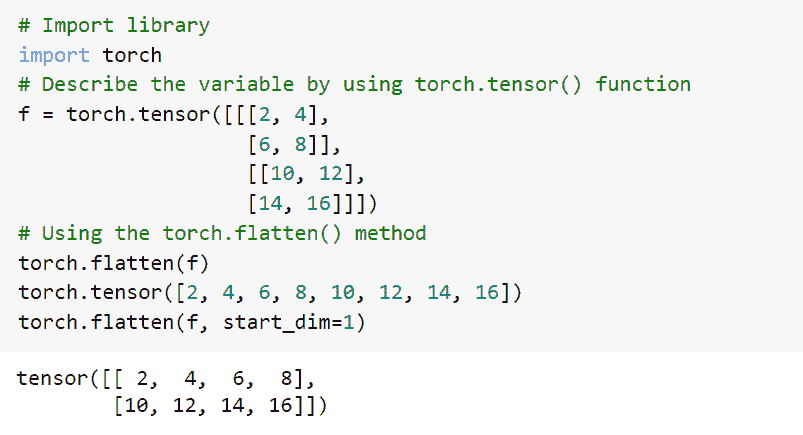
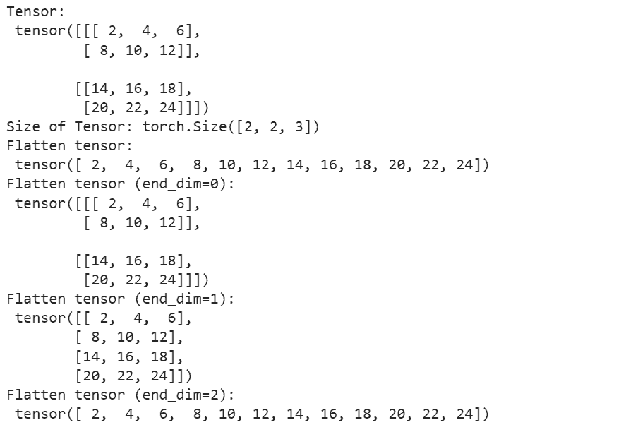
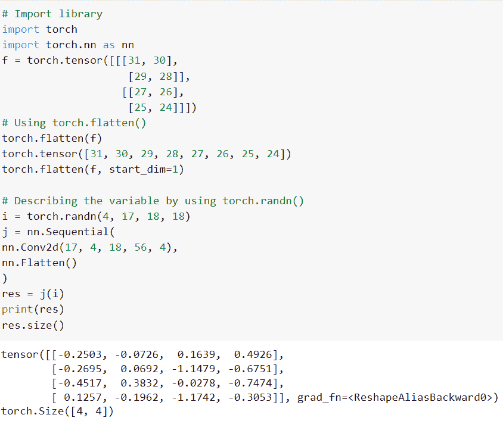
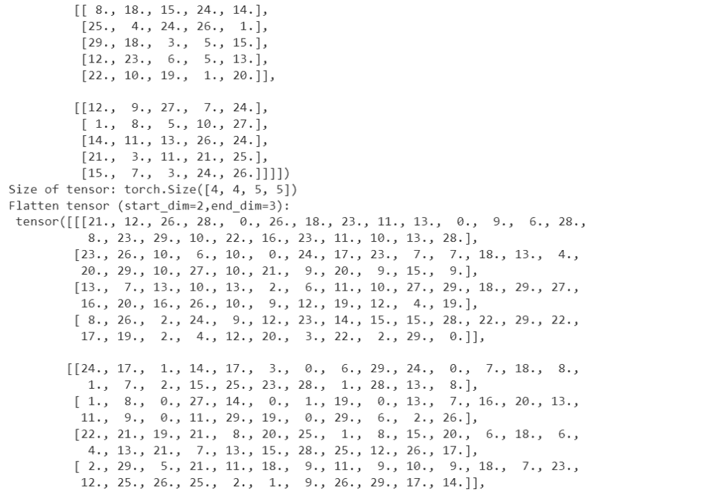
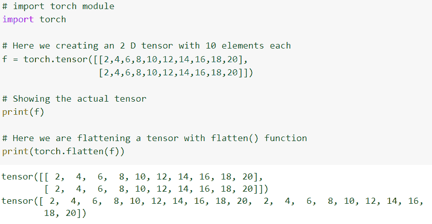
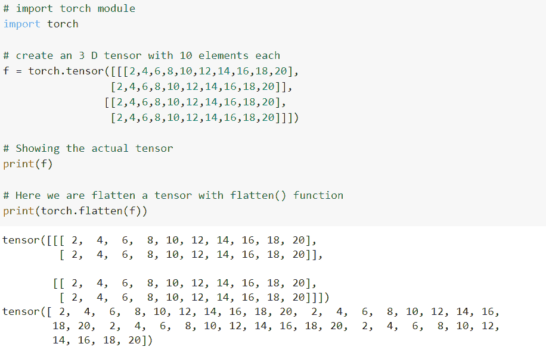

# PyTorch 扁平化+ 8 个示例

> 原文：<https://pythonguides.com/pytorch-flatten/>

[](https://sharepointsky.teachable.com/p/python-and-machine-learning-training-course)

`*PyTorch Flatten*` 方法携带实数和复数输入张量。 *`torch.flatten()`* 方法用于通过整形将张量展平为一维张量。详细来说，我们将讨论在 python 中使用 [PyTorch 的 flatten()方法。](https://pythonguides.com/what-is-pytorch/)

此外，我们还将介绍与 `*PyTorch flatten()*` 函数相关的不同示例。我们将讨论这些话题。

*   PyTorch 展平是什么
*   PyTorch 展平示例
*   PyTorch 展平层
*   PyTorch 展平张量列表
*   PyTorch 展平参数
*   如何用 2D 元素创建一个张量并展平这个向量
*   如何用 3D 元素创建一个张量并展平这个向量

目录

[](#)

*   [什么是 PyTorch 展平](#What_is_PyTorch_Flatten "What is PyTorch Flatten")
*   [PyTorch 展平示例](#PyTorch_Flatten_example "PyTorch Flatten example")
*   [PyTorch 展平图层](#PyTorch_flatten_layer "PyTorch flatten layer")
*   [PyTorch 展平张量列表](#PyTorch_Flatten_list_of_tensors "PyTorch Flatten list of tensors")
*   [PyTorch 展平参数](#PyTorch_Flatten_parameters "PyTorch Flatten parameters")
*   [如何用 2D 元素创建一个张量并展平这个向量](#How_to_create_a_tensor_with_2D_elements_and_flatten_this_vector "How to create a tensor with 2D elements and flatten this vector")
*   [如何用 3D 元素创建一个张量并展平这个向量](#How_to_create_a_tensor_with_3D_elements_and_flatten_this_vector "How to create a tensor with 3D elements and flatten this vector")

## 什么是 PyTorch 展平

在这一节中，我们将学习 python 中的 **PyTorch flatten。**

*`torch.flatten()`* 方法用于通过整形将张量展平为一维张量。

PyTorch 展平方法携带实数和复合值输入张量。它获取一个 torch 张量作为输入，并返回一个被展平为一维的 torch 张量。

**语法:**

PyTorch flatten 的语法:

```py
torch.flatten(input, start_dim=0, end_dim=-1)
```

**参数:**

以下是 PyTorch 展平的参数

*   **输入:**用作输入张量。
*   **start_dim:** 作为第一个要展平的 dim。
*   **end_dim:** 作为最后一个要展平的 dim。

因此，有了这个，我们详细了解了 PyTorch 展平。

阅读: [PyTorch 预训练模型](https://pythonguides.com/pytorch-pretrained-model/)

## PyTorch 展平示例

在这一节中，我们将借助 python 中的一个例子来学习如何实现 PyTorch flatten。

PyTorch 展平方法携带实数和复合值输入张量。它获取一个 torch 张量作为输入，并返回一个被展平为一维的 torch 张量。它包含两个参数 start_dim 和 end_dim。

**代码:**

在下面的代码中，我们将首先导入 torch 库，如 import torch。

f = torch.tensor([[[2，4]，[6，8]]，[[10，12]，[14，16]])通过使用 torch.tensor()函数来描述变量。

torch.flatten(f):这里我们使用了 torch.flatten()函数。

torch.flatten(f，start_dim=1)用作 flatten()函数，在这个函数中，我们使用了一些参数。

```py
# Import library
import torch
# Describe the variable by using torch.tensor() function
f = torch.tensor([[[2, 4],
                   [6, 8]],
                   [[10, 12],
                   [14, 16]]])
# Using the torch.flatten() method
torch.flatten(f)
torch.tensor([2, 4, 6, 8, 10, 12, 14, 16])
torch.flatten(f, start_dim=1)
```

**输出:**

运行上面的代码后，我们得到下面的输出，我们可以看到 PyTorch Flatten 值打印在屏幕上。



PyTorch Flatten example

这就是我们如何借助一个例子来理解 PyTorch 展平。

阅读:[py torch ms loss–详细指南](https://pythonguides.com/pytorch-mseloss/)

## PyTorch 展平图层

在这一节中，我们将学习 python 中的 **PyTorch 展平层**。

PyTorch Flatten 用于将具有不同维度的任何张量层整形为单一维度。

*`torch.flatten()`* 函数用于通过整形将张量展平为一维张量。

**代码:**

在下面的代码中，我们将首先导入 torch 库，如 import torch。

*   **f = torch.tensor([[[2，4，6]，[8，10，12]]，[[14，16，18]，[20，22，24]])**这里我们用 torch.tensor()函数来描述 f 变量。
*   `flatten _ tens = torch . flatten(f)`这里我们用 end_dims 来描述展平上面的张量。
*   **print("Flatten tensor:\n "，flatten_tens)** 用于打印展平张量。

```py
# Import Library
import torch
f = torch.tensor([[[2, 4, 6],
   [8, 10, 12]],
   [[14, 16, 18],
   [20, 22, 24]]])
print("Tensor:\n", f)
print("Size of Tensor:", f.size())

# Describe the flatten the above tensor by using end_dims
flatten_tens = torch.flatten(f)
flatten_tens1 = torch.flatten(f, end_dim=0)
flatten_tens2 = torch.flatten(f, end_dim=1)
flatten_tens3 = torch.flatten(f, end_dim=2)
# print the flatten tensors
print("Flatten tensor:\n", flatten_tens)
print("Flatten tensor (end_dim=0):\n", flatten_tens1)
print("Flatten tensor (end_dim=1):\n", flatten_tens2)
print("Flatten tensor (end_dim=2):\n", flatten_tens3)
```

**输出:**

在下面的代码中，你可以看到 PyTorch 展平图层在 *`torch.flatten()`* 函数的帮助下被重新整形。



PyTorch Flatten layer

这样，我们就明白了如何借助 *`torch.flatten()`* 来重塑张量层。

阅读: [PyTorch nn 线性+例题](https://pythonguides.com/pytorch-nn-linear/)

## PyTorch 展平张量列表

在这一节中，我们将学习 python 中张量的 **PyTorch 展平列表。**

PyTorch 通过将张量输入整形为一维张量来展平张量输入列表。输入、start_dim 和 end_dims 在 torch.flatten()函数中传递。以 start_dim 开始并以 end_dim 结束的尺寸被展平。

**代码:**

在下面的代码中，我们将首先导入 torch 库，如 import torch。

*   **f = torch.tensor([[[31，30]，[29，28]]，[[27，26]，[25，24]])**用于使用 torch.tensor()函数描述变量。
*   `torch.flatten(f)` 这里我们使用的是 torch.flatten()函数。
*   **i = torch.randn(4，17，18，18)** 用于通过使用 torch.randn()函数来描述变量。
*   `print(res)` 用于使用print()功能打印结果。

```py
# Import Library
impo# Import library
import torch
import torch.nn as nn
f = torch.tensor([[[31, 30],
                    [29, 28]],
                   [[27, 26],
                    [25, 24]]])
# Using torch.flatten()
torch.flatten(f)
torch.tensor([31, 30, 29, 28, 27, 26, 25, 24])
torch.flatten(f, start_dim=1) 

# Describing the variable by using torch.randn()
i = torch.randn(4, 17, 18, 18)
j = nn.Sequential(
nn.Conv2d(17, 4, 18, 56, 4),
nn.Flatten()
)
res = j(i)
print(res)
res.size()
```

**输出:**

运行上面的代码后，我们得到下面的输出，其中我们可以看到 py torch tensor 值的 Flatten 列表打印在屏幕上。



PyTorch flatten list of tensors

这就是我们如何理解 PyTorch 在 python 中展平张量列表。

阅读:[交叉熵损失 PyTorch](https://pythonguides.com/cross-entropy-loss-pytorch/)

## PyTorch 展平参数

在本节中，我们将学习 python 中的 **PyTorch 展平参数**。

这里我们使用了 torch.flatten()函数，在这个函数中，我们使用了一些参数。第一个参数是 input，第二个参数是 start_sim，最后一个参数是 end_dim。

以 start_dim 开始并以 end_dim 结束的尺寸被展平。

**代码:**

在下面的代码中，我们将首先导入 torch 库，如 import torch。

*   f = torch.empty(4，4，5，5)。random_(30) 这里我们用 torch.empty()函数来描述 f 变量。
*   **print("Size of tensor:"，f.size())** 用于借助 print()函数打印张量的大小。
*   ftens = torch.flatten(f，start_dim=2，end_dim=3):这里我们用 strat_dim 和 end_dim 将上面的张量展平。
*   **print(" Flatten tensor(start _ dim = 2，end_dim=3):\n "，ftens)** 用于打印展平张量。

```py
# Importing Library
import torch
# Describing the variable 
f = torch.empty(4,4,5,5).random_(30)
# Printing the size of the tensor
print("Tensor:\n", f)
print("Size of tensor:", f.size())

# Here we are flatten the above tensor using start_dim and end_dim
ftens = torch.flatten(f, start_dim=2, end_dim=3)

# printing the flatten tensors
print("Flatten tensor (start_dim=2,end_dim=3):\n", ftens)
```

**输出:**

运行上面的代码后，我们得到下面的输出，我们可以看到 PyTorch Flatten 参数值打印在屏幕上。



PyTorch Flatten parameters

这就是我们对 torch.flatten()函数中使用的 PyTorch Flatten 参数的理解。

阅读: [PyTorch Numpy to Tensor](https://pythonguides.com/pytorch-numpy-to-tensor/)

## 如何用 2D 元素创建一个张量并展平这个向量

在这一节中，我们将学习**如何用二维元素创建一个张量，并在 python 中展平这个向量**。

这里我们使用 flatten()函数，该函数用于将 N 维张量展平为一维张量。

**代码:**

在下面的代码中，我们将首先导入 torch 库，如 import torch。

*   **f = torch.tensor([[2，4，6，8，10，12，14，16，18，20]，[2，4，6，8，10，12，14，16，18，20]])** 用于创建一个有 10 个元素的二维张量。
*   `print(f)` 用于显示实际张量。
*   `print(torch.flatten(f))` :这里我们用 flatten()函数来谄媚一个张量。

```py
# import torch module
import torch

# Here we creating an 2 D tensor with 10 elements each
f = torch.tensor([[2,4,6,8,10,12,14,16,18,20],
                  [2,4,6,8,10,12,14,16,18,20]])

# Showing the actual tensor
print(f)

# Here we are flattening a tensor with flatten() function
print(torch.flatten(f))
```

**输出:**

运行上面的代码后，我们得到了下面的输出，其中我们可以看到，二维张量创建了 10 个元素值打印在屏幕上。



How to create a tensor with 2D elements and flatten this vector

有了这个，我们明白了如何用 2D 元素创建一个张量，并展平这个向量。

阅读: [PyTorch 全连接层](https://pythonguides.com/pytorch-fully-connected-layer/)

## 如何用 3D 元素创建一个张量并展平这个向量

在这一节中，我们将学习**如何用 3D 元素**创建一个张量，并在 python 中展平这个向量。

这里我们使用 flatten()函数，该函数用于将 N 维张量展平为一维张量，并创建一个包含三维元素的张量，然后展平向量。

**代码:**

在下面的代码中，我们将首先导入 torch 库，如 import torch。

*   **f = torch . tensor([[2，4，6，8，10，12，14，16，18，20]，[2，4，6，8，10，12，16，18，20]，[2，4，6，8，12，14，16，18，20]，[2，4，6，8，10，12，14，16，18，20]])]**
*   `print(f)` 用于显示实际张量。
*   **print(torch.flatten(f)):** 这里我们用 flatten()函数展平一个张量。

```py
# import torch module
import torch

# create an 3 D tensor with 10 elements each
f = torch.tensor([[[2,4,6,8,10,12,14,16,18,20],
                 [2,4,6,8,10,12,14,16,18,20]],
                [[2,4,6,8,10,12,14,16,18,20],
                 [2,4,6,8,10,12,14,16,18,20]]])

# Showing the actual tensor
print(f)

# Here we are flatten a tensor with flatten() function
print(torch.flatten(f))
```

**输出:**

在下面的输出中，我们可以看到 3d 张量是用 10 个元素值打印在屏幕上创建的。



How to create a tensor with 3D elements and flatten this vector

因此，有了这个，我们明白了如何用 3D 元素创建一个张量，并展平这个向量。

另外，看看更多使用 Python 的 PyTorch 教程。

*   [软最大指针](https://pythonguides.com/pytorch-softmax/)
*   [PyTorch 车型总结](https://pythonguides.com/pytorch-model-summary/)
*   [PyTorch 栈教程](https://pythonguides.com/pytorch-stack/)
*   [PyTorch Full()函数](https://pythonguides.com/pytorch-full-function/)
*   [PyTorch 逻辑回归](https://pythonguides.com/pytorch-logistic-regression/)
*   [数据加载器指针+示例](https://pythonguides.com/pytorch-dataloader/)
*   [PyTorch 添加尺寸](https://pythonguides.com/pytorch-add-dimension/)

因此，在本教程中，我们讨论了 `PyTorch Flatten` ，并且我们还讨论了与其实现相关的不同示例。这是我们已经讨论过的例子列表。

*   PyTorch 展平是什么
*   PyTorch 展平示例
*   PyTorch 展平层
*   PyTorch 展平张量列表
*   PyTorch 展平参数
*   如何用 2D 元素创建一个张量并展平这个向量
*   如何用 3D 元素创建一个张量并展平这个向量

[Bijay Kumar](https://pythonguides.com/author/fewlines4biju/)

Python 是美国最流行的语言之一。我从事 Python 工作已经有很长时间了，我在与 Tkinter、Pandas、NumPy、Turtle、Django、Matplotlib、Tensorflow、Scipy、Scikit-Learn 等各种库合作方面拥有专业知识。我有与美国、加拿大、英国、澳大利亚、新西兰等国家的各种客户合作的经验。查看我的个人资料。

[enjoysharepoint.com/](https://enjoysharepoint.com/)[](https://www.facebook.com/fewlines4biju "Facebook")[](https://www.linkedin.com/in/fewlines4biju/ "Linkedin")[](https://twitter.com/fewlines4biju "Twitter")