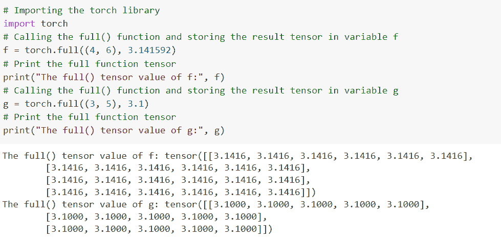
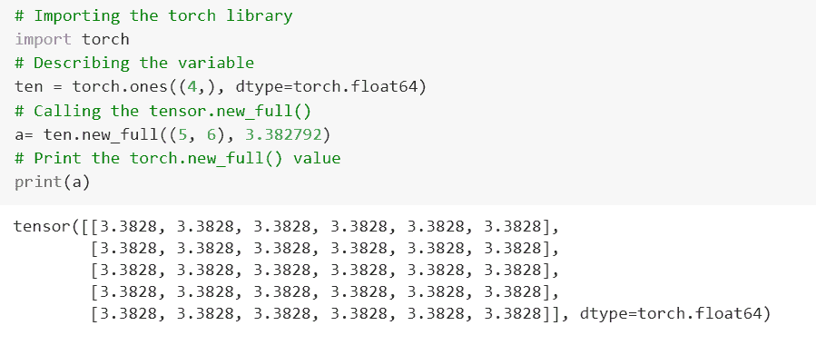
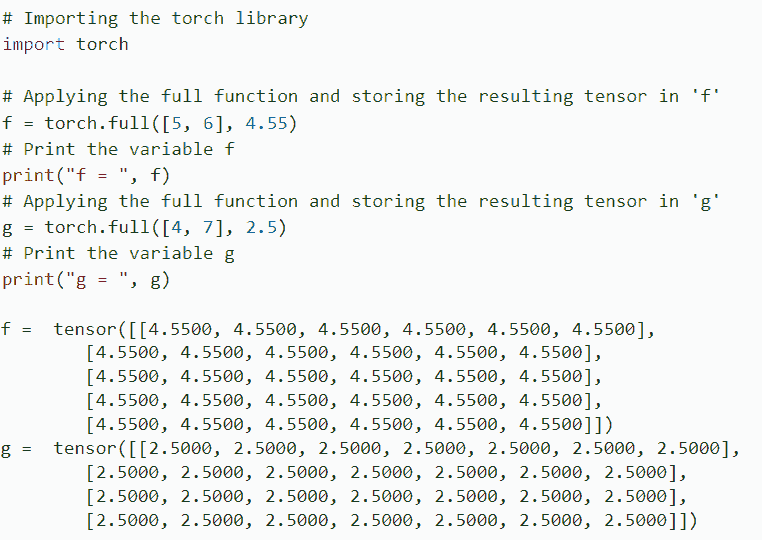

# 如何使用 PyTorch Full()函数

> 原文：<https://pythonguides.com/pytorch-full-function/>

[](https://sharepointsky.teachable.com/p/python-and-machine-learning-training-course)

`*py torch torch . full()*`函数定义为创建一个用 *`fill_value`* 填充的大小的张量。详细来说，我们将讨论 Python 中使用 [PyTorch 的 *`full()`* 函数。](https://pythonguides.com/what-is-pytorch/)

此外，我们将介绍与 PyTorch full()函数相关的不同示例。我们将讨论这些话题。

*   什么是 PyTorch full()函数
*   PyTorch full()函数示例
*   PyTorch torch.new_full()函数是什么
*   PyTorch torch.full_like()函数是什么
*   如何使用 PyTorch full()函数追加

目录

[](#)

*   [什么是 PyTorch full()函数](#What_is_PyTorch_full_function " What is PyTorch full() function")
*   [PyTorch full()函数示例](#PyTorch_full_function_example "PyTorch full() function example")
*   [什么是 PyTorch torch.new_full()函数](#What_is_PyTorch_torchnew_full_function "What is PyTorch torch.new_full() function")
*   [什么是 PyTorch torch.full_like()函数](#What_is_PyTorch_torchfull_like_function "What is PyTorch torch.full_like() function")
*   [如何使用 PyTorch full()函数追加](#How_to_use_PyTorch_full_function_append "How to use PyTorch full() function append")

## 什么是 PyTorch full()函数

在本节中，我们将学习 python 中的 **PyTorch full()函数**。

`*py torch torch . full()*`函数被定义为创建一个用 fill_value 填充的大小的张量，张量 dtype 从 fill_value 中推导出来。

**语法:**

PyTorch full()函数的语法是:

```py
torch.full(size, fill_value, out=None, dtype=None, layout=torch.strided, device=None, required_grad=False)
```

**参数:**

size:size 是一个参数，它定义了一个列表、元组或整数的大小，这些整数定义了输出张量的形状。

*   **fill_value:** 填充值用于填充输出张量。
*   **out = None:**out 是一个被描述为输出张量的参数。
*   **dtype=None:** 类型被定义为返回张量的所需数据类型。dtype 的默认值是 None。
*   `layout=torch.strided` 定义为返回张量的期望布局，布局的默认值为 torch.strided。
*   `device=None` 定义为返回张量的期望设备。设备的默认值是无。
*   **requires_grad:**requires _ grad 定义为一个参数，如果自动签名应该记录对返回张量的操作，requires _ grad 的默认值为 False。

这样，我们借助 torch.full()方法理解了 PyTorch 的全部功能。

阅读: [PyTorch Conv3d](https://pythonguides.com/pytorch-conv3d/)

## PyTorch full()函数示例

在这一节中，我们将借助 python 中的一个例子来学习**如何实现 full()函数**。

这里我们使用 torch.full()创建一个用 fill_value 填充的大小为**大小为**的张量。

**代码:**

在下面的代码中，我们将导入 torch 模块，如 import torch。

*   **f = torch.full((4，6)，3.141592):** 这里我们调用 full()函数，将结果存储在 f 变量中。
*   **print(" f 的 full()张量值:"，f)** 使用 print()函数打印 f 的 full()函数值。
*   **g = torch.full((3，5)，3.1)** 用于描述一个 full()函数，并将结果存储在 g 变量中。

```py
# Importing the torch library
import torch
# Calling the full() function and storing the result tensor in variable f
f = torch.full((4, 6), 3.141592)
# Print the full function tensor 
print("The full() function value of f:", f)
# Calling the full() function and storing the result tensor in variable g
g = torch.full((3, 5), 3.1)
# Print the full function tensor 
print("The full() function value of g:", g)
```

**输出:**

运行上面的代码后，我们得到下面的输出，其中我们可以看到 PyTorch full()函数值被打印在屏幕上。



PyTorch full function example

这就是我们借助 python 中的一个例子来理解 PyTorch full()函数的方法。

阅读: [PyTorch 查看教程](https://pythonguides.com/pytorch-view/)

## 什么是 PyTorch torch.new_full()函数

在本节中，我们将学习 python 中的 **PyTorch torch.new_full()函数**。

torch.new _ full()函数返回用 fill_value 填充的大小为 `size` 的张量，默认情况下，因为这个设备返回值具有相同的 torch.dtype 和 torch.device。

**语法:**

PyTorch torch.new_full()函数的语法:

```py
torch.new_full(size, fill_value, dtype=None, device=None, requires_grad=False)
```

**参数:**

**fill _ value:**fill _ value 是描述填充输出张量的数字的参数。

*   **dtype:** 类型定义为返回张量的期望类型，dtype 的默认值为 None。
*   **设备:**设备被定义为期望类型的返回张量。设备的默认值是无。
*   `requires_grad`:requires _ grad 定义为一个参数，如果自动签名应该记录对返回张量的操作，requires _ grad 的默认值为 False。

**举例:**

在下面的代码中，我们将导入 torch 库，如 import torch。

*   **ten = torch.ones((4，)，dtype=torch.float64):** 这里我们用 torch.ones()函数来描述张量变量。
*   **a= ten.new_full((5，6)，3.382792):** 这里我们调用的是 tensor.new_full()函数。
*   `print(a)` 用于使用 print()函数在屏幕上打印 torch.new_full()函数值。

```py
# Importing the torch library
import torch
# Describing the variable
ten = torch.ones((4,), dtype=torch.float64)
# Calling the tensor.new_full()
a= ten.new_full((5, 6), 3.382792)
# Print the torch.new_full() value
print(a)
```

**输出:**

运行上面的代码后，我们得到下面的输出，其中我们可以看到 PyTorch torch.new_full()函数值被打印在屏幕上。



PyTorch torch.new_full function

这就是我们对 python 中 PyTorch torch.new_full()函数的理解。

阅读: [PyTorch 添加尺寸](https://pythonguides.com/pytorch-add-dimension/)

## 什么是 PyTorch torch.full_like()函数

在本节中，我们将学习 python 中的 **PyTorch torch.full_like()函数**。

torch.full _ like()函数返回与用 fill_value 填充的输入大小相同的张量。

**语法:**

PyTorch torch.full_like()函数的语法:

```py
torch.full_like(input, fill_value, dtype=None, layout=torch.strided, device=None, required_grad=False, memory_format=torch.preserve_format)
```

**参数:**

以下是 torch.full _ like()函数的参数:

*   **输入:**输入是输入的大小将决定输出张量大小的参数。
*   **fill _ value:**fill _ value 定义为填充输出张量的数。
*   dtype:dtype 被定义为返回张量的所需数据类型，dtype 的默认值是 None。
*   **布局:**布局是的一个参数**，表示返回张量的期望布局。布局的默认值是无。**
*   设备:设备被定义为返回张量的期望设备，缺省值为 None。
*   requires_grad:如果自动签名应该记录对返回张量的操作，并且 requires_grad 的默认值为 False，则 requires_grad 被定义为一个参数。
*   memory_format:memory _ format 被定义为返回张量所需的内存格式，memory _ format 的默认值是 torch.preserve_format。

这样，我们理解了 python 中的 torch.full _ like()函数。

阅读: [Jax Vs PyTorch](https://pythonguides.com/jax-vs-pytorch/)

## 如何使用 PyTorch full()函数追加

在本节中，我们将学习如何使用 python 中的 **PyTorch full()函数** `append` 。

在继续之前，我们应该了解一些关于追加的知识。

追加被定义为在书面文档的末尾添加内容的过程。

这里，我们通过使用 torch.full()方法在 PyTorch full 函数中追加整数。

**代码:**

在下面的代码中，我们将导入 torch 库，如 import torch。

*   **f = torch.full([5，6]，4.55)** 用于应用 full()函数，并将结果张量存储在 f 中。
*   **print("f = "，f)** 用于通过 print()函数打印 f 的值。
*   **g = torch.full([4，7]，2.5)** 用于应用 full()函数，并将结果张量存储在 g 中。
*   **print("g = "，g)** 用于借助 print()函数打印值 g。

```py
# Importing the torch library
import torch

# Applying the full function and storing the resulting tensor in 'f'
f = torch.full([5, 6], 4.55)
# Print the variable f
print("f = ", f)
# Applying the full function and storing the resulting tensor in 'g'
g = torch.full([4, 7], 2.5)
# Print the variable g
print("g = ", g)
```

**输出:**

运行上面的代码后，我们得到下面的输出，其中我们可以看到 PyTorch full()函数的 append 值被打印在屏幕上。



PyTorch full function append

这就是我们理解如何使用 PyTorch full()函数 append 的方式。

你可能也喜欢阅读下面的 PyTorch 教程。

*   [pytorch league relu](https://pythonguides.com/pytorch-leaky-relu/)
*   [PyTorch 猫功能](https://pythonguides.com/pytorch-cat-function/)
*   [创建 PyTorch 空张量](https://pythonguides.com/pytorch-empty-tensor/)
*   [如何在 PyTorch 中压缩张量](https://pythonguides.com/squeeze-a-tensor-in-pytorch/)
*   [PyTorch 展平+ 8 个示例](https://pythonguides.com/pytorch-flatten/)
*   [PyTorch 激活功能](https://pythonguides.com/pytorch-activation-function/)
*   [PyTorch 车型总结](https://pythonguides.com/pytorch-model-summary/)
*   [PyTorch 逻辑回归](https://pythonguides.com/pytorch-logistic-regression/)

因此，在本教程中，我们讨论了 `PyTorch full()` ，并且我们还讨论了与其实现相关的不同示例。这是我们已经讨论过的例子列表。

*   什么是 PyTorch full()函数
*   PyTorch full()函数示例
*   PyTorch torch.new_full()函数是什么
*   PyTorch torch.full_like()函数是什么
*   如何使用 PyTorch full()函数追加

[Bijay Kumar](https://pythonguides.com/author/fewlines4biju/)

Python 是美国最流行的语言之一。我从事 Python 工作已经有很长时间了，我在与 Tkinter、Pandas、NumPy、Turtle、Django、Matplotlib、Tensorflow、Scipy、Scikit-Learn 等各种库合作方面拥有专业知识。我有与美国、加拿大、英国、澳大利亚、新西兰等国家的各种客户合作的经验。查看我的个人资料。

[enjoysharepoint.com/](https://enjoysharepoint.com/)[](https://www.facebook.com/fewlines4biju "Facebook")[](https://www.linkedin.com/in/fewlines4biju/ "Linkedin")[](https://twitter.com/fewlines4biju "Twitter")