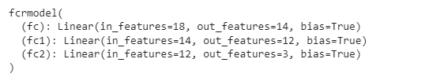

# PyTorch 全连接层

> 原文：<https://pythonguides.com/pytorch-fully-connected-layer/>

[](https://sharepointsky.teachable.com/p/python-and-machine-learning-training-course)

在这个 [Python 教程](https://pythonguides.com/learn-python/)中，我们将学习 Python 中的 **PyTorch 全连接层**，我们还将涵盖与 **PyTorch 全连接层**相关的不同示例。我们将讨论这些话题。

*   PyTorch 全连接层
*   PyTorch 全连接层初始化
*   PyTorch 全连接层输入大小
*   PyTorch cnn 全连接层
*   PyTorch 2d 全连接层
*   PyTorch 具有 128 个神经元的全连接层
*   PyTorch 全连接层，带脱落
*   PyTorch 全连接层 relu

目录

[](#)

*   [PyTorch 全连接层](#PyTorch_fully_connected_layer "PyTorch fully connected layer")
*   [PyTorch 全连接层初始化](#PyTorch_fully_connected_layer_initialization "PyTorch fully connected layer initialization")
*   [PyTorch 全连接层输入尺寸](#PyTorch_fully_connected_layer_input_size "PyTorch fully connected layer input size")
*   [PyTorch CNN 全连接层](#PyTorch_CNN_fully_connected_layer "PyTorch CNN fully connected layer")
*   [PyTorch 2d 全连通层](#PyTorch_2d_fully_connected_layer "PyTorch 2d fully connected layer")
*   [py torch 128 神经元全连接层](#PyTorch_fully_connected_layer_with_128_neurons "PyTorch fully connected layer with 128 neurons")
*   [PyTorch 全连接层，带脱落](#PyTorch_fully_connected_layer_with_dropout "PyTorch fully connected layer with dropout")
*   [PyTorch 全连接层 relu](#PyTorch_fully_connected_layer_relu "PyTorch fully connected layer relu")

## PyTorch 全连接层

在本节中，我们将学习 Python 中的 PyTorch 全连接层。

线性层也称为全连接层。这一层帮助转换来自前一层的输出的维度。

**代码:**

在下面的代码中，我们将导入 torch 模块，从中我们可以转换上一层输出的维度。

*   **inp = torch.randn(15，9)** 作为输入值。
*   **weght = torch.randn(7，9)** 用于生成权重。
*   **torch.mm(inp，weght.t())** 用作矩阵乘法。
*   **lay=nn。Linear(in_features=9，out_features=7，bias=False)** 用于创建前馈网络。
*   lay.weght=nn。参数(weght)用于定义为一个权重。

```py
import torch
import torch.nn as nn

inp = torch.randn(15, 9)
weght = torch.randn(7,9)

torch.mm(inp,weght.t())
lay=nn.Linear(in_features=9,out_features=7,bias=False)
lay.weght=nn.Parameter(weght)
lay.weght
lay(inp)
```

**输出:**

运行上面的代码后，我们得到下面的输出，其中我们可以看到 PyTorch 完全连接的层显示在屏幕上。


PyTorch fully connected layer

阅读: [PyTorch 车型总结](https://pythonguides.com/pytorch-model-summary/)

## PyTorch 全连接层初始化

在本节中，我们将学习**如何在 python 中初始化 PyTorch 全连接层**。

线性层用于神经网络的最后一级。它的线性层也称为全连通层。

线性层是初始化的，有助于转换前一层输出的维度。

为此，该模型可以很容易地解释数据值之间的关系。

**代码:**

在下面的代码中，我们将导入 torch 模块，从中我们可以初始化完全连接的层。

*   **nn。Conv2d()** 用于对输入应用 2d 卷积。
*   **nn。Dropout2d()** 用于帮助提升特征图之间的独立性。
*   **self.fc = nn。线性(9218，130)** 用作第一个全连接层。
*   **self.fc1 = nn。线性(130，12)** 用作第二个全连接层。
*   **打印(nnmodel)** 用于打印模型。

```py
import torch as tor
import torch.nn as nn
import torch.nn.functional as fun
class model(nn.Module):
    def __init__(self):
      super(model, self).__init__()

      self.conv = nn.Conv2d(3, 34, 5, 3)
      self.conv1 = nn.Conv2d(34, 66, 5, 3)

      self.dropout = nn.Dropout2d(0.27)
      self.dropout1 = nn.Dropout2d(0.7)
      self.fc = nn.Linear(9218, 130)
      # Second fully connected layer that outputs our 10 labels
      self.fc1 = nn.Linear(130, 12)

nnmodel = model()
print(nnmodel)
```

**输出:**

在下面的输出中，我们可以看到完全连接的层正在成功初始化。


PyTorch fully connected layer initialization

阅读: [PyTorch 数据加载器+示例](https://pythonguides.com/pytorch-dataloader/)

## PyTorch 全连接层输入尺寸

在本节中，我们将学习 python 中的 **PyTorch 全连接层输入大小**。

全连接层将输入乘以一个权重矩阵，并加上一个权重。神经网络的输入是批量大小*通道数量*身高*体重的类型。

**代码:**

在下面的代码中，我们将导入 torch 模块，从中我们可以获得全连接层的输入大小。

*   **nn。Conv2d()** 等待输入的形状为 batch_size、input_channels、input_height、input_width。
*   **nn。线性()**用作前馈神经网络。
*   `print(fc)` 用于打印完全连接的神经网络。

```py
import torch
import torch.nn as nn
import torch.nn.functional as fun
class fcmodel(nn.Module):
    def __init__(self):
        super(fcmodel, self).__init__()
        self.conv = nn.Conv2d(5, 8, 7)
        self.pool  = nn.MaxPool2d(2,2)
        self.conv1 = nn.Conv2d(8, 18, 7)
        self.fc  = nn.Linear(16*5*5, 120)
        self.fc1   = nn.Linear(140, 86)
        self.fc2  = nn.Linear(86, 12)

    def forward(self, y):
        y = self.pool(fun.relu(self.conv(y)))
        y = self.pool(fun.relu(self.conv1(y)))
        y = y.view(-1, 16*5*5)
        y = fun.relu(self.fc(y))
        y = fun.relu(self.fc1(y))
        y = self.fc2(y)
        return y

fc = fcmodel()
print(fc)
```

**输出:**

运行上面的代码后，我们得到下面的输出，其中我们可以看到完全连接的层输入大小被打印在屏幕上。


PyTorch fully connected layer input size

阅读: [PyTorch 模型评估+示例](https://pythonguides.com/pytorch-model-eval/)

## PyTorch CNN 全连接层

在本节中，我们将学习 python 中的 **PyTorch CNN 全连接层**。

CNN 是解决计算机视觉最流行的方法，例如物体检测。CNN 对等图像中的模式。

线性层用于卷积神经网络的最后一级。它的线性层也称为全连通层。

**代码:**

在下面的代码中，我们将导入 torch 模块，从中我们可以创建 cnn 全连接层。

*   **def forward(self，y)** 这里 y 是代表我们的数据。
*   `y = self.conv(y)` 用于通过 conv 传递数据。
*   `y = func.relu(y)` 用于 y 上的整流线性激活函数
*   **y = func.max_pool2d(y，2)** 用于在 y 上运行最大池。
*   `y = self.dropout(y)` 用于通过 dropout 传递数据。
*   **y = torch.flatten(y，1)** 用作 flatten y，start_dim 为 1。
*   `y = self.fc(y)` 用于通过 fc 传递数据。
*   `print (cnn)` 用于打印 cnn 图层。

```py
import torch
import torch.nn as nn
import torch.nn.functional as func
class cnnfc(nn.Module):
    def __init__(self):
      super(cnnfc, self).__init__()
      self.conv = nn.Conv2d(3, 34, 5, 3)
      self.conv1 = nn.Conv2d(34, 66, 5, 3)
      self.dropout = nn.Dropout2d(0.30)
      self.dropout1 = nn.Dropout2d(0.10)
      self.fc = nn.Linear(9218, 130)
      self.fc1 = nn.Linear(130, 15)

    def forward(self, y):

      y = self.conv(y)
      y = func.relu(y)

      y = self.conv1(y)
      y = func.relu(y)

      y = func.max_pool2d(y, 2)

      y = self.dropout(y)

      y = torch.flatten(y, 1)

      y = self.fc(y)
      y = func.relu(y)
      y = self.dropout1(y)
      y = self.fc1(y)

cnn = cnnfc()
print (cnn) 
```

**输出:**

在下面的输出中，我们可以看到 PyTorch cnn 全连接层打印在屏幕上。


PyTorch cnn fully connected layer

阅读:[py torch ms loss–详细指南](https://pythonguides.com/pytorch-mseloss/)

## PyTorch 2d 全连通层

在本节中，我们将学习 Python 中的 **PyTorch 2d 连接层**。

2d 全连接图层有助于更改前一图层的输出维度。该模型可以很容易地定义数据值之间的关系。

**代码:**

在下面的代码中，我们将导入 torch 模块，从中我们可以初始化 2d 全连接层。

*   **nn。Conv2d()** 用于执行 2d 数据的卷积。
*   **nn。线性()**用于创建一个前馈神经网络。
*   `modl = model()` 用于初始化模型。
*   `print(modl)` 用于打印模型。

```py
import torch
import torch.nn as nn
import torchvision
import torch.nn.functional as func
import torchvision.transforms as transforms
class model(nn.Module):
    def __init__(self):
        super(model, self).__init__()
        self.conv = nn.Conv2d(in_channels=3, out_channels=34, kernel_size= 7,stride = 3)
        self.conv1 = nn.Conv2d(34, 66, 7, 2)
        self.fc = nn.Linear(66*22*22, 49)

    def forward(self, y):
        y = func.relu(self.conv(y))
        y = func.relu(self.conv1(y))
        y = func.max_pool2d(y, 1)
        y = torch.flatten(y, 1)
        y = self.fc(y)
        out = func.log_softmax(y, dim=1)
        return out
# initiating the model
modl = model()
print(modl)
```

**输出:**

运行上面的代码后，我们得到下面的输出，其中我们可以看到 PyTorch 2d 全连接层打印在屏幕上。


PyTorch 2d fully connected layer

阅读: [PyTorch 批量标准化](https://pythonguides.com/pytorch-batch-normalization/)

## py torch 128 神经元全连接层

在本节中，我们将学习 python 中具有 128 个神经元的 **PyTorch 全连接层**。

全连接层被定义为来自一层的所有输入都连接到下一层的每个激活单元的层。

**代码:**

在下面的代码中，我们将导入 torch 模块，从中我们可以制作具有 128 个神经元的全连接层。

*   **self.conv = nn。Conv2d(1，35，(7，7)，padding=0)** 用于与 35 个大小为 7 x 7 的特征映射进行卷积，并激活 ReLU。
*   **self.fc = nn。线性(20 * 7**4，128)** 用作 128 个神经元的全连接层。
*   `z = self.conv(y)` 被用作通过 conv 传递数据。
*   `z = func.relu(z)` 用作 z 上的整流线性激活函数
*   **z = func.max_pool2d(z，2)** 在 z 上运行最大池。
*   `z = self.dropout(z)` 数据可以通过 dropout 传递。
*   **z = torch.flatten(z，1)** 用 start_dim = 1 展平 z。
*   `cnn = cnnwithneurons()` 用于初始化模型。

```py
import torch 
import torch.nn.functional as func
from torch import nn

class cnnwithneurons(nn.Module):
    def __init__(self):
        super(cnnwithneurons, self).__init__()
        self.conv = nn.Conv2d(1, 35, (7, 7), padding=0)
        self.conv1 = nn.Conv2d(35, 20, (5, 5), padding=0)
        self.fc = nn.Linear(20 * 7**4, 128)
        self.fc1 = nn.Linear(128, 52)
        self.fc2 = nn.Linear(52, 12)

    def forward(self, z):

      z = self.conv(y)

      z = func.relu(z)

      z = self.conv1(z)
      z = func.relu(z)

      z = func.max_pool2d(z, 2)

      z = self.dropout(z)

      z = torch.flatten(z, 1)

      z = self.fc(z)
      z = func.relu(z)
      z = self.dropout1(z)
      z = self.fc1(z)
cnn = cnnwithneurons()
print (cnn) 
```

**输出:**

在下面的输出中，我们可以看到屏幕上打印了具有 128 个神经元的全连接层。


PyTorch fully connected layer with 128 neurons

阅读: [PyTorch 负载模型+示例](https://pythonguides.com/pytorch-load-model/)

## PyTorch 全连接层，带脱落

在本节中，我们将学习 python 中的 P **yTorch 全连接层和 dropout** 。

使用丢弃技术去除神经网络，以同时模拟训练大量架构。

**代码:**

在下面的代码中，我们将导入 torch 模块，从中我们可以获得带有 dropout 的全连接层。

*   **self.conv = nn。Conv2d(5，34，5)** 等待输入的形状为 batch_size，input_channels，input_height，input_width。
*   **nn。线性()**用于创建前馈神经网络。
*   **self.dropout = nn。【T1(0.27)】用于定义神经元要脱落的比例。**
*   `model =dropoutmodel()` 用于初始化模型。
*   **打印(模型)**用于打印模型。

```py
import torch
from torch import nn
import torch.nn.functional as func
from torch import nn
class dropoutmodel(nn.Module):
  def __init__(self, input_shape=(3,32,32)):
    super(dropoutmodel, self).__init__()

    self.conv = nn.Conv2d(5, 34, 5)
    self.conv1 = nn.Conv2d(34, 66, 5)
    self.conv2 = nn.Conv2d(66, 130, 5)

    self.pool = nn.MaxPool2d(2,2)

    self.fc = nn.Linear(20 * 9**4, 218)
    self.fc1 = nn.Linear(218, 10)

    # Define proportion or neurons to dropout
    self.dropout = nn.Dropout(0.27)

  def forward(self, z):
    z = self._forward_features(z)
    z = z.view(z.size(0), -1)
    z = self.dropout(z)
    z = func.relu(self.fc1(z))
    # Apply dropout
    z = self.dropout(z)
    z = self.fc2(z)
    return z
model =dropoutmodel()
print(model) 
```

**输出:**

运行上面的代码后，我们得到下面的输出，其中我们可以看到 PyTorch 完全连接的 dropout 打印在屏幕上。


PyTorch fully connected layer dropout

阅读: [PyTorch nn 线性+例题](https://pythonguides.com/pytorch-nn-linear/)

## PyTorch 全连接层 relu

在本节中，我们将学习 python 中的 **PyTorch 全连接层 relu** 。

在前进之前，我们应该对 relu 有一些了解。ReLu 代表校正线性激活函数。

它也被称为用于多线性神经网络的非线性激活函数。

**代码:**

在下面的代码中，我们将导入 torch 模块，从中我们可以得到完全连接的层 relu。

*   【fcrmodel 类(nn。模块用于定义网络类。
*   **超级()。__init__()** 用于从超类调用构造函数。
*   **nn。线性()**用于创建一个前馈神经网络。
*   `func.relu(self.fc1(z))` 用于定义正向传递。
*   rmodl = fcrmodel()用于初始化模型。
*   print(rmodl)用于打印模型架构。

```py
import torch
import torch.nn.functional as func
from torch import nn

class fcrmodel(nn.Module):
    def __init__(self):

        super().__init__()

        self.fc = nn.Linear(18, 14)
        self.fc1 = nn.Linear(14, 12)
        self.fc2 = nn.Linear(12, 3)

    def forward(self, z):

        z = func.relu(self.fc1(z))
        z = func.relu(self.fc2(z))
        z = torch.sigmoid(self.fc3(z))
        return z

rmodl = fcrmodel()

print(rmodl)
```

**输出:**

在下面的输出中，我们可以看到 PyTorch 全连接层 relu activation 打印在屏幕上。



PyTorch fully connected relu

你可能也喜欢阅读下面的 PyTorch 教程。

*   [PyTorch nn Conv2d](https://pythonguides.com/pytorch-nn-conv2d/)
*   【numpy 指针为张量
*   [PyTorch 线性回归](https://pythonguides.com/pytorch-linear-regression/)
*   [PyTorch 保存模型–完整指南](https://pythonguides.com/pytorch-save-model/)
*   [PyTorch 激活功能【有 11 个例子】](https://pythonguides.com/pytorch-activation-function/)
*   [Adam 优化器 PyTorch 及示例](https://pythonguides.com/adam-optimizer-pytorch/)
*   [PyTorch 二元交叉熵](https://pythonguides.com/pytorch-binary-cross-entropy/)

因此，在本教程中，我们已经讨论了 **PyTorch 全连接层**，我们还涵盖了与其实现相关的不同示例。这是我们已经讨论过的例子列表。

*   PyTorch 全连接层
*   PyTorch 全连接层初始化
*   PyTorch 全连接层输入大小
*   PyTorch cnn 全连接层
*   PyTorch 2d 全连接层
*   PyTorch 具有 128 个神经元的全连接层
*   PyTorch 全连接层，带脱落
*   PyTorch 全连接层 relu

[Bijay Kumar](https://pythonguides.com/author/fewlines4biju/)

Python 是美国最流行的语言之一。我从事 Python 工作已经有很长时间了，我在与 Tkinter、Pandas、NumPy、Turtle、Django、Matplotlib、Tensorflow、Scipy、Scikit-Learn 等各种库合作方面拥有专业知识。我有与美国、加拿大、英国、澳大利亚、新西兰等国家的各种客户合作的经验。查看我的个人资料。

[enjoysharepoint.com/](https://enjoysharepoint.com/)[](https://www.facebook.com/fewlines4biju "Facebook")[](https://www.linkedin.com/in/fewlines4biju/ "Linkedin")[](https://twitter.com/fewlines4biju "Twitter")