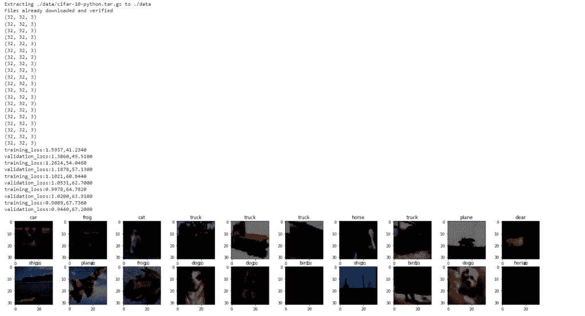

# PyTorch 超参数调谐

> 原文：<https://pythonguides.com/pytorch-hyperparameter-tuning/>

[](https://sharepointsky.teachable.com/p/python-and-machine-learning-training-course)

在这个 [Python 教程](https://pythonguides.com/learn-python/)中，我们将学习 Python 中的 **PyTorch 超参数调优**来构建平均模型和高精度模型之间的差异。此外，我们还将介绍与 PyTorch 超参数调整相关的不同示例。我们也将讨论这些话题。

*   PyTorch 超参数调谐
*   PyTorch 闪电超参数调谐
*   PyTorch 几何超参数调谐

目录

[](#)

*   [PyTorch 超参数调谐](#PyTorch_hyperparameter_tuning "PyTorch hyperparameter tuning")
*   [PyTorch 闪电超参数调谐](#PyTorch_lightning_hyperparameter_tuning "PyTorch lightning hyperparameter tuning")
*   [PyTorch 几何超参数调谐](#PyTorch_geometric_hyperparameter_tuning "PyTorch geometric hyperparameter tuning")

## PyTorch 超参数调谐

在本节中，我们将学习 python 中的 **PyTorch 超参数调优**。

PyTorch 超参数调整被定义为在平均模型或高度精确模型之间产生差异的过程。

**代码:**

在下面的代码中，我们将导入所有必需的库，如 ***导入 torch** 、**导入 matplotlib.pyplot** 、**导入 numpy 作为 np** 、**导入 torch.nn.functional 作为 func** 、**从 torch 导入 nn**、**导入数据集**、**从 torchvision 导入转换**、* ***导入请求、从 PIL 导入图像***

*   **变换=变换。撰写([转换。调整大小((32，32))，变换。ToTensor()，转换。Normalize((0.7，0.7，0.7)，(0.7，0.7)，0.7))]):**transforms . compose()函数允许我们将多个转换链接在一起，作为 composed 的第一个参数传递。
*   **训练数据集=数据集。CIFAR10(root= '。/data '，train=True，download=True，transform=transform)** 用于加载 CIFAR 数据集。
*   **train loader = torch . utils . data . data loader(dataset = train dataset，batch_size=100，shuffle=True)** 用于声明训练加载器。
*   **classes=('飞机'，'汽车'，'鸟'，'猫'，'亲爱的'，'狗'，'青蛙'，'马'，'船'，'卡车'):**我们在这里声明类的列表。
*   `data ITER = ITER(train loader)`用于获取一些随机的训练图像。
*   **figure = plot . figure(figsize =(25，4))** 用于绘制图形。
*   **班莱尼特(nn。Module):** 用于借助 init 和 forward()方法创建模型类。
*   **model=LeNet()。【to(device)】T1 用于创建模型的实例。**
*   **criteron=nn。**用来定义一个损失函数。
*   **optimizer = torch . optim . Adam(model . parameters()、lr=0.001)** 用于初始化优化器。
*   **loss1=criteron(outputs，labels)** 用于计算总分类交叉熵损失。
*   **_，preds=torch.max(outputs，1)** 用于查找我们的网络的精度。
*   `loss+=loss1.item()` 用于跟踪每个时期的损失。
*   **打印(' validation_loss:{:.4f}，{:.4f} '。format(valepoch_loss，valepoch _ ACC . item())**用于打印验证损失和验证准确度。

```py
# Importing Libraries
import torch  
import matplotlib.pyplot as plot  
import numpy as np  
import torch.nn.functional as func  
from torch import nn  
from torchvision import datasets,transforms   
import requests  
from PIL import Image 

# Using the device
device=torch.device("cuda:0" if torch.cuda.is_available() else "cpu")  
# Using Compose() method of transform
transform = transforms.Compose(
    [transforms.Resize((32,32)),transforms.ToTensor(),
     transforms.Normalize((0.7, 0.7, 0.7), (0.7, 0.7, 0.7))])
# Load the CIFAR10 train and validate dataset
traindataset=datasets.CIFAR10(root='./data',train=True,download=True,transform=transform)  
valdataset=datasets.CIFAR10(root='./data',train=False,download=True,transform=transform)  

# Declaring the train loaders and validate loaders
trainloader=torch.utils.data.DataLoader(dataset=traindataset,batch_size=100,shuffle=True)  
valloader=torch.utils.data.DataLoader(dataset=valdataset,batch_size=100,shuffle=False)

# Declare the list of classes
classes=('plane','car','bird','cat','dear','dog','frog','horse','ship','truck')  

# Functions to show an images
def im_convert(tensor):  
    image=tensor.cpu().clone().detach().numpy()  
    image=image.transpose(1,2,0)  
    print(image.shape)  
    image=image*(np.array((0.5,0.5,0.5))+np.array((0.5,0.5,0.5)))  
    image=image.clip(0,1)  
    return image 
    # Get some random training images
dataiter=iter(trainloader)  
images,labels=dataiter.next()  
# Plot the figures
figure=plot.figure(figsize=(25,4)) 
for idx in np.arange(20):  
    axis=figure.add_subplot(2,10,idx+1)  
    plot.imshow(im_convert(images[idx]))  
    axis.set_title(classes[labels[idx].item()])   

# Create a model class
class LeNet(nn.Module):  
        def __init__(self):  
            super().__init__()  
            self.conv1=nn.Conv2d(3,16,3,1, padding=1)  
            self.conv2=nn.Conv2d(16,32,3,1, padding=1)  
            self.conv3=nn.Conv2d(32,64,3,1, padding=1)     
            self.fully1=nn.Linear(4*4*64,500)  
            self.dropout1=nn.Dropout(0.5)   
            self.fully2=nn.Linear(500,10)  
        def forward(self,y):  
            y=func.relu(self.conv1(y))  
            y=func.max_pool2d(y,2,2)  
            y=func.relu(self.conv2(y))  
            y=func.max_pool2d(y,2,2)  
            y=func.relu(self.conv3(y))  
            y=func.max_pool2d(y,2,2) 
            #Reshaping the output into desired shape   
            y=y.view(-1,4*4*64) 
            #Applying relu activation function to our first fully connected layer 
            y=func.relu(self.fully1(y))  
            y=self.dropout1(y)  
            #We will not apply activation function here because we are dealing with multiclass dataset  
            y=self.fully2(y)    
            return y      

# Creating an instance of the model
model=LeNet().to(device) 

# Define Loss Function
criteron=nn.CrossEntropyLoss()  

# Use the optimizer
optimizer=torch.optim.Adam(model.parameters(),lr=0.001)

# Specify the number of epochs
epochs=5  
losshistory=[]  
correcthistory=[]  
valloss_history=[]  
valcorrect_history=[]  

# Validate the model
for e in range(epochs):  
    loss=0.0  
    correct=0.0  
    valloss=0.0  
    valcorrect=0.0  
    # Define a for loop statement for labels and inputs
    for input,labels in trainloader:  
        # Itetrate through our batch of the images 
        input=input.to(device)  
        labels=labels.to(device)  
        outputs=model(input)  
        # Calculate the total categorical cross entropy loss
        loss1=criteron(outputs,labels)  
        optimizer.zero_grad()  
        loss1.backward()  
        optimizer.step()  
        # Find the accuracy of our network
        _,preds=torch.max(outputs,1) 
        # Keep the track of the losses at every epochs 
        loss+=loss1.item()  
        correct+=torch.sum(preds==labels.data)  
    else:  
        with torch.no_grad():  
            # Define a for loop statement for labels and inputs
            for val_input,val_labels in valloader:  
                # Itetrate through our batch of the images
                val_input=val_input.to(device)  
                val_labels=val_labels.to(device)  
                val_outputs=model(val_input)  
                 # Calculate the total categorical cross entropy loss
                val_loss1=criteron(val_outputs,val_labels)   
                _,val_preds=torch.max(val_outputs,1)  
                # Calculate the validation loss and accuracy
                valloss+=val_loss1.item()  
                valcorrect+=torch.sum(val_preds==val_labels.data)  
        epoch_loss=loss/len(trainloader)  
        epoch_acc=correct.float()/len(trainloader)  
        losshistory.append(epoch_loss)  
        correcthistory.append(epoch_acc)  
        # Calculate the validation epoch loss
        valepoch_loss=valloss/len(valloader)  
        valepoch_acc=valcorrect.float()/len(valloader)  
        valloss_history.append(valepoch_loss)  
        valcorrect_history.append(valepoch_acc)  
        # print validation loss and validation accuracy
        print('training_loss:{:.4f},{:.4f}'.format(epoch_loss,epoch_acc.item()))  
        print('validation_loss:{:.4f},{:.4f}'.format(valepoch_loss,valepoch_acc.item())) 
```

**输出:**

运行上述代码后，我们得到以下输出，其中我们可以看到训练损失和验证损失以及 CIFAR 数据集图像打印在屏幕上。



PyTorch hyperparameter tuning

这样，我们了解了 PyTorch 超参数调谐。

阅读: [PyTorch 线性回归](https://pythonguides.com/pytorch-linear-regression/)

## PyTorch 闪电超参数调谐

在本节中，我们将学习 python 中的 **PyTorch lightning 超参数调优**。

PyTorch lightning 是一个轻量级的高性能框架。它让人工智能快速迭代。

PyTorch 超参数调整可以建立平均模型或高度精确模型之间的差异。

**代码:**

在下面的代码中，我们将导入所有必要的库，如 import torch，import functional as F，import MNISTDataModule from pl _ bolts . data modules，import os。

*   **类 LightningClassifier(pl。LightningModule):** 这里我们借助 init()和 forward()方法定义一个模型类。
*   **def config optimizer(self):**用于定义配置优化器。
*   **def trainstep(self，trainingbatch，batch_index):** 用于定义训练步骤。
*   **def validstep(self，validationbatch，batch_index):** 用于定义验证步骤。
*   **MNISTDataModule(数据目录=数据目录)。**用于下载数据的 prepare_data()。
*   `print(analysis . best _ config)`用于通过 print()函数打印分析最佳配置。

```py
# Importing Libraries
import torch
from torch.nn import functional as F
import pytorch_lightning as pl
from pl_bolts.datamodules import MNISTDataModule
import os
from ray.tune.integration.pytorch_lightning import TuneReportCallback

# Define a model class
class LightningClassifier(pl.LightningModule):
    def __init__(self, config, data_dir=None):
        super(LightningClassifier, self).__init__()
        self.data_dir = data_dir or os.getcwd()
        self.lr = config["lr"]
        layer, layer_1 = config["layer"], config["layer_1"]
        # mnist images are (1, 28, 28) (channels, width, height)
        self.layer = torch.nn.Linear(28 * 28, layer)
        self.layer_1 = torch.nn.Linear(layer, layer_1)
        self.layer_2 = torch.nn.Linear(layer_1, 12)
        self.accuracy = pl.metrics.Accuracy()

    def forward(self, m):
        batchsize, channels, width, height = m.size()
        m = m.view(batchsize, -1)
        m = self.layer(m)
        m = torch.relu(m)
        m = self.layer_1(m)
        m = torch.relu(m)
        m = self.layer_2(m)
        m = torch.log_softmax(m, dim=1)
        return m

    def configoptimizers(self):
        return torch.optim.Adam(self.parameters(), lr=self.lr)

    def trainstep(self, trainingbatch, batch_index):
        m, n = trainingbatch
        logits = self.forward(m)
        loss = F.nll_loss(logits, n)
        acc = self.accuracy(logits, n)
        self.log("ptl/train_loss", loss)
        self.log("ptl/train_accuracy", acc)
        return loss

    def validstep(self, validationbatch, batch_index):
        m, n = validationbatch
        logits = self.forward(m)
        loss = F.nll_loss(logits, n)
        acc = self.accuracy(logits, n)
        return {"val_loss": loss, "val_accuracy": acc}

    def validationepoch_end(self, outputs):
        avg_loss = torch.stack(
            [m["val_loss"] for m in outputs]).mean()
        avg_acc = torch.stack(
            [m["val_accuracy"] for m in outputs]).mean()
        self.log("ptl/val_loss", avg_loss)
        self.log("ptl/val_accuracy", avg_acc)
def training_mnist(config, data_dir=None, num_epochs=10, num_gpus=0):
    model = LightningClassifier(config, data_dir)
    dl = MNISTDataModule(
        data_dir=data_dir, num_workers=1, batch_size=config["batch_size"])
    metrices = {"loss": "ptl/val_loss", "acc": "ptl/val_accuracy"}
    trainer = pl.Trainer(
        max_epochs=num_epochs,
        gpus=num_gpus,
        progress_bar_refresh_rate=0,
        callbacks=[TuneReportCallback(metrices, on="validation_end")])
    trainer.fit(model, dl)

import tempfile
from ray import tune

numsamples = 12
numepochs = 12
# set this to higher if using GPU
gpusper_trial = 0 

data_dir = os.path.join(tempfile.gettempdir(), "mnist_data_")
# Download data
MNISTDataModule(data_dir=data_dir).prepare_data()

config = {
    "layer": tune.choice([34, 66, 130]),
    "layer_1": tune.choice([66, 130, 260]),
    "lr": tune.loguniform(1e-4, 1e-1),
    "batch_size": tune.choice([34, 66, 130]),
}

trainable = tune.with_parameters(
    training_mnist,
    data_dir=data_dir,
    num_epochs=numepochs,
    num_gpus=gpusper_trial)

analysis = tune.run(
    trainable,
    resources_per_trial={
        "cpu": 1,
        "gpu": gpusper_trial
    },
    metric="loss",
    mode="min",
    config=config,
    num_samples=numsamples,
    name="tune_mnist")

print(analysis.best_config)
```

**输出:**

运行上述代码后，我们得到以下输出，其中我们可以看到 Pytorch lightning 超参数调整批次大小、层、层 1 和学习率值打印在屏幕上。


PyTorch hyperparameter tuning lightning

PyTorch lightning 超参数调整就是这样让人工智能快速迭代的。

阅读: [PyTorch 激活功能](https://pythonguides.com/pytorch-activation-function/)

## PyTorch 几何超参数调谐

在本节中，我们将学习 python 中的 **PyTorch 几何超参数调整**。

PyTorch 几何超参数调整被定义为作为参数传递给估计器类的构造函数的参数。

**代码:**

在下面的代码中，我们将导入所有必要的库，如 import torch、import torchvision、import transforms from torch vision。

*   **变换=变换。撰写([转换。ToTensor()]):** 这里我们使用了 conpose()的转换方法，这将允许我们将多个转换链接在一起，并作为 composed，will transform.ToTensor 的第一个参数传递。
*   **trainset = torch vision . datasets . fashion mnist(root = '。/data '，train=True，download=True，transform=transform)** 用于加载数据集。
*   **NN 类(NN。Module):** 用于使用 init()和 forward()方法定义模型类。
*   **training_size，validation_size = 48000，12000** 用于描述训练规模和验证规模。
*   **self.conv = nn。Conv2d(1，32，kernel_size=3，stride=1，padding=1)** 用作输入 1 通道，有 32 个滤波器，每个滤波器的内核大小为 3。
*   **self.fc = nn。线性(128*3*3，32)** 作为全连通层。
*   **打印(' training_size:'，training_size)** 用于打印训练尺寸。
*   **print('validation_size:'，validation_size)** 用于打印验证尺寸。
*   **training _ loader = data loader(training，batch_size=100，shuffle=False)** 用于训练数据加载器。
*   **判据= nn。CrossEntropyLoss()** 用于定义损失。
*   **优化器= optim。Adam(net.parameters()，lr=0.001)** 用于初始化优化器。
*   **plot.figure(figsize=(16，6))** 用于绘制图形。
*   `plot.show()` 用于在屏幕上显示图。
*   **打印(f '测试精度:{正确/总计:. 3f} \n' )** 用于打印测试精度。
*   **classes = ('T-Shirt '，'连衣裙'，'套头衫'，'裤子'，'外套'，'包'，'衬衫'，'运动鞋'，'凉鞋'，'踝靴'):**我们在这里声明类的列表。
*   **print('精度%5s : %2d %%' % ( classes[n]，100 * class _ correct[n]/class _ total[n])**用于使用 print()函数打印精度。

```py
# Importing libraries
import torch
import torchvision
from torchvision import transforms

torch.manual_seed(0)

# Using compose() method
transform = transforms.Compose([transforms.ToTensor()])

# Load dataset
trainset = torchvision.datasets.FashionMNIST(root='./data', train=True, download=True, transform=transform)
testset = torchvision.datasets.FashionMNIST(root='./data', train=False, download=True, transform=transform)

from statistics import mean
import numpy as np
import matplotlib.pyplot as plot
import pandas as pd
import torch
import torchvision
from torchvision import transforms

import torch.nn as nn
import torch.nn.functional as fun
from torch.utils.data import DataLoader, TensorDataset

# Define the model class
class NN(nn.Module):
    def __init__(self):
        super(NN, self).__init__()

        # Input 1 channel with 32 filters each with kernel_size=3 
        self.conv = nn.Conv2d(1, 32, kernel_size=3, stride=1, padding=1)
        self.conv1 = nn.Conv2d(32, 64, kernel_size=3, stride=1, padding=1)
        self.conv2 = nn.Conv2d(64, 128, kernel_size=3, stride=1, padding=1)

        self.batch_norm = nn.BatchNorm2d(32)
        self.batch_norm1 = nn.BatchNorm2d(64)
        self.batch_norm2 = nn.BatchNorm2d(128)

        self.pool = nn.MaxPool2d(kernel_size=2, stride=2)

        self.dropout25 = nn.Dropout2d(p=0.25)

        # Fully connected layer
        self.fc = nn.Linear(128*3*3,32)
        self.fc1 = nn.Linear(32, 10)

    def forward(self, y):
        y = self.pool(fun.relu(self.batch_norm(self.conv(y))))
        y = self.dropout25(y)
        y = self.pool(fun.relu(self.batch_norm1(self.conv1(y))))
        y = self.dropout25(y)
        y = self.pool(fun.relu(self.batch_norm2(self.conv2(y))))
        y = self.dropout25(y)

        y = y.view(y.size(0),-1)
        y = self.fc(y)
        y = self.fc1(y)

        return y

# Describe the variables
training_size, validation_size = 48000, 12000

scale_tensor = trainset.data / 255.0
scale_tensor = scale_tensor.view(scale_tensor.size(0), 1, 28, 28)
scale_trainset = TensorDataset(scale_tensor, trainset.targets)

training, validation = torch.utils.data.random_split(scale_trainset, [training_size, validation_size])

print('training_size: ', training_size)
print('validation_size: ', validation_size)

training_loader = DataLoader(training, batch_size=100, shuffle=False)
validation_loader = DataLoader(validation, batch_size=100, shuffle=False)

net = NN()

device = 'cuda'

net.to(device)

import torch.optim as optim

# Define Loss function
criterion = nn.CrossEntropyLoss()
optimizer = optim.Adam(net.parameters(), lr=0.001)

epochs = 30
batches = 0
training_losses = list()
validation_losses = list()
validation_acces = list()
batch_lst = list()

batches = 0
validation_loss = 0

# Train NN
 # loop over the dataset multiple times
for epoch in range(1,epochs+1): 

    running_loss = 0.0
    for n, data in enumerate(training_loader):
        # get the inputs; data is a list of [inputs, labels]
        inputs, labels = data

        if torch.cuda.is_available():
          inputs = inputs.cuda()
          labels = labels.cuda()

        optimizer.zero_grad()

        # forward + backward + optimize
        outputs = net(inputs)
        loss = criterion(outputs, labels)
        loss.backward() 
        optimizer.step()

        # print statistics
        running_loss += loss.item()
        # print every 2000 mini-batches
        if n % 100 == 99:    

            net.eval()

            correct = 0

            for m, val_data in enumerate(validation_loader):
                valid_X, valid_y = val_data

                valid_X = valid_X.cuda()
                valid_y = valid_y.cuda()

                outputs = net(valid_X)

                v_loss = criterion(outputs, valid_y)
                validation_loss += v_loss.item()

                preds = outputs.data.max(1, keepdim=True)[1]

                correct += preds.eq(valid_y.view_as(preds)).cpu().sum().item()

            log = f"epoch: {epoch} {n+1} " \
                  f"train_loss: {running_loss / 100:.3f} " \
                  f"val_loss: {validation_loss / 100:.3f} " \
                  f"Val Acc: {correct/len(validation_loader.dataset):.3f}"

            training_losses.append(running_loss / 100)
            validation_losses.append(validation_loss / 100)
            validation_acces.append(correct/len(validation_loader.dataset))
            batches += 100
            batch_lst.append(batches)

            valid_loss = 0

            print(log)     

            running_loss = 0.0

            net.train()

print('Finished Training')

# Plot the figure
plot.figure(figsize=(16,6))
plot.plot(batch_lst, training_losses, '-o', label='Training loss')
plot.plot(batch_lst, valid_losses, '-o', label='Validation loss')
plot.legend()
plot.title('Learning curves')
plot.xlabel('Batches')
plot.ylabel('Loss')
plot.xticks(batch_lst,rotation = 90)
plot.tight_layout()

plot.savefig("result.png")

plot.show()

scale_tensr = testset.data / 255.0
scale_tensr = scale_tensr.view(scale_tensr.size(0), 1, 28, 28)
scale_testset = TensorDataset(scale_tensr, testset.targets)

testing_loader = DataLoader(scale_testset, batch_size=100, shuffle=False)

correct = 0
total = 0

net.eval()

for data in testing_loader:
    testing_X, testing_y = data

    testing_X = testing_X.cuda()
    testing_y = testing_y.cuda()

    outputs = net(testing_X.float())
    _, predicted = torch.max(outputs.data, 1)
    total += testing_y.size(0)
    correct += (predicted == testing_y).sum().item()

print(f'Test Accuracy: {correct/total:.3f} \n' )

classes = ('T-Shirt', 'Dress', 'Pullover', 'Trouser',
           'Coat', 'Bag', 'Shirt', 'Sneaker', 'Sandal', 'Ankle Boot')

class_correct = list(0\. for n in range(10))
class_total = list(0\. for n in range(10))
with torch.no_grad():
    for data in testing_loader:
        testing_X, testing_y = data

        testing_X = testing_X.cuda()
        testing_y = testing_y.cuda()

        _, predicted = torch.max(outputs, 1)
        d = (predicted == testing_y).squeeze()
        for n in range(100):
            label = testing_y[n]
            class_correct[label] += d[n].item()
            class_total[label] += 1

for n in range(10):
    print('Accuracy of %5s : %2d %%' % (
        classes[n], 100 * class_correct[n] / class_total[n]))
```

**输出:**

运行上述代码后，我们得到以下输出，其中我们可以看到 PyTorch 几何超参数调节精度值打印在屏幕上。


PyTorch hyperparameter tuning geometry

这样，我们了解了 PyTorch 几何超参数调谐的工作原理。

您可能也喜欢阅读下面的 Python PyTorch 教程。

*   [PyTorch 车型总结](https://pythonguides.com/pytorch-model-summary/)
*   [PyTorch 逻辑回归](https://pythonguides.com/pytorch-logistic-regression/)
*   [PyTorch 预训练模型](https://pythonguides.com/pytorch-pretrained-model/)
*   [PyTorch 添加尺寸](https://pythonguides.com/pytorch-add-dimension/)
*   [PyTorch nn Conv2d](https://pythonguides.com/pytorch-nn-conv2d/)
*   [指针为 Numpy](https://pythonguides.com/pytorch-tensor-to-numpy/)

因此，在本教程中，我们讨论了 **PyTorch 超参数调优**,我们还涵盖了与其实现相关的不同示例。这是我们已经讨论过的例子列表。

*   PyTorch 超参数调谐
*   PyTorch 闪电超参数调谐
*   PyTorch 几何超参数调谐

[Bijay Kumar](https://pythonguides.com/author/fewlines4biju/)

Python 是美国最流行的语言之一。我从事 Python 工作已经有很长时间了，我在与 Tkinter、Pandas、NumPy、Turtle、Django、Matplotlib、Tensorflow、Scipy、Scikit-Learn 等各种库合作方面拥有专业知识。我有与美国、加拿大、英国、澳大利亚、新西兰等国家的各种客户合作的经验。查看我的个人资料。

[enjoysharepoint.com/](https://enjoysharepoint.com/)[](https://www.facebook.com/fewlines4biju "Facebook")[](https://www.linkedin.com/in/fewlines4biju/ "Linkedin")[](https://twitter.com/fewlines4biju "Twitter")