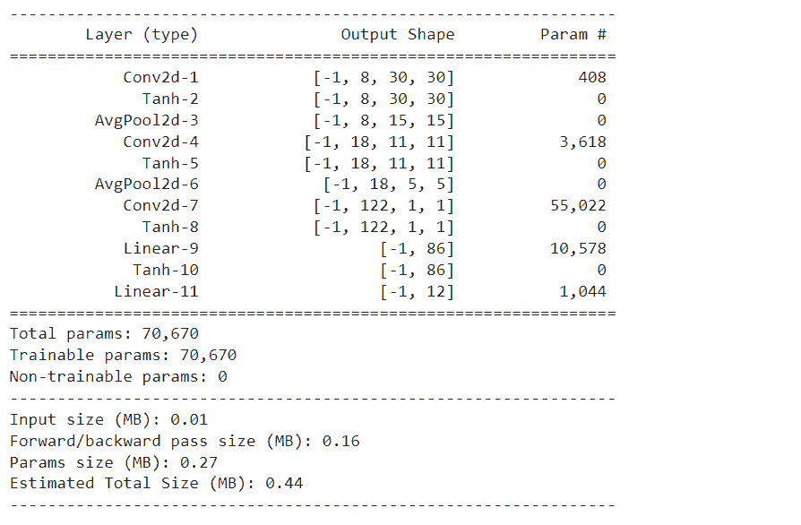
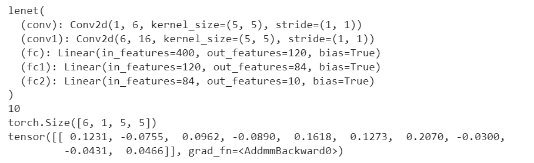
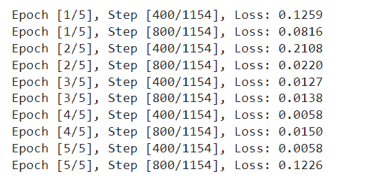
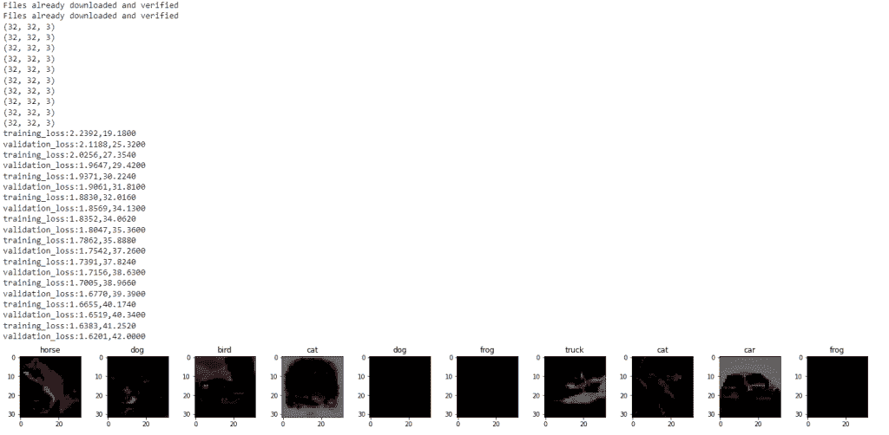
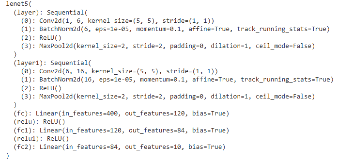

# PyTorch Lenet 简介

> 原文：<https://pythonguides.com/pytorch-lenet/>

[](https://sharepointsky.teachable.com/p/python-and-machine-learning-training-course)

PyTorch Lenet 是一个简单的卷积神经网络，我们可以在 32 x 32 像素的灰度级上训练该模型，它具有 Leranable 参数。详细来说，我们将讨论在 Python 中使用 PyTorch 的 Lenet。

此外，我们还将介绍与 PyTorch Lenet 相关的不同示例。我们将讨论这些话题。

*   PyTorch Lenet
*   PyTorch Lenet 实施
*   皮托奇·兰内·姆尼斯特
*   PyTorch Lenet cifar10
*   皮托奇·勒内特五世

目录

[](#)

*   [PyTorch Lenet](#PyTorch_Lenet "PyTorch Lenet")
*   [PyTorch Lenet 实施](#PyTorch_Lenet_implementation "PyTorch Lenet implementation")
*   [pytorch lenet mnitst](#PyTorch_Lenet_MNIST "PyTorch Lenet MNIST")
*   [PyTorch Lenet cifar10](#PyTorch_Lenet_cifar10 "PyTorch Lenet cifar10")
*   [PyTorch Lenet5 MNIST](#PyTorch_Lenet5_MNIST "PyTorch Lenet5 MNIST")

## PyTorch Lenet

在这一节中，我们将学习 python 中的 `PyTorch Lenet` 。

Lenet 被定义为一个简单的卷积神经网络。卷积神经网络是一种前馈神经网络。

Lenet 模型可以在大小为 32 x 32 像素的灰度图像上进行训练。它有可学习的参数。

**代码:**

在下面的代码中，我们将导入所有必要的库，如 import torch，import torch.nn as nn，import torch . nn . functional as func，import summary from torchsummary。

*   **类 leNetModel(nn。Module):** 这里我们通过使用 init()和 forward()方法来使用模型类。
*   **y = torch.randn(2，2，34，34):** 这里我们用 torch.randn()函数来描述变量。
*   **mdl = leNetModel():** 这里我们正在初始化模型。
*   **summary(mdl，(2，34，34))** 用于得到模型的摘要。

```py
import torch
import torch.nn as nn
import torch.nn.functional as func
from torchsummary import summary

class leNetModel(nn.Module):
    def __init__(self):
        super(leNetModel,self).__init__()
        #Here we are starting the implementation of Layer 1  which has six kernels of size 5x5 with padding 0 and stride 1

        self.conv = nn.Conv2d(in_channels=2,out_channels=8,kernel_size=(5,5),padding=0,stride=1)

        #Here we are starting the implementation  of Layer 3 which has eighteen kernels of size 5x5 with padding 0 and stride 1

        self.conv1 = nn.Conv2d(in_channels = 8, out_channels = 18,kernel_size = (5,5),padding=0,stride=1)

        # Here we are starting the implementation of  Layer 5  which is basically flattening the data 

        self.conv2 = nn.Conv2d(in_channels = 18, out_channels = 122,kernel_size = (5,5),padding=0,stride=1)

        #Here we are starting the implementation of Layer 6  which has eighty six Linear Neurons

        self.L1 = nn.Linear(122,86)

        #Here we are starting the implementation of Layer 7 which has ten Linear Neurons and input of 84

        self.L2 = nn.Linear(86,12)

        # Here we are using  pooling of size 2 and stride 2 in this architecture 

        self.pool = nn.AvgPool2d(kernel_size = 2, stride = 2)

        #Here we are using tanh as an activation function  so we will use tanh at all layers excluding F7.
        self.act = nn.Tanh()

    #Here we are implementing forward function to produce entire flow of the architecture.

    def forward(self,y):
        y = self.conv(y)
        # Here we are using tanh as an activation function in this architecture so we will use tanh at all layers excluding F7.
        y = self.act(y)
        # Here this will be passed from pooling 
        y = self.pool(y)
        # The next stage is convolution
        y = self.conv1(y)
        y = self.act(y)
        y = self.pool(y)
        # The next we will pass conv3, here we will not pass data from pooling as per Architecture 
        y = self.conv2(y)
        y = self.act(y)

        # Now the data should be flaten and it would be passed from FullyConnected layers. 
        y = y.view(y.size()[0], -1)
        y = self.L1(y)
        y = self.act(y)
        y = self.L2(y)

        return y

y = torch.randn(2,2,34,34)

mdl = leNetModel()

summary(mdl,(2,34,34))
```

输出:

运行上面的代码后，我们得到下面的输出，其中我们可以看到 PyTorch Lenet 模型被打印在屏幕上。



PyTorch Lenet

因此，有了这个，我们理解了 PyTorch Lenet 模型。

阅读: [PyTorch 整形张量](https://pythonguides.com/pytorch-reshape-tensor/)

## PyTorch Lenet 实施

在这一节中，我们将通过一个例子来学习如何实现 PyTorch Lenet。

PyTorch Lenet 是一种卷积神经网络结构。这是贝尔实验室的 Yann LeCun 在 1989 年提出的。它较早地将反向传播算法应用到实际应用中。

**代码:**

在下面的代码中，我们首先导入所有必要的库，如 import torch，import torch.nn as nn，import torch . nn . func as func。

*   **班莱尼特(nn。Module):** 下面是使用 init()和 forward()方法的 lenet 模型类。
*   `params = list(net . parameters())`用于打印参数的长度。
*   `print(out)` 用于借助 print()函数打印输出。

```py
import torch
import torch.nn as nn
import torch.nn.functional as func

class lenet(nn.Module):

    def __init__(self):
        super(lenet, self).__init__()
        # Here is one input image channel, six output channels, 5x5 square convolution
        self.conv = nn.Conv2d(1, 6, 5)
        self.conv1 = nn.Conv2d(6, 16, 5)
        # operation y = Wx + b
        self.fc = nn.Linear(16 * 5 * 5, 120)  # 5*5 from image dimension
        self.fc1 = nn.Linear(120, 84)
        self.fc2 = nn.Linear(84, 10)

    def forward(self, y):
        # Here we are doing max pooling over a (2, 2) window
        y = func.max_pool2d(func.relu(self.conv(y)), (2, 2))
        # Here if the size is a square, you can specify with a single number
        y = func.max_pool2d(func.relu(self.conv1(y)), 2)
        y = torch.flatten(y, 1) 
        y = func.relu(self.fc(y))
        y = func.relu(self.fc1(y))
        y = self.fc2(y)
        return y

net = lenet()
print(net)

# Print the lenght of the parameters
params = list(net.parameters())
print(len(params))
print(params[0].size()) 

#Print the output
input = torch.randn(1, 1, 32, 32)
out = net(input)
print(out)
```

**输出:**

运行上面的代码后，我们得到下面的输出，您可以看到 PyTorch Lenet 的实现已经在屏幕上完成。



PyTorch Lenet Implementation

这样，我们理解了 PyTorch Lenet 的实现。

阅读: [Jax Vs PyTorch](https://pythonguides.com/jax-vs-pytorch/)

## pytorch lenet mnitst

在这一节中，我们将学习 python 中的 `PyTorch Lenet MNIST` 。

这里，我们使用卷积神经网络定义 lenet 模型，并使用 MNIST 数据集的分类。MNIST 数据集包含灰度图像的数量。

代码:

在下面的代码中，我们将首先导入所有必要的库，如 import torch、import torch.nn as nn、import torchvision 和 import torch . transforms as transforms。

*   **device = torch . device(' cuda ' if torch . cuda . is _ available()else ' CPU ')**作为可用设备使用。
*   **training dtset = torch vision . datasets . Mn ist(root = '。/data '，train = True，transform = transforms。撰写([转换。调整大小((32，32))，变换。ToTensor()，转换。Normalize(mean = (0.1307，)，std = (0.3081，)])，download = True)** 用于加载数据集。
*   **train ldr = torch . utils . data . DataLoader(dataset = training dtset，batch_size = batchsiz，shuffle = True)** 用于定义为 data loader。
*   lass lenet(nn。这里我们通过使用 init()和 forward()方法来定义一个 lenet 模型类。
*   **l = nn。CrossEntropyLoss()** 被定义为损失函数。
*   **optimizer = torch . optim . Adam(MDL . parameters()、lr=lr)** 用于初始化优化器。
*   `ttlstep = len(trainldr)` 用于打印总步数。
*   **打印(' Epoch [{}/{}]，Step [{}/{}]，Loss: {:.4f} '。format(epoch+1，nepochs，x+1，ttlstep，loss . item())**用于打印 epoch 和 loss。

```py
# Importing Libraries
import torch
import torch.nn as nn
import torchvision
import torchvision.transforms as transforms

# Define variable
batchsiz = 52
nclasses = 10
lr = 0.001
nepochs = 5

# Describing the device
device = torch.device('cuda' if torch.cuda.is_available() else 'cpu')

# Loading the dataset
trainingdtset = torchvision.datasets.MNIST(root = './data',
                                           train = True,
                                           transform = transforms.Compose([
                                                  transforms.Resize((32,32)),
                                                  transforms.ToTensor(),
                                                  transforms.Normalize(mean = (0.1307,), std = (0.3081,))]),
                                           download = True)

testingdtset = torchvision.datasets.MNIST(root = './data',
                                          train = False,
                                          transform = transforms.Compose([
                                                  transforms.Resize((32,32)),
                                                  transforms.ToTensor(),
                                                  transforms.Normalize(mean = (0.1325,), std = (0.3105,))]),
                                          download=True)

# Define the data loader
trainldr = torch.utils.data.DataLoader(dataset = trainingdtset,
                                           batch_size = batchsiz,
                                           shuffle = True)

testldr = torch.utils.data.DataLoader(dataset = testingdtset,
                                           batch_size = batchsiz,
                                           shuffle = True)

# Defining the Lenet model
class lenet(nn.Module):
    def __init__(self, num_classes):
        super(lenet, self).__init__()
        self.layer = nn.Sequential(
            nn.Conv2d(1, 6, kernel_size=5, stride=1, padding=0),
            nn.BatchNorm2d(6),
            nn.ReLU(),
            nn.MaxPool2d(kernel_size = 2, stride = 2))
        self.layer1 = nn.Sequential(
            nn.Conv2d(6, 16, kernel_size=5, stride=1, padding=0),
            nn.BatchNorm2d(16),
            nn.ReLU(),
            nn.MaxPool2d(kernel_size = 2, stride = 2))
        self.fc = nn.Linear(400, 120)
        self.relu = nn.ReLU()
        self.fc1 = nn.Linear(120, 84)
        self.relu1 = nn.ReLU()
        self.fc2 = nn.Linear(84, num_classes)

    def forward(self, y):
        outp = self.layer(y)
        outp = self.layer1(outp)
        outp = outp.reshape(outp.size(0), -1)
        outp = self.fc(outp)
        outp = self.relu(outp)
        outp = self.fc1(outp)
        outp = self.relu1(outp)
        outp = self.fc2(outp)
        return outp

mdl = lenet(nclasses).to(device)

# Defining the loss function
l = nn.CrossEntropyLoss()

# Initializing the optimizer
optimizer = torch.optim.Adam(mdl.parameters(), lr=lr)

# Print the total step
ttlstep = len(trainldr)

ttlstep = len(trainldr)
for epoch in range(nepochs):
    for x, (imgs, lbls) in enumerate(trainldr):  
        imgs = imgs.to(device)
        lbls = lbls.to(device)

        #Forward pass
        output = mdl(imgs)
        loss = l(output, lbls)

        # Backward and optimize
        optimizer.zero_grad()
        loss.backward()
        optimizer.step()

        if (x+1) % 400 == 0:
            print ('Epoch [{}/{}], Step [{}/{}], Loss: {:.4f}' 
        		           .format(epoch+1, nepochs, x+1, ttlstep, loss.item()))
```

**输出:**

在下面的输出中，您可以看到 PyTorch Lenet MNSIT 的历元和损耗值打印在屏幕上。



PyTorch lenet MNIST

因此，有了这个，我们理解了皮托尔·莱内特·MNIST。

阅读: [PyTorch Numpy to Tensor](https://pythonguides.com/pytorch-numpy-to-tensor/)

## PyTorch Lenet cifar10

在本节中，我们将学习 python 中的 `PyTorch Lenet cifar10` 。

在继续之前，我们应该对 cifar10 有一些了解。

CIFAR 代表加拿大高级研究所。它是定期用于训练机器学习和计算机视觉算法的图像集合。

这里，我们用 cifar10 数据集描述 lenet 模型。

**代码:**

在下面的代码中，首先我们将导入所有必要的库，如 import torch、import matplotlib.pyplot as plt、import numpy as np、import torch.nn.functional 等。

*   **转换 1 =转换。撰写([转换。调整大小((32，32))，变换。ToTensor()，转换。Normalize((0.7，)，(0.7，)])** 用作变换的合成方法。
*   traindst =数据集。CIFAR10(root= '。/data '，train=True，download=True，transform=transform1) 用于加载 cifar10 数据集。
*   **classes=('飞机'，'汽车'，'猫'，'狗'，'青蛙'，'亲爱的'，'马'，'船'，'卡车'，'鸟'):**我们在这里声明类的列表。
*   **班莱尼特(nn。Module):** 这里我们使用 init(0 和 forward()方法定义 lenet 模型类。
*   **criteron=nn。CrossEntropyLoss():** 这里我们定义损失函数。
*   **optimizer = torch . optim . Adam(MDL . parameters()，lr=0.00001)** 用于初始化优化器。
*   **print('training_loss:{:.4f}，{:.4f} '。format(epoch_loss，epoch _ ACC . item())**用于打印训练损耗。
*   **打印(' validation_loss:{:.4f}，{:.4f} '。format(valepochloss，valepochacc . item())**用于打印验证损失。

```py
# Importing libraries
import torch  
import matplotlib.pyplot as plt  
import numpy as np  
import torch.nn.functional as func  
import PIL.ImageOps  
from torch import nn  
from torchvision import datasets,transforms   
import requests  
from PIL import Image  

# Using the device
d=torch.device("cuda:0" if torch.cuda.is_available() else "cpu")  
# Using the compose method of transforms
transform1=transforms.Compose([transforms.Resize((32,32)),transforms.ToTensor(),transforms.Normalize((0.7,),(0.7,))])  

# Loading the dataset
traindst=datasets.CIFAR10(root='./data',train=True,download=True,transform=transform1)  
validdst=datasets.CIFAR10(root='./data',train=False,download=True,transform=transform1)  
trainldr=torch.utils.data.DataLoader(dataset=traindst,batch_size=100,shuffle=True)  
validldr=torch.utils.data.DataLoader(dataset=validdst,batch_size=100,shuffle=False)  
# Define the function to show an images
def iconvert(tensor):  
    img=tensor.cpu().clone().detach().numpy()  
    img=img.transpose(1,2,0)  
    print(img.shape)  
    img=img*(np.array((0.5,0.5,0.5))+np.array((0.5,0.5,0.5)))  
    img=img.clip(0,1)  
    return img  
# Declare the list of classes
classes=('plane','car','cat','dog','frog','dear','horse','ship','truck','bird')   
diter=iter(trainldr)  
imgs,lbls=diter.next()  
figure=plt.figure(figsize=(25,4))  
for index in np.arange(10):  
    axis=figure.add_subplot(2,10,index+1)  
    plt.imshow(iconvert(imgs[index]))  
    axis.set_title(classes[lbls[index].item()])
# Define the model  
class LeNet(nn.Module):  
        def __init__(self):  
            super().__init__()  
            self.conv=nn.Conv2d(3,20,5,1)  
            self.conv1=nn.Conv2d(20,50,5,1)  
            self.fully=nn.Linear(5*5*50,500)  
            self.dropout=nn.Dropout(0.5)   
            self.fully1=nn.Linear(500,10)  
        def forward(self,y):  
            y=func.relu(self.conv(y))  
            y=func.max_pool2d(y,2,2)  
            y=func.relu(self.conv1(y))  
            y=func.max_pool2d(y,2,2) 
            # Reshaping the output 
            y=y.view(-1,5*5*50) 
            # Apply the relu activation function
            y=func.relu(self.fully(y))   
            y=self.dropout(y)  
            y=self.fully1(y)    
            return y      
mdl=LeNet().to(d)  
# Define the loss
criteron=nn.CrossEntropyLoss()  
# Initialize the optimizer
optimizer=torch.optim.Adam(mdl.parameters(),lr=0.00001)  
# Specify the number of epochs 
epochs=10  
losshistry=[]  
crrcthistry=[]  
vallosshistry=[]  
valcrrcthistry=[]  
# Validate the model
for x in range(epochs):  
    loss=0.0  
    correct=0.0  
    valloss=0.0  
    valcrrct=0.0  
    for input,lbls in trainldr:  
        input=input.to(d)  
        lbls=lbls.to(d)  
        outputs=mdl(input)  
        loss1=criteron(outputs,lbls)  
        optimizer.zero_grad()  
        loss1.backward()  
        optimizer.step()  
        _,preds=torch.max(outputs,1)  
        loss+=loss1.item()  
        correct+=torch.sum(preds==lbls.data)  
    else:  
        with torch.no_grad():  
            for valinp,vallbls in validldr:  
                valinp=valinp.to(d)  
                vallbls=vallbls.to(d)  
                valoutps=mdl(valinp)  
                valloss1=criteron(valoutps,vallbls)   
                _,val_preds=torch.max(valoutps,1)  
                valloss+=valloss1.item()  
                valcrrct+=torch.sum(val_preds==vallbls.data)  
        epoch_loss=loss/len(trainldr)  
        epoch_acc=correct.float()/len(trainldr)  
        losshistry.append(epoch_loss)  
        crrcthistry.append(epoch_acc)  
        valepochloss=valloss/len(validldr)  
        valepochacc=valcrrct.float()/len(validldr)  
        vallosshistry.append(valepochloss)  
        valcrrcthistry.append(valepochacc)  
        print('training_loss:{:.4f},{:.4f}'.format(epoch_loss,epoch_acc.item()))  
        print('validation_loss:{:.4f},{:.4f}'.format(valepochloss,valepochacc.item())) 
```

**输出:**

运行上面的代码后，我们得到了下面的输出，其中我们可以看到训练损失和验证损失值被打印在屏幕上。



PyTorch Lenet cifar10

由此，我们了解了 PyTorch Lenet cifar10。

阅读:[py torch RNN-详细指南](https://pythonguides.com/pytorch-rnn/)

## PyTorch Lenet5 MNIST

在这一节中，我们将学习 python 中的 `Pytorch Lenet5` 。

Lenet5 是高级卷积神经网络。它用于手写字符的识别。

**代码:**

在下面的代码中，我们将首先导入所有必要的库，如 import torch、import torch.nn as nn、import torchvision 和 import torch . transforms as transforms。

*   **device = torch . device(' cuda ' if torch . cuda . is _ available()else ' CPU ')**作为可用设备使用。
*   **training dtset = torch vision . datasets . Mn ist(root = '。/data '，train = True，transform = transforms。撰写([转换。调整大小((32，32))，变换。ToTensor()，转换。Normalize(mean = (0.1307，)，std = (0.3081，)])，download = True)** 用于加载数据集。
*   **train ldr = torch . utils . data . DataLoader(dataset = training dtset，batch_size = batchsiz，shuffle = True)** 用于定义为 data loader。
*   lass lenet(nn。这里我们通过使用 init()和 forward()方法来定义一个 lenet 模型类。
*   `print(mdl)` 用于打印模型。

```py
 # Importing Libraries
import torch
import torch.nn as nn
import torchvision
import torchvision.transforms as transforms

# Define variable
batchsiz = 52
nclasses = 10
lr = 0.001
nepochs = 5

# Describing the device
device = torch.device('cuda' if torch.cuda.is_available() else 'cpu')

# Loading the dataset
trainingdtset = torchvision.datasets.MNIST(root = './data',
                                           train = True,
                                           transform = transforms.Compose([
                                                  transforms.Resize((32,32)),
                                                  transforms.ToTensor(),
                                                  transforms.Normalize(mean = (0.1307,), std = (0.3081,))]),
                                           download = True)

testingdtset = torchvision.datasets.MNIST(root = './data',
                                          train = False,
                                          transform = transforms.Compose([
                                                  transforms.Resize((32,32)),
                                                  transforms.ToTensor(),
                                                  transforms.Normalize(mean = (0.1325,), std = (0.3105,))]),
                                          download=True)

# Define the data loader
trainldr = torch.utils.data.DataLoader(dataset = trainingdtset,
                                           batch_size = batchsiz,
                                           shuffle = True)

testldr = torch.utils.data.DataLoader(dataset = testingdtset,
                                           batch_size = batchsiz,
                                           shuffle = True)

# Defining the Lenet model
class lenet5(nn.Module):
    def __init__(self, num_classes):
        super(lenet5, self).__init__()
        self.layer = nn.Sequential(
            nn.Conv2d(1, 6, kernel_size=5, stride=1, padding=0),
            nn.BatchNorm2d(6),
            nn.ReLU(),
            nn.MaxPool2d(kernel_size = 2, stride = 2))
        self.layer1 = nn.Sequential(
            nn.Conv2d(6, 16, kernel_size=5, stride=1, padding=0),
            nn.BatchNorm2d(16),
            nn.ReLU(),
            nn.MaxPool2d(kernel_size = 2, stride = 2))
        self.fc = nn.Linear(400, 120)
        self.relu = nn.ReLU()
        self.fc1 = nn.Linear(120, 84)
        self.relu1 = nn.ReLU()
        self.fc2 = nn.Linear(84, num_classes)

    def forward(self, y):
        outp = self.layer(y)
        outp = self.layer1(outp)
        outp = outp.reshape(outp.size(0), -1)
        outp = self.fc(outp)
        outp = self.relu(outp)
        outp = self.fc1(outp)
        outp = self.relu1(outp)
        outp = self.fc2(outp)
        return outp

mdl = lenet5(nclasses).to(device)
print(mdl)
```

**输出:**

运行上述代码后，我们得到以下输出，可以看到 PyTorch Lenet5 MNIST 模型打印在屏幕上。



PyTorch lenet5 MNIST

你可能也喜欢阅读下面的 PyTorch 教程。

*   [PyTorch Conv1d](https://pythonguides.com/pytorch-conv1d/)
*   [PyTorch Conv3d](https://pythonguides.com/pytorch-conv3d/)
*   [如何使用 PyTorch Polar](https://pythonguides.com/pytorch-polar/)
*   [PyTorch Full()函数](https://pythonguides.com/pytorch-full-function/)
*   [PyTorch 查看教程](https://pythonguides.com/pytorch-view/)
*   [PyTorch 二元交叉熵](https://pythonguides.com/pytorch-binary-cross-entropy/)
*   [数据加载器指针+示例](https://pythonguides.com/pytorch-dataloader/)
*   [PyTorch 预训练模型](https://pythonguides.com/pytorch-pretrained-model/)
*   [指针为 Numpy](https://pythonguides.com/pytorch-tensor-to-numpy/)

因此，在本教程中，我们讨论了 `PyTorch Lenet` ,我们还讨论了与其实现相关的不同示例。这是我们已经讨论过的例子列表。

*   PyTorch Lenet
*   PyTorch Lenet 实施
*   皮托奇·兰内·姆尼斯特
*   PyTorch Lenet cifar10
*   皮托奇·勒内特五世

[Bijay Kumar](https://pythonguides.com/author/fewlines4biju/)

Python 是美国最流行的语言之一。我从事 Python 工作已经有很长时间了，我在与 Tkinter、Pandas、NumPy、Turtle、Django、Matplotlib、Tensorflow、Scipy、Scikit-Learn 等各种库合作方面拥有专业知识。我有与美国、加拿大、英国、澳大利亚、新西兰等国家的各种客户合作的经验。查看我的个人资料。

[enjoysharepoint.com/](https://enjoysharepoint.com/)[](https://www.facebook.com/fewlines4biju "Facebook")[](https://www.linkedin.com/in/fewlines4biju/ "Linkedin")[](https://twitter.com/fewlines4biju "Twitter")